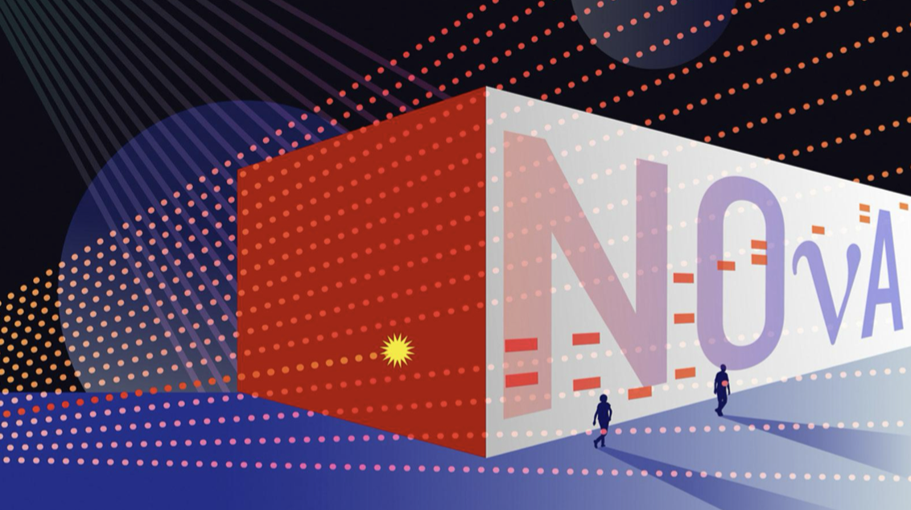
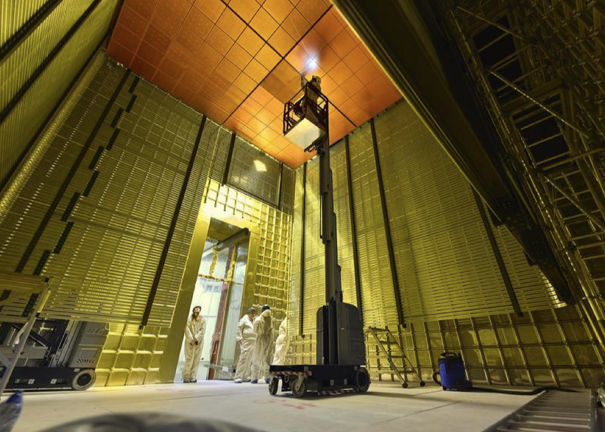
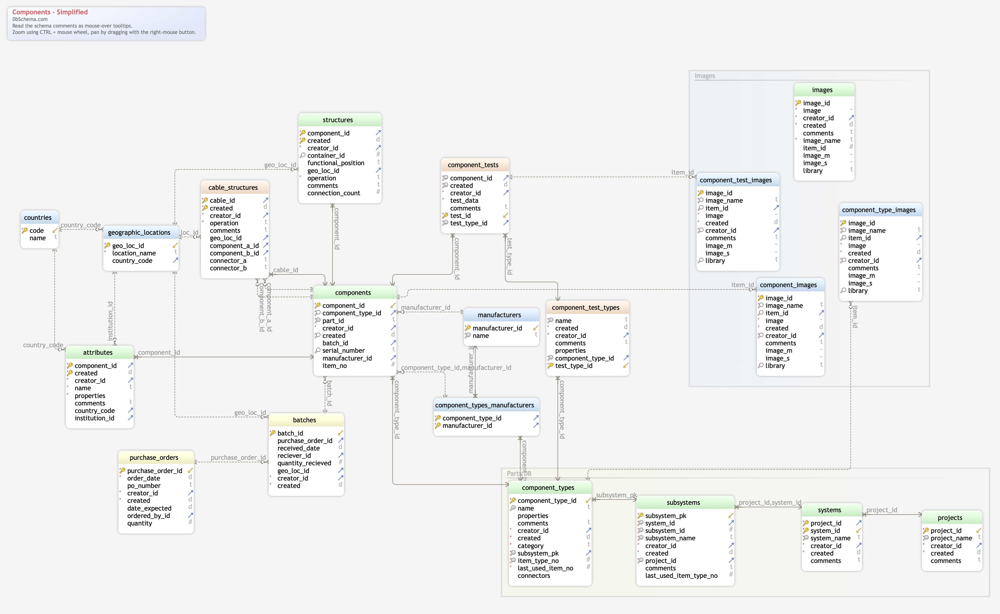
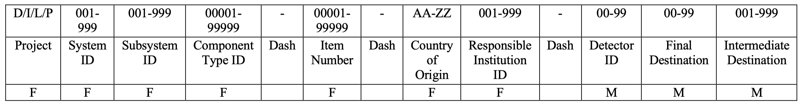

>## Contents
>
>|-------------+------------------|
>|    | Description  |
>|-------------+------------------|
>| [Hardware DB Conceptual Overview](#hardware-db-conceptual-overview) | |
>|-------------+------------------|
>| [PID](#pid) | |
>|-------------+------------------|
>| &emsp;[Project Identifier (required)](#project-identifier-required) | |
>|-------------+------------------|
>| &emsp;[System Identifier (required)](#system-identifier-required) | |
>|-------------+------------------|
>| &emsp;[Subsystem Identifier (required)](#subsystem-identifier-required) | |
>|-------------+------------------|
>| &emsp;[Component Type Identifier (required)](#component-type-identifier-required) | |
>|-------------+------------------|
>| &emsp;[Item Number (required)](#item-number-required) | |
>|-------------+------------------|
>| &emsp;[Country of Origin (required)](#country-of-origin-required) | |
>|-------------+------------------|
>| &emsp;[Responsible Institution ID (required)](#responsible-institution-id-required) | |
>|-------------+------------------|
>| &emsp;[Important Reminder](#important-reminder) | |
>|-------------+------------------|

## Hardware DB Conceptual Overview

### Hardware DB, A Bit of History

- HWDB was originally developed and created for NOvA about 2008-ish.00
  - by Dennis Box, Margherita Vittone and Steve White with guidance from Jon Paley.
- It was created to track a specific set of parts for NOvA and some tests done on them.

{: .image-with-shadow}{: width="35%"}

- About 2015 it started being adopted by other experiments including:
  - Mu2e, Icarus, SBND, Proto Dune, Ash River (currently under development)
- Known Issues with HWDB
  - Supporting a new experiment means creating a new schema from scratch.
  - Adding a new type of part/test requires developing and adding a new, distinct table or columns to the schema.
  - Good at tracking current state but little to no historical data was kept.
  - Very limited API allowing uploading data only.
  - Utilizes original, very early, web technology which will not last for the life of DUNE.

### DUNE Expands the Requirements

{: .image-with-shadow}{: width="35%"}

- The full current state as well as past history must be available for each item.
- Requires the complete test history for every item, not just the last one done on item or a history on a few items.
- Robust html access for queries, inserts and updates.
- Ability to see what an item is connected to or what is plugged into it.
  - Both current and past history of all connections.
- Support for storage of associated documentation and or photographs.
- Create a unique physical identifier (PID) for every item as well as provide for the generation of their labels. i.e. bar codes.
- For a complete list of requirements: [https://docs.dunescience.org/cgi-bin/sso/ShowDocument?docid=23333]

DUNE requires a very large set of discrete types of items to be tracked making creating individual tables for each item extremely difficult. Well, impossible.

### Hardware Database for DUNE

Hardware Database supports the complete life cycle of each item in the DB for the experiment as a whole.

The figure shows a simplified view of the DUNE HWDB schema (sorry for the fuzziness).
For more details, please refer to: [https://cdcvs.fnal.gov/redmine/projects/components-db/wiki].
{: .image-with-shadow}{: width="60%"}

- Manufacturing / Procurement
  - Manufacturer created a component
  - Where it was created
- You describe what items is to be stored in the DB, the data to be stored for it. As well as what items are allowed to be attached to it.
  - No longer need a developer to add a table for each new type of item.
  - You create a definition of what that item is, a pattern if you will.
  - Item data is entered according to the pattern.
- Versioning is fully supported with a history of all changes.
  - Displays the item according to the version in effect at the item’s creation or last update.
  - The entire history of “patterns” and each item is available.
- Testing and Quality Control
  - Create any number of tests for each type of item
  - Run any test and store its data multiple times. There is no limit.
  - View the entire test history.
- Support for Documentation, Photographs, URLS.
  - Can be tied to the Patterns, Items and Tests.
- A complete, secure, REST API is available for most of what the forms do.

### Accessing the System

- The page the production link is on: [https://dbweb0.fnal.gov/cdb/login/sso]
  - You can also access the development system : [https://dbweb0.fnal.gov/cdbdev/login/sso]
- All DUNE analysis experimenters have read only access.
  - Requires a FNAL services account.
  - If you do not do analysis, you may need to be manually added.
- Login using your Fermilab Services account/password.
  - We support the lab’s Single Sign On (SSO).
  - Non-FNAL accounts are not allowed.
- Security is provided by
  - Creating a role for one or more component types
  - Adding users to roles.
- Data can be entered through web forms or a REST API.
  - The API requires a CILogin certificate for security.

### The Big Three

This system is built around the concept of

- Component Types
- Items
- PartIDs

This is integral to all web forms, APIs and database tables.

#### Component Type

- Component Type is simply a PATTERN, where you define what DATA will be collected for a type of item.
  - This is a virtual construct.
  - It is used to display a web form for specific to that type of item. It is also used by the APIs.
  
#### Items and PartIDs

- An item is simply a physical piece of real world equipment.
- Every item must have a PartID attached via a bar/QR-coded label.
- A PartID is a unique identifier defined according to DUNE specifications ([LBNF/DUNE Parts Identifier: EDMS 2505353](https://edms.cern.ch/ui/#!master/navigator/document?D:101278257:101278257:subDocs)).

   
 

## PID

The Parts Identifier (**PID**) is a 32-characters alphanumeric string that is used to uniquely identify all the LBNF and DUNE components that are used during the construction of the LBNF facility (including both the far site at the Sanford Underground Research Facility – SURF and the near site at Fermilab) and of all the corresponding detectors. The parts identifier forms a unique identifier for that part in the hardware database. Each part which has important information associated with it must have a parts identifier assigned so the data can be archived in the hardware database. The parts identifier is used for all equipment bar codes, QR codes, tags and other systems of identification. The PID is composed of 10 fields, of which 7 are required. More information about PIDs can be found under [LBNF/DUNE Parts Identifier: EDMS 2505353](https://edms.cern.ch/ui/#!master/navigator/document?D:101278257:101278257:subDocs).

{: .image-with-shadow}{: width="75%"}

The following is an example of a PID.
~~~
D00502301200-00050-US125
      D     = DUNE
      005   = FD1-HD HVS
      020   = CPA
      01200 = DUNE Shipping Crate
      00050 = the 50th item (crate)
      US    = United States
      125   = Argonne National Laboratory
~~~

### Project Identifier (required)

The project identifier is a single character in the range A-Z representing the major divisions in the DUNE/LBNF enterprise. The designations are as follows:
- **D**: DUNE (includes approved far detector modules and near detectors)
- **I**: Integration (includes cryostats, cryogenic plants, system engineering, installation …..)
- **L**: LBNF (includes Conventional facilities, cavern services, …..)
- **P**: Future project.

### System Identifier (required)

The system identifier is a three-digit (001-999) number representing the major subdivisions in responsibility for LBNF/DUNE. In general, each detector consortium is assigned a separate system identifier and the consortium is then assigned the responsibility of defining the sub-systems and components under their authority.

  
Click to expand table

  <table>
    <thead>
      <tr>
        <th>System ID</th>
        <th>Description</th>
      </tr>
    </thead>
    <tbody>
      <tr>
        <td>0</td>
        <td>Invalid</td>
      </tr>
      <tr>
        <td>1</td>
        <td>FD1-HD Complete Detector</td>
      </tr>
      <tr>
        <td>2</td>
        <td>FD1-HD Instrumented Anode Plane (with Elec and photon Det.)</td>
      </tr>
      <tr>
        <td>3</td>
        <td>FD1-HD Anode Plane Assemblies (bare wire planes)</td>
      </tr>
      <tr>
        <td>4</td>
        <td>FD1-HD Photon Detection System</td>
      </tr>
      <tr>
        <td>5</td>
        <td>FD1-HV HY</td>
      </tr>
      <tr>
        <td>6</td>
        <td>FD1-HD Calibration</td>
      </tr>
      <tr>
        <td>51</td>
        <td>FD2-VD Complete Detector</td>
      </tr>
      <tr>
        <td>52</td>
        <td>FD2-VD Instrumented Top Charge Readout Planes (CRP) (inc. Elect)</td>
      </tr>
      <tr>
        <td>53</td>
        <td>FD2-VD Instrumented Bottom Charge Readout Planes (CRP) (inc, Elect)</td>
      </tr>
      <tr>
        <td>54</td>
        <td>FD2-VD Instrumented Cathode Plane (inc. PD)</td>
      </tr>
      <tr>
        <td>55</td>
        <td>FD2-VD Top Charge Readout Planes (CRP)</td>
      </tr>
      <tr>
        <td>56</td>
        <td>FD2-VD Bottom Charge Readout Planes (CRP)</td>
      </tr>
      <tr>
        <td>57</td>
        <td>FD2-VD Top Vertical Drift CRP Electronics</td>
      </tr>
      <tr>
        <td>58</td>
        <td>FD2-VD Photon Detector</td>
      </tr>
      <tr>
        <td>59</td>
        <td>FD2-VD Calibration</td>
      </tr>
      <tr>
        <td>80</td>
        <td>FD-2-VD HV</td>
      </tr>
      <tr>
        <td>81</td>
        <td>FD1-HD TPC Elec. and FD2-VD Bottom Elec.</td>
      </tr>
      <tr>
        <td>82</td>
        <td>FD DAQ</td>
      </tr>
      <tr>
        <td>83</td>
        <td>FD Slow Control</td>
      </tr>
      <tr>
        <td>84</td>
        <td>FD Cryogenic Instrumentation</td>
      </tr>
      <tr>
        <td>85</td>
        <td>FD Integration</td>
      </tr>
      <tr>
        <td>86</td>
        <td>FD Installation</td>
      </tr>
      <tr>
        <td>100</td>
        <td>ND: Near detector complex</td>
      </tr>
      <tr>
        <td>101</td>
        <td>ND: Liquid Argon Near Detection</td>
      </tr>
      <tr>
        <td>102</td>
        <td>ND: TMS</td>
      </tr>
      <tr>
        <td>103</td>
        <td>ND: Beam Monitor - SAND</td>
      </tr>
      <tr>
        <td>104</td>
        <td>ND: DAQ</td>
      </tr>
      <tr>
        <td>105</td>
        <td>ND: Slow Controls</td>
      </tr>
      <tr>
        <td>106</td>
        <td>ND: Prism Infrastructure</td>
      </tr>
      <tr>
        <td>107</td>
        <td>ND: Integration</td>
      </tr>
      <tr>
        <td>108</td>
        <td>ND: Installation</td>
      </tr>
      <tr>
        <td>200</td>
        <td>FS: Safety</td>
      </tr>
      <tr>
        <td>201</td>
        <td>FS: BSI</td>
      </tr>
      <tr>
        <td>220</td>
        <td>NS: Safety</td>
      </tr>
      <tr>
        <td>221</td>
        <td>NS: BSI</td>
      </tr>
      <tr>
        <td>300</td>
        <td>FS: Cryogenics</td>
      </tr>
      <tr>
        <td>321</td>
        <td>NS: Cryogenics</td>
      </tr>
      <tr>
        <td>400</td>
        <td>FS: Networking</td>
      </tr>
      <tr>
        <td>421</td>
        <td>NS: Networking</td>
      </tr>
      <tr>
        <td>500</td>
        <td>Computing</td>
      </tr>
      <tr>
        <td>600</td>
        <td>FD Cryostat</td>
      </tr>
      <tr>
        <td>621</td>
        <td>ND Cryostat</td>
      </tr>
      <tr>
        <td>900</td>
        <td>ProtoDUNE-Il complete detector</td>
      </tr>
      <tr>
        <td>901</td>
        <td>FD2-VD Module-0 complete detector</td>
      </tr>
    </tbody>
  </table>

### Subsystem Identifier (required)

The subsystem ID is a three-digit number (001-999) defined by the consortium or responsible group. Its purpose is to allow the consortia to separate the major components under their responsibility into subsystems.

### Component Type Identifier (required)

The component Type ID is a 5-digit number (00001-99999) used to identify the specific parts in a subsystem. Together with the subsystem ID the component Type ID defines the part inside the consortium scope.

### Item Number (required)

The item number is a five-digit number used to specify the exact part in a series and is assigned by the HWDB. It serves the typical role of the serial number in commercial fabrication. Five digits was chosen as the vast majority of components will have less than 100,000 units fabricated. In the handful of situations where this is not the case, different Component Type IDs will be needed for batches. 

### Country of Origin (required)

The country of origin is a two-character string representing the country responsible for fabricating the part or assembling the sub-components into the assembly (AA-ZZ). The country codes are specified according to the ISO3166 standard (ISO 3166-1 alpha-2). The list of active countries in the DUNE collaboration are as follows:

| Country          | Code | Country          | Code | Country          | Code | Country          | Code |
|------------------|------|------------------|------|------------------|------|------------------|------|
| Armenia          | AM   | Madagascar       | MG   | Brazil           | BR   | Mexico           | MX   |
| Canada           | CA   | Netherlands      | NL   | CERN             | CH   | Paraguay         | PY   |
| Chile            | CL   | Peru             | PE   | China            | CN   | Poland           | PL   |
| Colombia         | CO   | Portugal         | PT   | Czech Republic   | CZ   | Romania          | RO   |
| Finland          | FI   | Russia           | RU   | France           | FR   | Spain            | ES   |
| Georgia          | GE   | Sweden           | SE   | Germany          | DE   | Switzerland      | CH   |
| Greece           | GR   | Turkey           | TR   | India            | IN   | Ukraine          | UA   |
| Iran             | IR   | United Kingdom   | GB   | Italy            | IT   | USA              | US   |
| Japan            | JP   | Korea, South     | KR   |                  |      |                  |      |

### Responsible Institution ID (required)

The responsible institution ID is a three-digit number (001-999) representing the institution inside LBNF/DUNE responsible for the part or assembly. The responsible institution is the last of the immutable fields making both the country and institution required information before a part number can be assigned to a given part. The range 001-500 are reserved for the DUNE collaboration institutions. 000 is an illegal value.



### Important Reminder

When a PID is assigned, then the corresponding drawing should be associated (stored) with it. This will allow workers in the field to verify that the correct parts were used in the assemblies and installation. If/when a part is to be handled, transported, or assembled into other systems by other group, it must be marked with the PID.This will allow the workers to look up the relevant procedures, drawings, QC steps, and safety info at the installation location. Every shipment (box, crate) must be assigned with a PID. This is crucial in to be able to track the latest locations of parts and the number of parts at certain locations.



[https://docs.dunescience.org/cgi-bin/sso/ShowDocument?docid=23333]: https://docs.dunescience.org/cgi-bin/sso/ShowDocument?docid=23333
[https://cdcvs.fnal.gov/redmine/projects/components-db/wiki]: https://cdcvs.fnal.gov/redmine/projects/components-db/wiki
[https://dbweb0.fnal.gov/cdb/login/sso]: https://dbweb0.fnal.gov/cdb/login/sso
[https://dbweb0.fnal.gov/cdbdev/login/sso]: https://dbweb0.fnal.gov/cdbdev/login/sso
