   

>## Contents
>
>|-------------+------------------|
>|    | Description  |
>|-------------+------------------|
>|[Tasks for Administrators and very simplified DB schema](#tasks-for-administrators-and-very-simplified-db-schema) | |
>|-------------+------------------|
>| &emsp; [Sub-components](#sub-components) | |
>|-------------+------------------|
>| &emsp; [Tests](#tests) | |
>|-------------+------------------|
>| &emsp; [Very simplified DB schema](#very-simplified-db-schema) | |
>|-------------+------------------|
>| [WEB UI](#web-ui)  |   |
>|-------------+------------------|
>| &emsp;[Going through the hierarchy of IDs](#going-through-the-hierarchy-of-ids) | List of Projects, Systems, Subsystems, and Component Types |
>|-------------+------------------|
>| &emsp;[Defining a Component Type](#defining-a-component-type) | Definition of a Component Type |
>|-------------+------------------|
>| &emsp;&emsp;[Managed by](#managed-by) | Permissions of editing a Component Type definition |
>|-------------+------------------|
>| &emsp;&emsp;[Manufacturers](#manufacturers) | List of Manufacturers, creating and editing |
>|-------------+------------------|
>| &emsp;&emsp;[Specifications](#specifications) | DB schema for a Component Type |
>|-------------+------------------|
>| &emsp;&emsp;[Connectors](#connectors-an-optional-field) | where sub-Component Types are defined |
>|-------------+------------------|
>| &emsp;&emsp;[SPEC LOG](#spec-log) | History of Specifications |
>|-------------+------------------|
>| &emsp;[Defining a Test Type](#defining-a-test-type) | Definition of a Test Type |
>|-------------+------------------|
>| [REST API](#rest-api) | |
>|-------------+------------------|
>| &emsp;[Going through the hierarchy of IDs with the REST API](#going-through-the-hierarchy-of-ids-with-the-rest-api) | List of Projects, Systems, Subsystems, and Component Types |
>|-------------+------------------|
>| &emsp;&emsp;[GET a list of Projects](#get-a-list-of-projects) | GET /projects |
>|-------------+------------------|
>| &emsp;&emsp;[GET lists of Systems, Subsystems, and Component Types](#get-lists-of-systems-subsystems-and-component-types) | GET /systems, /subsystems, and /component-types |
>|-------------+------------------|
>| &emsp;[Defining a Component Type with the REST API](#defining-a-component-type-with-the-rest-api) | PATCH & GET /component-types/\<type_id> |
>|-------------+------------------|
>| &emsp;[Defining a Test Type with the REST API](#defining-a-test-type-with-the-rest-api) | POST & GET  /component-types/\<type_id>/test-types |
>|-------------+------------------|
>| &emsp;[Some other useful endpoints](#some-other-useful-endpoints) | List of some useful REST API endpoints |
>|-------------+------------------|
{: .checklist}

        

# Tasks for Administrators and very simplified DB schema

We now know how a PID is formed and there are three types of user privileges.
One of the privileges, Administrator, allows to edit Component Types.
In this session, we will go through what Administrators need to do before active users can start to enter data.

[back to top](#contents)

## Sub-components

While editing a Component Type, Administrator can also define sub-component Types.
A sub-component is a component (Item) that is linked to another component (Item).
This is a very powerful functionality, allowing user to trace various related Items for a given single PID.
We will show how this is done later in this session.

[back to top](#contents)

## Tests

For a given Item, there is a place to store Test results.
Actually it doesn’t have to be a Test result.One could store there anything that is associated with that Item.
It is Administrator’s job to create/define Test Types for each of your Component Types.
And for a given Component Type, one could create multiple Test Types.
Again we will go over how this is done later in this session.

[back to top](#contents)

## Very simplified DB schema

The picture below shows a very simplified DB schema, in which one can see that Administrators define Component Types,
Sub-component Types, and Test Types, while ordinary (active) users enter data and Test data.

  

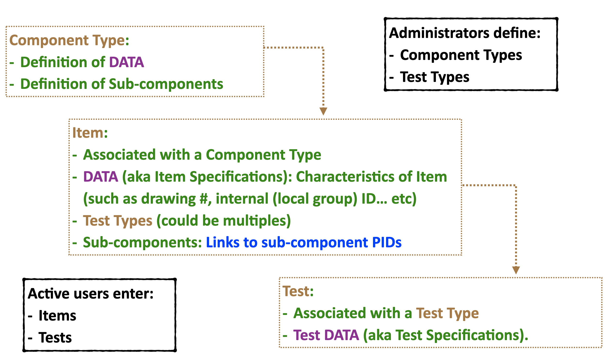{: .image-with-shadow}{: width="65%"}

  

For the remaining of this session, we will go through how Administrators achieve these tasks
in two different ways:
- WEB UI: user-friendly, intuitive, probably one wouldn’t want touse this method for repetitive tasks.
- REST API: executed from command-line or communicated directly from your preferred programs.

[back to top](#contents)

    

# WEB UI

<!--slides are 1024 x 768 px-->

<!-- Before inserting Items and their corresponding Tests, we need to define a Component Type and Test Type, respectively.
 We will do so, first with the WEB UI, and then through the REST API in the 2nd half of this session. -->

 One can access to the two versions of the HWDB from these addresses.We will use the development version in this session.

 Production version : [https://dbweb0.fnal.gov/cdb/login/sso]

 Development version: [https://dbweb0.fnal.gov/cdbdev/login/sso]

Go ahead to log into the development version. Once logged in, you should be seeing the opening page like below:

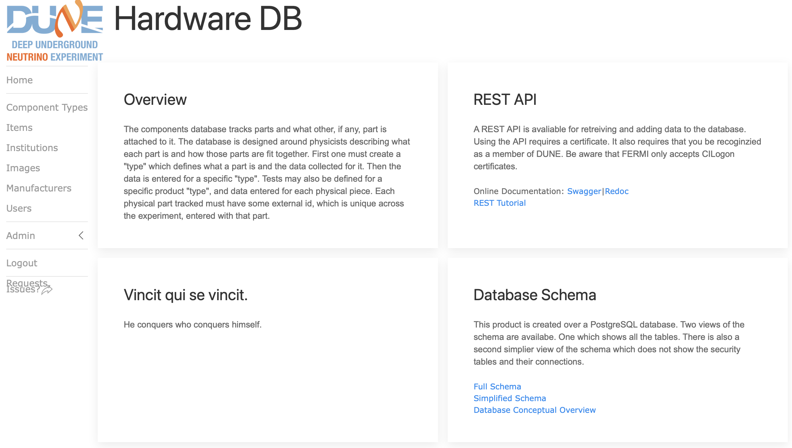{: .image-with-shadow}{: width="85%"}

[back to top](#contents)

   

## Going through the hierarchy of IDs

 In the previous session, we introduced a several different types of IDs:
 **Project**, **System ID**, **Subsystem ID**, and **Component Type ID**.
 With the WEB UI, one can go down (and up) such hierarchy of IDs easily.
 Click **Admin** in the side-menu. It will show a sub-menu as shown here. One can select any of the three, **Projects**, **Systems**, or **Subsystems** to get into each of these lists.
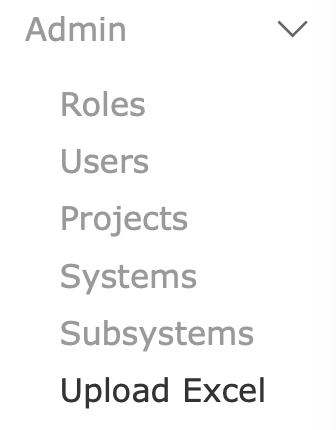{: .image-with-shadow}{: width="15%"}

 Let’s start with the *root* by clicking **Projects** in the above sub-menu.
You should be seeing a list of currently available Projects in the HWDB like this:

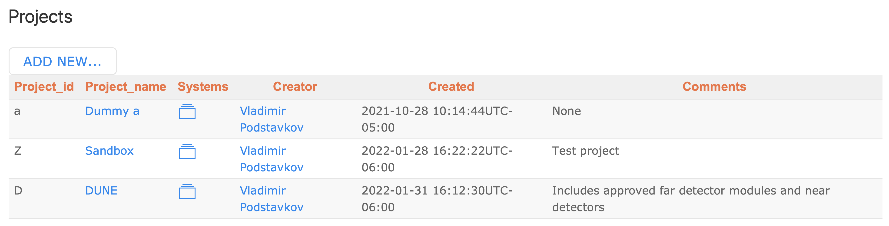{: .image-with-shadow}{: width="85%"}

Now let’s click the *folder* in the **DUNE** row & **Systems** column. This will show a list of **Systems** (individual **System names** along with **System IDs**) that correspond to the **DUNE** project as shown below:

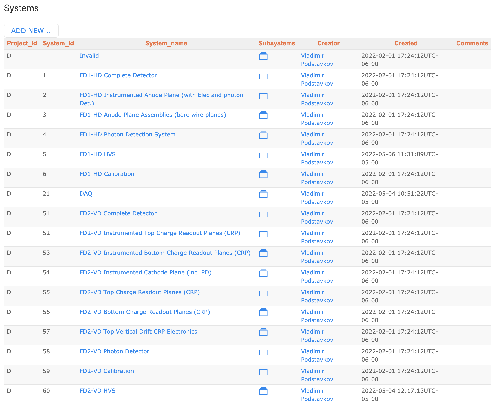{: .image-with-shadow}{: width="85%"}

 Similarly let’s display a list of **Subsystems** of the **System**, **FD2-VD HVS** by clicking its folder icon. You should be seeing a Subsystem list like shown below:

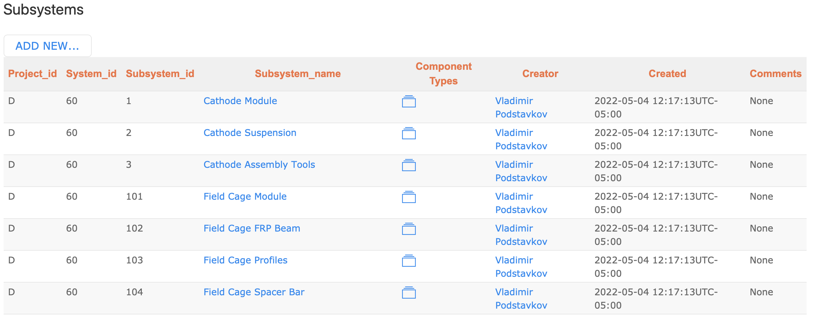{: .image-with-shadow}{: width="85%"}

 By the way, in these lists we have seen so far (currently Subsystems), one can also click individual **name** (i.e., **Subsystem name**) to see the corresponding *definition*. We'll come back to this shortly.

 Now let’s pick a Subsystem, **Field Cage Spacer Bar** and see a list of its **Component Types** by clicking its folder.
 You should be seeing a list of Component Types shown below:

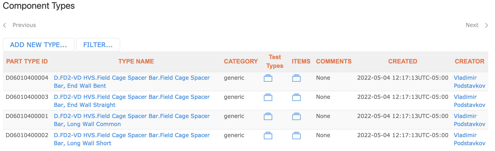{: .image-with-shadow}{: width="85%"}

Four Component Types for Field Cage Spacer Bar are seen.
In this list one can click the **ITEMS** or **Test Types** columns to see a list of the corresponding Items or Test Types, if it exists, respectively.

[back to top](#contents)

   

## Defining a Component Type

 Now that we can go through the hierarchy of existing IDs, let’s edit one of the existing Component Types.Pick one that you like to modify.
 As an example, we’ll modify the Component Type, **CPA Parts FR4 bottom frame** (type id = Z00100100017) here. 

 First, let’s find the Component Type.
 From the side menu, click **Component Types** and then click **FILTER…**.
 In the **Apply filters** window, you can provide the corresponding type id to the **Part_type** field, if you already know the type id you are looking for.
 You could also provide a part of the Component Type name, like **FR4_BOTTOM** to **Name** field as shown below. It is *case-insensitive* here. Now hit the **SEARCH** button.
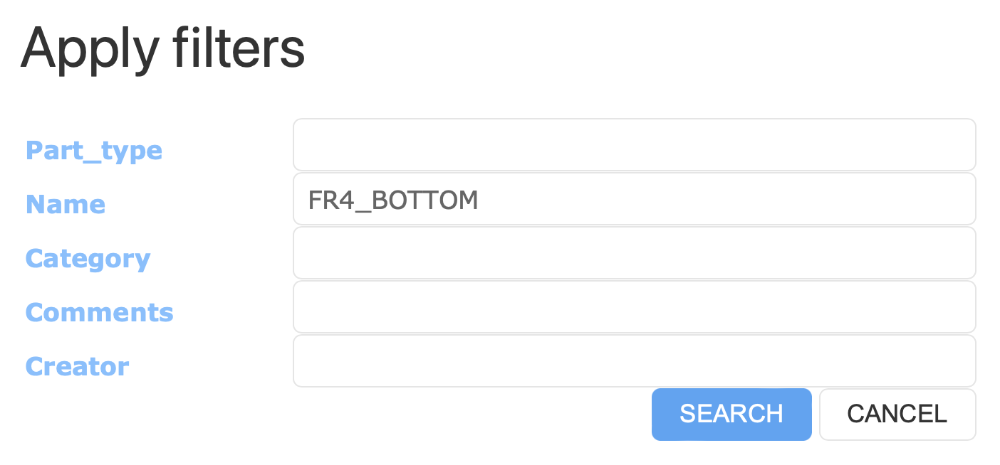{: .image-with-shadow}{: width="35%"}

After filtering the Component Type list, you should be seeing the type you were looking for.
Clicking its **TYPE NAME** should display its definition as shown below:
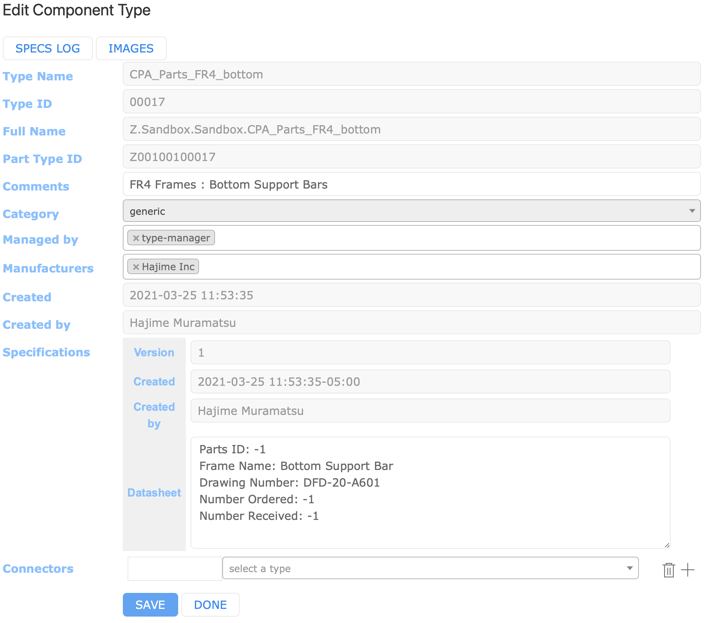{: .image-with-shadow}{: width="70%"}

 Some of the fields are in *gray*, indicating that you are not allowed to edit them, such as**Type Name**, **Type ID**, **Full Name**, **Part Type ID**, **Created**, and **Created by**... etc.
 Here **Full Name** is a name that combines the all id names together:
 - Project = Z
 - System name = Sandbox
 - Subsystem name = Sandbox
 - Component Type name = CPA_Parts_FR4_bottom

 We'll now go through the rest of the fields/button now: **Managed by**, **Manufacturers**, **Specifications**, **Connectors**, and **SPECS LOG**.

[back to top](#contents)

   

### Managed by (a required field)

 In **Managed by** field, we provide a specific *Role* or *Roles* which behaves as an access restriction to this particular Component Type.
 That is, by providing a specific Role, only users who are assigned to that specific Role are allowed to create/edit the corresponding Items.

 Where can we see a list of available Roles and how can we create a new one?

 Again, from the side-menu, click **Admin** and then **Roles**.
 You should see a list of existing Roles like shown here:

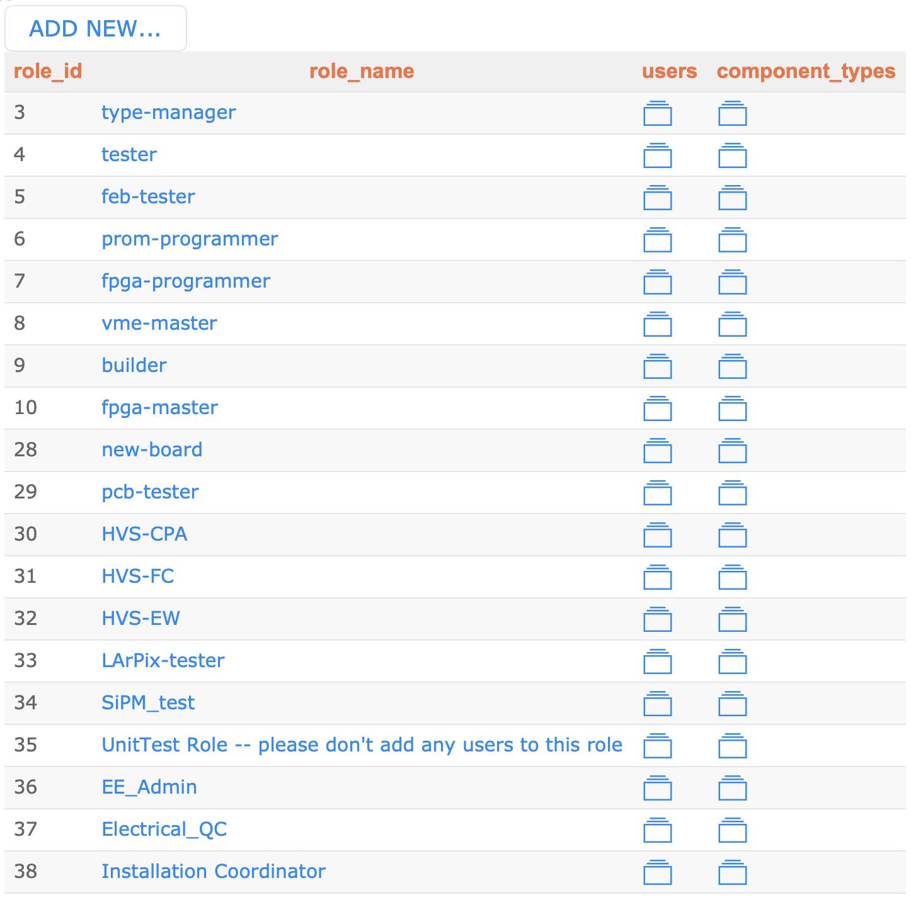{: .image-with-shadow}{: width="45%"}

 Only users with the *Administrator privilege* can create a new Role by clicking **ADD NEW…**.
 
 Similarly one can find out what Roles each user has been assigned to. 
 Clicking **Admin** from the side-menu and then go to **Users**. This shows a list of the all available users.
 Clicking **full_name** shows information of the individual user like shown here in which one can see what Role(s)
 the user has been assigned to:
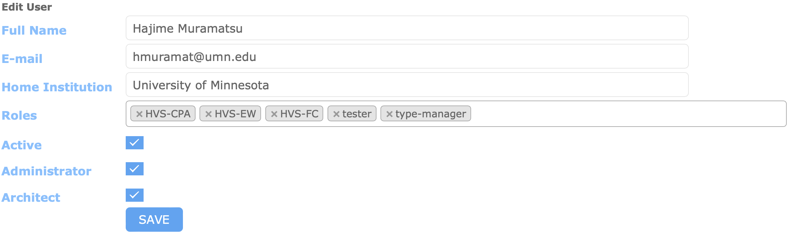{: .image-with-shadow}{: width="65%"}
[back to top](#contents)

   

### Manufacturers (an optional field)

 Just like Roles, we assign Manufacture(s) from its available list.
 The list can be reached by going to **Manufactures** from the side-menu.
 Again only **Administrators** can edit the list.
 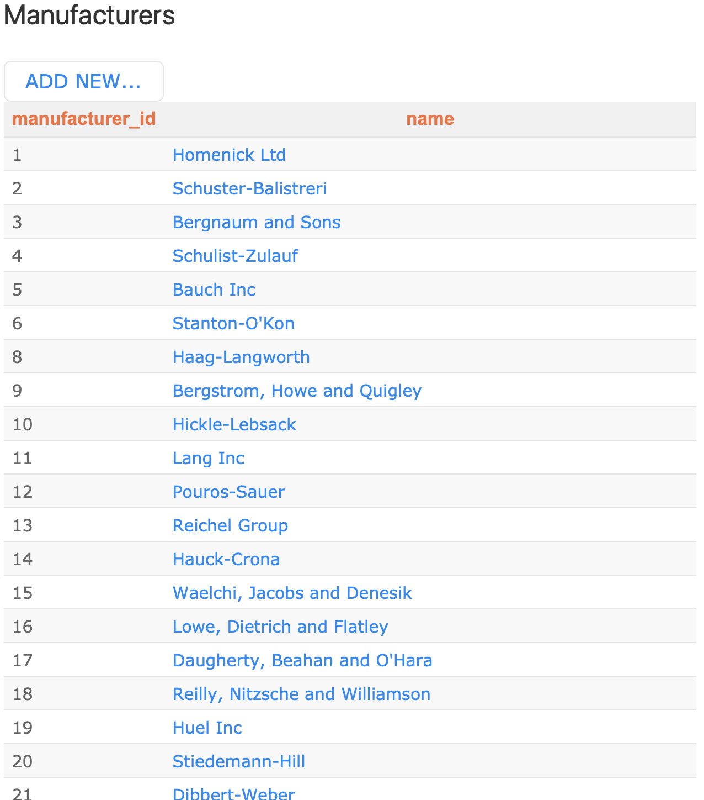{: .image-with-shadow}{: width="40%"}
[back to top](#contents)

   

### Specifications (a required field)

 Let's now fill the field, **Datasheet** under **Specifications**. This is probably the most important field in defining a Component Type definition.

 Users may provide information in **Specifications** of an Item, that uniquely identifies each of the corresponding Items.
 Database schema for Specifications can be provided by **[YAML]**,  a human-friendly data serialization
 language for all programming languages. It has typically a form of;

  Key : Value

 Value could be numbers, strings, null, list, array, or even an empty array. For instance,
 if you define a Specifications like the following;
 ~~~
 Parts ID: -1
 Frame Name: Bottom Support Bar
 Drawing Number: DFD-20-A601
 Number Ordered: -1
 Number Received: -1
 ~~~
 then when you create an Item (in the next session) you will have boxes that are filled with their initial valies as shown below:
 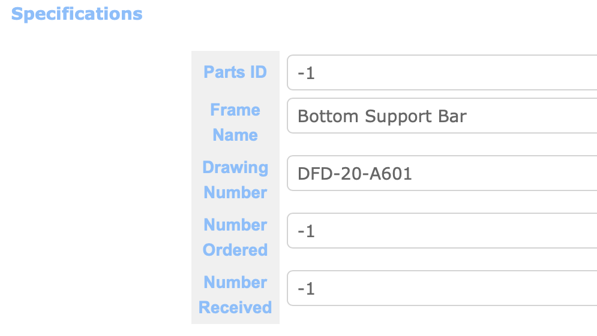{: .image-with-shadow}{: width="35%"}
 
 You could also provide an empty array, like [ ]. In this case, you could provide data for this array in *any* scheme,
 which might sometimes be useful.
 
 You could also provide *options* like the following;
 ~~~
 AR: []
 Gain:
  - T1
  - T2
 Size: null
 Type: null
 ~~~
 so that when you create a new Item, it will let you select predefined optional values as shown below:
 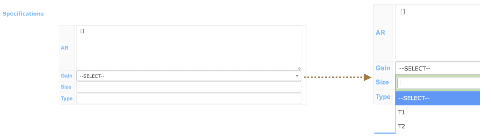{: .image-with-shadow}{: width="90%"}
> ## Quiz
> Can yo provide a Specifications that has nested Keys?
{: .solution}

[back to top](#contents)

   

### Connectors (an optional field)

In the **Connectors** section, one can provide **Type IDs** of sub-Components, defining *relations* among different Component Types.
For instance,

  &emsp; an assembly is a Component Type that is constructed from other **sub-Component Types**.
 
E.g., A Component Type, CPA Plane, is made of a pair of sub-Component Types, CPA Panels. By the way, from the view of
one of the sub0Component Types, the current Component Type you are editing would be then its *parent* Component Type,
forming a hierarchical structure : Parent Component Type ⟷ Current Component Type ⟷ sub-Component Type(s).
 
Suppose, we have 3 Component Types: **Front Axle**, **Left Wheel**, and **Right Wheel**. And let's just that Front Axle
is made of two sub-Component Types, Left and Right Wheels.
 
Furthermore, Type IDs for these 3 Types are:
 - Type ID = Z00100400005 for Front Axle
 - Type ID = Z00100400007 for Left Wheel
 - Type ID = Z00100400008 for Right Wheel
 
Now let's start to define Type IDs of these two sub-Components. Again, we want Left & Right Wheels to be sub-Components
of **Frot Axle**. Go to the Component Type definition page of **Front Axle** and find the **Connectors** section at the bottom.

To add a new sub-Component Type ID, click **+** icon. It will ask you to fill out two empty boxes in a single row.
In the first one, provide a **functional position name**. This name needs to be unique within this Component Type,
such as ASIC-001, SMB00008-S13360.. etc. For us, let's call this 1st sub-Component as **My L Wheel**.

For the 2nd empty box, you need to provide the actual existing Component Type name. Entring 2 characters would trigger the HWDB
to look for and display them for you, as can be seen below (be careful that the entered characters here are case-sensitive):
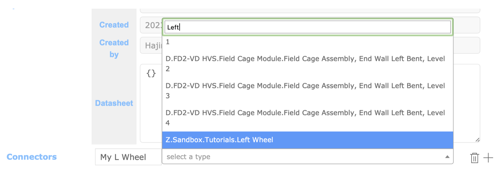{: .image-with-shadow}{: width="70%"}
Pick the **Left Wheel** there.

Next, click the **+** icon again and setup similarly for the **Right Wheel**. And once you are done with the two Types,
click **SAVE**. The HWDB then converts the two provided sub-Component Type names to the corresponding Type IDs as shown below:
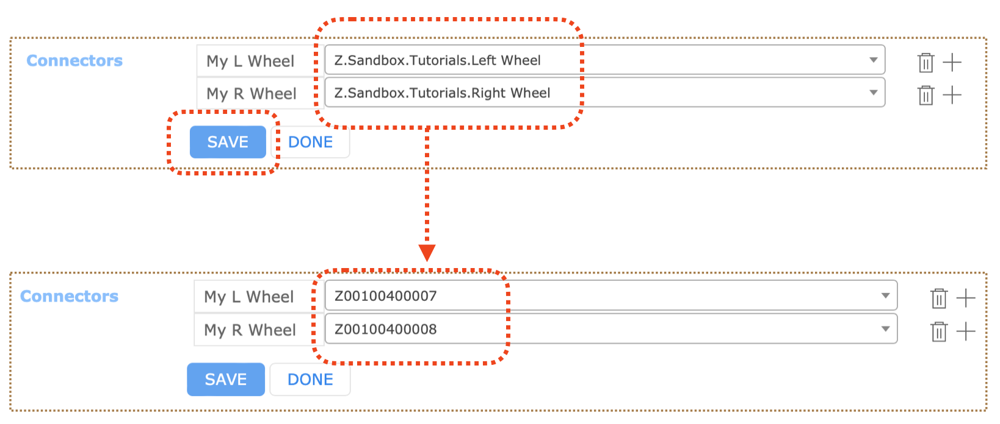{: .image-with-shadow}{: width="70%"}

**CAUTIONS!!**

Once you define these sub-Component Types and start to actually use them (i.e., linking existing Items as sub-Components;
we will do this in the next session), **you will not be allowed to delete or edit those existing sub-Component Types**.
Else there could be inconsistencies between modified (updated) Component Type definitions and pre-existing Items that are linked.

Because of this, the sub-Component Type definition will be *frozen* once the corresponding Item(s) is linked as shown below:
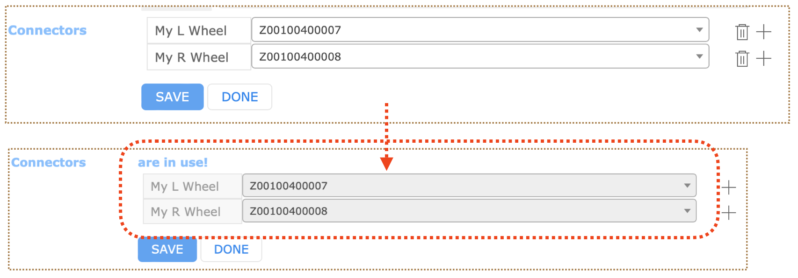{: .image-with-shadow}{: width="70%"}

Nevertheless, you are still allowed to **add** new sub-Component Types by clicking the **+** icon.

If you absolutely need to delete or edite the existing sub-Component Type definition(s), you can do so
once you *undo* (delete) the all existing sub-Component links in the corresponding Items.

[back to top](#contents)

   

### SPEC LOG

In a typical Component Type definition page, there is a tab-button, **SPECS LOG** at the top.
Clicking it will take you to a page, where you can see a history of modifications on that Component Type Specifications.
This could be useful not only when you need to look at the historical changes, but if you need to roll-back your Specifications definition.
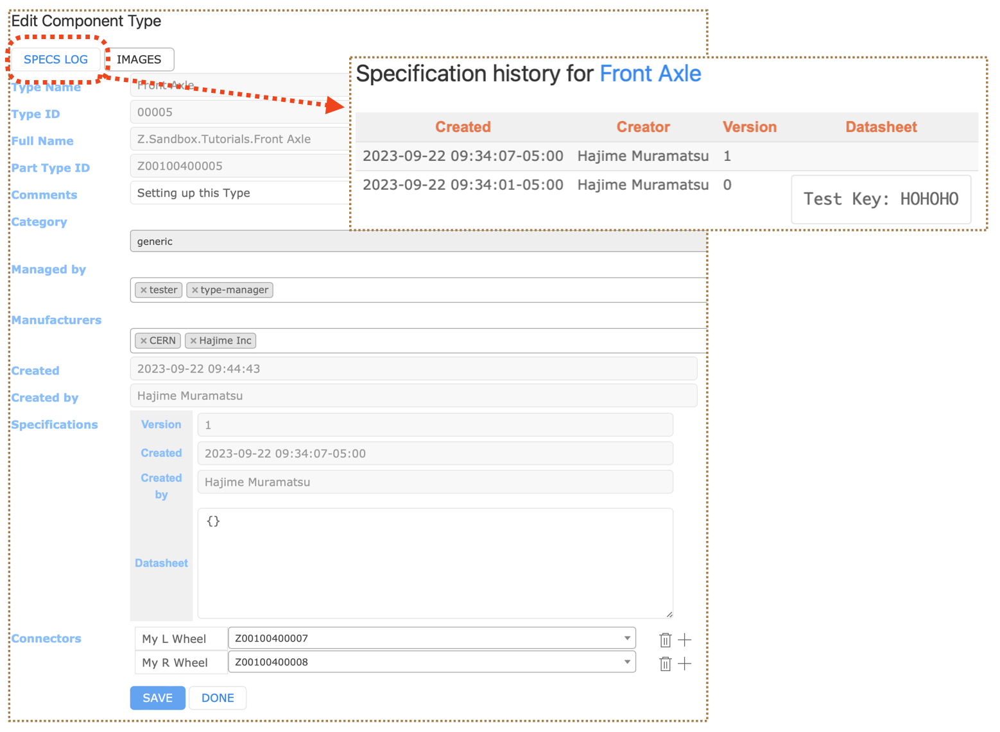{: .image-with-shadow}{: width="70%"}

[back to top](#contents)

   

## Defining a Test Type

Now let's define a Test Type, which essentially defines the DB schema for the data you store at the HWDB, such as QC test results.
Also remember that we could have multiple Test Types for a given Component Type.

The procedure is very much similar to what we have done to define a Component Type.
Let us employ the Component Type, **CPA_Parts_FR4_bottom**, as an example again.
To find that Component Type, select **Component Types** from the side-menu, then click **FILTER...**.
In the pop-up window, **Apply filters**, provide "CPA_Parts_FR4_bottom" in the **Name** field and hist **SEARCH**.
Click the folder in the **Test Types** column. You should be seeing a list of available Test Types for this Component Type as shown below:
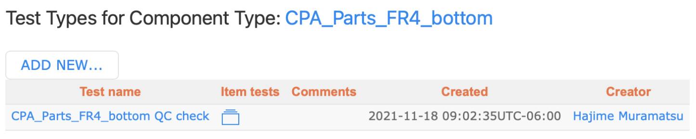{: .image-with-shadow}{: width="50%"}

Click **ADD NEW...** to create a new Test Type definition. This will bring a screen like the one below.
You **must** provide a Test Type name, which needs to be unique within its Component Type.
Again, its Specifications should be provided in YAML. Once you are done, don't forget to hit **SAVE**.
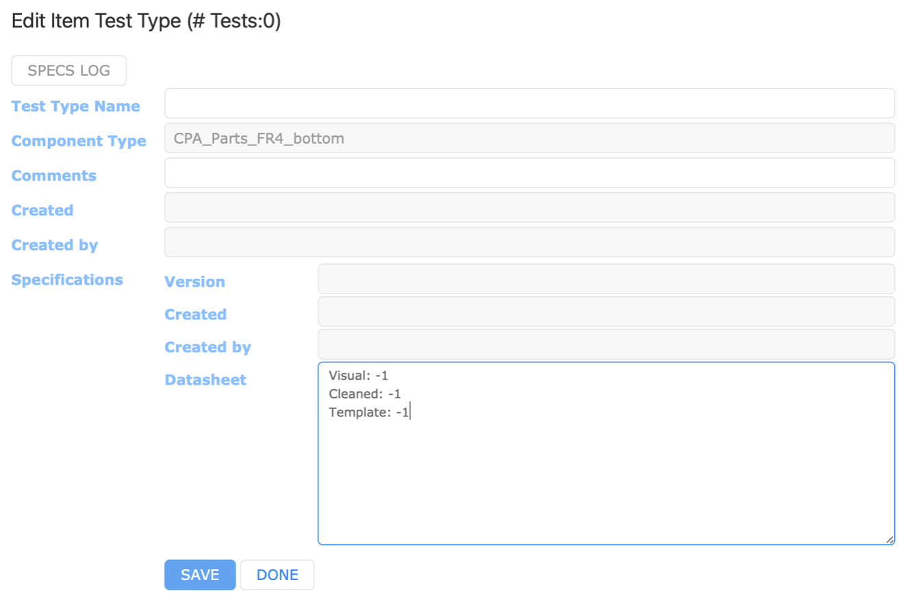{: .image-with-shadow}{: width="60%"}

[back to top](#contents)

   
   
   
   

# REST API

Let's try everything we have done so far in this session through the REST API of the HWDB.
We will extensively employ the *alias* and the variable, *APIPATH*, that we defined in [Setup][mysetup].
Just to remind what they were:
 ~~~
 alias CURL='curl --cert-type P12 --cert usercred.p12:PassWord'
 export APIPATH='https://dbwebapi2.fnal.gov:8443/cdbdev/api/v1'
 ~~~
{: .source}
Notice that the **APIPATH** points to both the version **v1** of the API and the development version (**cdbdev**).
If you like to access to the production version, it should be **cdb**, instead of **cdbdev**.

Please also be aware that, while we will cover API endpoints that are essential in this session,
we will *not* cover the all available endpoints.
For a complete list of endpoints, please refer to the online documentation [Redoc][redoc]
as well as the [Swagger][swagger] site in which users can try the REST API endpoints interactively.

[back to top](#contents)

   

## Going through the hierarchy of IDs with the REST API

With the API, it is easy to obtain lists of available Projects, Systems, Subsystems, and Component Types.

   

### GET a list of Projects

The endpoint to *get* a list of Projects is simply **/projects** as shown below.

~~~
CURL "${APIPATH}/projects" | jq
~~~
{: .language-bash}

And here is the response in JSON. As can be seen, two projects current exist in the HWDB.
~~~
{
  "data": [
    {
      "comments": null,
      "created": "2021-10-28T10:14:44.215630-05:00",
      "creator": {
        "id": 3,
        "name": "Vladimir Podstavkov",
        "username": "podstvkv"
      },
      "id": "a",
      "name": "Dummy a"
    },
    {
      "comments": "Includes approved far detector modules and near detectors",
      "created": "2022-01-31T16:12:30.338331-06:00",
      "creator": {
        "id": 3,
        "name": "Vladimir Podstavkov",
        "username": "podstvkv"
      },
      "id": "D",
      "name": "DUNE"
    },
    {
      "comments": "Test project",
      "created": "2022-01-28T16:22:22.319197-06:00",
      "creator": {
        "id": 3,
        "name": "Vladimir Podstavkov",
        "username": "podstvkv"
      },
      "id": "Z",
      "name": "Sandbox"
    }
  ],
  "link": {
    "href": "/cdbdev/api/v1/projects",
    "rel": "self"
  },
  "status": "OK"
}
~~~
{: .output}

[back to top](#contents)

   

### GET lists of Systems, Subsystems, and Component Types

Similarly one can easily *get* lists of Systems, Subsystems, and Component Types with the following endpoints:
- List of Systems: /systems/\<project_id>
- List of Subsystems: /subsystems/\<project_id>/\<system_id>
- List of Component Types: /component-types/\<project_id>/\<system_id>/\<subsystem_id>

[back to top](#contents)
   

> ## Quiz
> GET lists of Systems, Subsystems, and Component Types for the following cases:
> - Obtain a list of Systems for project_id = D
> - Obtain a list of Subsystems for project_id = D and system_id = 005
> - Obtain a list of Component Types for  project_id = D, system_id = 005, and subsystem_id = 20
{: .solution}

[back to top](#contents)

  

## Defining a Component Type with the REST API

Now let's define a Component Type. Let's take the **Front Axle** (Type ID = Z00100400005) as an example.

The endpoint we need in this case is /component-types/\<type_id>
Or the actual command-line would look like the following:
~~~
CURL -H "Content-Type: application/json" -X PATCH -d @Patch_CompType.json "${APIPATH}/component-types/Z00100400005" | jq
~~~
{: .language-bash}
Here;
- we are *patching* instead of *posting* as the Component Type must pre-exist (only **Architect** can create a Component Type)
- Type ID = Z00100400005
- Patch_CompType.json is a file and its contents are shown below:
~~~
{
    "part_type_id": "Z00100400005",
    "comments": "Setting up this Type",
    "manufacturers": [7,27],
    "roles": [3,4],
    "properties": {
        "specifications": {
	    "Last name": "Muramatsu",
	    "First name": "Hajime"
	}
    },
    "connectors": {
	"My L Wheel": "Z00100400007",
	"My R Wheel": "Z00100400008"
    }
}
~~~
In this file, you need to provide the followings:
- **part_type_id**, which is the Type ID = Z00100400005 we are modifying.
- **manufacturers** can be given in terms of the corresponding Manufacturer-IDs.
- **roles** similarly can be provided by their IDs.
- **specifications** holds its schema.
- **connectors** holds the info of Connectors. You can specify functional position names and sub-Component Type IDs here. Or you don't need to provide the info and leave it blank (no **connectors** section) and patch this Component Type *later*, if you like.

 

Now let's GET the Component Type we just patched. The endpoint we need is still the same, /component-types/\<type_id>.
The actual command-line is like this:
~~~
CURL "${APIPATH}/component-types/Z00100400005" | jq
~~~
{: .language-bash}
And its response is long, but we show it below for completes.
~~~
{
  "data": {
    "category": "generic",
    "comments": "Setting up this Type",
    "connectors": {
      "My L Wheel": "Z00100400007",
      "My R Wheel": "Z00100400008"
    },
    "created": "2024-03-11T04:59:48.503848-05:00",
    "creator": {
      "id": 12624,
      "name": "Hajime Muramatsu",
      "username": "hajime3"
    },
    "full_name": "Z.Sandbox.Tutorials.Front Axle",
    "id": 1058,
    "manufacturers": [
      {
        "id": 7,
        "name": "Hajime Inc"
      },
      {
        "id": 27,
        "name": "CERN"
      }
    ],
    "part_type_id": "Z00100400005",
    "properties": {
      "specifications": [
        {
          "created": "2024-03-11 05:00:22-05:00",
          "creator": "Hajime Muramatsu",
          "datasheet": {
            "First name": "Hajime",
            "Last name": "Muramatsu"
          },
          "version": 6
        }
      ]
    },
    "roles": [
      {
        "id": 3,
        "name": "type-manager"
      },
      {
        "id": 4,
        "name": "tester"
      }
    ],
    "subsystem": {
      "id": 263,
      "name": "Tutorials"
    }
  },
  "link": {
    "href": "/cdbdev/api/v1/component-types/Z00100400005?history=False",
    "rel": "self"
  },
  "methods": [
    {
      "href": "/cdbdev/api/v1/component-types/Z00100400005/components",
      "rel": "Components"
    },
    {
      "href": "/cdbdev/api/v1/component-types/Z00100400005/test-types",
      "rel": "Test Types"
    },
    {
      "href": "/cdbdev/api/v1/component-types/Z00100400005/connectors",
      "rel": "Connectors description"
    },
    {
      "href": "/cdbdev/api/v1/component-types/Z00100400005/specifications",
      "rel": "Type specs"
    },
    {
      "href": "/cdbdev/api/v1/component-types/Z00100400005/images",
      "rel": "Images"
    },
    {
      "href": "/cdbdev/api/v1/component-types/Z00100400005/bulk-add",
      "rel": "Bulk Add"
    }
  ],
  "status": "OK"
}
~~~
{: .output}
Inside of the *data blob*, we see;
- comments
- manufacturers
- roles (Managed by)
- specifications and its version
- subsystem
- connectors
It shows the latest version of its Specifications by default.
If you like to see older version, you could do the following:
~~~
CURL "${APIPATH}/component-types/Z00100400005?history=true" | jq
~~~
{: .language-bash}

There are other *blobs*:
- link: shows the href you just accessed.
- methods: shows other API endpoints available that are associated with this Component Type.
- status: reports a status of the access you just made.

[back to top](#contents)

   

## Defining a Test Type with the REST API

In a similar manner we can define a new Test Type. The endpoint we need in this case is /component-types/\<type_id>/test-types.
And again the actual command-line would look like the following:
~~~
CURL -H "Content-Type: application/json" -X POST -d @Post_TestType.json "${APIPATH}/component-types/Z00100100046/test-types" | jq
~~~
{: .language-bash}
We are *posting* a new Test Type here. The contents of Post_TestType.json file are shown below:
~~~
{
    "component_type": {
        "part_type_id": "Z00100100046"
    },
    "name": "Test_Parts_3_TestType_10",
    "comments": "Testing...",
    "specifications": {
        "Cleaned": 0,
        "Template": 0,
        "Visual": 0
    }
}
~~~
You must provide:
 - the Test Type name (Test_Parts_3_TestType_10 in this example)
 - the Specifications.

Let's GET a list of the available Test Types for this Component Type, Z00100100046 with the following command-line.
~~~
CURL "${APIPATH}/component-types/Z00100100046/test-types" | jq
~~~
{: .language-bash}
Its response is shown below. It is long, so we are not showing the entire response here.
~~~
{
  "component_type": {
    "name": "Test_Parts_3",
    "part_type_id": "Z00100100046"
  },
  "data": [
    {
      "comments": "Testing...",
      "created": "2022-04-22T15:49:13.519104-05:00",
      "creator": {
        "id": 12624,
        "name": "Hajime Muramatsu",
        "username": "hajime3"
      },
      "id": 223,
      "link": {
        "href": "/cdbdev/api/v1/component-test-types/223",
        "rel": "self"
      },
      "name": "Test_Parts_3_TestType_3"
    },
    {
      "comments": "Testing...",
      "created": "2022-04-22T15:07:07.456921-05:00",
      "creator": {
        "id": 12624,
        "name": "Hajime Muramatsu",
        "username": "hajime3"
      },
      "id": 218,
      "link": {
        "href": "/cdbdev/api/v1/component-test-types/218",
        "rel": "self"
      },
      "name": "Test_Parts_3_TestType_2"
    },
    {
      "comments": "",
      "created": "2022-04-19T10:17:00.887976-05:00",
      "creator": {
        "id": 12624,
        "name": "Hajime Muramatsu",
        "username": "hajime3"
      },
      "id": 217,
      "link": {
        "href": "/cdbdev/api/v1/component-test-types/217",
        "rel": "self"
      },
      "name": "Test_Parts_3_TestType"
    }
  ],
  "link": {
    "href": "/cdbdev/api/v1/component-types/Z00100100046/test-types",
    "rel": "self"
  },
  "status": "OK"
}
~~~
{: .output}
Three Test Types are seen, Test_Parts_3_TestType, Test_Parts_3_TestType_2, and Test_Parts_3_TestType_3.

[back to top](#contents)

   

## Some other useful endpoints

There are some useful ones that you could easily try out:

- /users : list of registered users
- /users/whoami : your account info
- /users/\<user_id> : user info
- /countries : list of countries
- /institutions : list of institutions
- /manufacturers : list of manufacturers
- /roles : list of roles, including lists of the corresponding users and Component Types
- /roles/\<role_id> : info of a particular role

[back to top](#contents)

      

# Useful links to bookmark

- Production version of the HWDB (WEB UI) : [https://dbweb0.fnal.gov/cdb/login/sso]
- Development version of the HWDB (WEB UI) : [https://dbweb0.fnal.gov/cdbdev/login/sso]
- Online documentation of the REST API (Redoc) : [https://dbweb9.fnal.gov:8443/cdbdev/apidoc/redoc]
- Where users can try API endpoints interactively (Swagger) : [https://dbweb9.fnal.gov:8443/cdbdev/apidoc/swagger]

     



[https://dbweb0.fnal.gov/cdb/login/sso]: https://dbweb0.fnal.gov/cdb/login/sso
[https://dbweb0.fnal.gov/cdbdev/login/sso]: https://dbweb0.fnal.gov/cdbdev/login/sso
[YAML]: https://yaml.org
[mysetup]: https://dune.github.io/computing-HWDB/setup.html
[redoc]: https://dbweb9.fnal.gov:8443/cdbdev/apidoc/redoc
[https://dbweb9.fnal.gov:8443/cdbdev/apidoc/redoc]: https://dbweb9.fnal.gov:8443/cdbdev/apidoc/redoc
[swagger]: https://dbweb9.fnal.gov:8443/cdbdev/apidoc/swagger
[https://dbweb9.fnal.gov:8443/cdbdev/apidoc/swagger]: https://dbweb9.fnal.gov:8443/cdbdev/apidoc/swagger
