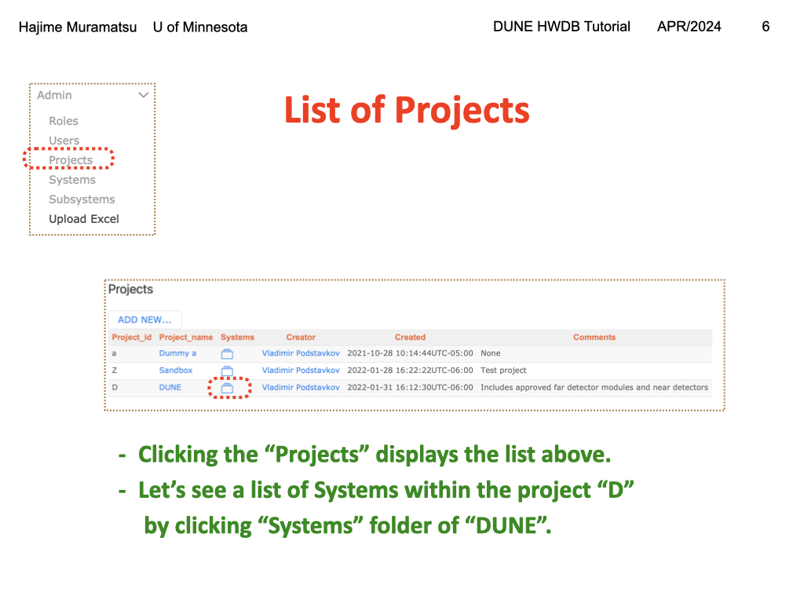
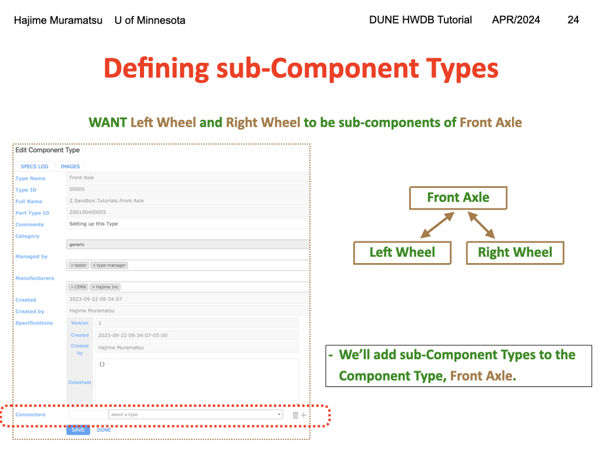
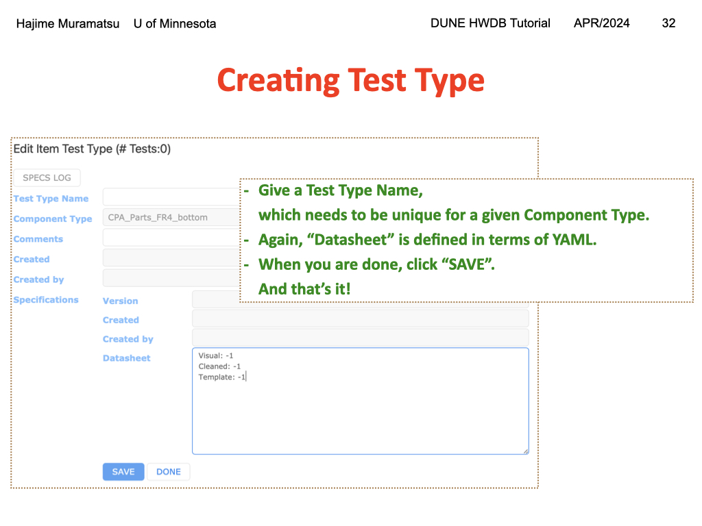
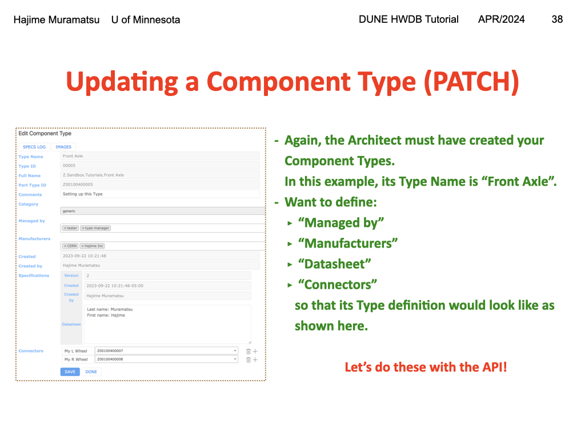
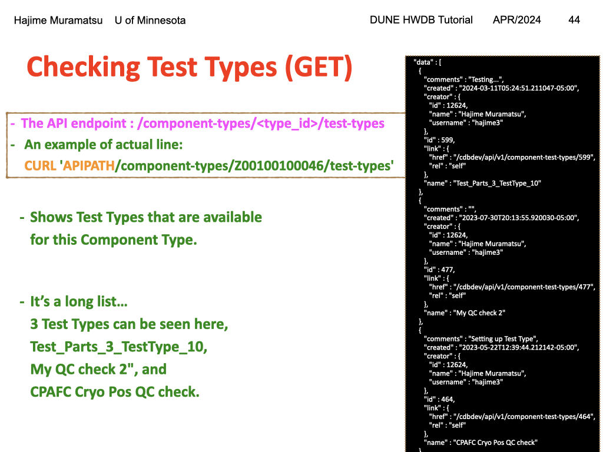
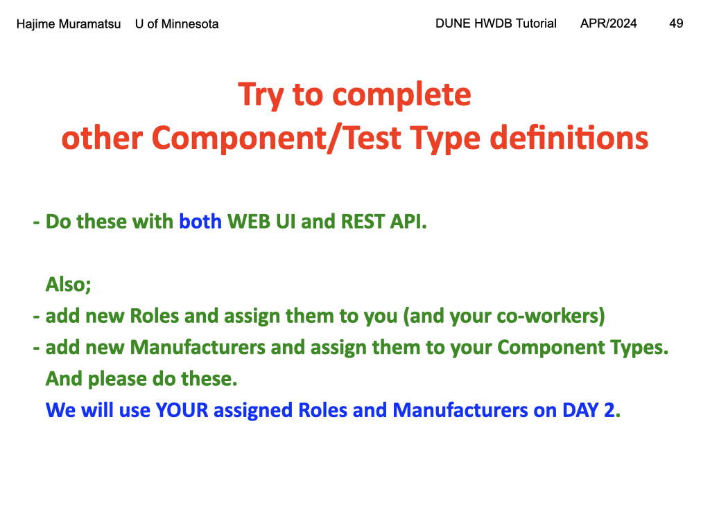

## Lesson Part 1

<!--slides are 1024 x 768 px-->

> Before inserting Items and their corresponding Tests, we need to define a Component Type and Test Type, respectively.
We will do so, first with the WEB UI, and then through the REST API in this section.
>
>> ## Slide 01
>>  
>>
>> Reference: [Slide Show](../fig/Setting-up-Types-v1.key)
>>{: output}
>{: .solution}
{: .challenge}

> First the WEB UI approach.
>
>> ## Slide 02
>>  
>>
>>  Reference: [Slide Show](../fig/Setting-up-Types-v1.key)
>>{: output}
>{: .solution}
{: .challenge}

> One can access to the two versions of the HWDB from these addresses.

We will use the development version in this session.
>
>> ## Slide 03 
>>  
>>
>>  Reference: [Slide Show](../fig/Setting-up-Types-v1.key)
>>{: output}
>{: .solution}
{: .challenge}

> The opening page: When you login, this is the very 1st page you will see.
One can look at the database schema of the HWDB.
There are links to Swagger (https://dbweb9.fnal.gov:8443/cdbdev/apidoc/swagger) and Redoc (https://dbweb9.fnal.gov:8443/cdbdev/apidoc/redoc) as well, which we will mention later in this session.
>
>> ## Slide 04
>>  
>>
>>  Reference: [Slide Show](../fig/Setting-up-Types-v1.key)
>>{: output}
>{: .solution}
{: .challenge}

> Going through the hierarchy of IDs (pages 5 through 9): 
>In the previous session, we introduced a several different IDs: Project, System ID, Subsystem ID, and Component Type ID.

>With the WEB UI, one can go down (and up) such hierarchy of IDs easily.

>Click “Admin” in the sidemen. It will show a menu as shown here. One can select any of the three, Projects, Systems, or Subsystems to get into the hierarchy list.
>
>> ## Slide 05
>>  
>>
>>  Reference: [Slide Show](../fig/Setting-up-Types-v1.key)
>>{: output}
>{: .solution}
{: .challenge}

> Let’s start with the “root” list by clicking Projects.
>You should be seeing a list of currently available Projects in the HWDB.
>
>Now let’s click the folder in the “DONE row” & “Systems” column. This will show a list of Systems (individual System names along with System IDs) that correspond to the DUNE project. 
>
>> ## Slide 06
>>  
>>
>>  Reference: [Slide Show](../fig/Setting-up-Types-v1.key)
>>{: output}
>{: .solution}
{: .challenge}

>Here is the list of currently available Systems (of the DUNE project).
>
>Now, similarly let’s display a list of Subsystems of System, FD2-VD HVS.
>
>> ## Slide 07
>>  
>>
>>  Reference: [Slide Show](../fig/Setting-up-Types-v1.key)
>>{: output}
>{: .solution}
{: .challenge}

>We now see a list of Subsystems of “System, FD2-VD HVS”.
>
>By the way, within these lists we have seen so far (currently Subsystems), one can also click individual “name” (i.e., Subsystem name) to see the corresponding definition.
>
>Now let’s pick “Field Cage Spacer Bar” to see a list of Component Types of the Subsystem, Field Cage Spacer Bar.
>
>> ## Slide 08
>>  
>>
>>  Reference: [Slide Show](../fig/Setting-up-Types-v1.key)
>>{: output}
>{: .solution}
{: .challenge}

>Four Component Types for Field Cage Spacer Bar are seen.


>
>From a Component Type list, one can click the “Items” or “Test Types” columns to see a list of the corresponding Items or Test Types, if it exists.
> 
>> ## Slide 09
>>  
>>
>>  Reference: [Slide Show](../fig/Setting-up-Types-v1.key)
>>{: output}
>{: .solution}
{: .challenge}

>Now that we can go through the hierarchy of existing IDs, let’s edit one of the existing Component Types.
Pick one that you like to modify.

>
>As an example, we’ll modify the Component Type, “CPA Parts FR4 bottom frame” (type id = Z00100100017) here. 
>
>> ## Slide 10
>>  
>>
>>  Reference: [Slide Show](../fig/Setting-up-Types-v1.key)
>>{: output}
>{: .solution}
{: .challenge}

> First, let’s find the Component Type.
>
>From the side menu, click “Component Types” and then click “FILTER…”.
>
>In the “Apply filters” window, you can provide the corresponding type id to “Part_type”, if you know the type id.
>You could also provide a fraction of the Component Type name, like “FR4_BOTTOM”. It is case-insensitive here.
>
>After filtering the Component Type list, you should be seeing the type you were looking for.
>Click its Type name to see its definition now.
>
>> ## Slide 11
>>  
>>
>>  Reference: [Slide Show](../fig/Setting-up-Types-v1.key)
>>{: output}
>{: .solution}
{: .challenge}

>Some of the fields are in “gray”, meaning that you are not allowed to edit them, such as
Type Name, Type ID, Full Name, Part Type ID, Created, and Created by.. etc.
>
>We’ll fill out the rest of the empty fields now. 
>
>> ## Slide 12
>>  
>>
>>  Reference: [Slide Show](../fig/Setting-up-Types-v1.key)
>>{: output}
>{: .solution}
{: .challenge}

>
>> ## Slide 13
>>  
>>
>>  Reference: [Slide Show](../fig/Setting-up-Types-v1.key)
>>{: output}
>{: .solution}
{: .challenge}

>Let’s start with “Managed by”.
>
>Here we provide a specific “Role” or “Roles”.
Each user can be assigned a specific Role or Roles.
>By providing a specific Role to this Component Type, only users who are assigned the specific Role are allowed to create/edit the corresponding Items later on.
>
>How can we create a new Role and assign to a specific user? 
>
>> ## Slide 14
>>  
>>
>>  Reference: [Slide Show](../fig/Setting-up-Types-v1.key)
>>{: output}
>{: .solution}
{: .challenge}

>Again, from the side-menu, click Admin -> Roles.
>You should see a list of existing Roles like shown here.
>
>Users with the Administrator privilege can create a new Role by clicking “ADD NEW…”.
>
>Similarly, one can display a list of users by clicking Admin -> Users.
>There, you can add a Role(s) to individual user.
> 
>> ## Slide 15
>>  
>>
>>  Reference: [Slide Show](../fig/Setting-up-Types-v1.key)
>>{: output}
>{: .solution}
{: .challenge}
> 
>> ## Slide 16
>>  
>>
>>  Reference: [Slide Show](../fig/Setting-up-Types-v1.key)
>>{: output}
>{: .solution}
{: .challenge}

> 
>> ## Slide 19
>>  
>>
>>  Reference: [Slide Show](../fig/Setting-up-Types-v1.key)
>>{: output}
>{: .solution}
{: .challenge}

> 
>> ## Slide 17
>>  
>>
>>  Reference: [Slide Show](../fig/Setting-up-Types-v1.key)
>>{: output}
>{: .solution}
{: .challenge}

> 
>> ## Slide 19
>>  
>>
>>  Reference: [Slide Show](../fig/Setting-up-Types-v1.key)
>>{: output}
>{: .solution}
{: .challenge}

> 
>> ## Slide 20
>>  
>>
>>  Reference: [Slide Show](../fig/Setting-up-Types-v1.key)
>>{: output}
>{: .solution}
{: .challenge}

> 
>> ## Slide 21
>>  
>>
>>  Reference: [Slide Show](../fig/Setting-up-Types-v1.key)
>>{: output}
>{: .solution}
{: .challenge}

> 
>> ## Slide 22
>>  
>>
>>  Reference: [Slide Show](../fig/Setting-up-Types-v1.key)
>>{: output}
>{: .solution}
{: .challenge}

> 
>> ## Slide 23
>>  
>>
>>  Reference: [Slide Show](../fig/Setting-up-Types-v1.key)
>>{: output}
>{: .solution}
{: .challenge}

> 
>> ## Slide 24
>>  
>>
>>  Reference: [Slide Show](../fig/Setting-up-Types-v1.key)
>>{: output}
>{: .solution}
{: .challenge}

> 
>> ## Slide 25
>>  
>>
>>  Reference: [Slide Show](../fig/Setting-up-Types-v1.key)
>>{: output}
>{: .solution}
{: .challenge}

> 
>> ## Slide 26
>>  
>>
>>  Reference: [Slide Show](../fig/Setting-up-Types-v1.key)
>>{: output}
>{: .solution}
{: .challenge}

> 
>> ## Slide 27
>>  
>>
>>  Reference: [Slide Show](../fig/Setting-up-Types-v1.key)
>>{: output}
>{: .solution}
{: .challenge}

> 
>> ## Slide 28
>>  
>>
>>  Reference: [Slide Show](../fig/Setting-up-Types-v1.key)
>>{: output}
>{: .solution}
{: .challenge}

> 
>> ## Slide 29
>>  
>>
>>  Reference: [Slide Show](../fig/Setting-up-Types-v1.key)
>>{: output}
>{: .solution}
{: .challenge}

> 
>> ## Slide 30
>>  
>>
>>  Reference: [Slide Show](../fig/Setting-up-Types-v1.key)
>>{: output}
>{: .solution}
{: .challenge}

> 
>> ## Slide 31
>>  
>>
>>  Reference: [Slide Show](../fig/Setting-up-Types-v1.key)
>>{: output}
>{: .solution}
{: .challenge}

> 
>> ## Slide 32
>>  
>>
>>  Reference: [Slide Show](../fig/Setting-up-Types-v1.key)
>>{: output}
>{: .solution}
{: .challenge}

> 
>> ## Slide 33
>>  
>>
>>  Reference: [Slide Show](../fig/Setting-up-Types-v1.key)
>>{: output}
>{: .solution}
{: .challenge}

> 
>> ## Slide 34
>>  
>>
>>  Reference: [Slide Show](../fig/Setting-up-Types-v1.key)
>>{: output}
>{: .solution}
{: .challenge}

> 
>> ## Slide 35
>>  
>>
>>  Reference: [Slide Show](../fig/Setting-up-Types-v1.key)
>>{: output}
>{: .solution}
{: .challenge}

> 
>> ## Slide 36
>>  
>>
>>  Reference: [Slide Show](../fig/Setting-up-Types-v1.key)
>>{: output}
>{: .solution}
{: .challenge}

> 
>> ## Slide 37
>>  
>>
>>  Reference: [Slide Show](../fig/Setting-up-Types-v1.key)
>>{: output}
>{: .solution}
{: .challenge}

> 
>> ## Slide 38
>>  
>>
>>  Reference: [Slide Show](../fig/Setting-up-Types-v1.key)
>>{: output}
>{: .solution}
{: .challenge}

> 
>> ## Slide 39
>>  
>>
>>  Reference: [Slide Show](../fig/Setting-up-Types-v1.key)
>>{: output}
>{: .solution}
{: .challenge}

> 
>> ## Slide 40
>>  
>>
>>  Reference: [Slide Show](../fig/Setting-up-Types-v1.key)
>>{: output}
>{: .solution}
{: .challenge}

> 
>> ## Slide 41
>>  
>>
>>  Reference: [Slide Show](../fig/Setting-up-Types-v1.key)
>>{: output}
>{: .solution}
{: .challenge}

> 
>> ## Slide 42
>>  
>>
>>  Reference: [Slide Show](../fig/Setting-up-Types-v1.key)
>>{: output}
>{: .solution}
{: .challenge}

> 
>> ## Slide 43
>>  
>>
>>  Reference: [Slide Show](../fig/Setting-up-Types-v1.key)
>>{: output}
>{: .solution}
{: .challenge}

> 
>> ## Slide 44
>>  
>>
>>  Reference: [Slide Show](../fig/Setting-up-Types-v1.key)
>>{: output}
>{: .solution}
{: .challenge}

> 
>> ## Slide 45
>>  
>>
>>  Reference: [Slide Show](../fig/Setting-up-Types-v1.key)
>>{: output}
>{: .solution}
{: .challenge}

> 
>> ## Slide 46
>>  
>>
>>  Reference: [Slide Show](../fig/Setting-up-Types-v1.key)
>>{: output}
>{: .solution}
{: .challenge}

> 
>> ## Slide 47
>>  
>>
>>  Reference: [Slide Show](../fig/Setting-up-Types-v1.key)
>>{: output}
>{: .solution}
{: .challenge}

> 
>> ## Slide 48
>>  
>>
>>  Reference: [Slide Show](../fig/Setting-up-Types-v1.key)
>>{: output}
>{: .solution}
{: .challenge}

> 
>> ## Slide 49
>>  
>>
>>  Reference: [Slide Show](../fig/Setting-up-Types-v1.key)
>>{: output}
>{: .solution}
{: .challenge}


