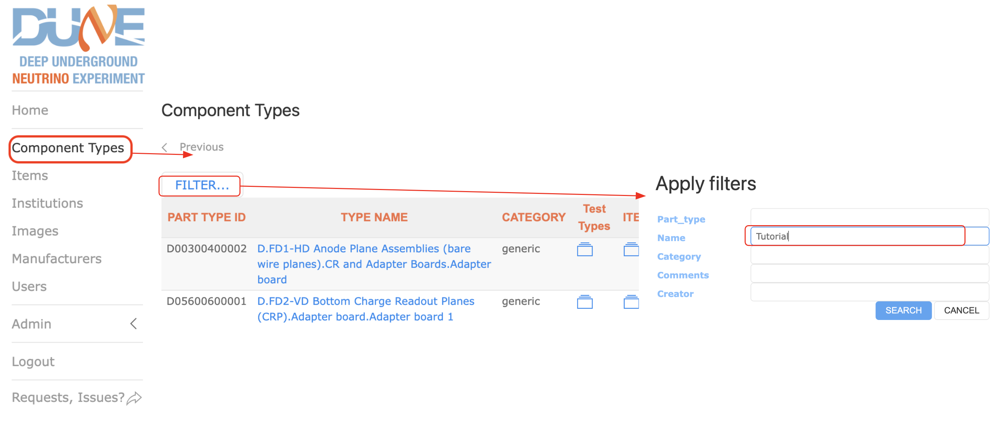
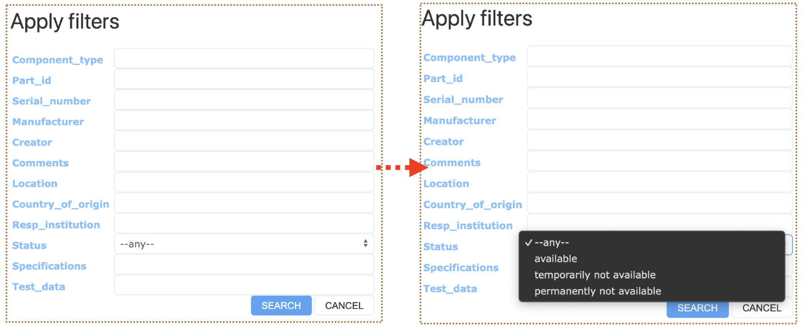
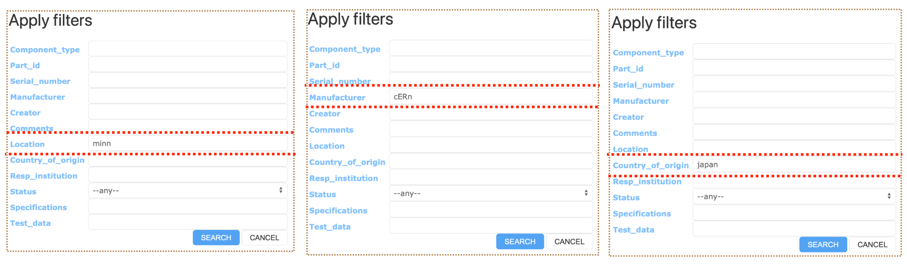
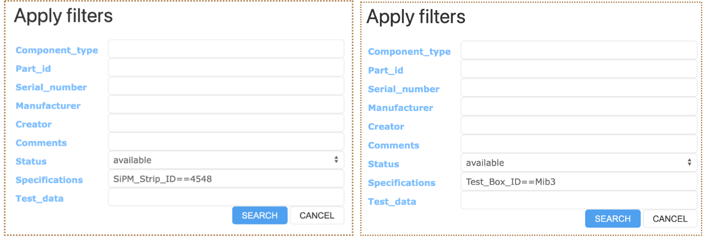

## Contents
>
>|-------------+------------------|
>|    | Description  |
>|-------------+------------------|
>| [Component Types](#component-types) |   |
>|-------------+------------------|
>| [Items](#items) |   |
>|-------------+------------------|
>| &emsp;[Preparing Items to be Added](#preparing-items-to-be-added) | |
>|-------------+------------------|
>| &emsp;[Adding Item(s)](#adding-items) | |
>|-------------+------------------|
>| &emsp;&emsp;[Adding Single Item](#adding-single-item) | |
>|-------------+------------------|
>| &emsp;&emsp;[Bulk Adding Items](#bulk-adding-items) | |
>|-------------+------------------|
>| &emsp;&emsp;[Adding Subcomponents](#adding-subcomponents) | |
>|-------------+------------------|
>| &emsp;&emsp;[Adding Tests](#adding-tests) | |
>|-------------+------------------|
>| &emsp;&emsp;[Adding Images](#adding-images) | |
>|-------------+------------------|
>| &emsp;[More Item Operations](#more-item-operations) | |
>|-------------+------------------|
>| [Item Filtering](#item-filtering) | Searching for Items based on chosen Filters |
>|-------------+------------------|
>| &emsp;[Syntax](#syntax) | Syntax in Filter fields |
>|-------------+------------------|
>|&emsp;[Filtering with Specifications](#filtering-with-specifications) | Filtering via the Specifications field |
>|-------------+------------------|
>|&emsp;[Filtering with Test Data](#filtering-with-test-data) | Filtering via the Test Data field |
>|-------------+------------------|
{: .checklist}

        

This tutorial will walk you through using the Web UI for the Hardware Database.

The development version of the HWDB can be accessed via http://dbweb0.fnal.gov:8443/cdbdev/login.

The production version of the HWDB can be accessed via http://dbweb0.fnal.gov:8443/cdbdev/login.

## Accessing Component Types

Note: Adding component types requires the user to have "Architect" priveleges for the HWDB. This 
is covered by the previous tutorial, "Setting up Component Types and Test Types." This tutorial 
assumes that component types being managed already exist in the HWDB, and the user has been added
to the appropriate Roles defined for that component type.

Let's try accessing a component type from the previous tutorial: "Z.Sandbox.Tutorials.Front Axle":

- Open the Web UI in your browser and log in.
- Select "Component Types" from the left menu. The UI will display a list of all component types
in the HWDB. This list will be many pages long. 
- We should filter this list so that we can find our component type more easily. Find the 
"Filter..." button towards the top of the page and click on it. The UI should display a pop-up
box titled "Apply filters."
- In the "Name" field, type part or all of the component type's name and click "Search." For this
example, let's type "Tutorial," although you could also try variations like "Sandbox.Tutorial" or 
"Front Axle". You may use wildcards to omit a middle portion, e.g. "Sand%.Tut%.Front". (Wildcards
are already assumed at the beginning and end.) The UI will respond with a list of component
types that only match the filter criteria.
 

{: width="85%"}

The component types are displayed in list view. This provides a variety of options as seen below. 
In particular you may access the Component Type definition, the Test Types, and the list of Items 
of that component type. 

Click on the red boxes in the image below for more information.



Let's take a look at "Front Axle."

- Click on the "Z.Sandbox.Tutorials.Front Axle" link.

We can see in the image below that the Specifications Datasheet contains two fields: "Last Name"
and "First Name". These have been given default values of "Muramatsu" and "Hajime". (If you wish
to have no default values, you may use the value "null".
 
We also see that the component type has two subcomponents ("connectors"): "My L Wheel" and 
"My R Wheel", each of which has been assigned a Part Type ID.



[back to top](#contents)

  

### Adding Item(s)

Now that we've examined the component type, let's add some items!

- Use the back button on your browser to return to the filtered list of component types.
- Click on the folder icon in the "ITEMS" column in the row for "Front Axle." The UI will respond
with a list of items for this component type.



[back to top](#contents)

  

#### Adding Single Item

To add a single item:

- Click on the "ADD NEW..." button towards the top of the screen. The UI will respond with the 
"Edit Item" screen. (Note that this screen
will show both for adding and editing items. However, when editing an item, there will be more
options available on the screen.
- At minimum, you must select a "Country of Origin" and "Resp. Institution." The remaining fields
are optional. IMPORTANT: Once the Country and 
Institution have been set, they may not be edited!
- The "Part ID" field displays the next available Part ID, which will be assigned to this item
when it is added. Note that the Part ID is not reserved until you save the item, so if multiple
users are adding items at the same time, that Part ID might get assigned to another user's item
before you finish adding it! If you need to make a note of the Part ID for later use, look for the
Part ID that was assigned after saving!
- Location may not be set until after the item has been created.
- Sub-components may not be assigned until after the item has been created.
- Click the "Save" button to add the item.



[back to top](#contents)

  

#### Bulk Adding Items

Bulk Adding allows you to add a number of items simultaneously. This is handy if you have a 
number of Items you wish to reserve Part IDs for, but you’re not ready to enter all the 
information for those Items yet.

To bulk add items:

- Use the back button on your broser to return to the list of items for "Front Axle". (You may
wish to hit the refresh button on your browser to pick up any items you have added since you were
last on that screen.)
- Click on the "BULK ADD..." button towards the top of the screen. The UI will display the
"Item Bulk Add" Screen.
- Select the appropriate values in the "Country of Origin" and "Resp. Institution" fields.
- Manufacturer is optional.
- Enter the number of items you wish to add in the "Count" field.
- Click the "SAVE" button. The UI will respond with a page in a new tab containing bar codes
and QR codes for the items you have added. You may print these out and apply them to your 
physical items.



[back to top](#contents)

  

#### Adding Subcomponents

Suppose we wish to add subcomponents to the previously added item `Z00100400005-00030`. 
Since this item has component type "Front Axle", the component type definition requires that the
subcomponents be of component type "Left Wheel" and "Right Wheel". Suppose we have added items
for both of these types, and their Part IDs are `Z00100400007-00013` and `Z00100400008-00014`.
Both of these items must have their status set to "Available."

To add these subcomponents:

- Use the back button on your browser to return to the list of items for "Front Axle." Refresh the 
page to update the list.
- Click on the link for "Z00100400005-00030". The UI will display the "Edit Item" screen for this
item.
- Under "Sub-components," click the "+" button to expand. The UI will now show the subcomponent
functional positions that need to be filled.
- Click the drop-down box for "My L Wheel: Left Wheel". The box will expand to show a text field
and the message "Please enter 2 or more characters."
- Enter two or more characters for any substring of the Part ID that you want. In this case, "13"
will suffice. The UI will display a list of Part IDs matching this substring.
- Click on "Z00100400007-13" to select it.
- Repeat this process for "My R Wheel:Right Wheel."



[back to top](#contents)

  

#### Adding Tests

Test Types need to be added to the Component Type before performing this action. When editing the item, click on "Test Log" on the top item menu (see [More Item Operations](#more-item-operations) for more) which will present you with something that looks like the following.



You can also add new tests by editing the item. To do so navigate to the particular item and go to its "Test Log", then click "Add New." Adding a new instance of a test and “editing” an instance are functionally identical! The only difference is that “editing” starts the form pre-filled with the contents of that instance. There is no branching. There is only one sequence of test records, and adding or “editing” will always just add a record to the end of that sequence. If multiple instances of the same test is desired, it is advisable to set up the Test Definition itself to accommodate multiple rows, and then always regard the last record in the log to be “current” and contain all relevant data for all tests, and every other record to be historical and not current.

[back to top](#contents)

  

#### Adding Images

In order to add an image to a selected item, click on "Images" on the top item menu (see [More Item Operations](#more-item-operations) for more) which will present you with something that looks like the following.



You can also add images to specific tests associated with items. Suppose we wish to add an image to the bounce test we added to `Z00100400005-00030`. Then navigate to the particular item and go to its "Test Log" which produces the following which allows you to add an image in the same way as shown above.



You can also add an image immediately after the additon of a new test, as it gives you the option to do so.

Images are attached to that test result record ONLY. If you “edit” a test, the images you have attached will not carry forward. You will need to decide whether you should re-attach all images every time you update a test record, or regard all images in the historical sequence to be “current.” The author of this presentation has no strong opinion at the time this was written.

[back to top](#contents)

  

### More Item Operations

Once an Item has been created, you are provided with more operations as shown below.



[back to top](#contents)
  

## Item Filtering

You can search for Items (Components) based on the usual fields such as Component_type, Part_id, Serial_number, and Creator. In addition, you can filter by the fields as shown below.

You can filter by **status**: any, available, temporarily not available, permanantly not available.
{: width="70%"}

You can also filter by **Location**, **Manufacturer**, and **Country of Origin**. Each of which are case **in**sensitive and need not be completely spelled out.
{: width="90%"} 

A more advanced discussion of filtering requires use of specific syntax.

### Syntax

There is certain syntax that can be used when you are refining your search using filter fields. The following symbols can be utilized with **numbers** in filter fields. 

>|------+------|
>| symbol | definition|
>|------+------|
>| == | equal to|
>|------+------|
>| != | not equal to|
>|------+------|
>| < | less than|
>|------+------|
>| <= | less than or equal to|
>|------+------|
>| > | greater than|
>|------+------|
>| >= | greater than or equal to|
>|------+------|

The following symbols can be utilized with **strings** and **substrings** in filter fields.

>|------+------|
>| symbol | definition|
>|------+------|
>| == | equal to|
>|------+------|
>| != | not equal to|
>|------+------|
>| ~ | case sensitive regex search|
>|------+------|
>| ~* | case insensitive regex search|
>|------+------|

[back to top](#contents)

### Filtering with Specifications

You can also filter based on item **Specifications**. Suppose there exists an item with the following specifictations:
~~~
"specifications":[
  {
    "Documentation": "https://something.com/something"
    "SiPM_Strip_ID": 4548
    "Test_Box_ID": "Mib3"
    "Tray_Number": 20
    "Vendor_box_Number": 14,
    "Vendor_Delivery_ID": "HPK_Ciemat_03"
    "_meta":{
      "_column_order:[
        "Vendor_Delivery_ID",
        "Vendor_box_Number",
        "SiPM_Strip_ID",
        "Test_Box_ID",
        "Documentation"
      ]
    }
  }
]
~~~
{: .output}
Then you can apply the following filters to search the item. The syntax used in the filtering field is explained in depth in the following section. 
{: width="90%"} 

   

Consider an item with the following Specifications.

~~~
"specifications":[
  {
    "Vendor_Delivery_ID": "HPK_Ciemat_03"
    "DATA": {
      "Drawing Number": "DFD-21-2101",
      "Label Code": "12345",
      "Name": "Main I-Beam"
    }
  }
]
~~~
{: .output}

Then, 
- Vendor_Delivery_ID~HPK_Ciemat_
- Vendor_Delivery_ID~*HPK_CiemaT_
- Name==Main I-Beam
- Label Code==12345

all return this item (as well as others if possible). However,
- Vendor_Delivery_ID~HPK_CiemaT_

would not return any item as **~** is case sensitive.

[back to top](#contents)

   

### Filtering with Test Data

You can also filter using Test_data in the same way as Specifications. Suppose you have an item with the following test data:

~~~
"test_data":{
  "Test Results": [
    {
      "Location": "Minnesota",
      "Operator": "Scientist Red"; "Scientist Blue",
      "SiPM":[
        {
          "Comment":"",
          "List1":[
            1.77734e-06
            6.90008e-07
            -2.44907e-06
            5.33429e-06
          ]
          "List2":[
            "H_RED"
            "Z_yellow"
            "U_green"
            "J_BLUE"
          ]
        }
      ]
    }
  ]
}
~~~
{: .output}
Then,
- List1[0]==1.77734e-06
- List1[1]>6.9e-07
- List2[3]~*j_blue
- List[*]==H_RED

all return the intended item.

[back to top](#contents)
   



