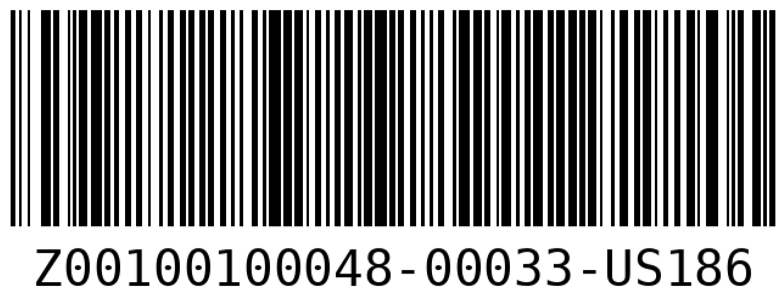

## Contents
>
>|-------------+------------------|
>|    | Description  |
>|-------------+------------------|
>| [GET](#get) |   |
>|-------------+------------------|
>| &emsp;[GET Item](#get-item) | |
>|-------------+------------------|
>| &emsp;[GET List of Items](#get-list-of-items) | |
>|-------------+------------------|
>| &emsp;[GET Test Types](#get-test-types) | |
>|-------------+------------------|
>| &emsp;[GET Test Results](#get-test-types) | |
>|-------------+------------------|
>| &emsp;[GET Location of Item](#get-location-of-item) | |
>|-------------+------------------|
>| &emsp;[GET QR/Barcode](#get-qrbarcode) | |
>|-------------+------------------|
>| &emsp;[GET Images](#get-images) | |
>|-------------+------------------|
>| [POST](#post) |   |
>|-------------+------------------|
>| &emsp;[POST Item](#post-item) | |
>|-------------+------------------|
>| &emsp;[POST Multiple Items](#post-mulitple-items) | |
>|-------------+------------------|
>| &emsp;[POST Test Types](#post-test-type) | |
>|-------------+------------------|
>| &emsp;[POST Test Results](#post-test-result)| |
>|-------------+------------------|
>| &emsp;[POST New Location](#post-new-location) | |
>|-------------+------------------|
>| &emsp;[POST Images](#post-images) | |
>|-------------+------------------|
>| &emsp;&emsp;[POST Images for Component Type](#post-image-for-component-type) | |
>|-------------+------------------|
>| &emsp;&emsp;[POST Images for Item](#post-image-for-item) | |
>|-------------+------------------|
>| &emsp;&emsp;[POST Images for Test](#post-image-for-test) | |
>|-------------+------------------|
>| [Item Filtering](#item-filtering) | Get via specifications and test data |
>|-------------+------------------|
>| [Subcomponents](#subcomponents) | |
>|-------------+------------------|
>| &emsp;[Dealing with Status](#dealing-with-status) | |
>|-------------+------------------|
>| &emsp;[Linking Subcomponents](#linking-subcomponents) | |
>|-------------+------------------|
>| &emsp;&emsp;[PATCH to Link](#patch-to-link) | |
>|-------------+------------------|
>| &emsp;&emsp;[PATCH to Clear](#patch-to-clear) | |
>|-------------+------------------|
>| &emsp;[GET Subcomponent](#get-subcomponent) | |
>|-------------+------------------|
>| &emsp;[GET Parent-Component](#get-parent-component) | |
>|-------------+------------------|
{: .checklist}

   

In order to interface with the REST API we will use the following command line often:

~~~
curl --cert-type P12 --cert MyCert.p12:myPSWD 'https://dbwebapi2.fnal.gov:8443/cdbdev/api/version/…'
~~~
{: .language-bash}

Where MyCert.p12 is a p12 certificate which an be obtained from [cilogon](https://cilogon.org), myPSWD is the certificate's password, and version is the version of the REST API (as of March 11th 2024, the latest version is v1).

Due to their repeated usage, we will abbreviate the following commands as such:

~~~
curl --cert-type P12 --cert MyCert.p12:myPSWD --> CURL
https://dbwebapi2.fnal.gov:8443/cdb/api/v1/ --> APIPATH
~~~
{: .language-bash}

## GET

### GET Item            

[Jump to POST counterpart](#post-item)

'Getting' an item calls the `/components/<pid>` API endpoint. For the following example we will use the following item: `Z00100400005-00001`. Use the following command line in order to 'get' the desired item.

~~~
CURL 'APIPATH/components/Z00100400005-00001'
~~~
{: .language-bash}

When executed, you will get the following response.

~~~
"data": {
    "batch": {
      "id": 3,
      "received": "2020-05-15"
    },
    "comments": "",
    "component_id": 46435,
    "component_type": {
      "name": "Front Axle",
      "part_type_id": "Z00100400005"
    },
    "country_code": "US",
    "created": "2023-09-22T10:50:55.099050-05:00",
    "creator": {
      "id": 12624,
      "name": "Hajime Muramatsu",
      "username": "hajime3"
    },
    "institution": {
      "id": 186,
      "name": "University of Minnesota Twin Cities"
    },
    "location": null,
    "manufacturer": {
      "id": 7,
      "name": "Hajime Inc"
    },
    "part_id": "Z00100400005-00001",
    "serial_number": "",
    "specifications": [
      {
        "First name": "Hajime.",
        "Last name": "Muramatsu"
      }
    ],
    "specs_version": 4,
    "status": {
      "id": 2,
      "name": "temporarily not available"
    }
  },
~~~
{: .output}

This can seem overwhealming at first, but notice the following important fields:
- component type id & name
- country Code
- institution id
- manufacturer
- serial number (empty)
- location (not defined, yet)
- specifications
- part_id (which is the pid generated by the database)

[back to top](#contents)

   

### GET List of Items

[Jump to POST counterpart](#post-mulitple-items)

You can also get items by simply specifying the Component Type ID. To do so you can use the `/component-types/<type_id>/components` API endpoint. For the following example we will use component type 'Front Axle' with ID `Z00100400005`.

~~~
CURL 'APIPATH/component-types/Z00100400005/components'
~~~
{: .language-bash}

When executed, it gives the following response:

~~~
{
  "component_type": {
    "name": "Front Axle",
    "part_type_id": "Z00100400005"
  },
  "data": [
    {
      "comments": "",
      "component_id": 46435,
      "created": "2023-09-22T10:50:55.099050-05:00",
      "creator": {
        "id": 12624,
        "name": "Hajime Muramatsu",
        "username": "hajime3"
      },
      "link": {
        "href": "/cdbdev/api/v1/components/Z00100400005-00001",
        "rel": "self"
      },
      "location": "",
      "part_id": "Z00100400005-00001",
      "serial_number": "",
      "specifications": [
        {
          "First name": "Hajime.",
          "Last name": "Muramatsu"
        }
      ],
      "status": {
        "id": 2,
        "name": "temporarily not available"
      }
    },
    {
      "comments": null,
      "component_id": 46436,
      "created": "2023-09-22T11:07:46.576790-05:00",
      "creator": {
        "id": 12624,
        "name": "Hajime Muramatsu",
        "username": "hajime3"
      }
    }
  ]
}
~~~
{: .output}

This command returns all items with 'Front Axle' component type. The database returns 100 items at a time. If a component type has more than 100 items associated with it, the list of items is split into multiple pages which is managed by pagination. Take for example `Z00100300030`

~~~
"pagination": {
    "next": "/cdbdev/api/v1/component-types/Z00100300030/components?page=2&size=100",
    "page": 1,
    "page_size": 100,
    "pages": 2,
    "prev": null,
    "total": 182
  }
~~~
{: .output}

In order to access a specific page number, you can use `CURL 'APIPATH/component-types/Z00100300030/components?page=X'` where X is the specific page number.

[back to top](#contents)

   

### GET Test Types

[Jump to POST counterpart](#post-test-type)

You can check which test types are compatible with a given component type. In order to do so you can use the `/component-types/<type_id>/test-types` API endpoint. The following is an example using component type `Z00100100046`.

~~~
CURL 'APIPATH/component-types/Z00100100046/test-types'
~~~
{: .language-bash}

The response when executed is quite long, so we display an abbreviated list.

~~~
  "data" : [
      {
         "comments" : "Testing...",
         "created" : "2024-03-11T05:24:51.211047-05:00",
         "creator" : {
            "id" : 12624,
            "name" : "Hajime Muramatsu",
            "username" : "hajime3"
         },
         "id" : 599,
         "link" : {
            "href" : "/cdbdev/api/v1/component-test-types/599",
            "rel" : "self"
         },
         "name" : "Test_Parts_3_TestType_10"
      },
      {
         "comments" : "",
         "created" : "2023-07-30T20:13:55.920030-05:00",
         "creator" : {
            "id" : 12624,
            "name" : "Hajime Muramatsu",
            "username" : "hajime3"
         },
         "id" : 477,
         "link" : {
            "href" : "/cdbdev/api/v1/component-test-types/477",
            "rel" : "self"
         },
         "name" : "My QC check 2"
      },
      {
         "comments" : "Setting up Test Type",
         "created" : "2023-05-22T12:39:44.212142-05:00",
         "creator" : {
            "id" : 12624,
            "name" : "Hajime Muramatsu",
            "username" : "hajime3"
         },
         "id" : 464,
         "link" : {
            "href" : "/cdbdev/api/v1/component-test-types/464",
            "rel" : "self"
         },
         "name" : "CPAFC Cryo Pos QC check"
      }....
  ]
~~~
{: .output}

[back to top](#contents)

   

### GET Test Results

[Jump to POST counterpart](#post-test-result)

You can also get test results associated with particular items. This uses the `/components/<eid>/tests/<test_type_name>` API endpoint. For the following example, we will use item `Z00100100046-00008` and test type `Test_Parts_3_TestType_10`.

~~~
CURL ‘APIPATH/components/Z00100100046-00008/tests/Test_Parts_3_TestType_10'
~~~
{: .language-bash}

Which returns the following.

~~~
"data": [
    {
      "comments": "All look ok",
      "created": "2024-05-22T09:43:37.049580-05:00",
      "creator": {
        "id": 12624,
        "name": "Hajime Muramatsu",
        "username": "hajime3"
      },
      "id": 17813,
      "images": [],
      "link": {
        "href": "/cdbdev/api/v1/component-tests/17813",
        "rel": "details"
      },
      "methods": [
        {
          "href": "/cdbdev/api/v1/component-tests/17813/images",
          "rel": "Images"
        }
      ],
      "test_data": {
        "Cleaned": 1,
        "Template": 1,
        "Visual": 1
      },
      "test_spec_version": -1,
      "test_type": {
        "id": 599,
        "name": "Test_Parts_3_TestType_10"
      }
    }
  ],
~~~
{: .output}

[back to top](#contents)

   

### GET Location of Item

[Jump to POST counterpart](#post-new-location)

You can get the current and previous locations of an item using the `/components/<pid>/locations` API endpoint. The returned list is sorted by most recent first. We will use item `Z00100300030-00103` for the following example.

~~~
CURL 'APIPATH/components/Z00100300030-00103/locations'
~~~
{: .language-bash}

Which returns the following.

~~~
"data": [
    {
      "arrived": "2024-04-10T14:50:12-05:00",
      "comments": "now testing through the REST API",
      "created": "2024-04-10T14:09:44.316278-05:00",
      "creator": "Hajime Muramatsu",
      "id": 92,
      "link": {
        "href": "/cdbdev/api/v1/locations/92",
        "rel": "details"
      },
      "location": {
        "id": 187,
        "name": "University of Mississippi"
      }
    },
    {
      "arrived": "2024-04-10T09:51:44.735194-05:00",
      "comments": "testing...",
      "created": "2024-04-10T09:51:44.735194-05:00",
      "creator": "Hajime Muramatsu",
      "id": 91,
      "link": {
        "href": "/cdbdev/api/v1/locations/91",
        "rel": "details"
      },
      "location": {
        "id": 186,
        "name": "University of Minnesota Twin Cities"
      }
    },
    {
      "arrived": "2024-04-10T14:50:12-05:00",
      "comments": "now testing through the REST API",
      "created": "2024-04-04T08:16:44.333658-05:00",
      "creator": "Hajime Muramatsu",
      "id": 15,
      "link": {
        "href": "/cdbdev/api/v1/locations/15",
        "rel": "details"
      },
      "location": {
        "id": 9,
        "name": "Universidade Federal de Alfenas"
      }
    }
]
~~~
{: .output}

[back to top](#contents)

### GET QR/Barcode

You can use the designated API endpoints `/get-barcode/<pid>` and `/get-qrcode/<pid>` to get a barcode and QR code respectively. Consider `Z00100100048-00033`.

~~~
CURL 'APIPATH/get-barcode/Z00100100048-00033-US186' --output test.png
~~~
{: .language-bash}

Which produces the following.

{: width="25%"}

The process is identical for producing QR codes.

[back to top](#contents)

### GET Images

[Jump to POST counterpart](#post-image-for-item)

Regardless of how the image was posted (for a given Component Type, Item, or Test entry) the process of GETting the image and downloading it is very similar. The following are the API endpoints for Component type, Item, and Test entry respectively. Note that GETting an image from a test entry requires the OID. The manner in which the OID can be obtained is shown [here](#post-image-for-test).

~~~
 CURL 'APIPATH/component-types/<type_id>/images'
 CURL 'APIPATH/components/<eid>/images'
 CURL ‘APIPATH/component-tests/<oid>/images’
~~~
{: .language-bash}

We will only guve an example for GETting an image for a given component type, as aside from the inital API endpoint, the process is identical. Suppose you have the type id `Z00100100048`.

~~~
CURL 'APIPATH/component-types/Z00100100048/images'
~~~
{: .language-bash}

~~~
{
  "component_type": {
    "name": "Test_Parts_1",
    "part_type_id": "Z00100100048"
  },
  "data": [
    {
      "comments": null,
      "created": "2024-05-22T14:03:26.007944-05:00",
      "creator": {
        "id": 12624,
        "name": "Hajime Muramatsu",
        "username": "hajime3"
      },
      "image_id": "fa636f5c-186d-11ef-ba26-2f96aeb61232",
      "image_name": "myimage.pdf",
      "library": "type",
      "link": {
        "href": "/cdbdev/api/v1/img/fa636f5c-186d-11ef-ba26-2f96aeb61232",
        "rel": "self"
      }
    },
    {
      "comments": null,
      "created": "2024-05-22T14:09:14.068344-05:00",
      "creator": {
        "id": 12624,
        "name": "Hajime Muramatsu",
        "username": "hajime3"
      },
      "image_id": "c9dfdd88-186e-11ef-ba26-c76e454071ee",
      "image_name": "myimage.pdf",
      "library": "type",
      "link": {
        "href": "/cdbdev/api/v1/img/c9dfdd88-186e-11ef-ba26-c76e454071ee",
        "rel": "self"
      }
    }
  ],
  "link": {
    "href": "/cdbdev/api/v1/component-types/Z00100100048/images",
    "rel": "self"
  },
  "status": "OK"
}
~~~
{: .output}

Notice that there are mulitple "myimage.pdf"s, but the image_id is unique. In order to download the desired image, we will require the image_id, since we will utilize the `/img/<image_id>` API endpoint.

~~~
CURL 'APIPATH/img/fa636f5c-186d-11ef-ba26-2f96aeb61232' -o myimage.pdf
~~~
{: .language-bash}

[back to top](#contents)

   
   

## POST

### POST item

[Jump to GET counterpart](#get-item)

When you post an item, the database generates a unique DUNE PID and assigns it to the item. Posting an item calls on the `/component-types/<type_id>/components` API endpoint. For the following example we will post an item with Component Type ID `Z00100400005`. You can execute the command using the following line:

~~~
 CURL -H "Content-Type: application/json" -X POST -d @Add_AnItem_Test_Parts_1.json 'APIPATH/component-types/Z00100400005/components' 
~~~
{: .language-bash}

And entering the following JSON.

~~~
{
    "component_type": {
        "part_type_id": "Z00100400005"
    },
    "country_code": "US",
    "comments": "Testing...",
    "institution": {
        "id": 186
    },
    "manufacturer": {
        "id": 7
    },
    "specifications": {
	"Last name" : "Muramatsu",
	"First name" : "Hajime"
    }
}
~~~

When posting an item, the following fields are **required**:
- part_type_id
- country_code
- institution
- specifications

When excecuted, you should receive a response similar to the following:

~~~
{
  "component_id": 153639,
  "data": "Created",
  "part_id": "Z00100400005-00014",
  "status": "OK"
}
~~~
{: .output}

Which displays the assigned PID, `Z00100400005-00014`.

[back to top](#contents)

   

### POST mulitple items

[Jump to GET counterpart](#get-list-of-items)

You can also post multiple items for a specified Component Type ID at once. To do so, you can use the `/component-types/<type_id>/bulk-add` API endpoint. For the following example we will post items with Component Type ID `Z00100400005`. You can execute the command using the following line:

~~~
CURL -H "Content-Type: application/json" -X POST -d @Add_ItemS_Test_Parts_1.json 'APIPATH/component-types/Z00100400005/bulk-add' 
~~~
{: .language-bash}

And enter the following JSON:

~~~
{
    "component_type": {
	"part_type_id": "Z00100400005"
    },
    "country_code": "US",
    "institution": {
	"id": 186
    },
    "manufacturer": {
	"id": 7
    },
    "count": 2
}
~~~

Notice that we specify how many items we wish to post by "**count**". When excecuted, you should receive a response similar to the following:

~~~
{
  "data": [
    {
      "link": {
        "href": "/cdbdev/api/v1/components/Z00100400005-00015",
        "rel": "self"
      },
      "part_id": "Z00100400005-00015"
    },
    {
      "link": {
        "href": "/cdbdev/api/v1/components/Z00100400005-00016",
        "rel": "self"
      },
      "part_id": "Z00100400005-00016"
    }
  ],
  "status": "OK"
}
~~~
{: .output}

You can see that two distinct PIDs have been assigned `Z00100400005-00015` and `Z00100400005-00016`.

[back to top](#contents)

   

### POST Test Type

[Jump to GET counterpart](#get-test-types)

Creating a Test Type for a particular Component Type calls upon the `/component-types/<type_id>/test-types` API endpoint. When posting a test type, the test type name and specifications are required. We will continue using Component Type `Z00100400005`.You can excecute the following command line:

~~~
CURL -H "Content-Type: application/json" -X POST -d @Post_TestType_Test_parts_3.json 'APIPATH/component-types/Z00100100046/test-types'
~~~
{: .language-bash}

And submit the following JSON file:

~~~
{
    "component_type": {
        "part_type_id": "Z00100100046"
    },
    "name": "Test_Parts_3_TestType_10",
    "comments": "Testing...",
    "specifications": {
        "Cleaned": 0,
        "Template": 0,
        "Visual": 0
    }
}
~~~

When executed, a response similar to the following should be displayed.

~~~
{
   "data" : "Created",
   "name" : "Test_Parts_3_TestType_10",
   "status" : "OK",
   "test_type_id" : 599
}
~~~
{: .output}

Which displays that a test type of name Test_Parts_3_TestType_10 was created.

[back to top](#contents)

   

### POST Test Result

[Jump to GET counterpart](#get-test-results)

Posting test results calls upon the `/components/<pid>/tests` API endpoint. you must specify the name of the test and the specifications. It is important to note that you should know the schema of the specifications prior to submission of the JSON file. Comments are optional. For the following example, the external ID is `Z00100100046-00008`. The command is as follows:

~~~
CURL -H "Content-Type: application/json" -X POST -d @Post_TestResult_Test_parts_10.json 'APIPATH/components/Z00100100046-00008/tests'
~~~
{: .language-bash}

And the JSON file is as such:

~~~
{
    "test_type": "Test_Parts_3_TestType_10",
    "comments": "All look ok",
    "test_data": {
        "Cleaned": 1,
        "Template": 1,
        "Visual": 1
    }
}
~~~

When executed, it should produce a response similar to the following:

~~~
{
  "data": "Created",
  "status": "OK",
  "test_id": 17813,
  "test_type_id": 599
}
~~~
{: .output}

[back to top](#contents)

   

### POST New location

[Jump to GET counterpart](#get-location-of-item)

You can post a new location to an item by using the `/components/<pid>/locations` API endpoint. The location is specified by Institution ID, which can be found [here]({{site.url}}/02-Introduction-HWDB/index.html#responsible-institution-id-required). When adding a new location to an item, if the time zone is not specified for the arrival time the time zone defaults to CST. The following is an example.

~~~
CURL -H "Content-Type: application/json" -X POST -d @Post_ALocation.json ‘APIPATH/components/Z00100300030-00103/locations'
~~~
{: .language-bash}

~~~
{
  "arrived": "2024-05-10 13:27:18",
  "comments": "now testing through the REST API",
  "location": {
    "id": 187
  }
}
~~~

When executed, it should produce a similar response to the following.

~~~
{
  "data": "Created",
  "id": 95,
  "status": "OK"
}
~~~
{: .output}

[back to top](#contents)

   

### POST Images

[Jump to GET counterpart](#get-images)

You can also post images in three different ways: for a given Component Type, for a given Item, and for a given Test entry. Most major image types are supported including .jpeg, .tiff, .pdf, .bmp, and .png.

#### POST Image for Component Type

Posting an image for a given Component Type utilizes the `/component-types/<type_id>/images` API endpoint. Suppose you wish to post an image myimage.pdf to the component type `Z00100100048`.

~~~
CURL -H "comments=testing from curl" -F "image=@myimage.pdf" 'APIPATH/component-types/Z00100100048/images'
~~~
{: .language-bash}

When executed, the response is as follows.

~~~
{
  "data": "Created",
  "image_id": "fa636f5c-186d-11ef-ba26-2f96aeb61232",
  "status": "OK"
}
~~~

#### POST Image for Item

Posting an image for a specific item utilizes the `/components/<eid>/images` API endpoint. Suppose you wish to post an image myimage.pdf to the item `Z00100100048-00033`.

~~~
CURL -H "comments=testing from curl" -F "image=@myimage.pdf" 'APIPATH/components/Z00100100048-00033/images'
~~~
{: .language-bash}

When executed, the response is as follows.

~~~
{
  "data": "Created",
  "image_id": "0c5cb65e-189c-11ef-bcbf-af36911a955c",
  "status": "OK"
}
~~~

#### POST Image for Test

In order to post an image to a particular Test entry you require a unique IF assigned to each entry, called an OID. To obtain the OID, you need to GET the particular test result. For this example, suppose you have item `Z00100200040-00001` and test type `CPA_Parts_FR4_main QC check`. You can use the ` /components/<eid>/tests/<test_type_name>` API endpoint to pull the test result.

~~~
CURL ‘APIPATH/components/Z00100200040-00001/tests/CPA_Parts_FR4_main QC check?history=true'
~~~
{: .language-bash}

~~~
  "data": [
    {
      "comments": "here is the 1st test of the test result...",
      "created": "2020-11-16T10:13:48.704421-06:00",
      "creator": {
        "id": 12624,
        "name": "Hajime Muramatsu",
        "username": "hajime3"
      },
      "id": 110,
      "images": [
        {
          "id": "12529424-86a6-11eb-a31b-936fd91bb429",
          "name": "DFD-20-A017.pdf"
        }
      ],
      "link": {
        "href": "/cdbdev/api/v1/component-tests/110",
        "rel": "details"
      },
      "methods": [
        {
          "href": "/cdbdev/api/v1/component-tests/110/images",
          "rel": "Images"
        }
      ],
      "test_data": {
        "Cleaned": 0,
        "Comments": null,
        "Template": 1,
        "Visual": 40
      },
      "test_spec_version": -1,
      "test_type": {
        "id": 15,
        "name": "CPA_Parts_FR4_main QC check"
      }
    },
    {
      "comments": "here is the 1st test of the test result...",
      "created": "2020-11-16T10:13:18.708351-06:00",
      "creator": {
        "id": 12624,
        "name": "Hajime Muramatsu",
        "username": "hajime3"
      },
      "id": 109,
      "images": [],
      "link": {
        "href": "/cdbdev/api/v1/component-tests/109",
        "rel": "details"
      },
      "methods": [
        {
          "href": "/cdbdev/api/v1/component-tests/109/images",
          "rel": "Images"
        }
      ],
      "test_data": {
        "Cleaned": 0,
        "Comments": "All looked/passed good...",
        "Template": 1,
        "Visual": 40
      },
      "test_spec_version": -1,
      "test_type": {
        "id": 15,
        "name": "CPA_Parts_FR4_main QC check"
      }
    }
  ]
~~~
{: .output}

Here we see two test results, the first one with an image, OID = 110 and the second without, OID = 109. Notice that, independent of whether there is an image(s) associated with a particular test or not, there is always an OID assigned to each of the entries. You can use the ` /component-tests/<oid>/images` API endpoint to post the image to the test result.

~~~
CURL -H "comments=testing from curl" -F "image=@myimage.pdf" 'APIPATH/component-tests/109/images'
~~~
{: .language-bash}

When executed, the response is as follows.

~~~
{
  "data": "Created",
  "image_id": "ccdd1168-18a0-11ef-ad0c-0bc7358d82dc",
  "status": "OK"
}
~~~
{: .output}

[back to top](#contents)

## Item Filtering

One can *get* items using specification and test data as seen in Item Filtering in the WEB UI section. The following are the templates for the bash commands.

~~~
/api/v1/components?specs=<XXX>
/api/v1/components?testdata=<XXX>
~~~
{: .language-bash}

The following are a list of specific examples for get via specifications:

~~~
/api/v1/components?specs=SiPM_Strip_ID==4548 | jq.data[].part_id
/api/v1/components?specs=Test_Box_ID==Mib3 | jq.data[].part_id
/api/v1/components?specs=Label%20Code==12345| jq.data[].part_id
~~~
{: .language-bash}

The following is a list of specific examples for get via test data:

~~~
/api/v1/components?testdata=RPFSSRes%20RP%20Drawing%20N==DFD-20-A503 | jq.data[].part_id
/api/v1/components?testdata=I[0]==1.2604860486048603e-06 | jq.data[].part_id
~~~
{: .language-bash}

[back to top](#contents)

### Syntax

There is certain syntax that can be used when you are refining your search using filter fields. The following symbols can be utilized with **numbers** in filter fields. 

>|------+------|
>| symbol | definition|
>|------+------|
>| == | equal to|
>|------+------|
>| != | not equal to|
>|------+------|
>| < | less than|
>|------+------|
>| <= | less than or equal to|
>|------+------|
>| > | greater than|
>|------+------|
>| >= | greater than or equal to|
>|------+------|

The following symbols can be utilized with **strings** and **substrings** in filter fields.

>|------+------|
>| symbol | definition|
>|------+------|
>| == | equal to|
>|------+------|
>| != | not equal to|
>|------+------|
>| ~ | case sensitive regex search|
>|------+------|
>| ~* | case insensitive regex search|
>|------+------|

[back to top](#contents)

## Subcomponents

Adding subcomponents is a way to link existing items. Before attempting to link them, it is important to insure that the subcomponent type definitions are correct. The defining of subcomponent types is done in the WEB UI.

### Dealing with Status

In order to link items, the status of the intended subcomponent must be "available." There are two ways to check for this, one is by simply checking the item itself via the `/components/<eid>` API endpoint. The other is to do so directly through the `/components/<eid>/status` API end point. For example, take `Z00100400005-00001`.

~~~
CURL ‘APIPATH/components/Z00100400005-00001/status’ 
~~~
{: .language-bash}

Which returns the following.

~~~
{
  "component": {
    "id": 152958,
    "part_id": "D00599800001-00379"
  },
  "data": {
    "status": {
      "id": 3,
      "name": "permanently not available"
    }
  }
}
~~~
{: .output}

We can see that the status is "permanently not available," with id 3. There are three different types of statuses:

| Status ID | Status Name |
|----------|----------|
| 1 | available |
| 2 | temporarily not available |
| 3| permanently not available |

If an item already exists which you wish to link to another item, we can make it available via the PATCH command and the `/components/<eid>/status` API endpoint. Take for example `Z00100400007-00001`.

~~~
CURL -H "Content-Type: application/json" -X PATCH -d @Patch_Item_Status.json ‘APIPATH/components/Z00100400007-00001/status'
~~~
{: .language-bash}

And submit the following.

~~~
{
    "component": {
        "part_id": "Z00100400007-00001"
    },
    "status": {
	"id": 1
    }
}
~~~

When executed, it returns the following.

~~~
{
  "component_id": 46438,
  "data": "Created",
  "new_status": "available",
  "part_id": "Z00100400007-00001",
  "status": "OK"
}
~~~
{: .output}

You can also PATCH the status of multiple items at a time via the `/components/bulk-enable` API endpoint. Suppose you have two items, `Z00100400007-00001` which you wish to enable or make "available" and `Z00100400007-00002` which you wish to disable or make "not available."

~~~
CURL -H "Content-Type: application/json" -X PATCH -d @enableBulkSub.json 'APIPATH/components/bulk-enable'
~~~
{: .language-bash}

Submit the following.

~~~
{
    "data": [
        {
              "part_id": "Z00100400007-00001"
        },
	{
            "part_id": "Z00100400007-00002",
	    "enabled": false
        }
    ]
}
~~~

When executed, it returns the following:

~~~
{
  "data": [
    {
      "link": {
        "href": "/cdbdev/api/v1/components/46438",
        "rel": "self"
      },
      "message": "enabled",
      "part_id": "Z00100400007-00001"
    },
    {
      "link": {
        "href": "/cdbdev/api/v1/components/46439",
        "rel": "self"
      },
      "message": "disabled",
      "part_id": "Z00100400007-00002"
    }
  ],
  "status": "OK"
}
~~~
{: .output}

[back to top](#contents)

### Linking Subcomponents

There are two ways to link a subcomponent. One is to do so directly when posting an item and specifying subcomponents, the other is patching an existing item to add the subcomponents. As previously mentioned, the intended subcomponents must be available to be linked. For the following examples, consider items `Z00100400007-00001`,`Z00100400008-00001`. As well as an item with subcomponent schema defined as:

~~~
"subcomponents": {
	"My L Wheel": <pid>
	"My R Wheel": <pid>
    }
~~~

#### POST

In order to link items via post, the process it identical to posting an item without subcomponents via the `/component-types/<type_id>/components` API endpoint. It is important to not that you cannot link items that are already linked to other items.

~~~
CURL -H "Content-Type: application/json" -X POST -d @Add_AnItem_Test_Parts_1-2.json 'APIPATH/component-types/Z00100400005/components'
~~~
{: .language-bash}

The JSON passed:
~~~
{
    "component_type": {
        "part_type_id": "Z00100400005"
    },
    "country_code": "US",
    "comments": "Testing...",
    "institution": {
        "id": 186
    },
    "manufacturer": {
        "id": 7
    },
    "specifications": {
	"Last name": "Muramatsu",
	"First name": "Hajime"
    },
    "subcomponents": {
        "My L Wheel": "Z00100400007-00001",
        "My R Wheel": "Z00100400008-00001"
    }
}
~~~

Notice the only difference is the specified subcomponents. When executed, it returns the following.

~~~
{
  "component_id": 153657,
  "data": "Created",
  "part_id": "Z00100400005-00017",
  "status": "OK"
}
~~~

#### PATCH to Link

You can patch an item to add subcomponents via the `/components/<eid>/subcomponents` API endpoint.

~~~
CURL -H "Content-Type: application/json" -X PATCH -d @Patch_AnItem_Test_Parts_1.json 'APIPATH/components/Z00100400005-00001/subcomponents'
~~~
{: .language-bash}

Submit the following JSON.

~~~
{
    "component": {
	"part_id": "Z00100400005-00001"
    },
    "subcomponents": {
	"My L Wheel": "Z00100400007-00002",
	"My R Wheel": "Z00100400008-00002"
    }
}
~~~

When executed, it returns the following.

~~~
{
  "component_id": 46435,
  "data": "Updated",
  "part_id": "Z00100400005-00001",
  "status": "OK"
}
~~~

Notice that "data" has been "Updated."

#### PATCH to Clear

You can also undo or clear links using PATCH and the `/components/<eid>/subcomponents` API endpoint. 

~~~
CURL -H "Content-Type: application/json" -X PATCH -d @Patch_AnItem_Test_Parts_1_clean.json 'APIPATH/components/Z00100400005-00001/subcomponents'
~~~
{: .language-bash}

In order to clear, pass null in the schema of the defined subcomponent.

~~~
  {
    "component": {
        "part_id": "Z00100400005-00001"
    },
    "subcomponents": {
        "My L Wheel": null,
        "My R Wheel": null
    }
}
~~~

When executed, the following is returned.

~~~
{
  "component_id": 46435,
  "data": "Updated",
  "part_id": "Z00100400005-00001",
  "status": "OK"
}
~~~

[back to top](#contents)

### GET Subcomponent

You can also use GET and the `/components/<eid>/subcomponents` API endpoint to return a list of all subcomponents linked to a particular item. For example, consider `Z00100400005-00001`.

~~~
CURL 'APIPATH/components/Z00100400005-00001/subcomponents'
~~~
{: .language-bash}

Which returns the following.

~~~
"data": [
    {
      "comments": null,
      "created": "2024-05-22T10:45:08.718759-05:00",
      "creator": {
        "id": 12624,
        "name": "Hajime Muramatsu",
        "username": "hajime3"
      },
      "functional_position": "My L Wheel",
      "link": {
        "href": "/cdbdev/api/v1/components/Z00100400007-00002",
        "rel": "self"
      },
      "operation": "mount",
      "part_id": "Z00100400007-00002",
      "type_name": "Left Wheel"
    },
    {
      "comments": null,
      "created": "2024-05-22T10:45:08.727897-05:00",
      "creator": {
        "id": 12624,
        "name": "Hajime Muramatsu",
        "username": "hajime3"
      },
      "functional_position": "My R Wheel",
      "link": {
        "href": "/cdbdev/api/v1/components/Z00100400008-00002",
        "rel": "self"
      },
      "operation": "mount",
      "part_id": "Z00100400008-00002",
      "type_name": "Right Wheel"
    }
  ],
~~~
{: .output}

[back to top](#contents)

### GET Parent-Component

You can also check it see if a particular item is a subcomponent, that is check to if if it has a parent-component. You can do so by calling the `/components/<eid>/container` API endpoint. Consider the item "My L Wheel", `Z00100400007-00001`.

~~~
CURL 'APIPATH/components/Z00100400007-00002/container'
~~~
{: .language-bash}

Which returns the following.

~~~
"data": [
    {
      "comments": null,
      "container": {
        "component_type": {
          "name": "Front Axle",
          "part_type_id": "Z00100400005"
        },
        "link": {
          "href": "/cdbdev/api/v1/components/Z00100400005-00001",
          "rel": "self"
        },
        "part_id": "Z00100400005-00001"
      },
      "created": "2024-05-22T10:45:08.718759-05:00",
      "creator": {
        "id": 12624,
        "name": "Hajime Muramatsu",
        "username": "hajime3"
      },
      "functional_position": "My L Wheel",
      "link": {
        "href": "/cdbdev/api/v1/components/Z00100400005-00001",
        "rel": "self"
      },
      "operation": "mount",
      "part_id": "Z00100400007-00002",
      "type_name": "Left Wheel"
    }
  ]
~~~
{: .output}

Notice "container" or the parent-component.

[back to top](#contents)

   
   
   



