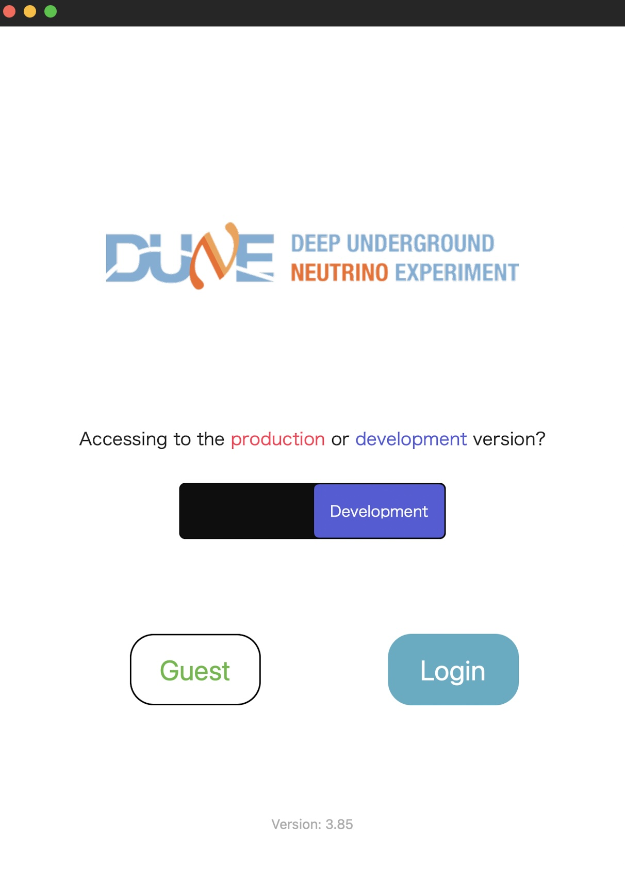
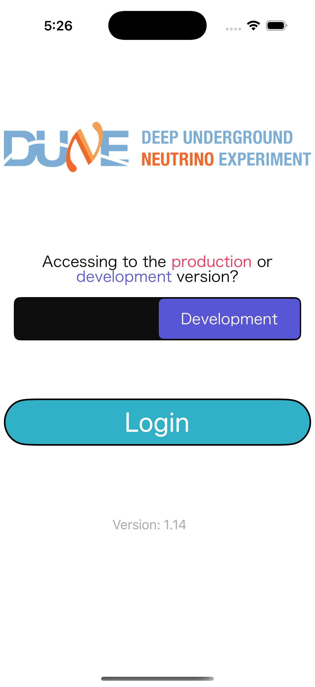
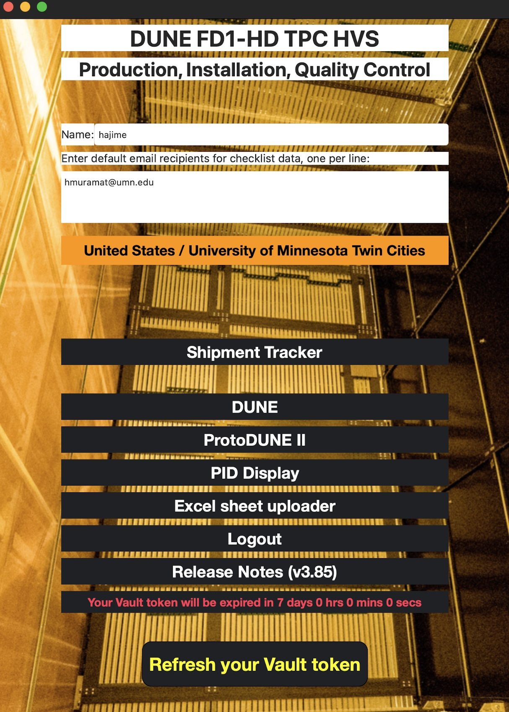
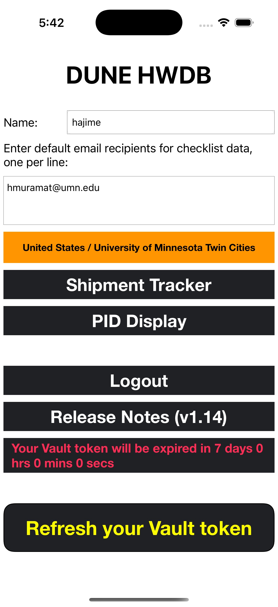
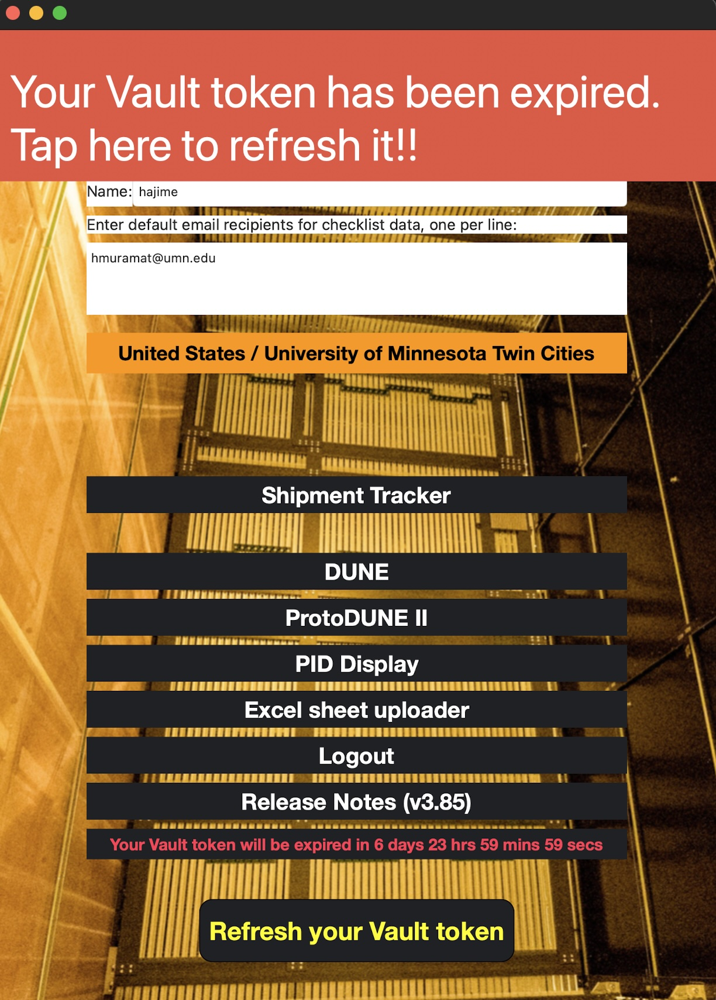
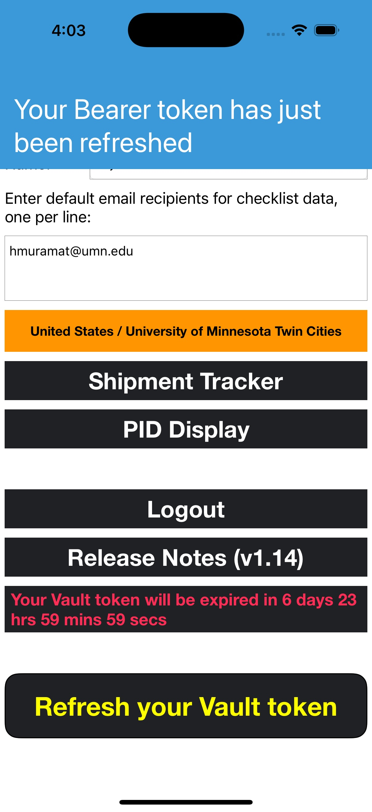
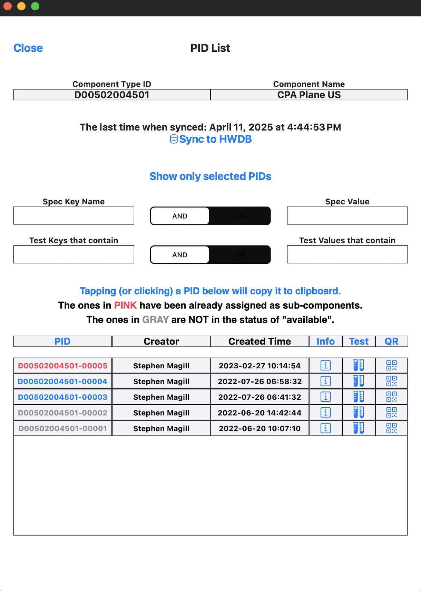
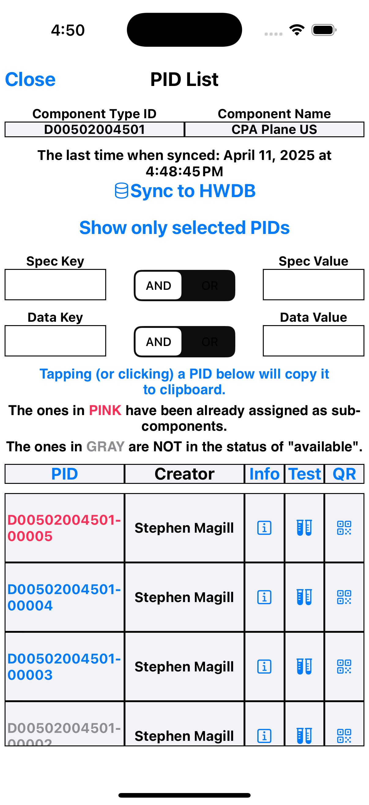
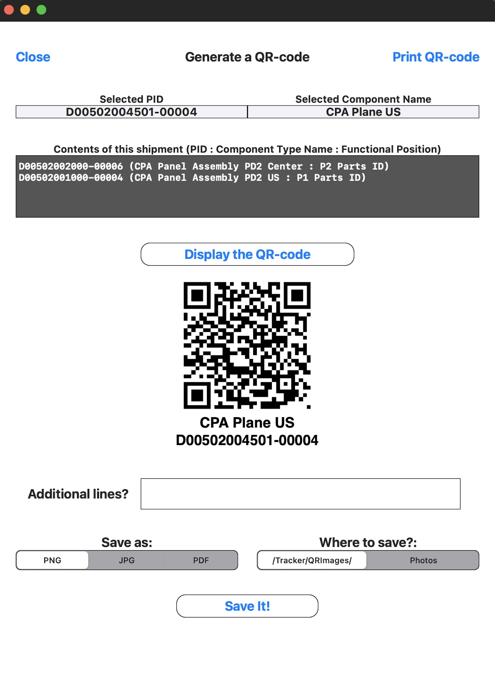
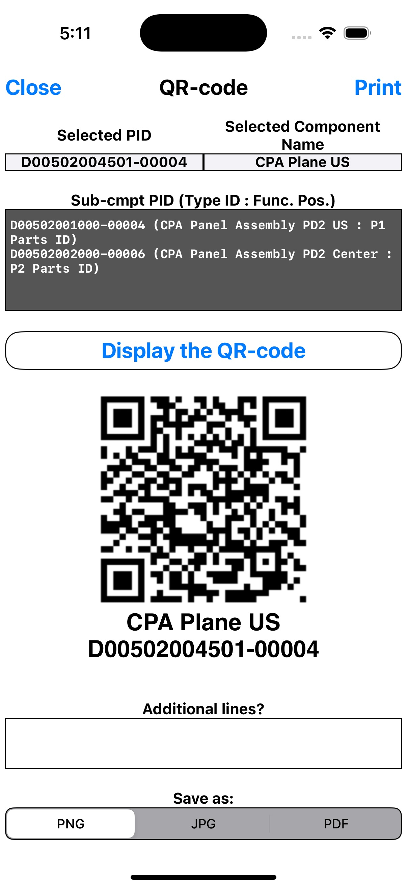

## Contents
>
>|-------------------------------------+------------------|
>| Section                             | Description      |
>|-------------------------------------+------------------|
>| [Basics](#basics)                   |  General overview of the iPad app. |
>| &emsp;[Requirements](#requirements) |  Device requirements  |
>| &emsp;[Deployment](#deployment)     |  How to download the app  |
>| &emsp;[Login Page](#login-page)     |   How to login  |
>|-------------------------------------+------------------|
>| [PID Display](#pid-display)         |  PID management system |
>|-------------------------------------+------------------|
>| [Shipment Tracker](#shipment-tracker) |  Utilizing the pid system to keep track of shipment crates   |
>|-------------------------------------+------------------|

## Basics

### Requirements

The iPad app can be run on iPad, iPhone, or even on Mac. The following are the specifics for each device.

iPad (and iPhone):
- iPadOS/iOS 14.0 or newer
For reference, we have been using an iPad with the following specifications since 2019:
- 6th generation
- 128 GB storage
- 9.7 inch (diagonal) display
- A10 Fusion Chip with 64-bit architecture, Embedded M10 coprocessor
- Model # : MR7J2LL/A

Mac:
- macOS 11 (Big Sur) or newer
The app also runs on Macs with both Intel and Apple M chips.

### Deployment

**iPad app Deployment**: As of now, you must contact Hajime Muramatsu and send [send him](mailto: hmuramat@umn.edu?subject=Request to resgiter an iPad(s)) your E-mail address.  You will then be sent an invitation, which includes a link to download an app called TestFlight. You can then intsall the app via TestFlight. This method is subject to change.

**Mac Deployment**: The latest version of the app can be downloaded at [https://www-users.cse.umn.edu/~hmuramat/iOS/CPAProductionChecklists-3-97.zip](https://www-users.cse.umn.edu/~hmuramat/iOS/CPAProductionChecklists-3-97.zip). To do so you will need **Username**: `DUNE` and **Password**: `DUNEana`.

### Login Page

When the app is launched, you will see the following page. You can either login using your credentials or run a "guest" session, which allows you to use all the capabilities of the app except for communicating with the HWDB. You can also choose between the "Production" version or "Development" version of the app.

When you select "Login", your iPad's default web browser starts up automatically and takes you to a CILogon cite,
where you will be asked to provide your FNAL SSO credential.
   

iPad or Mac             |  iPhone
:-------------------------:|:-------------------------:
{: .image-with-shadow}{: width="80%"}|{: .image-with-shadow}{: width="52%"}

   

Once you have logged in, you will see the following **home page**:

iPad or Mac             |  iPhone
:-------------------------:|:-------------------------:
{: .image-with-shadow}{: width="80%"}  |{: .image-with-shadow}{: width="52%"}

In home page, before proceeding further, you will need to provide/select the following three items:
- **Name** : The **Name** will be attached to file names that are stored locally on iPad, to be distinguished from files saved by other users.
- **Email** : Email can be sent directly from within the app. Addresses provided here will be used in such case.
- **Country/Institution** : A country and an institution must be selected. The combo will be used when a new PID needs to be assigned.

Once these three fields are filled/selected, one can proceed to either **PID Display** or **Shipment Tracker** sessions.
We will describe about these sessions in the following sections.

While the iPhone version offers only these two sessions, the iPad version offers three more sessions: DUNE, ProtoDUNE II, and Excel sheet uploader. In these sessions, checklists that are dedicated to specific consortia can be found. Since these are not for general usage, we will not describe what they are. You are still welcome to peek through those sections, however.

At the bottom of the home page, the remaining time before the issued Vault token gets expired is displayed, along with the botton, **Refresh your Vault token**. You can tap this button to force to refresh your Vault token.

When it is a minute before your Bearer token is expired, a bannar appears at the top of the screen to warn user. The bannar auto-disappears after 5 seconds. After 60 seconds, your Bearer token then gets auto-refreshed.

When your Vault token is expired, another bannar shows up. This one will stay on screen until you tap the bannar, which then triggers its renewing process.

(In the example screenshots shown below, please ignore the displayed expiration times. We just did not want to wait for 3 hours/7 days to take these screenshots)

iPad or Mac             |  iPhone
:-------------------------:|:-------------------------:
{: .image-with-shadow}{: width="80%"}  |{: .image-with-shadow}{: width="52%"}

   

[back to top](#contents)

## PID Display

The PID Display is a HWDB ID viewer that is hierarchically structured, meaning you are first provided the highest-level category Project ID from which you can tap a particular Project, that then takes you a list of System IDs... ans so on.

The hierarchical structure that PID Display offers is:
Project ID List ➞ System ID List ➞ Subsystem ID List ➞ Component Type ID List ➞ PID List.

In each list, if you have previously synced to the HWDB, the app shows the contents based on what it locally stores (SQLite). If not or when you need to refresh the local data, tap **Synce to HWDB**. It will update the stored (and displayed) list.
This is useful if you need PID lists (particularly long lists) with poor network connections.

As an example, screenshots of PID List are shown below:

iPad or Mac             |  iPhone
:-------------------------:|:-------------------------:
{: .image-with-shadow}{: width="80%"}  |{: .image-with-shadow}{: width="52%"}

As can be seen above, the page comes with a simple filterling functionality.

Also those PIDs in GRAY correspond to the items that are NOT in the status of available. And those in RED have their parents already assigned, meaning that they are not available to be newly linked.

In the actul PID table, there are three clickable columns: Info, Test, and QR:
 - **Info** : Tapping this button takes you to another page, where information of the selected Item (a PID) is provided. The information includes: its Item Specifications, its Parent's PID (with link) if it exists, as well as its Daughter's PIDs (with links) if exist.
 - **Test** : This takes you to a list of Test Types that are available for the selected Item, in which a particular Test Type can be selected. It will then display the corresponding stored Test data of the selected Test Type. If there is multiple entries (a history) for the selected Test Type, it will then display all stored data of that Test Type.
 - **QR** : This takes you to a page where you can see & edit the corresponding QR-code as can be seen below. By default, it generates a QR-code with two additional human readable lines, its Component Type Name and PID.
It also allows you to store the generated QR-code locally and print it (you will need a printer that is compatible with **AirPrint**).
 
 iPad or Mac             |  iPhone
:-------------------------:|:-------------------------:
{: .image-with-shadow}{: width="80%"}  |{: .image-with-shadow}{: width="52%"}
 
 
   

[back to top](#contents)

## Shipment Tracker

Still workin on this...

<!--
The Shipment Tracker provides a UI to deal with Location info of components in the HWDB. It allows you to easily view the location history of an Item, provides info on sub-components (if any exist). It also allows you to enter a new location and create a new item for which you can produce the corresponsing QR-code. It also lets you attach a picture associated with a particular location.

You pick a particular Component Type to start.  E.g., a Component Type, DUNE CPA shipping crate. Select an existing or create PID.  E.g., a PID = one of your DUNE CPA shipping crates. If any, assign its sub-component PIDs.  E.g., PIDs for CPA assembly tools and CPA Panels. Start by selecting a Component Type (e.g., a Type for shipping crate).You can select one either by scanning a QR code (see below)or select from the list (see the next page). You could also select a Component Type from the list. It shows Types that have been previously selected on your iPad. If you don’t see what you want, you can add a new Type.

The proceduce is shown in the video below. Click the info button to get a moveable popup window for more information.
-->

   

[back to top](#contents)

