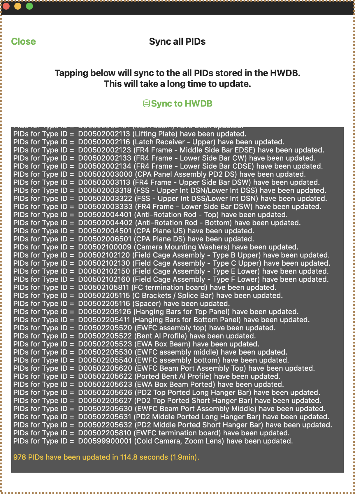

## Contents
>
>|-------------------------------------+------------------|
>| Section                             | Description      |
>|-------------------------------------+------------------|
>| [Basics](#basics)                   |                  |
>| &emsp;[Requirements](#requirements) |                  |
>| &emsp;[Deployment](#deployment)     |                  |
>| &emsp;[Login Page](#login-page)     |                  |
>|-------------------------------------+------------------|
>| [PID Display](#pid-display)         |                  |
>|-------------------------------------+------------------|
>| [Shipment Tracker](#shipment-tracker) |               |
>|-------------------------------------+------------------|
>| [QR-Code](#qr-code)                 |                  |
>|-------------------------------------+------------------|
>| [Local Storage](#local-storage)     |                  |
>|-------------------------------------+------------------|

## Basics

### Requirements

The iPad app can be utlized on either a MacBook or iPad. The following are the specifics for each device.

iPad:
- iPadOS 14.0 or newer
For reference, we have been using an iPad with the following specifications since 2019:
- 6th generation
- 128 GB storage
- 9.7 inch (diagonal) display
- A10 Fusion Chip with 64-bit architecture, Embedded M10 coprocessor
- Model # : MR7J2LL/A

Mac:
- macOS 11 (Big Sur) or newer
The app also runs on Macs with both Intel and Apple M chips.

### Deployment

**iPad app Deployment**: As of now, you must contact Hajime Muramatsu and send [send him](mailto: hmuramat@umn.edu?subject=Request to resgiter an iPad(s)) your E-mail address.  You will then be sent an invitation, which includes a link to download an app called TestFlight. You can then intsall the app via TestFlight. This method is subject to change.

**Mac Deployment**: The latest version of the app can be downloaded [https://www-users.cse.umn.edu/~hmuramat/iOS/CPAProductionChecklists.zip](https://www-users.cse.umn.edu/~hmuramat/iOS/CPAProductionChecklists.zip). To do so you will need **Username**: `DUNE` and **Password**: `DUNEana`.

### Login Page

When the app is launched, you will see the following page. You can either login using your credentials or run a "guest" session, which allows you to use all the capabilities of the app except for communicating with the HWDB. You can also choose between the "Production" version or "Development" version of the app. When opening the app for the first time after download, you must register your FNAL certification. Click on the red box below for more information.



Once you have logged in, you will see the following:



## PID Display

The PID Display is a PID viewer that is hierarchically structured, meaning you are first provided the highest-level category **System ID** from which you can specify until you reach the desired **PID**. If you have previously synced to the HWDB for that Component Type, the display orders the PIDs based on what are stored locally (SQLite). This is useful if you need PID lists (particularly long lists) with poor network connections.

Below, you can click on the red boxes to simulate going through the PID display. You can click the blue "Return" box on the top left to return to the top level System ID list.



You will notice that each level of the PID Display can be independently updated to sync with the HWDB, but it can also be done all at once using the "Sync All" button present on the top right of the System ID list page. It takes some time to sync them all. But it ultimately depends on the amount of the contents the DB currently holds.
For now, it takes only ~2mins.

{: width="50%"} 

## Shipment Tracker

The Shipment Tracker provides a UI to deal with Location info of components in the HWDB. It allows you to easily view the location history of an Item, provides info on sub-components (if any exist). It also allows you to enter a new location and create a new item for which you can produce the corresponsing QR-code. It also lets you attach a picture associated with a particular location.

You pick a particular Component Type to start.  E.g., a Component Type, DUNE CPA shipping crate. Select an existing or create PID.  E.g., a PID = one of your DUNE CPA shipping crates. If any, assign its sub-component PIDs.  E.g., PIDs for CPA assembly tools and CPA Panels. Start by selecting a Component Type (e.g., a Type for shipping crate).You can select one either by scanning a QR code (see below)or select from the list (see the next page). You could also select a Component Type from the list. It shows Types that have been previously selected on your iPad. If you don’t see what you want, you can add a new Type.

Below, you can click on the red boxes to simulate adding a Type ID to the Shipment Tracker. You can click the blue "Return" box on the top left to return to the top level Shipment Tracker menu.



The location history is shown in the order of “Time(CST)”. You can add a new log or look at the individual entry more in detail.



Currently, the HWDB does not have the capability to link an image to a location entry. The information, therefore, is stored as a Test of the PID with Test Type Name = _location_info.

As seen in the list of PIDs associated with certain component types, you can directly add PIDs. You can also assign subcomponents here.



## QR-Code

QR-codes are easy to generate on the iPad app.



## Local Storage

The info of the generated “Type List” is stored within the app folder. `CPAProductionChecklists -> Tracker -> _tracker_typeidlist` Pictures taken in the app and QR codes generated are also stored in the `Tracker` folder.


