   

>## Contents
>
>|-------------+------------------|
>|    | Description  |
>|-------------+------------------|
>| [A requirement and preparation](#a-requirement-and-preparation)  |   |
>| &emsp;[Know what you want to insert!](#know-what-you-want-to-insert) |  |
>| [Inserting manually](#inserting-manually)  |   |
>|-------------+------------------|
>| [Inserting a spreadsheet](#inserting-a-spreadsheet) | |
>|-------------+------------------|
{: .checklist}

        

## A requirement and preparation

<!--slides are 1024 x 768 px-->

This page is to teach a user how to insert new Component Types into the DUNE HWDB.
Only users with the **Architect** privilege are allowed to do so.
If you don't have such privilege, you likely do not go through the contents on this page.
If you think you should know how to, but don't have the **Architect** privilege, please contact the DUNE database group.

Let's check if your account in the HWDB already has the  **Architect** privilege.
From the side-menu of the HWDB, go to **Users** and find your own account.
If you have the **Architect** privilege, you should have a check-mark under **architect** as shown below.

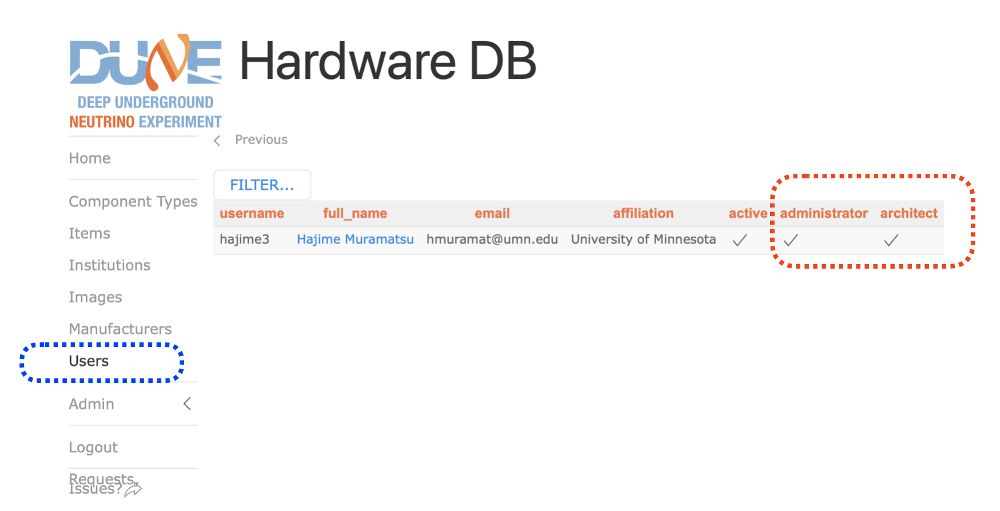{: .image-with-shadow}{: width="70%"}

[back to top](#contents)

   

### Know what you want to insert!

 Just to remind you, the figure below shows the DUNE PID syntax.
 Remember that with a combination of Project, System ID, Subsystem ID, Component Type ID, and Item Number,
 every DUNE component in the HWDB is uniquely defined. And the Item Number is just a counter.
 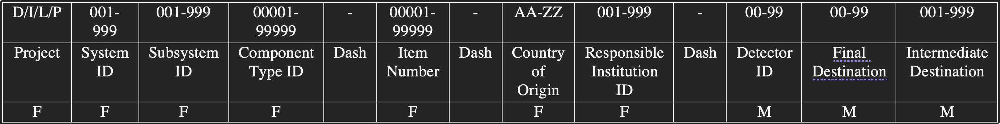{: .image-with-shadow}{: width="75%"}
 Thus, for each of the Component Types you like to like newly create, you should have the followings prepared:
 - **Project** (usually "D")
 - **System ID** and the corresponding **System Name**
 - **Subsystem ID** and the corresponding **Subsystem Name**
 - **Component Type ID** and the corresponding **Component Type Name**
 
   
 
 There are two ways to do this. In either way, you will do these through your web browser.
 1. Do it manually, one-by-one.
 2. Do it by providing a prepared spreadsheet.
 
 [back to top](#contents)

## Inserting manually

As an example, let's insert the following new Component Type:

 - **Project** = D
 - **System ID** = 005
 - **System Name** = FD1-HD HVS
 - **Subsystem ID** = 998
 - **Subsystem Name** = HWDBUnitTest
 - **Component Type ID** = 00011
 - **Component Type Name** = Test Type 011

This Subsystem (ID = 998, name = HWDBUnitTest) already exists in the HWDB.
Let's find it.

From the side-menu, go to **Admin** and then click **Projects** as shown below.
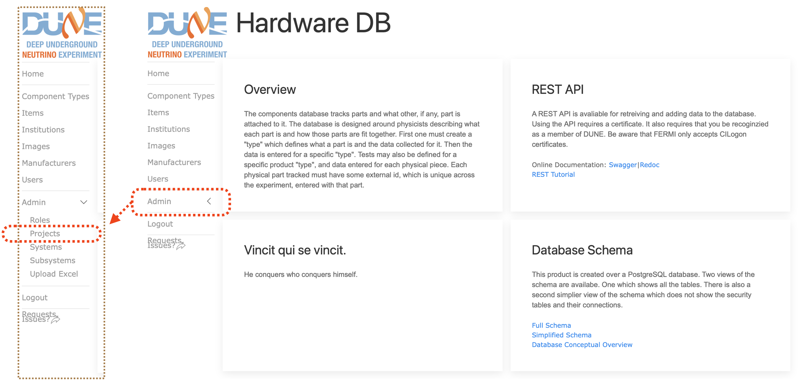{: .image-with-shadow}{: width="75%"}

You now should be seeing a list of **Project** as shown below. Click the **Systems** folder (DUNE), which takes you to the list of Systems.
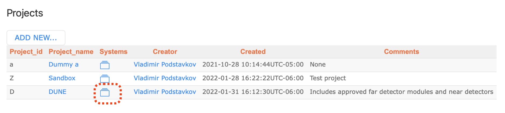{: .image-with-shadow}{: width="75%"}

In the list of Systems, click the **Subsystems** folder (FD1-HD HVS) as shown below.
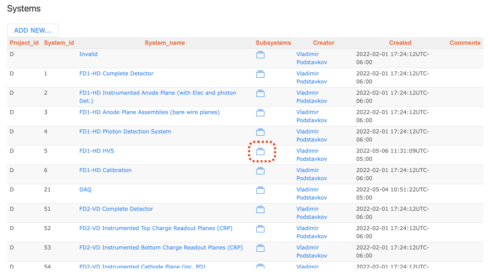{: .image-with-shadow}{: width="75%"}

You should be seeing a list of **Subsystems** as shown below. Select the **Subsystems** folder (HWDBUnitTest) now.
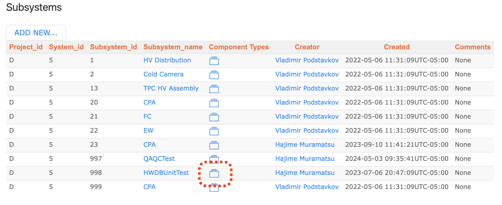{: .image-with-shadow}{: width="75%"}

The figure below shows a list of the **Component Types** that are currently available in the HWDB for the selected **Subsystem**, HWDBTestUnit.

Click "ADD NEW TYPE...".
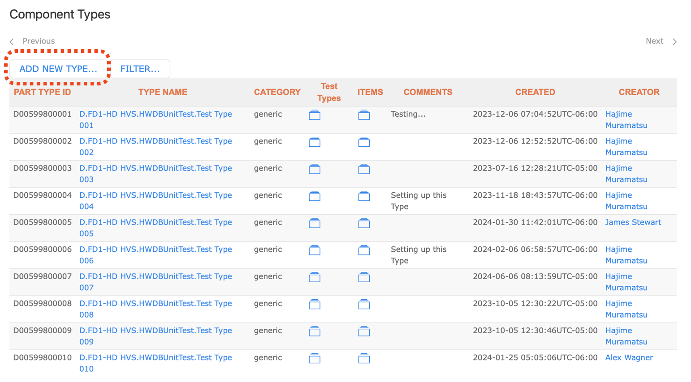{: .image-with-shadow}{: width="75%"}

You now should be seeing a figure similar to the one shown below. Enter:
- Type Name
- Type ID
- Comments (optional)

and then click "SAVE".
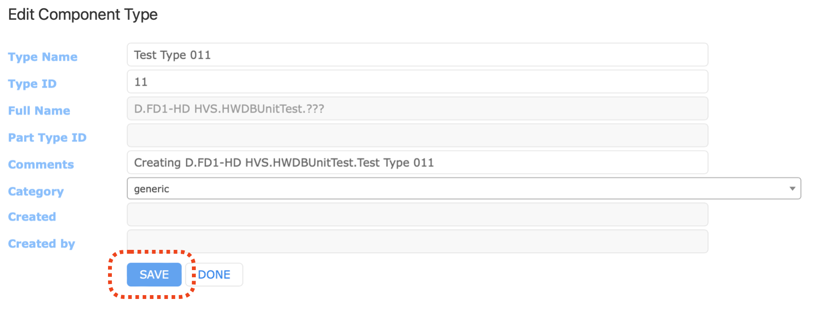{: .image-with-shadow}{: width="75%"}

After saving, you should be seeing a screen like the one below.
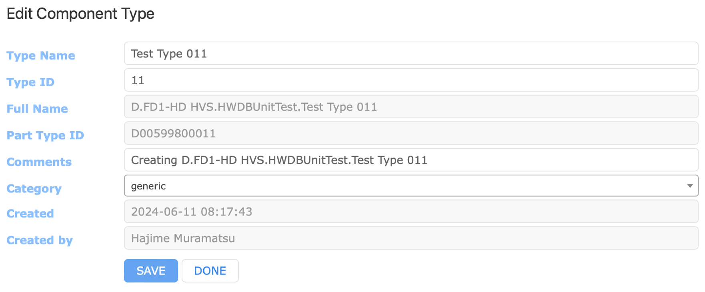{: .image-with-shadow}{: width="75%"}

If you now go back to the list of Component Types, you should be seeing a figure like the one shown below.
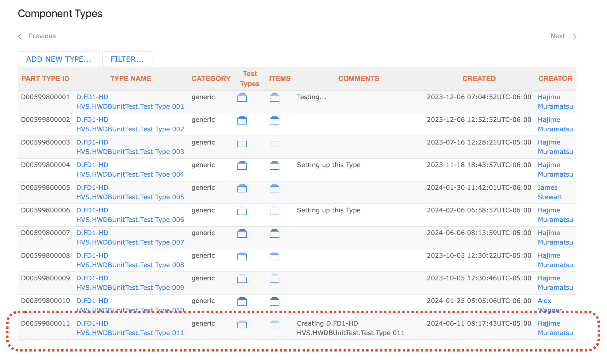{: .image-with-shadow}{: width="75%"}

  

In the above example, our **Subsystem ID** has been already defined in the HWDB.
In general, you could newly defined **Subsystem ID** as well. The procedure would be entirely identical to what we just described above,
except that you **ADD** new **Subsystem ID** to a list of **Subsystems** instead.

[back to top](#contents)

   

## Inserting a spreadsheet

 Now let's insert multiple new Component Types at once.

 Prepare a spreadsheet similar to the one shown below.
 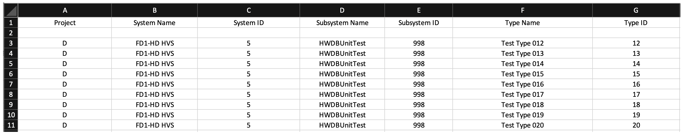{: .image-with-shadow}{: width="100%"}
 
 You could have multiple different **System IDs** and multiple different **Subsystem IDs** in general.
 In this example, for simplicity, we stick with the same **System ID** and **Subsystem ID** as before.

  

From the side-menu, go to **Admin** and then select **Upload Excel** as shown below.

Drag & drop your prepared Excel sheet there.
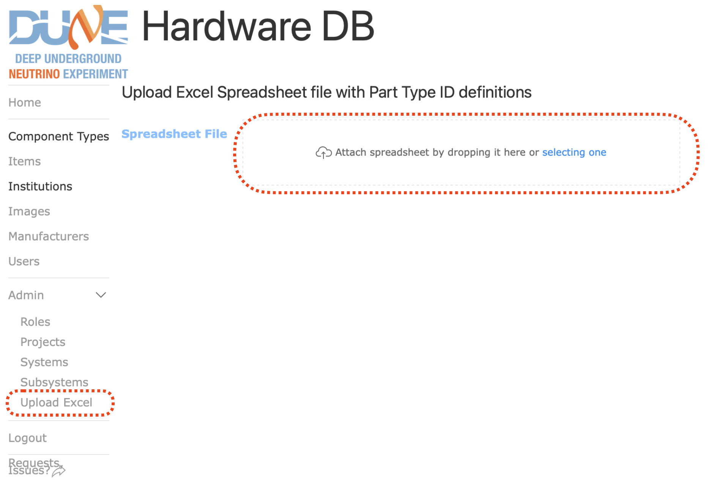{: .image-with-shadow}{: width="75%"}

  

Once you drop your sheet there, screen like below should show up.
Your requested **System ID(s)** is checked to see if it is in the accepted format.

If looks OK, click "NEXT".
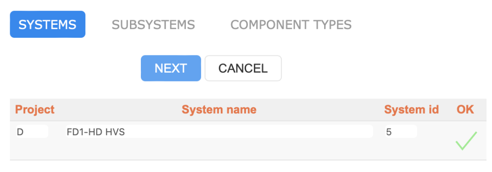{: .image-with-shadow}{: width="40%"}

Similarly it checks your requested **Subsystem ID(s)** as shown below.
Again, if it looks OK, click "NEXT" to proceed.
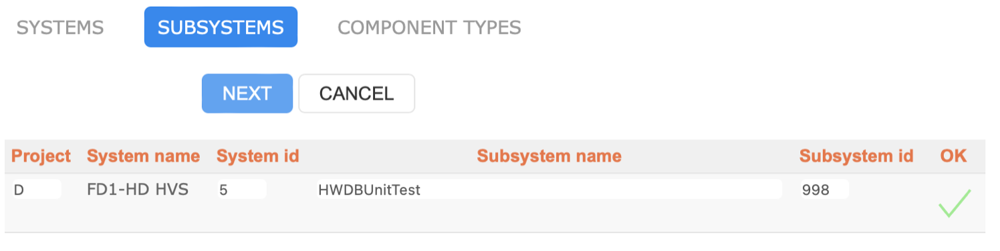{: .image-with-shadow}{: width="50%"}

And finally it checks your requested **Component Type ID(s)**.
Make sure they look OK before clicking "SAVE" to finalize the creation process. Once they are saved, you **will not**
be able to delete them!
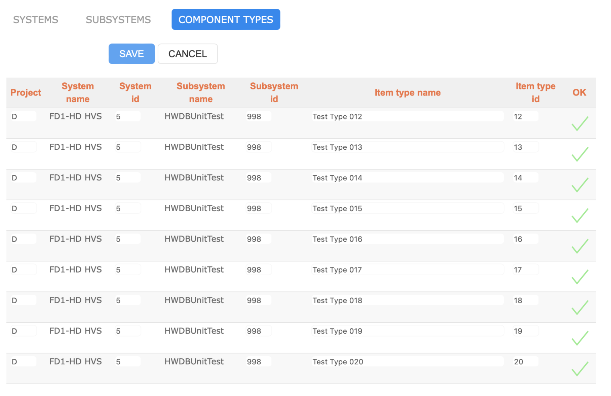{: .image-with-shadow}{: width="60%"}

When everything goes well, you should be notified by a message like the one shown below.
Notice that no **Systems** and **Subsystems** were newly created, while 9 **Component Types** have been created.
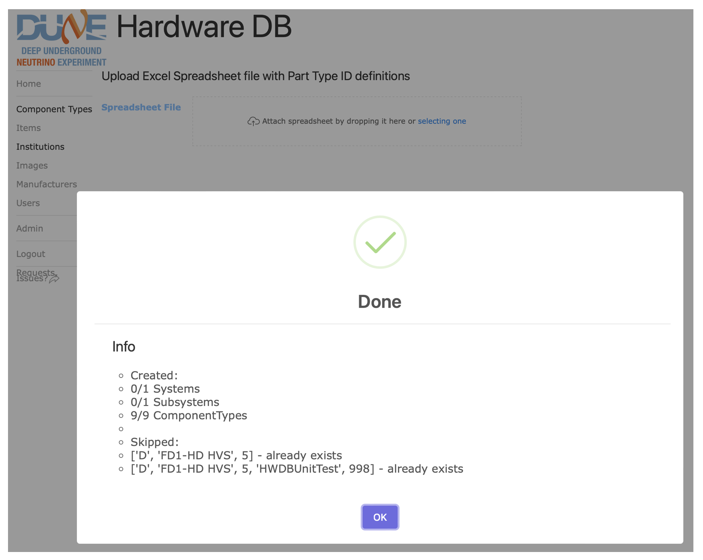{: .image-with-shadow}{: width="60%"}

  

Finally, if you go back to the list of the Component Types like the one shown below, newly created **Component Types**
should be showing up there.
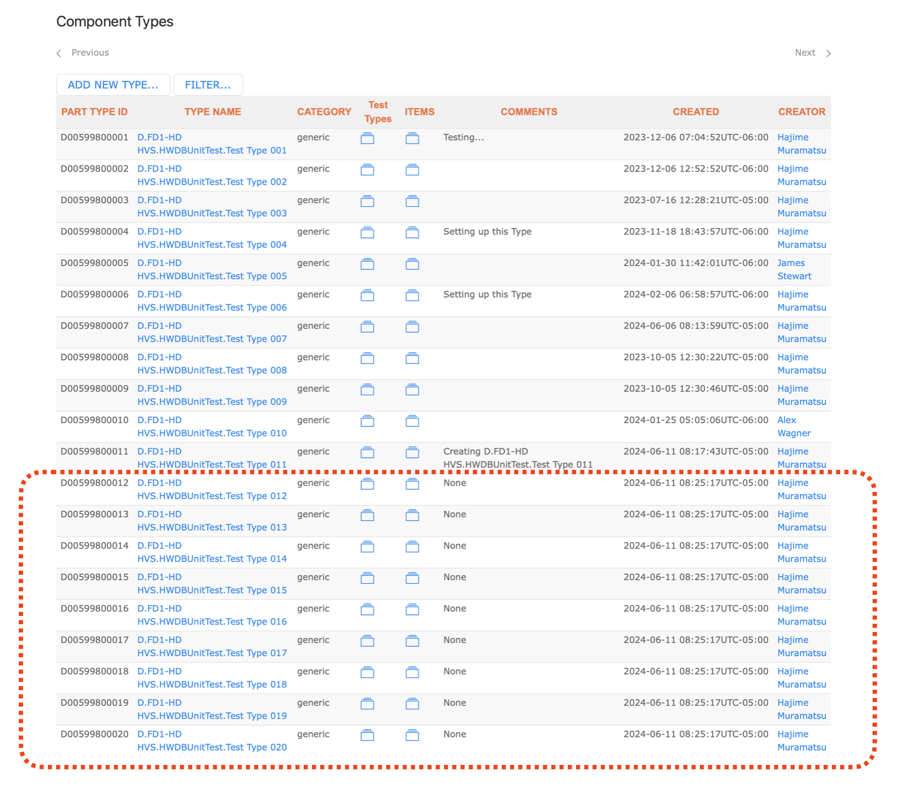{: .image-with-shadow}{: width="75%"}

[back to top](#contents)

   

   



[https://dbweb0.fnal.gov/cdb/login/sso]: https://dbweb0.fnal.gov/cdb/login/sso
[https://dbweb0.fnal.gov/cdbdev/login/sso]: https://dbweb0.fnal.gov/cdbdev/login/sso
[YAML]: https://yaml.org
[mysetup]: https://dune.github.io/computing-HWDB/setup.html
[redoc]: https://dbweb9.fnal.gov:8443/cdbdev/apidoc/redoc
[https://dbweb9.fnal.gov:8443/cdbdev/apidoc/redoc]: https://dbweb9.fnal.gov:8443/cdbdev/apidoc/redoc
[swagger]: https://dbweb9.fnal.gov:8443/cdbdev/apidoc/swagger
[https://dbweb9.fnal.gov:8443/cdbdev/apidoc/swagger]: https://dbweb9.fnal.gov:8443/cdbdev/apidoc/swagger
