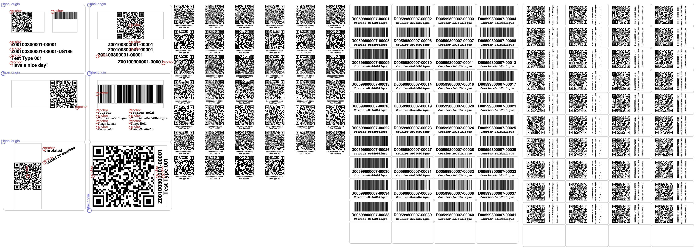
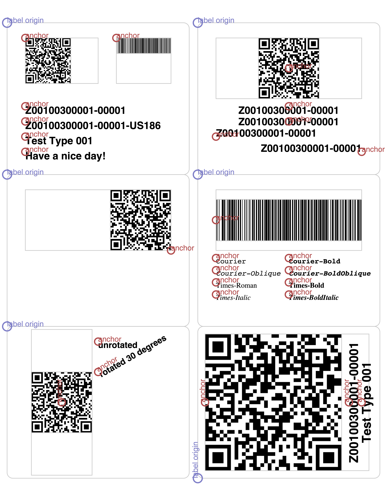
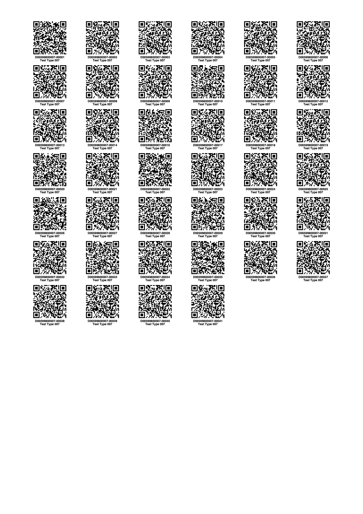

## This page describes how to configure paper & bar/QR label sizes as well as label positions within its sheet and generate label sheets using the Python HWDB Upload Tool.

{: .image-with-shadow}{: width="100%"}

 

#### With examples provided in this page, you will be able to:
- edit paper sizes of your label sheets
- edit orientation of lables
- edit individual label sizes 
- edit individual label positions
- edit positions of extra texts
- edit font type
- edit font size
- generate multiple label sheets with a single command-line

## Getting ready

- We will use the Python HWDB Upload Tool. For its installation and setting up the Tool, please refer to [Using the Python HWDB Upload Tool]({{ page.root }}/07-Using-Python-Upload-Tool/index.html) section or [Quick Start]({{ page.root }}/quickstart/index.html) section.

- Make sure to install **version 1.2.3 or newer**.

- Once the Tool is setup and ready, go to your working directory. And then execute the following command:
 ~~~
hwdb-labels
~~~
This will create:
  - **default_labels.py** and **custom_labels.py** in <your home directory>/.sisyphus/
  - **labels.pdf** in your local directory
{: .language-bash} 

- **labels.pdf** : For now this PDF file should be empty. You can just ignore it, or delete it if you like.
- **default_labels.py** : This is a file that holds default configurations of various paper/label sizes. You do not need to touch this.
- **custom_labels.py** : This is the file we are going to modify in the following subsections.
                         Also, the entire descriptions given in the following subsections are also provided within this file.

## Configuring custom_labels.py

THis is a sample custom_labels.py file. The contents of this file is merged with the default_labels.py file to produce a single label configuration.
Open Configuring custom_labels.py with your editor. You will see the following 4 nodes under contents:
- page sizes
- label templates
- layouts
- label sets

We'll now go describe how to modify/use each of these 4 nodes.

### page sizes:

 Use this node to define other page sizes if you need more sizes than A4 (210.0,297.0) in mm and Letter (8.5, 11.0) in inches,
 which are already defined in default_labels.py
 By convention, we've been defining these in "portrait" orientation. If you wish to use a page in "landscape" orientation, you can 
 specify that in "layouts". You do not need to create a new page size definition for it.
~~~
"page sizes": {
        "A5": {
            "units": "mm",
            "size": (148.5, 210)
        }
    },
~~~
{: .language-json}
- **units** can be "mm", "cm", "inch", or "pica".
- **size** can be defined as (width, height), in the preferred units.

### label templates:

 Use this node to define the dimensions of label sheets. You may name these however you like, but the convention we've been using
 is \<page size>-\<columns>x\<rows>-\<brand name>.
~~~
"label templates": {
        "A4-6x11-Herma": {
            "description": "A4 (210×297 mm), 25.4×25.4 mm labels, 66 per sheet",
            "page size": "A4",
            "label size": (25.4, 25.4),
            "horizontal offsets": (16.1, 46.58, 77.06, 107.54, 138.02, 168.5),
            "vertical offsets": (
                     11.3,  36.7,  62.1,  87.5,
                    112.9, 138.3, 163.7, 189.1,
                    214.5 ,239.9, 265.3),
            "rounding": 2.0,
            "draw outline": False,
        }
    },
~~~
{: .language-json}
- **description** will be displayed on the first page of the pdf label sheet for the set of labels using that label template.
- **page size** is required. The units defined for that page size will be used throughout the template definition.
- **label size** should be provided as (width, height), all labels must be the same size.
- **"horizontal offsets** is a list of offsets. They are offsets from the left edge of the page to the left edge of each label.
     E.g., if you need 16.1mm horizontal off-set from the left edge of the page and expect to have 6 labels horizontally,
	 with label size of 25.4x25.4mm and 5.08mm space between the labels, then you should have 
	 16.1 + (25.4+5.08) * N, where  N runs from 0 through 5.
- **vertical offsets** is list of offsets. They are offsets from the top edge of the page to the top edge of each label.
     E.g., if you need 11.3mm vertical off-set from the top edge of the page and expect to have 11 labels vertically,
	 with label size of 25.4x25.4mm and no space between labels vertically, then you should have
	 11.3 + 25.4 * N, where  N runs from 0 through 10.
- **rounding** defines the radius of curvature for the rounding at the corners of the labels. It is only used when drawing the
    outlines of labels. It does not affect or interfere with the  printing of the contents of the label.
- **draw outline** determines if the outline should be drawn for labels after the alignment sheet. (Outlines will always be 
    drawn on the alignment sheet regardless.) Typically, you will want this value to be False unless you troubleshooting.

 

#### Already available label templates in default_labels.py:

There are some label templates already defined in default_labels.py for your immediate use.

- **A4-4x11-Generic** : A4 (210×297 mm), 51.5×26.6 mm labels, 44 per sheet
- **A4-3x4-Generic** : A4 (210×297 mm), 67×72 mm labels, 12 per sheet
- **A4-6x11-Herma** : A4 (210×297 mm), 25.4×25.4 mm labels, 66 per sheet
- **Letter-2x2-Avery** : Letter (8.5”×11”), 5”×3.5” labels, 4 per sheet
- **Letter-2x3-Avery** : Letter (8.5”×11”), 4”×3.333” labels, 6 per sheet
- **Letter-2x4-Avery** : Letter (8.5”×11”), 4”×2.5” labels, 8 per sheet
- **Letter-2x5-Avery** : Letter (8.5”×11”), 4”×2” labels, 10 per sheet
- **Letter-2x6-Avery** : Letter (8.5”×11”), 4”×1.5” labels, 12 per sheet
- **Letter-2x7-Avery** : Letter (8.5”×11”), 4”×1.333” labels, 14 per sheet
- **Letter-3x5-Avery** : Letter (8.5”×11”), 2.625”×2” labels, 15 per sheet
- **Letter-3x10-Avery** : Letter (8.5”×11”), 2.625”×1” labels, 30 per sheet

### layouts:

Use this node to define how you want the utility to print contents onto each label on a sheet defined in "templates". You may define as
many layouts as you wish for a given template.

~~~
"layouts": {
        "Herma 10107 A4-6x11 Layout": {
            "label template": "A4-6x11-Herma",
            "orientation": "portrait", # or portrait
            "debug": False,
            "elements": [
                {
                    "element type": "qr",
                    "alignment": "top-center",
                    "anchor": ["50%", "4%"],
                    "size": ["75%", "75%"],
                    "preserve aspect ratio": True,
                },
                {
                    "element type": "part id",
                    "alignment": "top-center",
                    "anchor": ["50%", "83%"],
                    "font size": "5%",
                    "preserve aspect ratio": True,
                },
                {
                    "element type": "part name",
                    "alignment": "top-center",
                    "anchor": ["50%", "90%"],
                    "font size": "5%",
                    "preserve aspect ratio": True,
                },
            ]
        },
    },
~~~
{: .language-json}
- **label template** must point to one of the label templates defined in this file or in default_labels.py.
- **orientation** is optional and will default to "portrait" if not provided. If the orientation is "portrait," the label size will
    be the same as defined in "templates," and the upper left corner of the label will correspond to the upper left corner of the
    label on the sheet. If the orientation is "landscape," the label dimensions will be swapped, and the coordinate system will be
    rotated 90 degrees counterclockwise.
- **debug** can be set to True if you want to see the bounding boxes for images and the anchor points for all elements.
- **elements** represents the objects to be printed on each label. For each element, there are sub-node that needs to be specified.
  - **element types** : must be provided. The available element types are:
    - **qr** : a QR code encoding a link to the HWDB web page for the part
    - **bar** : a bar code encoding the External ID of the part
    - **part id** : the Part ID of the part, e.g., "Z00100300001-00001"
    - **external id** : the External ID of the part, e.g., "Z00100300001-00001-US186"
    - **part name** : the name in the HWDB for the associated part type
    - **text** : free-form text
  - **anchor** specifies an anchor position on the label. This may be given in absolute units, or as a percentage of the 
               label's width or height. (If given as a percentage, the value must be given as a string.)
  - **alignment** describes what part of the element is anchored at the "anchor" point. E.g., if the alignment is "center",
                  then the center of the element will be located at the anchor point. If "alignment" is not provided,
				  it will default to "top-left" Valid alignments are:
                  top-left, top-center, top-right, center-left, center, center-right, bottom-left, bottom-center or bottom-right.
  - **size** defines the size of "qr" and "bar" elements on the label. These may be given in absolute units or
             as percentages of the height or width of the label. Text-type elements will ignore "size"
  - **preserve aspect ratio** can be set as True in order to keep their original aspect ratios.
                              Text-type elements will ignore "preserve aspect ratio".
  - **font size** defines font size for Text-type elements ("part id", "external id", "part name", and "text").
                  If "font size" is given as a percentage, it is the percentage of the label's height.
  - **font face** defines a type of font to be employed for Text-type elements. The default is "Helvetica-Bold".
                  If the utility cannot find the font given, it reverts to "Helvetica-Bold" and a warning is logged.
                  The available fonts are: Courier, Courier-Bold, Courier-BoldOblique, Courier-Oblique, Helvetica,
                  Helvetica-Bold, Helvetica-BoldOblique, Helvetica-Oblique, Symbol, Times-Bold, Times-BoldItalic,
                  Times-Italic, Times-Roman, and ZapfDingbats.
  - **rotate** will rotate the object by the number of degrees indicated, counterclockwise around the anchor point.
               (Note that if the size is defined in percentages, it is still the percentages of the width or height of the label
               without factoring in any rotations.)

 

#### Already available layouts in default_labels.py:

There are some layouts already defined in default_labels.py for your immediate use.
These layouts print QR-codes, along with the corresponding PIDs and the Component Type names.

- **QR-A4-3x4-Generic** : QR in portrait with **A4-3x4-Generi** label template.
- **QR-Letter-2x2-Avery** : QR in portrait with **Letter-2x2-Avery** label template.
- **QR-Letter-2x3-Avery** : QR in landscape with **Letter-2x3-Avery** label template.
- **QR-Letter-2x4-Avery** : QR in landscape with **Letter-2x4-Avery** label template.
- **QR-Letter-2x5-Avery** : QR in landscape with **Letter-2x5-Avery** label template.
- **QR-Letter-2x6-Avery** : QR in portrait with **Letter-2x6-Avery** label template.
- **QR-Letter-3x5-Avery** : QR in landscape with **Letter-3x5-Avery** label template.
- **Bar-Letter-2x7-Avery** : Bar in portrait with **Letter-2x7-Avery** label template.
- **QR-A4-6x11-Herma_10107** : QR in portrait with **A4-6x11-Herma** label template.

### label sets:

Label Sets define which layouts should be used with each part type.
For instance, if you want to use two types of layouts, e.g., "Test Layout 1" and "Test Layout 2", only for part type, "Z00100300001",
then you could have label set like the following.
~~~
 "label sets": {
        "Z00100300001": [
            "Test Layout 1", 
            "Test Layout 2",
        ],
    }
~~~
{: .language-json}

To use a set of layouts for all part types, use 'default' as the part name. (This will override the 'default' already set in 
default_labels.py). For instance:
~~~
 "label sets": {
        "default": [
            "Herma 10107 A4-6x11 Layout"
        ],
    }
~~~
{: .language-json}

## Generating label sheets

Let's generate a label sheet now. If you already setup your **label sets** as the following (as in the previous subsection):
~~~
 "label sets": {
        "default": [
            "Herma 10107 A4-6x11 Layout"
        ],
    }
~~~
{: .language-json}
then try the following command:
~~~
hwdb-labels D00599800007-00001
~~~
{: .language-bash} 

This creates labels.pdf locally. Open it with your PDF viewer. You should see a QR code drawn based on "Herma 10107 A4-6x11 Layout".

   

Next, let's try the following **label sets**.
~~~
 "label sets": {
        "Z00100300001": [
            "Test Layout 1", 
            "Test Layout 2",
            "Test Layout 3",
            "Test Layout 4",
            "Test Layout 5",
            "Test Layout 6",
        ],
    }
~~~
{: .language-json}
This **label sets** will use 6 different layouts for the Component Type ID = Z00100300001 only. We show the definitions of the 6 layouts below:
~~~
"layouts": {

        "Test Layout 1": {
            "label template": "Letter-2x3-Avery",
            "orientation": "portrait",
            "elements": [
                {
                    "element type": "qr",
                    "alignment": "top-left",
                    "anchor": ["10%", "10%"],
                    "size": ["40%", "30%"],
                    "preserve aspect ratio": True,
                },
                {
                    "element type": "bar",
                    "alignment": "top-left",
                    "anchor": ["60%", "10%"],
                    "size": ["30%", "30%"],
                    "preserve aspect ratio": True,
                },
                {
                    "element type": "part id",
                    "alignment": "top-left",
                    "anchor": ["10%", "55%"],
                    "font size": "5%",
                },
                {
                    "element type": "external id",
                    "alignment": "top-left",
                    "anchor": ["10%", "65%"],
                    "font size": "5%",
                },
                {
                    "element type": "part name",
                    "alignment": "top-left",
                    "anchor": ["10%", "75%"],
                    "font size": "5%",
                },
                {
                    "element type": "text",
                    "text": "Have a nice day!",
                    "alignment": "top-left",
                    "anchor": ["10%", "85%"],
                    "font size": "5%",
                },
            ],
        },

        "Test Layout 2": {
            "label template": "Letter-2x3-Avery",
            "debug": True,
            "elements": [
                {
                    "element type": "qr",
                    "alignment": "center",
                    "anchor": ["50%", "30%"],
                    "size": ["80%", "40%"],
                    "preserve aspect ratio": True,
                },
                {
                    "element type": "part id",
                    "alignment": "top-center",
                    "anchor": ["50%", "55%"],
                    "font size": "5%",
                },
                {
                    "element type": "part id",
                    "alignment": "center",
                    "anchor": ["50%", "65%"],
                    "font size": "5%",
                },
                {
                    "element type": "part id",
                    "alignment": "bottom-left",
                    "anchor": ["10%", "75%"],
                    "font size": "5%",
                },
                {
                    "element type": "part id",
                    "alignment": "bottom-right",
                    "anchor": ["90%", "85%"],
                    "font size": "5%",
                },
            ]
        },

        "Test Layout 3": {
            "label template": "Letter-2x3-Avery",
            "debug": True,
            "elements": [
                {
                    "element type": "qr",
                    "alignment": "bottom-right",
                    "anchor": ["90%", "50%"],
                    "size": ["80%", "40%"],
                    "preserve aspect ratio": True,
                },
            ]
        },

        "Test Layout 4": {
            "label template": "Letter-2x3-Avery",
            "debug": True,
            "elements": [
                {
                    "element type": "bar",
                    "alignment": "center-left",
                    "anchor": ["10%", "30%"],
                    "size": ["80%", "40%"],
                    "preserve aspect ratio": True,
                },
                {
                    "element type": "text",
                    "text": "Courier",
                    "alignment": "top-left",
                    "anchor": ["10%", "55%"],
                    "font size": "3.5%",
                    "font face": "Courier",
                },
                {
                    "element type": "text",
                    "text": "Courier-Bold",
                    "alignment": "top-left",
                    "anchor": ["50%", "55%"],
                    "font size": "3.5%",
                    "font face": "Courier-Bold",
                },
                {
                    "element type": "text",
                    "text": "Courier-Oblique",
                    "alignment": "top-left",
                    "anchor": ["10%", "63%"],
                    "font size": "3.5%",
                    "font face": "Courier-Oblique",
                },
                {
                    "element type": "text",
                    "text": "Courier-BoldOblique",
                    "alignment": "top-left",
                    "anchor": ["50%", "63%"],
                    "font size": "3.5%",
                    "font face": "Courier-BoldOblique",
                },
                {
                    "element type": "text",
                    "text": "Times-Roman",
                    "alignment": "top-left",
                    "anchor": ["10%", "71%"],
                    "font size": "3.5%",
                    "font face": "Times-Roman",
                },
                {
                    "element type": "text",
                    "text": "Times-Bold",
                    "alignment": "top-left",
                    "anchor": ["50%", "71%"],
                    "font size": "3.5%",
                    "font face": "Times-Bold",
                },
                {
                    "element type": "text",
                    "text": "Times-Italic",
                    "alignment": "top-left",
                    "anchor": ["10%", "79%"],
                    "font size": "3.5%",
                    "font face": "Times-Italic",
                },
                {
                    "element type": "text",
                    "text": "Times-BoldItalic",
                    "alignment": "top-left",
                    "anchor": ["50%", "79%"],
                    "font size": "3.5%",
                    "font face": "Times-BoldItalic",
                },
            ]
        },

        "Test Layout 5": {
            "label template": "Letter-2x3-Avery",
            "debug": True,
            "elements": [
                {
                    "element type": "qr",
                    "alignment": "center",
                    "anchor": ["30%", "50%"],
                    "size": ["80%", "40%"],
                    "preserve aspect ratio": True,
                    "rotate": 90,
                    
                },
                {
                    "element type": "text",
                    "font-size": "3.5%",
                    "anchor": ["50%", "10%"],
                    "text": "unrotated",
                },
                {
                    "element type": "text",
                    "font-size": "3.5%",
                    "anchor": ["50%", "30%"],
                    "text": "rotated 30 degrees",
                    "rotate": 30,
                },
            ]
        },

        "Test Layout 6": {
            "label template": "Letter-2x3-Avery",
            "orientation": "landscape",
            "debug": True,
            "elements": [
                {
                    "element type": "qr",
                    "alignment": "top-center",
                    "anchor": ["50%", "4%"],
                    "size": ["90%", "90%"],
                    "preserve aspect ratio": True,
                },
                {
                    "element type": "part id",
                    "alignment": "top-center",
                    "anchor": ["50%", "83%"],
                    "font size": "5%",
                    "preserve aspect ratio": True,
                },
                {
                    "element type": "part name",
                    "alignment": "top-center",
                    "anchor": ["50%", "90%"],
                    "font size": "5%",
                    "preserve aspect ratio": True,
                },
            ]
        },
    },
~~~
{: .language-json}

Now try the following command:
~~~
hwdb-labels Z00100300001-00001
~~~
{: .language-bash} 

The locally created labels.pdf show the following:

{: .image-with-shadow}{: width="70%"}

      

### Generating many labels at once:

In practice, you would be running a commend like this (as in the example given in [Quick Start]({{ page.root }}/quickstart/index.html) section);
~~~
hwdb-upload QE-docket.json
~~~
{: .language-bash} 
This will create a local directory with its directory name being a timesstamp (e.g., YYYYMMDDTHHMMSS).
And inside of the newly created directory, **ItemLabels.pdf** will be created, which would look something like this:

{: .image-with-shadow}{: width="100%"}



