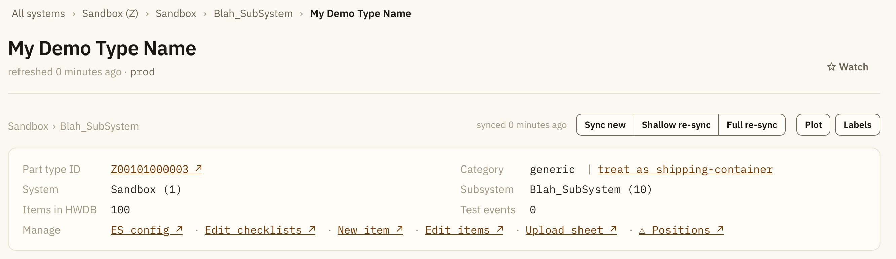
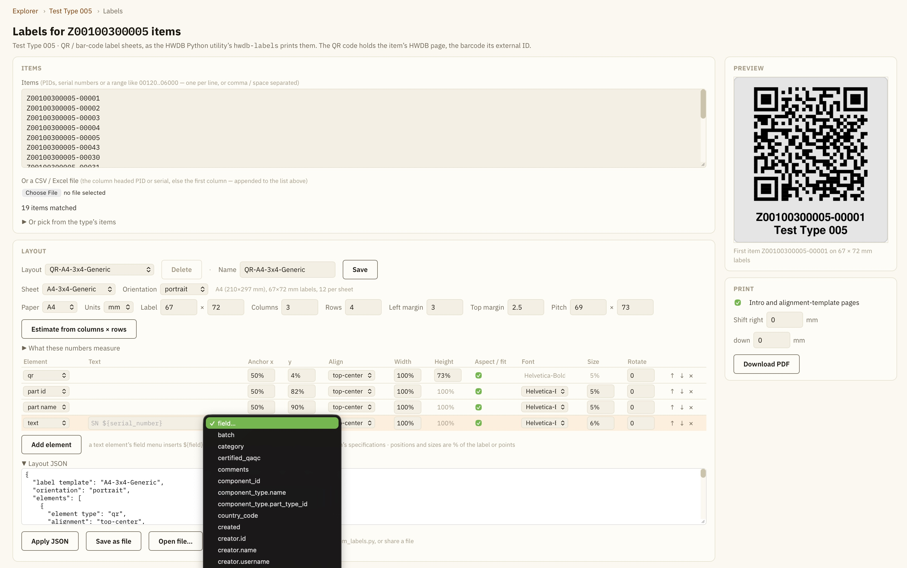
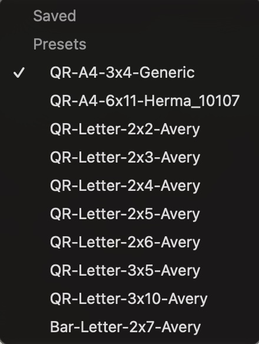
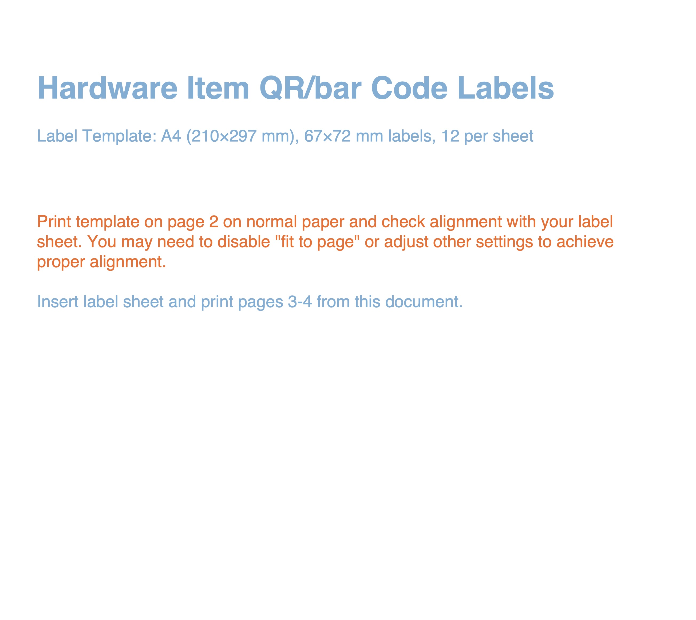
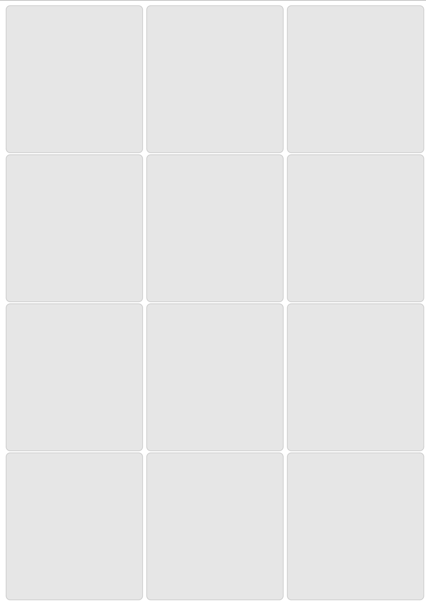
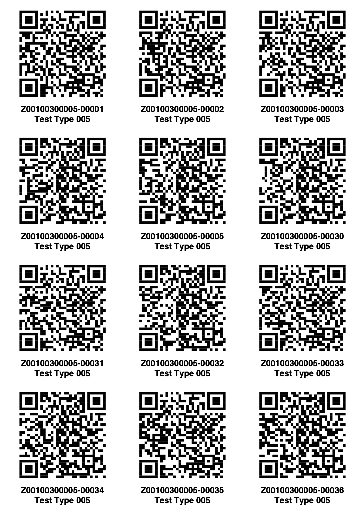

## This page describes how to configure paper & bar/QR label sizes as well as label positions within its sheet and generate label sheets using the HWDB Explorer.

 

Within [the HWDB Explorer]({{ page.root }}/explorer/index.html), from any Type View page like the one shown below, there is a link **Labels** that takes you to the label generator page of the corresponding Component Type.

{: .image-with-shadow}{: width="100%"}

  

Once you arrive the label generator page, you should be seeing a GUI like the one shown below:

{: .image-with-shadow}{: width="100%"}

Basically you provide a list of PIDs (or select from the available list).\
You then select from the available label formats (you could define one by yourself)
and apply more precise adjustments to the format.\
Decide what to be displayed for each given code. The generated QR/bar-codes have the DUNE PIDs embedded by default, but if desired, one could add more to the each label, such as a Serial #, manufacturer, or anything that is stored within its Item.

  

Currently we have the templates shown below already available.\
Please let us know if you need other templates.
{: .image-with-shadow}{: width="30%"}

  

Once you are ready, click the **Download PDF** button.\
The very first page of the downloaded PDF file would show something similar to the one shown below:
{: .image-with-shadow}{: width="50%"}

  

In the next page, there should be a test page as shown below:
{: .image-with-shadow}{: width="50%"}

  

Then it is followed by the label page(s) as shown below:
{: .image-with-shadow}{: width="50%"}



