### This page describes usage of the HWDB Dashboard which provides data obtained from the HWDB visually (e.g., by plotting them).

## Contents
>
>|-------------------------------------+------------------|
>| Section                             | Description      |
>|-------------------------------------+------------------|
>| [Overview/Browse](#overviewbrowse) | Allows one to go through the component hierarchy with ease |
>|-------------------------------------+------------------|
>| [Type View](#type-view) | Displays a summary of a selected Component Type |
>|-------------------------------------+------------------|
>| [Item View](#item-view) | Displays a summary of a selected Item |
>|-------------------------------------+------------------|
>| [Detector](#detector) | Allows one to explore Component Type hierarchy charts |
>|-------------------------------------+------------------|
>| [Shipments](#shipments) |  Displays statuses of available shipping boxes |
>|-------------------------------------+------------------|
{: .checklist}

 

## What is this:

This is a web-based app, lets you;
- go through the hierarchical structure of the HWDB (Systems, Subsystems, Types, and Items) easily,
- help you to deal with your shipments,
- generate and post executive summaries,
- and interact with component type heretical charts.

Access from here: **[https://www.phy.bnl.gov/twister/cets/hw/](https://www.phy.bnl.gov/twister/cets/hw/)**.

And anybody with FNAL SSO credential should be able to access.\
After loggin, you would likely see a screen like the one shown below:

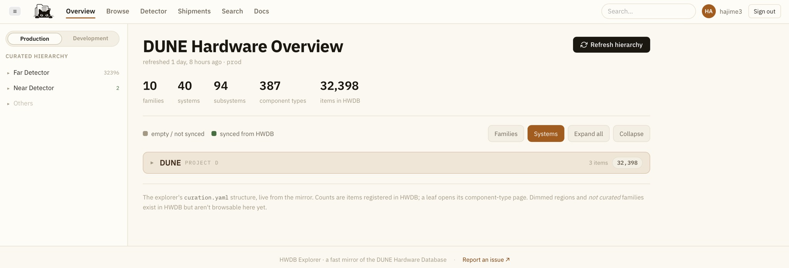{: .image-with-shadow}{: width="100%"}

As can be seen there:
- It allows you to access to two versions of the HWDB, the production or the development.
- At the top, we have the tabbed navigation. There are currently 6 selections.
  For the rest of this page, we go through each of these tabs and describe their basic functionalities and their usages.

More detail description can be also found here: [https://github.com/BNLIF/cets/blob/main/docs/tutorial/hwdb-explorer.md](https://github.com/BNLIF/cets/blob/main/docs/tutorial/hwdb-explorer.md).

## Overview/Browse:

As the two tabs provide very similar functionality, we describe only Overview here.\
As can be seen below, one can go up/down through the component hierarchy, starting from Projects (through Systems, Subsystems) to Types. 

In the example screenshot below, we see:
- Project = DUNE (D)
  - Region = Far Detector
    - Family = Far Detector
	  - System = FD CE (System ID = 081)
	    - Subsystem = FEMB (Subsystem ID = 011)
		  - Type = FD-VD MiniSAS (Component Type ID = D08101100041)

It also indicates **how many Items** in each layer.
For instance, we see there are currently 28 Items (PIDs) under Type ID = D08101100041.

For those dimmed ones (not solid black) indicate either there are no Items (PIDs) created or they are not synced to the HWDB, yet.

Clicking a particular Type here would take you to the Type View.

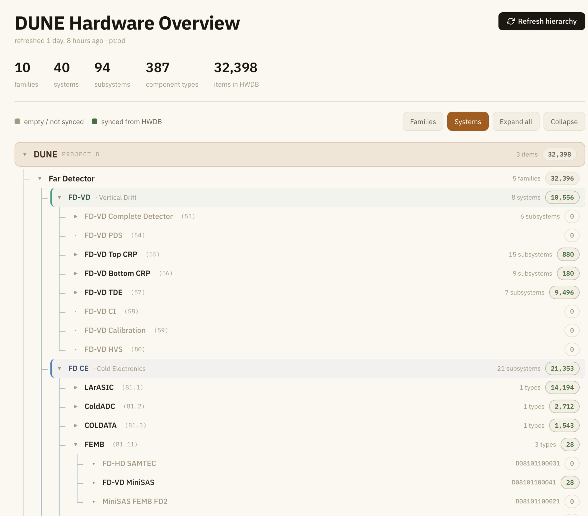{: .image-with-shadow}{: width="70%"}

[back to top](#contents)

### Type View:

Once a particular Type is selected, you would see a Type View as shown below.\
It shows:
- Summary of this Type (Name, ID, # of Items.. etc).
- Histogram of Items under this Type as a function of date.\
  Optionally one can overlay distributions with additional conditions on flags (status, uploaded, certified, and installed).
- Histograms of Tests (all available Test Types under this Type).
- Paginated list of available PIDs under this Type. 

Selecting a particular PID here will take you to its Item View in a new tab.

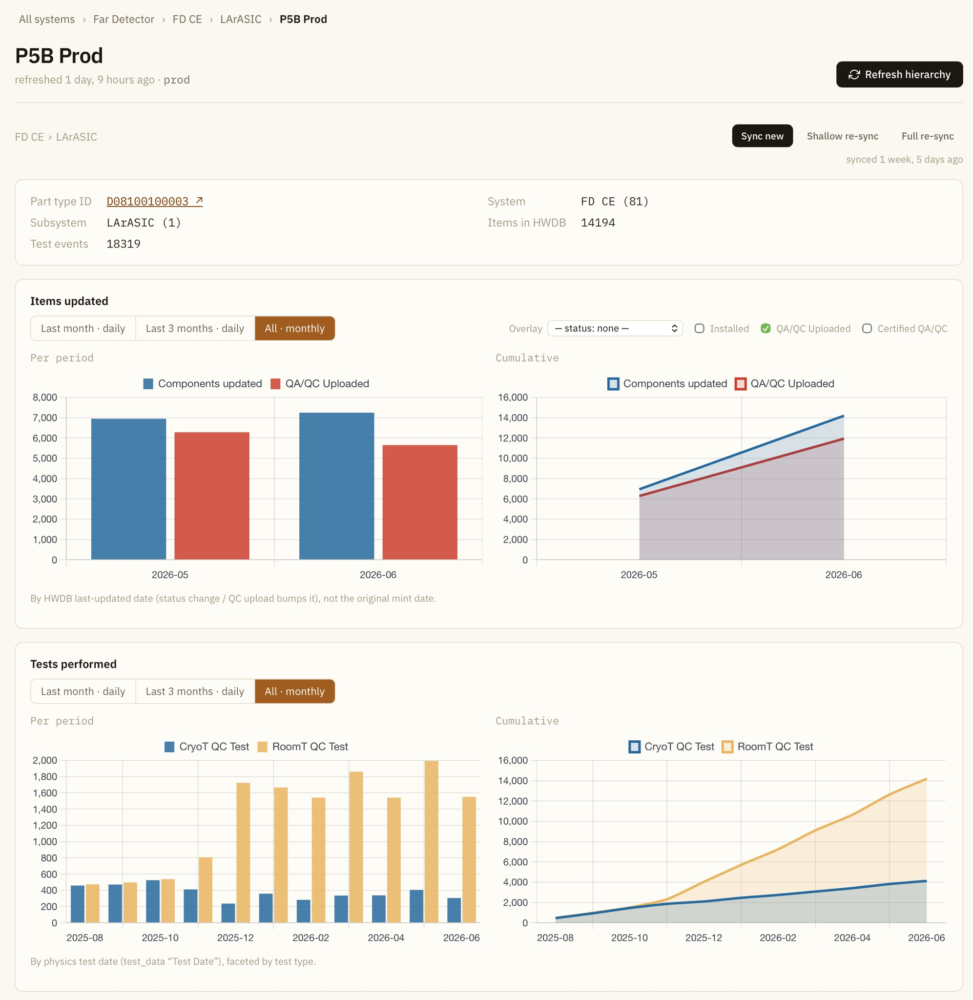{: .image-with-shadow}{: width="70%"}

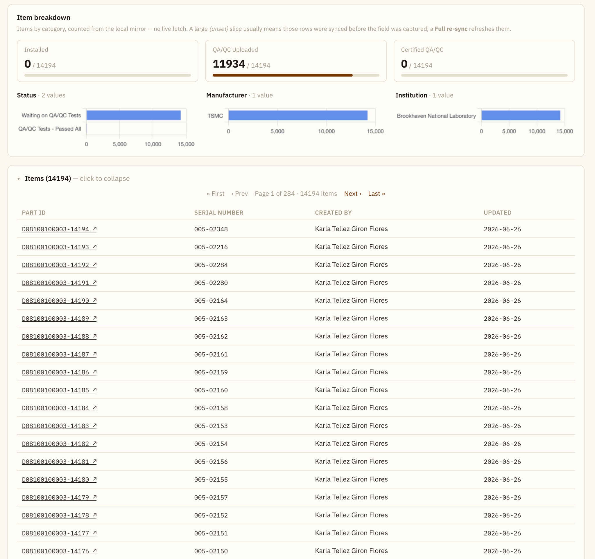{: .image-with-shadow}{: width="70%"}

[back to top](#contents)

### Item View:

It provides information about the Item:
- PID.
- Country, institution, and manufacturer.
- Component status.
- QA/QC Uploaded (binary flag).
- Certified QA/QC (binary flag).
- Installed (binary flag).
- Serial Number.
- Item Specifications.
- Tests (data are downloadable in JSON).
- PIDs of linked sub-components.
- Timeline of its location.
- Binaries (photos, csv files) that are associated with this PID.

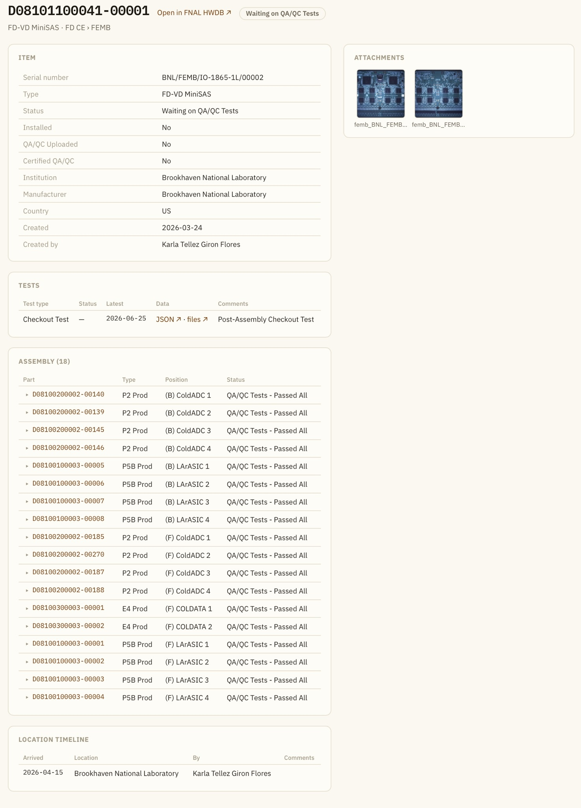{: .image-with-shadow}{: width="70%"}

[back to top](#contents)

## Detector:

It shows a Component Type hierarchy chart (for the vertical drift version only for now).

A Component Type hierarchy chart shows Component Types, that actually exist in the HWDB.
Each box in the chart represents a Component Type (or sometimes multiple Component Types).
And these Component Types could be generic Types, but also cables as well.
Background colors of these boxes correspond to each of the responsible consortia.

Boxes are connected by arrows. Color of the arrows could be either black, that is for connections between generic Type,
or red, that is for connections between a generic Type and cable Type.\
The direction of the arrows always point from a child to its parent.

   

The original charts can be found here:
- HD: [https://edms.cern.ch/document/3467007/](https://edms.cern.ch/document/3467007/)
- VD: [https://edms.cern.ch/document/3416341/](https://edms.cern.ch/document/3416341/)

One can go up/down/right/left and zoom-in/out with your mouse.\
As can be seen below, clicking one of the boxes would pop up a small window, in which info about the Component Type, along with a link to the Type, is displayed.

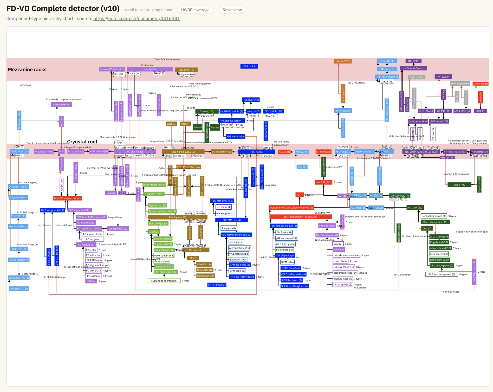{: .image-with-shadow}{: width="70%"}

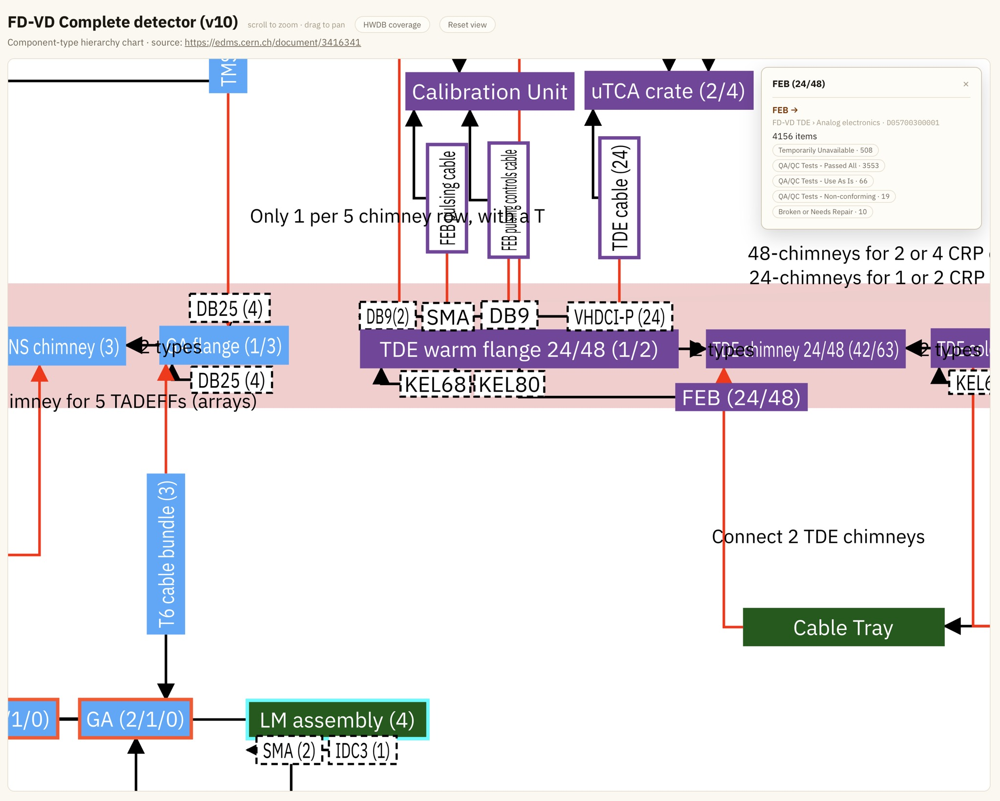{: .image-with-shadow}{: width="70%"}

[back to top](#contents)

## Shipments

In the Shipments tab, it shows the currently available shipping boxes/containers (PIDs) as can be seen below:

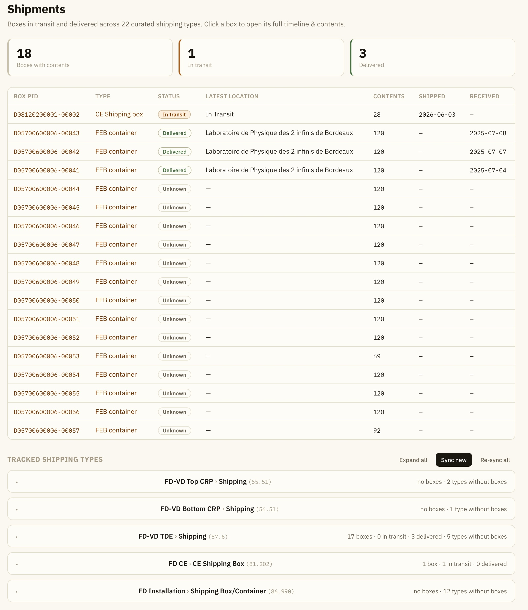{: .image-with-shadow}{: width="70%"}

Selecting a particular PID would take you to its shipping box View like the one below.\
There, you can see:
- Info about the shipping box (status, flags).
- Tests, if any.
- Contents of the 2 checklists, Pre-shipping and Shipping.\
  You can also directly download the corresponding Shipping Sheet (the label with bar/QR-codes).
- Info from the SD Warehouse if available.
- A list of linked sub-components (the actual contents of this shipping box).
- Location timeline of this shipping box.
- Binaries (such as photos) that are associated with this shipping box, if any.

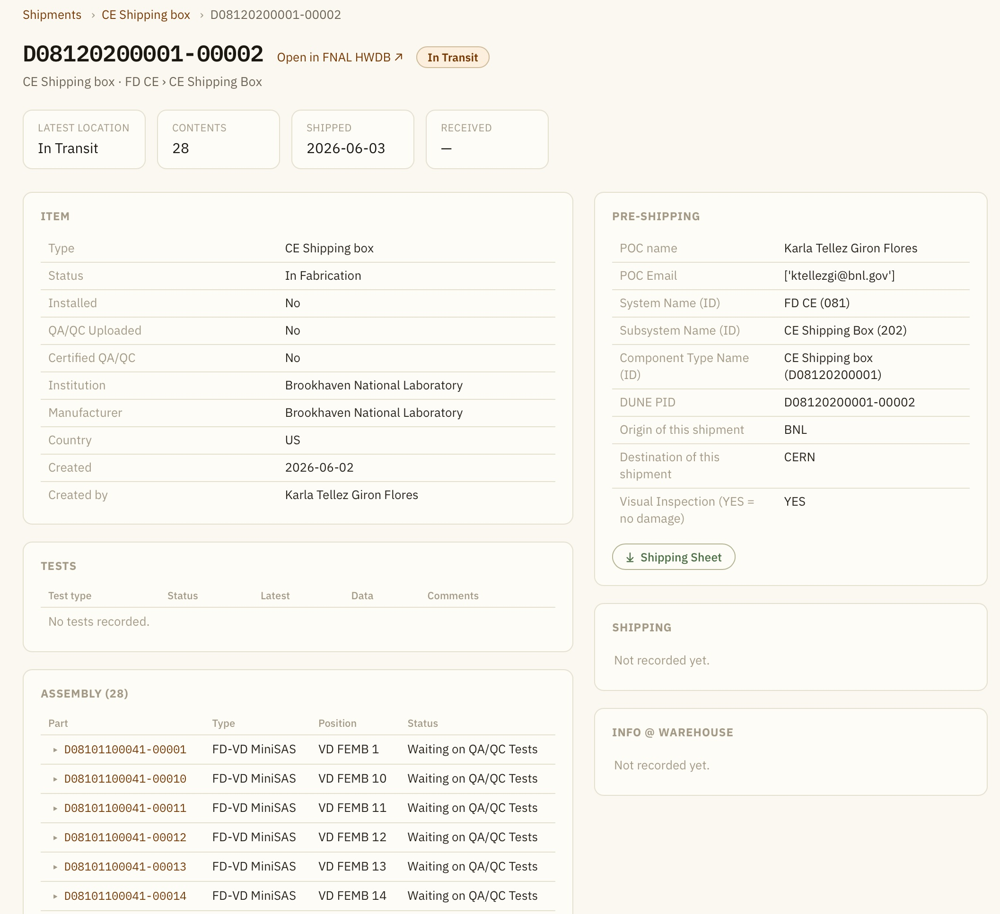{: .image-with-shadow}{: width="70%"}
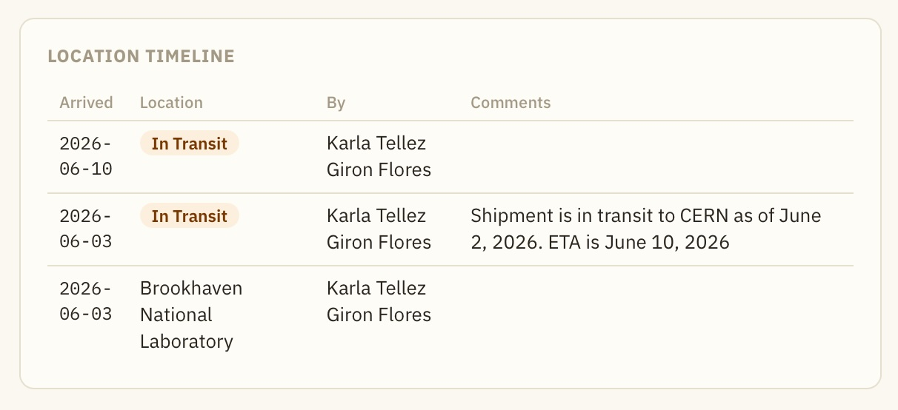{: .image-with-shadow}{: width="70%"}
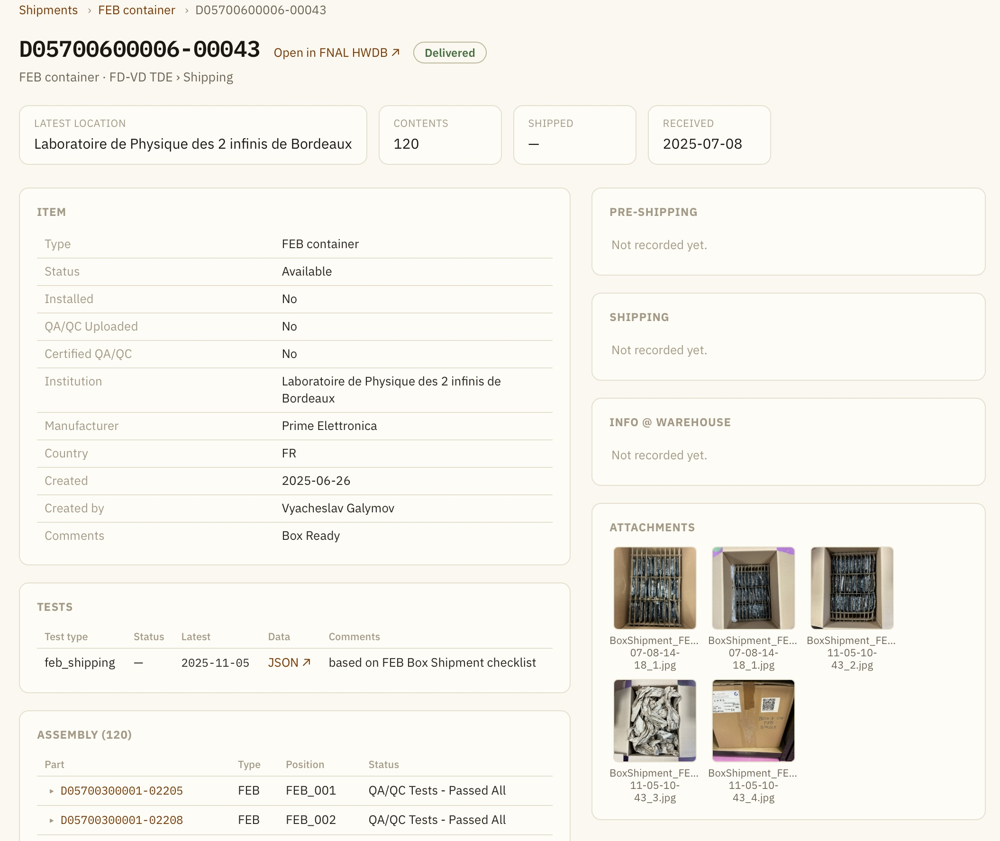{: .image-with-shadow}{: width="70%"}

[back to top](#contents)

   



