### This page describes usage of the HWDB Dashboard which provides data obtained from the HWDB visually (e.g., by plotting them).

## Contents
>
>|-------------------------------------+------------------|
>| Section                             | Description      |
>|-------------------------------------+------------------|
>| [Requirement](#requirement) | Must have the Python HWDB Tools installed. Need to have dash and pandas additionally  |
>|-------------------------------------+------------------|
>| [Startup](#startup) | A screen when launched |
>|-------------------------------------+------------------|
>| &emsp; [How it works](#how-it-works) | Brief description of how it works|
>|-------------------------------------+------------------|
>| [Preferences](#preferences) |  Setting up the version of the HWDB and your local working directory |
>|-------------------------------------+------------------|
>| [Plots tab](#plots-tab) |  Plotly |
>|-------------------------------------+------------------|
>| &emsp; [Pre-Filters](#pre-filters) | Applying filtering conditions on the HWDB side before syncing |
>|-------------------------------------+------------------|
>| &emsp; [Component Type ID/Name, sync, and select a local file](#component-type-id-test-type-name-sync-to-the-hwdb-select-a-file-and-select-a-csv-to-overlay) | Sync to the HWDB, read-in a local csv file... etc |
>|-------------------------------------+------------------|
>| &emsp; [Chart Type](#chart-type) |  Selecting a plotting method (e.g., histogram, scatter...etc) |
>|-------------------------------------+------------------|
>| &emsp; [Selecting a variable(s) to be plotted](#selecting-a-variables-to-be-plotted) | Naming scheme of flattened structure |
>|-------------------------------------+------------------|
>| &emsp; [Selecting conditions](#selecting-conditions) | How to apply conditions |
>|-------------------------------------+------------------|
>| &emsp; [Saving filtered Items in CSV](#saving-filtered-items-in-csv) | Saving both the resultant filtered data the selected conditions locally|
>|-------------------------------------+------------------|
>| &emsp; [Some example plots](#some-example-plots) | See if you could draw plots similarly! |
>|-------------------------------------+------------------|
>| [Type Getter tab](#type-getter-tab) |  Let you go up/down through the HWDB ID hierarchy to find a Component Type ID |
>|-------------------------------------+------------------|
>| [Shipment Tracker tab](#shipment-tracker-tab) | See the all statuses of your shipments on a single pane |
>|-------------------------------------+------------------|
{: .checklist}

 

## Requirement:

This is a part of the Python HWDB Tools. If not already, please refer to [Using the Python HWDB Tools]({{ page.root }}/07-Using-Python-Upload-Tool/index.html) section to obtain and install it first.
Make sure to install **version 1.4.1 or newer**. The latest version can be found from [here](https://github.com/DUNE/DUNE-HWDB-Python/releases/latest).

And to use HWDB Dashboard, you will need three additional packages, **dash**, **pandas**, and **dash_bootstrap_components**, if you don't have them arealdy:
~~~
conda install conda-forge::dash
conda install conda-forge::pandas
conda install conda-forge::dash-bootstrap-components
~~~
{: .language-bash} 

[back to top](#contents)

## Startup:

In your terminal, start it up via:
~~~
hwdb-dash
~~~
This will auto-launch your default web browser with http://127.0.0.1:8050/.
{: .language-bash} 

In your browser, you should see something like below:

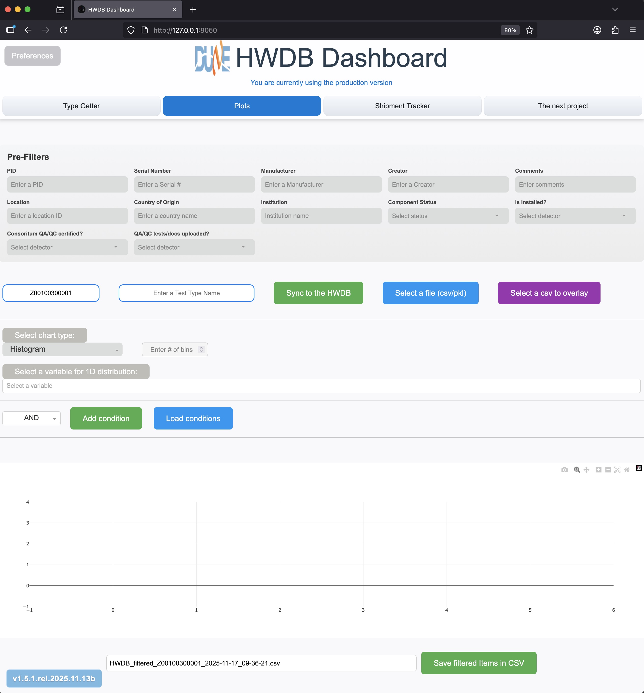{: .image-with-shadow}{: width="100%"}

      

### How it works:

There are three tabs currently available, Plots, Type Getter, and Shipment Tracker.
We will describe each of them below. In short:
- **Plots**:
  You provide a Component Type ID, such as Z00100100040 (you could additionally provide a Test Type Name as well).
  Dashboard then obtains the corresponding Items that are created under the provided Component Type ID.
  You could then:
  - Select certain conditions to filter those Items.
  - Plot a variable(s) with the selected conditions (1D or 2D).
  - Store the filtered data (Items), along with the selected conditions.
- **Type Getter**:
  Helps you to select a Component Type ID from the existing lists (Projects, Systems, Subsystem, and Types).
  It copies to its clipboard so that you could simply paste it to other tabs (Plots and/or Shipment Tracker).
- **Shipment Tracker**:
  Again, you provide a Component Type ID, that corresponds to your shipping box type. Dashboard then shows
  a list of currently available shipping boxes of that type, along with statuses of each of the boxes.
  You could then select individual box to see more detail information about that shipping box.

For the rest of this page, we describe how exactly individual buttons work.

[back to top](#contents)

## Preferences:

The Preferences button sits at the top-left conner. Clicking the button shows a screen like the one below slided in:

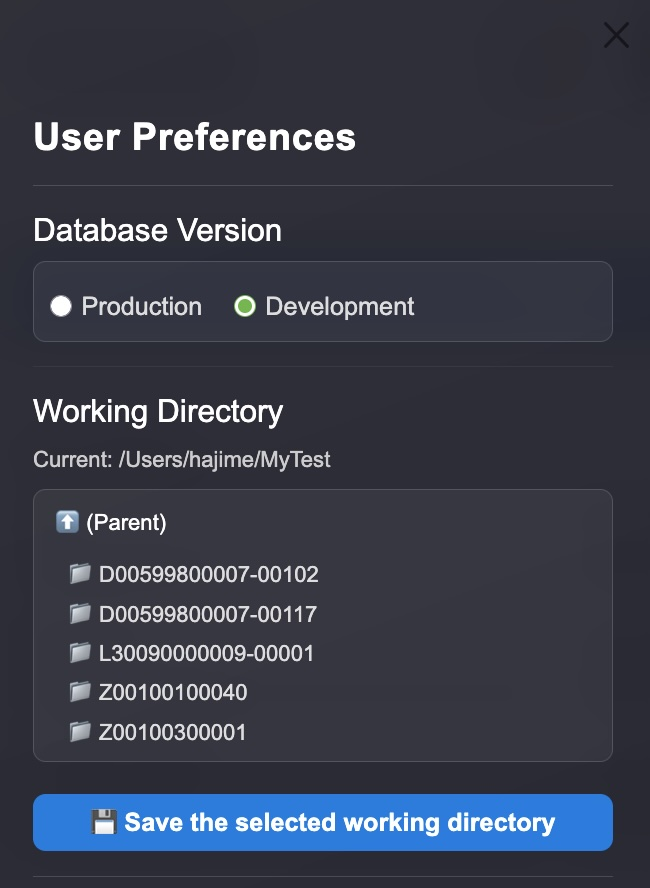{: .image-with-shadow}{: width="40%"}

You need to do two setups here:
- Select a version of the HWDB that you like to access to. It has to be either **Development** or **Production**.
- Select your working directory. The downloaded data, selected conditions, and filtered data are stored in this directory.
  Don't forget to click "Save the selected working directory" button to save.

[back to top](#contents)

## Plots tab:

### Pre-Filters:

Probably they are self-explanatory. You could (you don't need to) apply certain conditions
before you let Dashboard sync to the HWDB. This would potentially shorten the actual syncing time.

[back to top](#contents)

### Component Type ID, Test Type Name, Sync to the HWDB, Select a file, and Select a csv to overlay:

#### Component Type ID:
In this box, you input a Component Type ID, which must already exist in the HWDB. Dashboard will complain if you provide a non-existent ID.

#### Test Type Name:
This is optional. If you like to access to a variable(s) that is stored in **Test Log** of Items under the provided Component Type ID,
then insert the corresponding Test Type Name here. Again, Dashboard will complain if you provide non-existent Test Type Name.

#### Sync to the HWDB:
Clicking this initiates Dashboard to communicate with the HWDB. The button turns into orange-ish color as shown below while talking to the HWDB.
{: .image-with-shadow}{: width="30%"}

   

>## **Also...**
> While Dashboard stores the downloaded data in its memory, it also stores the downloaded data as a pickle file.
>
> - It saves in **/\<Your working directory\>/\<provided Component Type ID\>/**. If the sub-directory, **/\<provided Component Type ID>/**,doesn't exist, Dashboard will create one.
> - The saved file name would be **HWDB\_downloaded\_\<provided Component Type ID\>\_\<time stamp\>.pkl**. If a Component Test Type Name is provided, the file name would be **HWDB\_downloaded\_\<Test Type Name\>\_\<provided Component Type ID\>\_\<time stamp\>.pkl**, instead.
{: .prereq}

#### Select a file:
Let's you select a file, which must be either csv or pickle file, to load-in. The loaded-in data then can be plotted.
This is for files that are saved by Dashboard itself. We'll describe about saving later below.

#### Select a csv to overlay:
Sorry that this button might be slightly confusing with the previous one, "Select a file".
This button should be used only when you like to overlay another distribution over an existing one.
When clicked, it will ask you to select a csv file that contains data of the distribution that you like to overlay.
There are two restrictions:
- A distribution must be already drawn before you overlay.
- The selected csv must contain the same variable (name, units) as the one employed in the original distribution.

[back to top](#contents)

### Chart Type:

Select a type of distribution that you like to plot. As can be seen below, available types are:
- Histogram
- Histogram (log-Y)
- Cumulative Histogram
- Scatter
- Line
- Boxplot

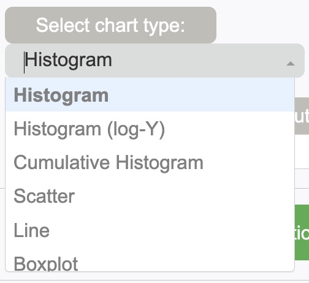{: .image-with-shadow}{: width="30%"}

#### # of bins:
Again, this is optional. Bins are auto-binned. However, you could enforce them to finner or broader binning.

#### Boxplot:
This is to visualize the data (aka box-and-whisker plot). An example plot is shown below:

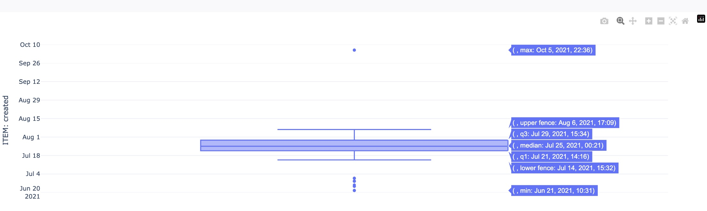{: .image-with-shadow}{: width="100%"}

#### Scatter:
This is to plot a very simple 2D scatter plot. When this type is selected, you need to select
the corresponding 2 variables to be plotted as shown below. We'll describe naming scheme of available variables later below.

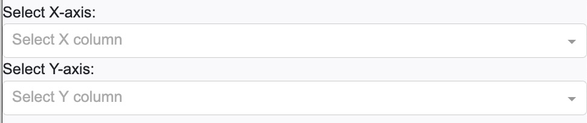{: .image-with-shadow}{: width="65%"}

[back to top](#contents)

### Selecting a variable(s) to be plotted:

Next, you need to select a variable (or variables if you select scatter for your chart type).
In principle, **all** variables, that are stored in the HWDB, should be available, including those in Item/Test Specifications,
with the exceptions of binaries (images, pdfs, and csv files), as seen below:

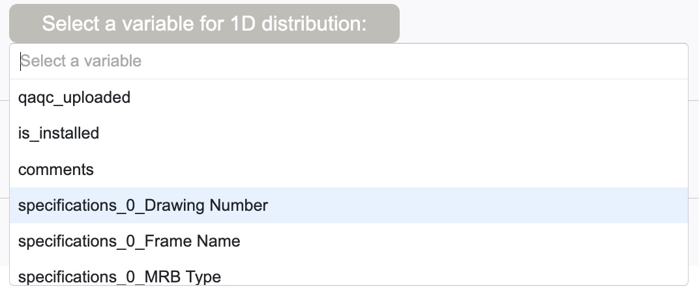{: .image-with-shadow}{: width="70%"}

These variable names are the ones what the HWDB REST-API returns, except when there is a nested structure, such as "Item Specifications".

To flatten such structure, we insert "_" between layers.
For the case of "Item Specifications", since the HWDB stores its modification history in array, Dashboard grabs its latest entry.
Hence there is "0" inserted in the above example.

When a Test Type Name is provided, names of all available variables start with either "ITEM:" or "TEST:", depending on whether
they belong to Items or Tests, as shown below.

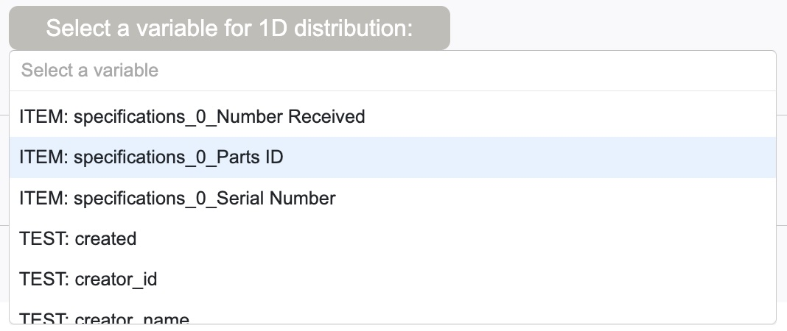{: .image-with-shadow}{: width="70%"}

[back to top](#contents)

#### Selecting a value(s) of the selected variables:

Optionally one could choose a particular value (bin) on the selected variables to be plotted, or could also select multiple values (bins) as shown below.
In this example, plotting certain values of *created* (dates/times).

One could also *toggle* the selection with the toggle button as well. This will NOT to plot the selected bins.
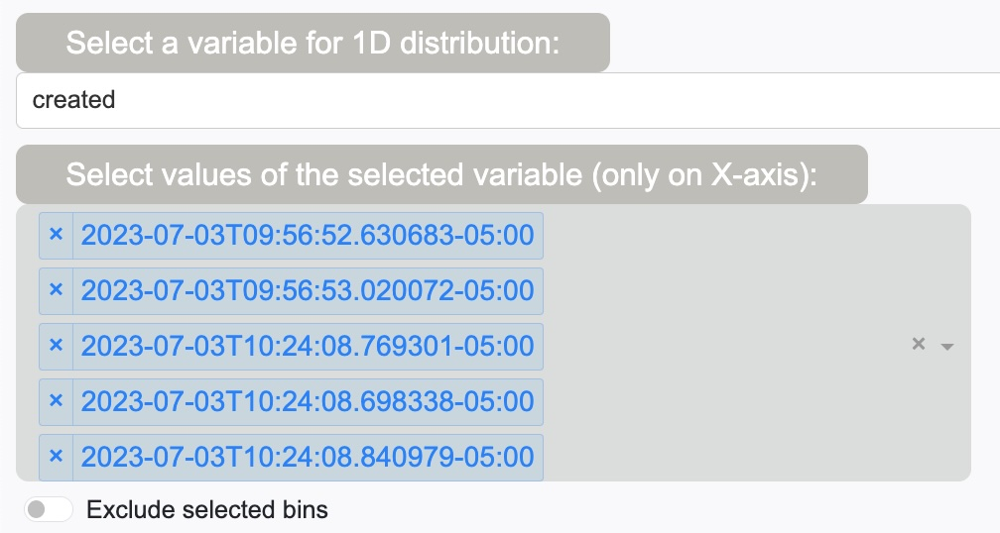{: .image-with-shadow}{: width="60%"}

### Selecting conditions:

In selecting conditions, you start by selecting the overall logis to be applied. It has to be either "AND" or "OR".
Then click "Add condition" to start a condition (or keep clicking it as many conditions as you like to apply).

Next, select a variable that you like to apply a condition, select an operation (>, <, ==, contains...etc), threshold, the corresponding color,
then finally click "Apply".

An example plot with two conditions are shown below:

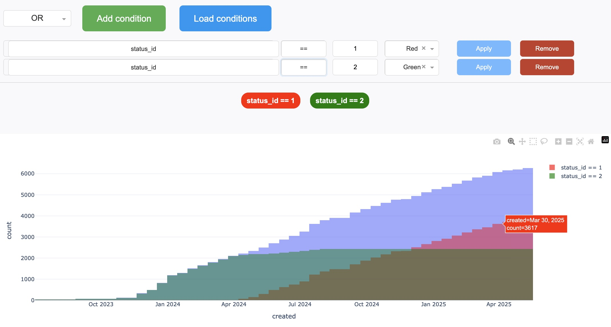{: .image-with-shadow}{: width="100%"}

   

Dashboard only overlays the filtered distributions here, ignoring the chosen overall logic ("AND" or "OR"). The chosen logic will be employed
when it saves the result, which we'll describe later below.

#### Load conditions:

Clicking "Load conditions" button lets you select a saved set of conditions from a local directory.
Again, we'll describe about this later below.

[back to top](#contents)

### Saving filtered Items in CSV:

Clicking "Save filtered Items in CSV" will do two things:
- Saves the filtefred Items in  **\<Your working directory\>/\<provided Component Type ID\>/** with a file name,
  **HWDB\_filtered\_\<provided Component Type ID\>\_\<time stamp\>.csv**.
  Again, if a Test Type Name is provided, its name would be **HWDB\_filtered\_\<provided Component Type ID\>\_\<Test Type Name\>\_\<time stamp\>.csv**.
- Similarly, it also saves the applied conditions in JSON in the same directory. The file name format is **HWDB\_conditions\_\<provided Component Type ID\>\_\<time stamp\>.json** and **HWDB\_conditions\_\<provided Component Type ID\>\_\<Test Type Name\>\_\<time stamp\>.json** when a Test Type Name is given.

As can be seen below, one could also specify a file name as well, while the default file name is auto-suggested there.

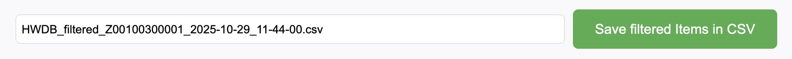{: .image-with-shadow}{: width="100%"}

   

>## **Also...**
> The saved csv file has the usual format:
> - Column labels, for each of the flattened variables, at the 1st row.
> - Each of the rest of the rows represent individual Item (PID).
{: .prereq}

[back to top](#contents)

   

### Some example plots:

We show examples below. Try to plot some by yourself as well!

**1D: Locations**:
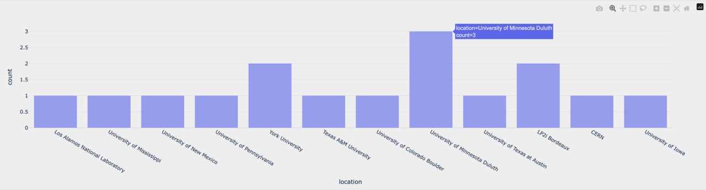{: .image-with-shadow}{: width="100%"}
**1D: Measured resistances on mini resistor boards**:
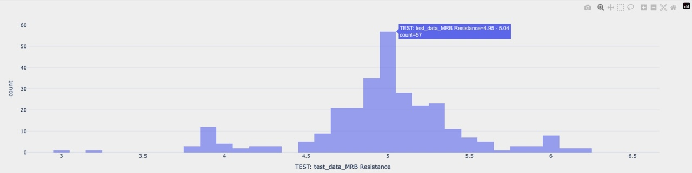{: .image-with-shadow}{: width="100%"}
**2D: Dates vs SiPM Strip IDs**:
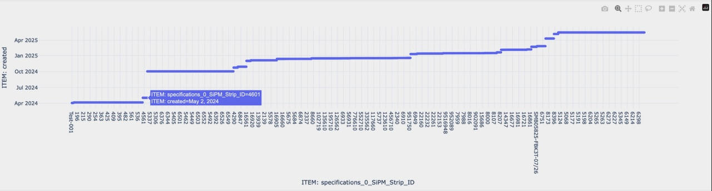{: .image-with-shadow}{: width="100%"}
**2D: Dates vs Locations**:
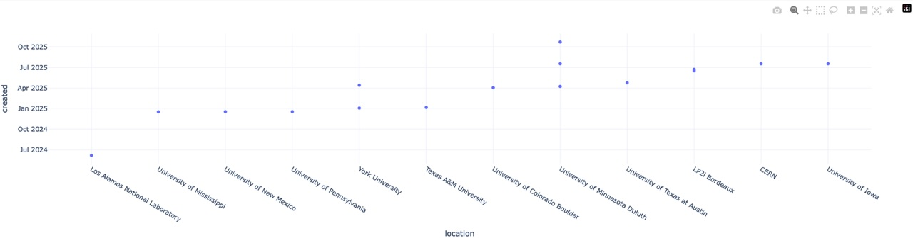{: .image-with-shadow}{: width="100%"}
**1D: Comments**:
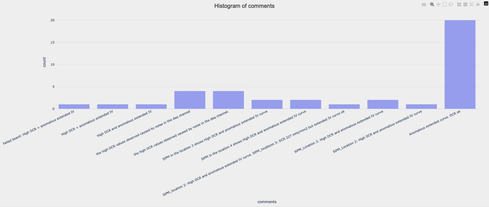{: .image-with-shadow}{: width="100%"}
**1D: Comments in log scale**:
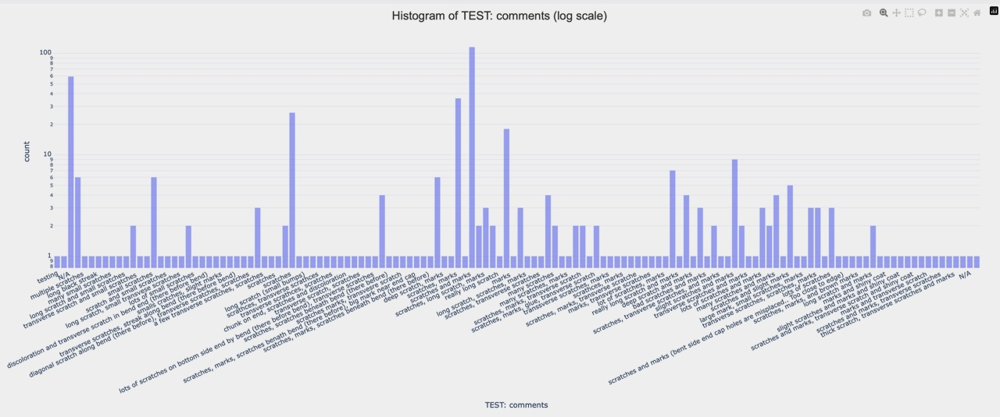{: .image-with-shadow}{: width="100%"}

## Type Getter tab:

This should be really self-explanatory.
It starts with a list of existing **Projects**. When a browser is newly launched, you would be seeing a blank page.
Go ahead to update the blank list by clicking the green **Sync to the HWDB** button.
You should then see a list like the one below:

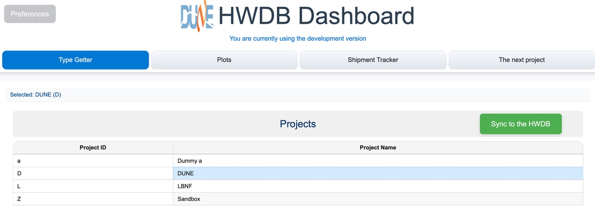{: .image-with-shadow}{: width="100%"}

Now, go ahead to select a Project. E.g., "DUNE". That would take you to show a list of the currently existing **Systems**.
Again, don't forget to click the green **Sync to the HWDB** button to update the list.

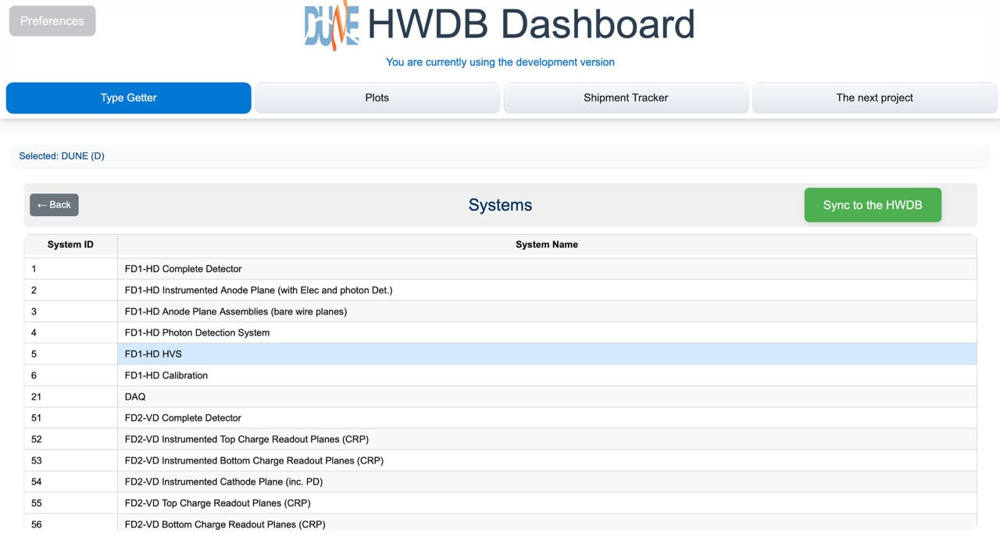{: .image-with-shadow}{: width="100%"}

Select a System, e.g., "FD1-HD HVS". That would then take you to a list of **Subsystems** like below:

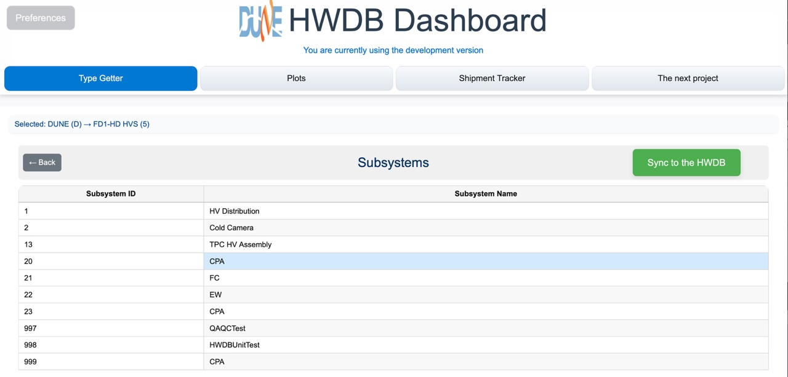{: .image-with-shadow}{: width="100%"}

Now select a Subsystem, e.g., "CPA", which finally takes you to a list of **Types** as shown below.

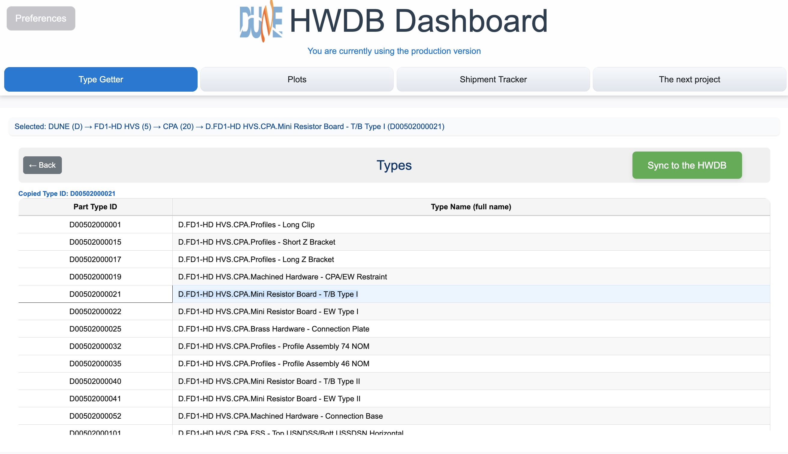{: .image-with-shadow}{: width="100%"}

Select a Type, such as **Mini Resistor Board - T/B Type I**. It will copy the corresponding Component Type ID
(D00502000021 in this case) to its clipboard, which you could then paste in another tab (Plots and/or Shipment Tracker).

[back to top](#contents)

   

## Shipment Tracker tab:

In this tab, you start by providing a Component Type ID that corresponds to your shipping box type.
If you don't have one, try **D00599800007** in the development version of the HWDB, for testing purpose.
As Dashboard will try to obtain information of the individual shipping boxes that are created under this Component Type ID,
it might ake sometime to finish syncing. Be patient.

Once synced, you should be seeing a list of shipping boxes like the one shown below:

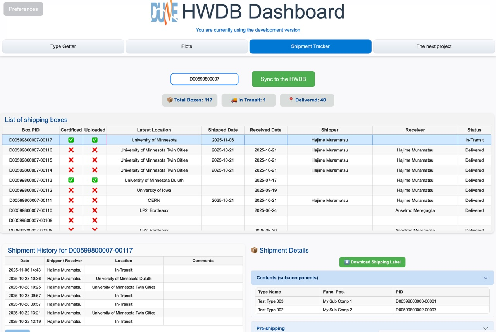{: .image-with-shadow}{: width="100%"}

In its top half, it displays;
- the overall info : Total # of boxes currently in the HWDB, # of boxes currently in-transit status, and # of boxes that have been delivered
- and the list of individual shipping boxes.

The list of individual boxes shows the following columns:
- **Box PID**: PIDs of each of your shipping boxes.
- **Certified**: This is the [Consortium Certified QA/QC]({{ page.root }}/shippinghandoff/index.html#the-two-key-flags) binary flag, which must be checked before shipped.
- **Uploaded**: This is the [All QA/QC Test and Documentation Uploaded]({{ page.root }}/shippinghandoff/index.html#the-two-key-flags) binary flag, which must be checked before shipped.
- **Latest Location**: The latest location.
- **Shipped Date**: The date when the shipping box enteres "In-Transit" status.
- **Received Date**: The date when the shipping box changes its status from "In-Transit".
- **Shipper/Receiver**: The user name who updates its location information in the HWDB.
- **Status**: It must be either "In-Transit" or "Delivered".

Selecting a particular shipping box (a row) from this list takes you to the bottom half of this tab, to show more detail
information about the selected shipping box, as can be seen below. Here, shipping box PID, D00599800007-00117, is selected as an example.

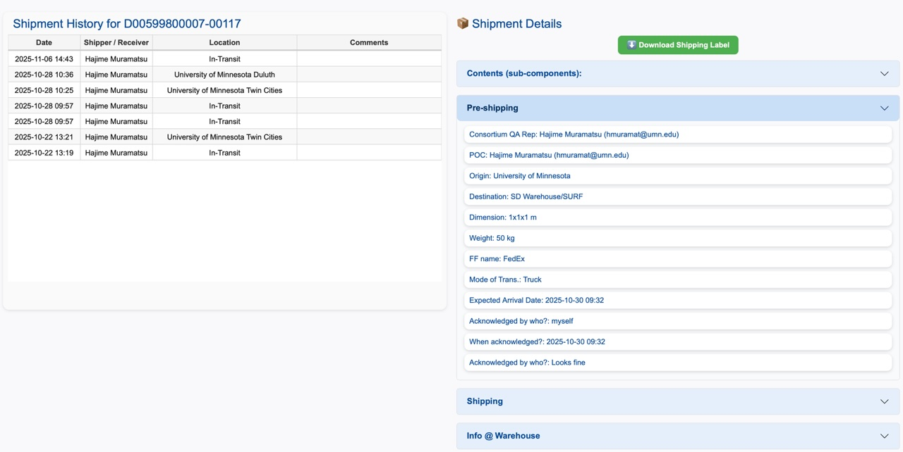{: .image-with-shadow}{: width="100%"}

In this bottom half of the tab, on the left, a history of the selected shipping box is shown.
This could be particularly helpful if your shipping box happens to have multiple origins/destinations.

On the right, you see the following information:
- **Download Shipping Label**: This button becomes green if such label is available in the HWDB (should be, if you follow the shipping procedure).
  Clicking the green button downloads the shipping label into your working directory.
- **Contents (sub-components)**: Shows a list of the contents of your shipping box. This info is displayed only if you properly fill out the Pre-shipping checklist.
- **Pre-shipping**: Shows contents of the Pre-shipping checklist you fill out before shipping.
- **Shipping**: Similarly shows contents of the Shipping checklist you fill out. This includes buttons to download your bill of lading, proforma invoice if international shipment, and other binaries that must be uploaded to the HWDB according to the [DUNE Shipping Procedure]({{ page.root }}/shippingprocedure/index.html).
- **Info @ Warehouse**: This shows SKU, Pallet ID of your shipment at the SD Warehouse, along with its received date/time and result of visual inspection when it is received there.

[back to top](#contents)

   



