### This page describes how to produce an Executive Summary using the HWDB Dashboard.

## Contents
>
>|-------------------------------------+------------------|
>| Section                             | Description      |
>|-------------------------------------+------------------|
>| [Startup](#startup) | Decide on one of the two modes then provide a Component Type ID |
>|-------------------------------------+------------------|
>| [Config File](#config-file) |  The syntax of Config File |
>|-------------------------------------+------------------|
>| [Executive Summary](#executive-summary) | The contents of an Executive Summary |
>|-------------------------------------+------------------|
>| [Generated PDF file](#generated-pdf-file) | An example of generated PDF |
>|-------------------------------------+------------------|
{: .checklist}

 

## What is this:

Executive Summary (ES) is to report QC results and needed for signoff of different assemblies or component batches.
This summary is created by the [HWDB Dashboard]({{ page.root }}/dashboard/index.html) which also allows designated individuals to certify components and records their associated sign-off in the HWDB.
The application also converts the produced summary into a PDF file and uploads it to the HWDB.

The QC results and sign-offs, that are displayed by the [HWDB Dashboard]({{ page.root }}/dashboard/index.html), vary by component type. 
Hence, each consortium needs to determine which component types need to have the corresponding ES.

For a given component type, the consortium needs to provide a list (config. file) of fields in the HWDB that are included in the ES.
The list includes:
- A checklist
- Reference URLs
- A group of supporting plots or plots to be checked
- Number of and the order of signees
- And any other info that would be needed for signees to review.

## Startup:

To start to write an ES, select a PID (e.g., that corresponds to an assembly or a shipping container)
from PID list of [Type View]({{ page.root }}/dashboard/index.html#type-view), which takes you to
[Item View]({{ page.root }}/dashboard/index.html#item-view) of the selected PID.

Within Item View, you should find a pane that shows the current status of ES for this PID as shown below:
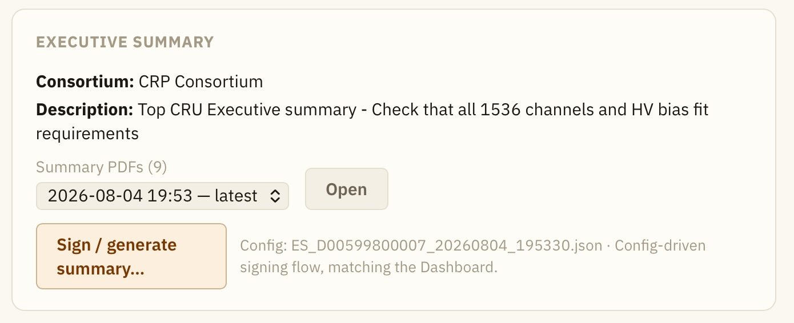{: .image-with-shadow}{: width="50%"}
There could be already multiple summaries in the HWDB (as in the above example). In such case, the linked button points
to the latest ES, while you can still optionally see older ones.

If there is no ES previously exists or you need to update the existing ES (e.g., you need to sign-off), click **Sign/generate summary...** button.

## Config File:

When you come to an ES page for the first time, it should look like the one shown below... very much empty!\
As you can see, it starts with the **default** version of ES, which does not require you to generate a template of your summary
and let's you start a sign-off process.\
Obviously, you would be the only one who can sign in this case.
As can be seen there, you could also do the following for this PID:
- Record your signature
- Set the 3 statuses (Component status, Certified QA/QC, and All QA/QC uploaded)
- Add comments, if any

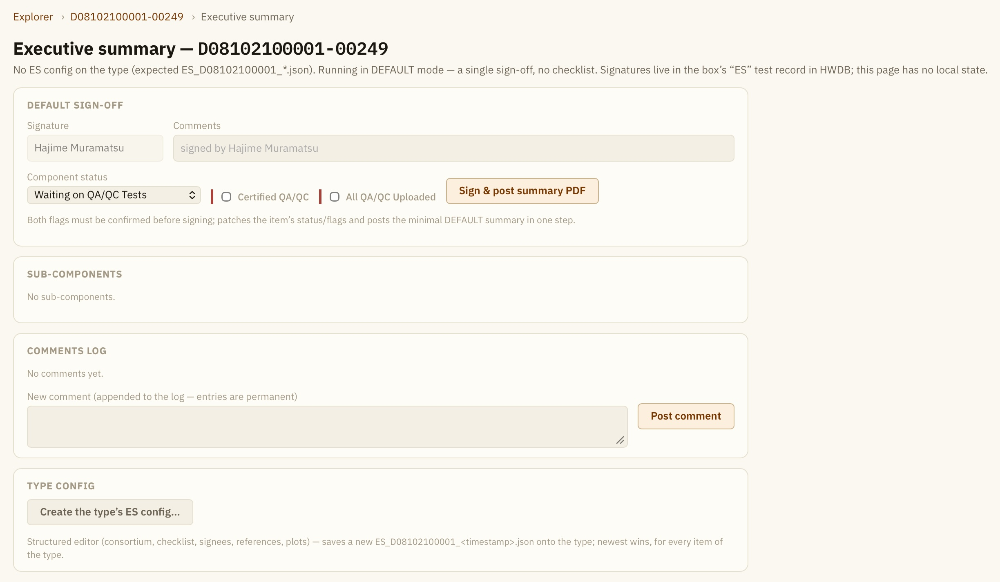{: .image-with-shadow}{: width="90%"}

To produce a **Detail** version of ES, one has to generate a template or **config file**.\
A config file is provided in JSON format and it needs to be placed in the **IMAGES** section of Component Type view
(e.g., see [https://dbweb2.fnal.gov:8443/cdbdev/edit/ctype/700](https://dbweb2.fnal.gov:8443/cdbdev/edit/ctype/700)).

> ## Admin. privilege 
> By the way, to be able to upload files to Component Type **IMAGES** section, one must have the Admin. privilege in the HWDB.\
> If you need to upload one and don't have the privilege, please consult with your HWDB liaisons.
{: .callout}

   

Our [HWDB Dashboard]({{ page.root }}/dashboard/index.html) provides GUI to produce config file.
Go ahead to click the **Create the type's ES config...** button.\
In the Edit scene, you might be seeing a very empty page, if you haven't had an ES for the selected PID.\
Below, we show an example of how one could fill out this Edit scene.

In the **BASICS** pane at the top, provide your consortium name and a brief description of what this summary is about.\
In the **QC CHECKS (TODOS)** pane, provide a title and a list of your checklist that you like your signnees to check on.\
In the **SIGNEES** pane, provide 3 items for each signee:
- **name**: Position name of the signee (e.g., HWDB liaison, Consortium lead).
- **rank**: This takes an integer and is for setting the **order** of signing.\
  If you don't want any order, provide *any* *negative* integer.\
  When a *positive* integer is given, it requires an order for signing and signees with **larger** integers sign **first**.\
  Thus, in the example below, while there is no order requirement between \"Grenoble Factory Lead\" and \"TOP CRP HWDB Liaison\",
  *both* of them must sign first before \"Consortium Lead\" signs.
- **roles**: This is an integer list and **[User Role IDs]({{ page.root }}/03-Setting-up-Types/index.html#managed-by-a-required-field)** can be given.\
Basically this restricts who can sign. Providing a particular User Role ID(s) here will require for user, who is signing, to have
that particular User Role(s) be assigned in his/her HWDB account.\
E.g., if 30, 31, 32 were given in the development version of the HWDB, he/she must have one of the following roles assigned in his account:
HVS-CPA, HVS-FC, or HVS-EW.\
Or this can be empty as in the example below.

In the **REFERENCE URLS** pane, you could provide URLs for your references, supporting documents, or even documents or data that you want your signees to check on within the HWDB.
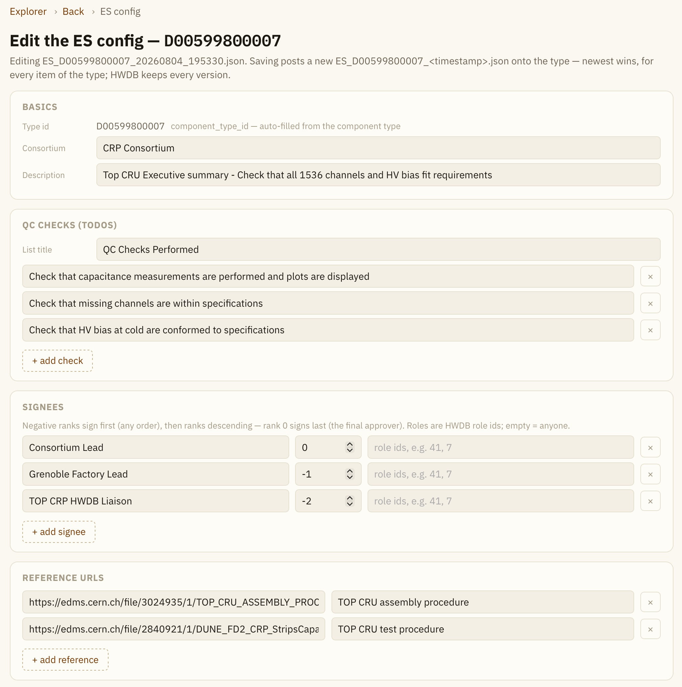{: .image-with-shadow}{: width="70%"}

  

In the **PLOTS** pane, you define which distributions you like to include in your summary.\
You have 3 options here:
- Draw a plot based on data points that are stored in the HWDB (the 1st plot in the example below).
- Use a figure (binary file) that already exists in the HWDB (the 2nd plot in the example below).
- Not to plot, but show some selective data stored in the HWDB (the 3rd plot in the example below).

To produce a plot based on data stored in the HWDB:
- Select **numeric (data_paths)**.
- Provide a **title** of the distribution.
- Provide the **Test Type Name** that holds the data under the PID.
- Provide **data_paths** to the actual data points.\
  If we have something like **data[0].chan, data[0].capa** as in the example below,
  it is treated as a 2-D scatter plot with x-values and y-values are provided as data[0].chan and data[0].capa, respectively.
  On the other hand, if you have only **data[0].chan**, it will be a simple 1D histogram.
  The actual stored data in the HWDB should look like the one below:
  
  ~~~
        "data": [
          {
            "capa": [
              7.609937,
              6.399149,
              8.050605,
			  ...
            ],
            "chan": [
              0,
              1,
              2,
              ...
		    ],
			...
~~~
{: .language-json .output}
- Provide a **PID** that is associated with the stored data.\
  Optionally you could also specify one of the linked sub-components from the specified PID. In this case, you need to provide the following two:
  - **sub layer**: Takes an integer. For instance, 1 (2 (3)) corresponds to the children (grand-children (grand-grand-children)) of your specified PID.
  - **sub position name**: Provide the functional position name that holds the data you are interested in.
- Optionally you could add an extra field(s) as well. In this case, you need to provide a label of the extra field.\
  You could also provide **data_paths** for this extra field to show the stored data in this field, or leave it empty.
  If you leave it empty, then user (e.g., signee or reviewer of your summary) can enter any value/string in that field.
  
  

To use a figure that already exists in the HWDB:

First of all, the figure(s) must be associated with a certain Test Type(s).

- Select **image (from a test record)**:
- The rest steps are pretty much similar to what we have already described above, except:
  - You do NOT provide data_paths, but the **image file name**.\
    Optionally you could specify an image(s) that is stored in **older** Test entries.
	This is specified by **history_order**, which is just an integer.
	 0 (default) corresponds to the latest entry. 1 corresponds to the previous one and so on.

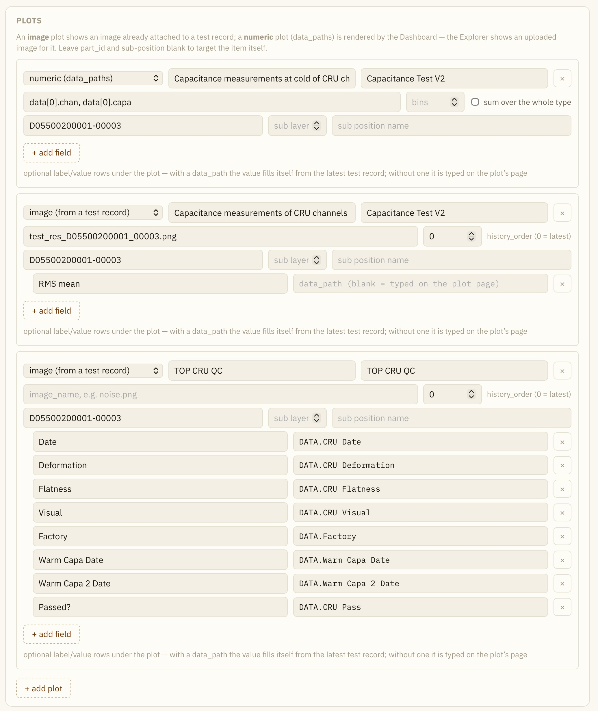{: .image-with-shadow}{: width="70%"}

  

Optionally, you could add extra fields. This is different from extra fields you could add that we mentioned above. Those are associated with each given plots.\
These extra fields, if you create, will be a part of the summary section of ES.

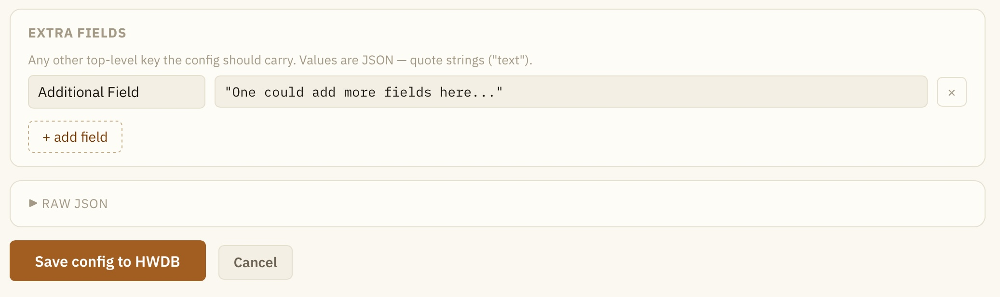{: .image-with-shadow}{: width="70%"}

Once you are done with editing, click **Save config to HWDB**.
The Dashboard generates a JSON file and uploads it to the HWDB.

      

[back to top](#contents)

## Executive Summary

Once you have your config file ready and uploaded, your Executive Summary page should look like the one below:\
We'll now go through each of the sections.

After **SUMMARY** and **REFERENCE URLS** panes (notice that an extra field we defined shows up here),
we have **QC CHECKS** pane, which is titled as \"QC Checks Performed\".
These checks are recorded and updated every time a signee uploads his signature to the HWDB.

The **SUB-COMPONENTS** page shows a list of linked sub-components. If a sub-component has already an ES stored in the HWDB,
the corresponding link is also provided.

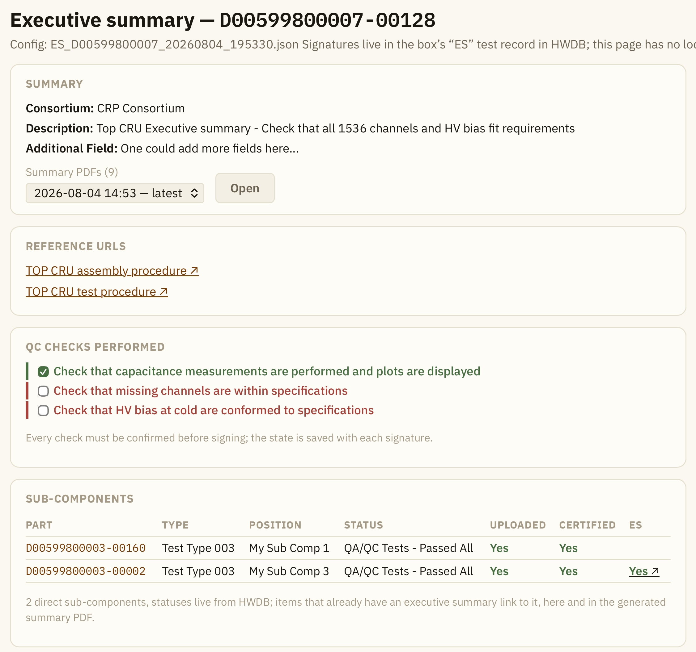{: .image-with-shadow}{: width="70%"}

  

The **PLOTS** pane shows the defined plots, along with extra fields, if defined any.\
In the example below, the 2nd plot has an extra filed, labeled as \"RMS mean\". One can enter a value there
by clicking **Upload image/fill fields**.
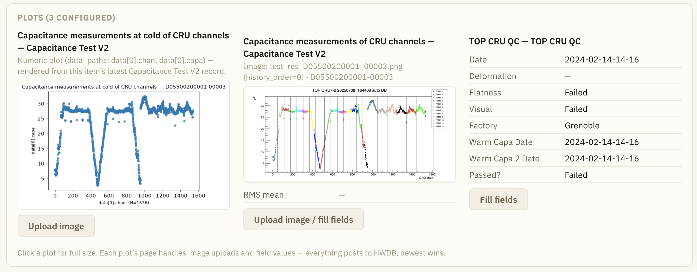{: .image-with-shadow}{: width="100%"}

  

After clicking **Upload image/fill fields**, you should see something like below, where you can enter a value/string to the defined extra field.
You could optionally replace the defined figure as well.

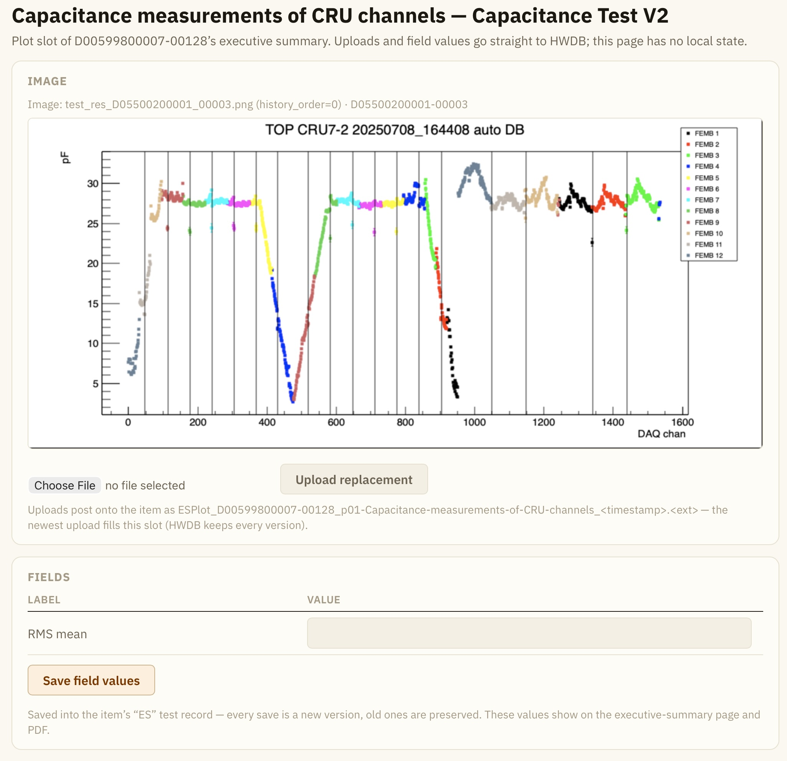{: .image-with-shadow}{: width="70%"}

  

In the **ITEM STATUS & QA/QC FLAGS**, you update the component status and the two QA/QC flags.
Again, these will be updated in the HWDB when a signee uploads his signature to the HWDB.

In the **SIGN-OFF** pane, each signee signs, with comments if any. Clicking **Sign & post** button posts a signature.

In the **GENERATE** pane, there is **Generate PDF & upload to HWDB** button, which becomes active
once the all designed signees sign. A PDF file will be generated and uploaded to the HWDB.

The **RESET signatures** button there is to reset all recorded signatures in the HWDB and redo the sign-off process from scratch.\
We don't want anybody to be able to reset here.\
It respects **roles** that is set to the signee with **the lowest integer rank** (in our example, it would be "Consortium Lead").

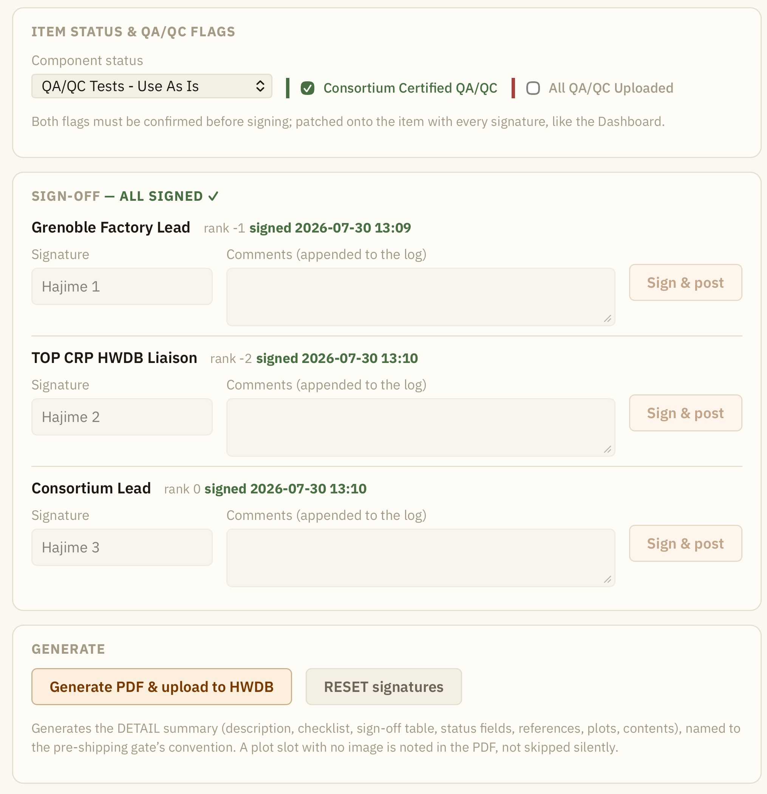{: .image-with-shadow}{: width="70%"}

  

In the **COMMENTS LOG**, we see all comments that have been entered in the HWDB, which include not only comments/signatures from
each designed signees, along with component status at those times, but also comments from others.\
Right, one can add comments by a user who is not designed as signee as well.\
Also notice that when signatures are reset, the log keeps the all previously recorded signatures/comments.

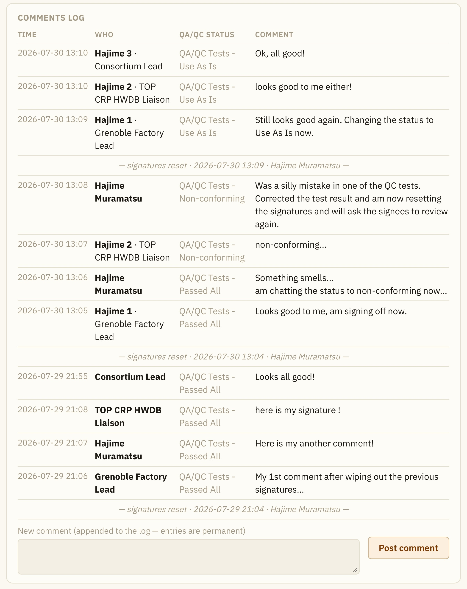{: .image-with-shadow}{: width="70%"}

      

[back to top](#contents)

## Generated PDF file

For completeness, we show a generated PDF of the above example below:

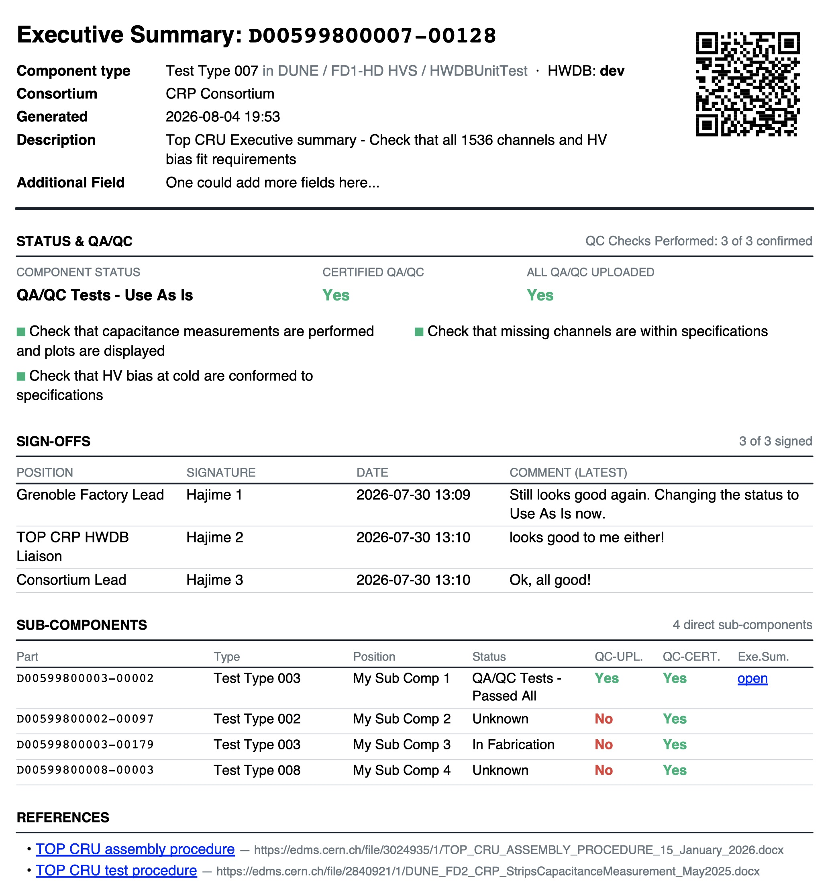{: .image-with-shadow}{: width="70%"}
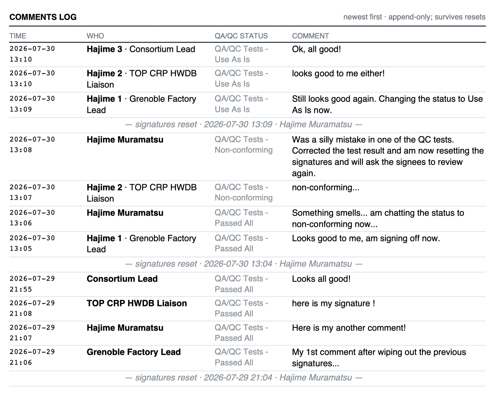{: .image-with-shadow}{: width="70%"}
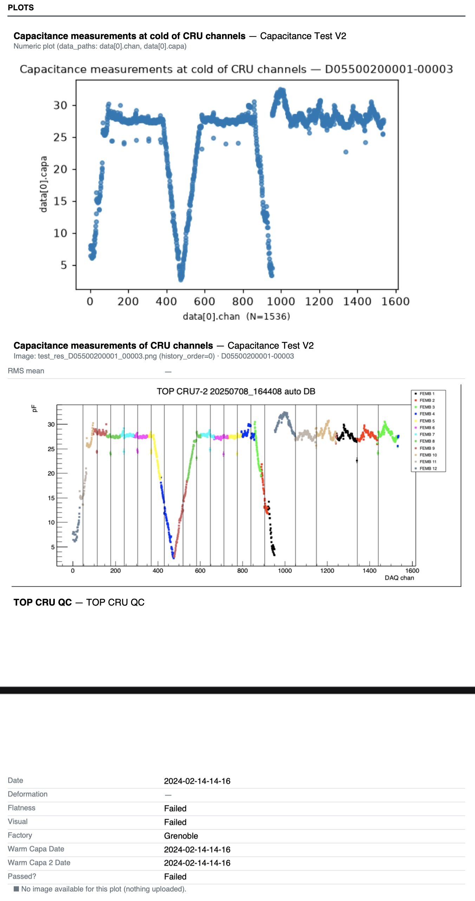{: .image-with-shadow}{: width="70%"}

      

[back to top](#contents)



