### This page describes how to produce an Executive Summary using the HWDB Dashboard.

## Contents
>
>|-------------------------------------+------------------|
>| Section                             | Description      |
>|-------------------------------------+------------------|
>| [Requirement](#requirement) | Must have the Python HWDB Tools installed. |
>|-------------------------------------+------------------|
>| [Startup](#startup) | Decide on one of the two modes then provide a Component Type ID |
>|-------------------------------------+------------------|
>| [Config File](#config-file) |  The syntax of Config File |
>|-------------------------------------+------------------|
>| [PID Table](#pid-table) | Shows a list of PID available under the provided Component Type ID |
>|-------------------------------------+------------------|
>| [Executive Summary](#executive-summary) | The contents of an Executive Summary |
>|-------------------------------------+------------------|
>| [Plots](#plots-1) | Example plots |
>|-------------------------------------+------------------|
>| [Generated PDF file](#generated-pdf-file) | An example of generated PDF |
>|-------------------------------------+------------------|
>| [DEFAULT mode](#default-mode) | The default mode (shorter Executive Summary) |
>|-------------------------------------+------------------|
{: .checklist}

 

## What is this:

Executive Summary (ES) is to report QC results and needed for signoff of different assemblies or component batches.
This summary is created by a HWDB Dashboard which also allows designated individuals to certify components and records their associated sign-off. 
The application also uploads a pdf file of the summary to the HWDB.

The QC results and sign-offs, that are displayed by the HWDB Dashboard application, vary by component type. Hence, each consortium needs 
to determine which component types need to have the corresponding ES.

For a given component type, the consortium needs to provide a list (config. file) of fields in the HWDB that are included in the ES.
The list includes:
- A checklist
- Reference URLs
- A group of supporting plots or plots to be checked
- Number of and the order of signees.

## Requirement:

This functionality is provided by one of the *tabs* in the [HWDB Dashboard]({{ page.root }}/dashboard/index.html),
where the [HWDB Dashboard]({{ page.root }}/dashboard/index.html) is a part of the Python HWDB Tools. 
If not already, please refer to [Using the Python HWDB Tools]({{ page.root }}/07-Using-Python-Upload-Tool/index.html)
section to obtain and install it first. Standalone binary versions for macOS and Linux (WSL2) are also available.

## Startup:

In your terminal, start it up via:
~~~
hwdb-dash
~~~
This will auto-launch your default web browser with http://127.0.0.1:8050/. (if your browser doesn't auto-start, just access to http://127.0.0.1:8050 manually).
{: .language-bash} 

In your browser, go to the ES session by selecting the ES as shown below:

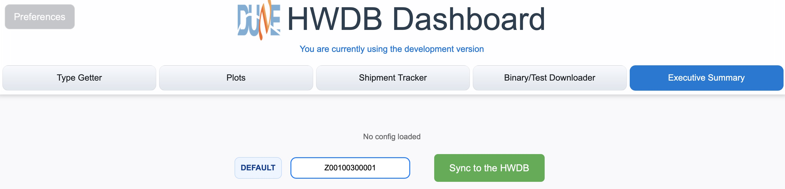{: .image-with-shadow}{: width="100%"}

In the ES tab, you should see **DEFAULT** button, which you can toggle between **DEFAULT** and **DETAIL** as also shown below.

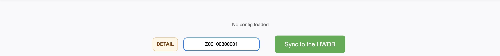{: .image-with-shadow}{: width="100%"}

There are two modes of ES that you could produce: **DEFAULT** mode produces a short/brief report while **DETAIL** mode provides a more complete ES.\
We describe **DETAIL** mode first below.

Once you set the toggle button, provide your Component Type ID in the field right next to the toggle button.\
Then click the green **Sync to the HWDB** button.

When/if the Dashboard finds a config file in the HWDB, it should display its file name and the corresponding Component Type name
as can be seen below.

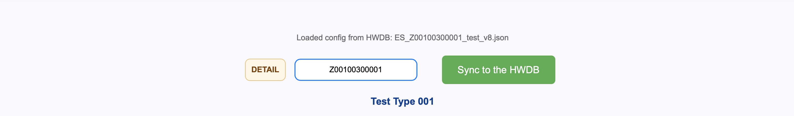{: .image-with-shadow}{: width="100%"}

      

[back to top](#contents)

## Config File:

A config file is provided in JSON format and it needs to be placed in the **IMAGES** section of Component Type view.\
We show such Component Type view as an example via WEB-UI for the case of Type ID = Z00100300001 below ([https://dbweb2.fnal.gov:8443/cdbdev/edit/ctype/700](https://dbweb2.fnal.gov:8443/cdbdev/edit/ctype/700)).

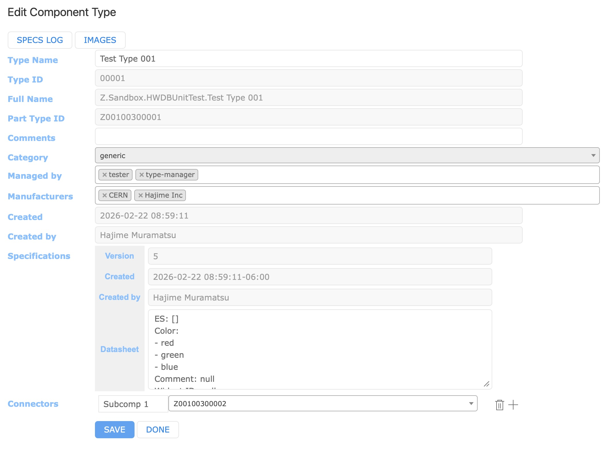{: .image-with-shadow}{: width="70%"}

Once you reach such Component Type view, just click **IMAGES** button, where you can upload your config file.\

   

> ## Admin. privilege 
>
> To upload files to Component Type **IMAGES** section, user must have the Admin. privilege in the HWDB.\
> If you need to upload one and don't have the privilege, please consult with your HWDB liaisons.
{: .callout}

   

Below, we show a typical config file as an example. We then describe each section (key) of the JSON file.

~~~
{
    "consortium_name": "CRP Consortium",
    "component_type_id": "Z00100300001",
    "test_description": "Top CRU Executive summary - Check that all 1536 channels and HV bias fit requirements",
    "todos": {
	"title": "QC Checks Performed",
	"check_list": [
	    "Check that capacitance measurements are performed and plots are displayed",
	    "Check that missing channels are within specifications",
	    "Check that HV bias at cold are conformed to specifications"
	 ]
    },
    "signees": [
	{
	    "name": "Consortium Lead : D. DUCHESNEAU",
	    "rank": 0,
	    "roles": []
	},
	{
	    "name": "Grenoble Factory Lead : JS. REAL",
	    "rank": -2,
	    "roles": []
	},
	{
	    "name": "TOP CRP HWDB Liaison : JF. MURAZ",
	    "rank": -3,
	    "roles": []
	}
    ],
    "references": [
	{
	    "url": "https://edms.cern.ch/file/3024935/1/TOP_CRU_ASSEMBLY_PROCEDURE_15_January_2026.docx",
	    "comments": "TOP CRU assembly procedure"
	},
        {
	    "url": "https://edms.cern.ch/file/2840921/1/DUNE_FD2_CRP_StripsCapacitanceMeasurement_May2025.docx",
	    "comments": "TOP CRU test procedure"
	}
    ],
    "plots": [
	{
	    "part_id": "Z00100300001-07039",
	    "test_type_name": "Bounce",
	    "title": "TOP CRU7-2 20250708_164408 auto DB",
	    "image_path": {
		"image_name": "testImage.png",
		"history_order": 0
	    },
	    "data_paths": ["data[0].chan", "data[0].capa"]
	},
	{
	    "part_id": "Z00100100040-00332",
	    "sub_part_id": {
		"layer": 3,
		"pos_name": "Left Bongo"
	    },
	    "test_type_name": "Test of Test",
	    "title": "Tensions A on xLayer",
	    "data_paths": ["DATA.data.measurements.xLayer.tensions_A"],
	    "bins": 479,
	    "sum": false
	},
	{
	    "part_id": "Z00100300029-02852",
	    "test_type_name": "IV SiPM Characterization",
	    "title": "1st measurement on the 2nd SiPM on this board: V vs I",
	    "data_paths": ["DATA[0].SiPM[1].I", "DATA[0].SiPM[1].V"],
	    "sum": false
	}
    ]
}
~~~
{: .language-json .output}

### \"consortium_name\"

Simply provide your Consortium name.

### \"component_type_id\"

Again, just provide a Component Type ID that you like to write an ES about.

### \"test_description\"

Provide a brief description of what the summary, that you are about to produce, is about.

### \"todos\"

As can be seen in the above example, this consists of \"title\" and \"check_list\" (string array) and forms a checklist.
Provide a title and a list of your checklist that you like your signnees to check on.

### \"signees\"

As can be seen in the above example, this consists of an array. It is an array so that you can decide how many signees you would require.\
And in each of the blobs in the array, theer are 3 keys that you can set:
- **name**: Position name of the signee (e.g., HWDB liaison, Consortium lead).
- **rank**: This takes an integer and is for setting the **order** of signing.\
  If you don't want any order, provide *any* *negative* integer.\
  When a *positive* integer is given, it requires an order for signing and signees with **larger** integers sign **first**.\
  Thus, in the above example, while there is no order requirement between \"Grenoble Factory Lead\" and \"TOP CRP HWDB Liaison\",
  *both* of them must sign first before \"Consortium Lead\" signs.
- **roles**: This is an integer list and **[User Role IDs]({{ page.root }}/03-Setting-up-Types/index.html#managed-by-a-required-field)** can be given.\
Basically this restricts who can sign. Providing a particular Ruser Role ID(s) here will require for user, who is signing, to have
that particular User Role(s) be assigned in his/her HWDB account.\
E.g., if [30, 31, 32] were given in the development version of the HWDB, he/she must have one of the following roles assigned in his account:
HVS-CPA, HVS-FC, or HVS-EW.\
Or this can be empty as in the above example.

### \"references\"

This is the place to define reference URLs. They are URLs for your references, supporting documents, or even documents that you liek your signees to check on.\
Again, this consists of an array so that you can have as many reference URLs as you like.

### \"plots\"

Define which distributions you like to include in your report here. Again, it consists of an array so that you can have as many plots as you like.\
In each blob (**each plot**), there are the following keys:
- **part_id**: Provide the PID which holds data of the plot you are interested in.
- **test_type_name**: Provide the Test Type Name that holds the data under the PID (really the corresponding Component Type).
- **title**: Just the title of your plot.
- **data_paths**: This must be provided in terms of JSON path (or JSON string).\
  If we have something like [\"DATA.data.measurements.xLayer.tensions_A\"] as in the above example,\
  it says it is a 1D histogram and the corresponding data sits in "DATA":{"data":{"measurements":{"xLayer":{"tensions_A"[...]}}}}.\
  If on the other hand, if it is [\"DATA[0].SiPM[1].I\", \"DATA[0].SiPM[1].V\"], again as in the above example, it means\
  it is a 2D scatter plot (since there are two entries in the array) and its X and Y values can be found in
  DATA[0].SiPM[1].I and DATA[0].SiPM[1].V, respectively.
- **bins**: Defines the number of bins to be ployed and is only relevant for the 1D histogram case.
- **sum**: A boolean. When it is true, the Dashboard sum data over the all PIDs that are available under the provided Component Type ID.
- **sub_part_id**: This is a way to provide a PID of your interest *with respect to* the PID specified by **part_id**.\
    As can be seen in the above example, it takes two keys:
  - **layer**: Takes an integer. For instance, 1 (2 (3)) corresponds to the children (grand-children (grand-grand-children)) of your **part_id**.
  - **pos_name**: Provide the functional position name that holds the data you are interested in.
- **image_path**: This is the way to include a plot (actually any image file) in your report. The file must be stored in the TestLog section for a given PID.
  Again, it takes two keys:
  - **image_name**: Provide the file name.
  - **history_order**: Takes an integer. Because the image file is associated with each test data for a given Test Type and the HWDB keeps
     all historical records of it, you need to tell which data (an image file) in its history you are interested in.\
	 0 corresponds to the latest entry. 1 corresponds to the previous one and so on.
      

[back to top](#contents)

## PID Table

Clicking the green **Sync to the HWDB** button triggers the Dashboard to start to collect
information of available PIDs under the provided Component Type ID.\
Once ready, it should show a list of the PIDs as shown below.

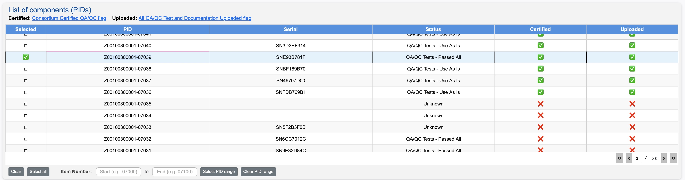{: .image-with-shadow}{: width="100%"}

The 3 statuses, Component Status (Status), Consortium Certified QA/QC flag (Certified), and All QA/QC Test and Documentation Uploaded flag (Uploaded
should all be visible for every PID. This is what the HWDB currently has.\
Select a PID that you are to write an ES about.

Once you select a PID, a list of the corresponding sub-components, if any, is displayed as shown below.

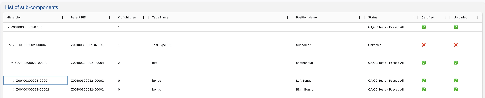{: .image-with-shadow}{: width="100%"}

Again, the 3 statuses for each of these components can be seen (make sure to expand each of them).

      

[back to top](#contents)

## Executive Summary

Below the sub-component list, the main contents of Executive Summary can be found as shown below.

### Checklist

We first see the Consortium name, the brief description, and the checklist.

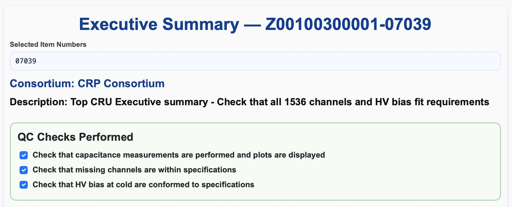{: .image-with-shadow}{: width="70%"}

The list should be checked by each signee.

### The 3 statuses

Right below the checklist section, there are 3 status pane, where each signee can check/update
the 3 statuses.

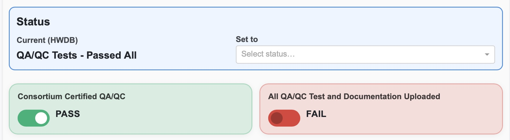{: .image-with-shadow}{: width="70%"}

### Reference URLs

After the status pane, we have the Reference URL section.

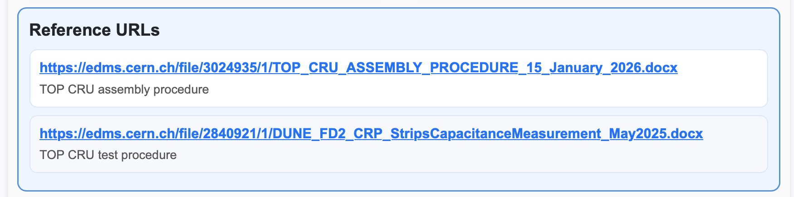{: .image-with-shadow}{: width="70%"}

### Sign-off by

We then have the sign-off section.\
This screenshot was generated by the config file we showed above as an example.
So, remember that "TOP CRP HWDB Liaison" and "Grenoble Factory Lead" must sign first before "Consortium Lead" signs.
Each signee must click **Upload this signature" button in order to record in the HWDB.

All assigned signees must finish signing before the **Generate PDF & Upload to HWDB** button becomes active.
(This screenshot was generated after the 3 assigned signees signed)

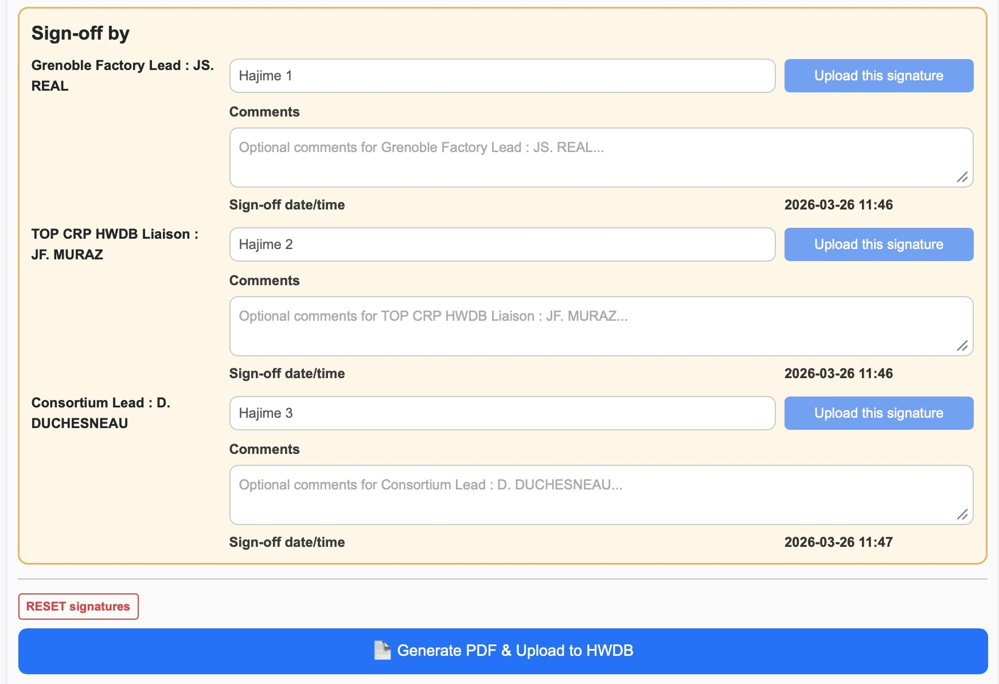{: .image-with-shadow}{: width="70%"}

#### RESET signatures

Notice that there is the **RESET signatures** button in the above screenshot.
Right, this is to reset all recorded signatures in the HWDB and redo from scratch.

For instance, in our example, while both "TOP CRP HWDB Liaison" and "Grenoble Factory Lead" thought the component was in good status,
"Consortium Lead" might find something odd. He could then click this button and ask the two persons to review/sign again.

We wouldn't want anybody to be able to reset here.\
It respects **roles** that is set to the signee with **the lowest integer rank** (in our example, it would be "Consortium Lead").

      

[back to top](#contents)

## Plots

Below we show three example plots that are included in the summary based on the example config file.

   
This is an image file (not plotted):
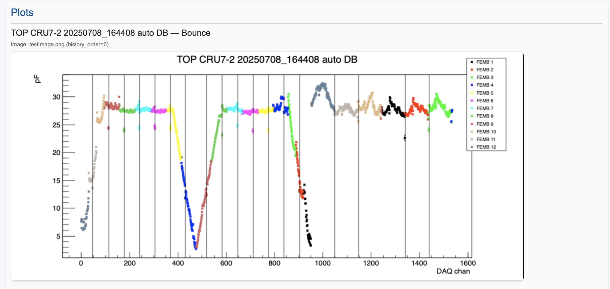{: .image-with-shadow}{: width="100%"}

   

A binned 1D histogram:
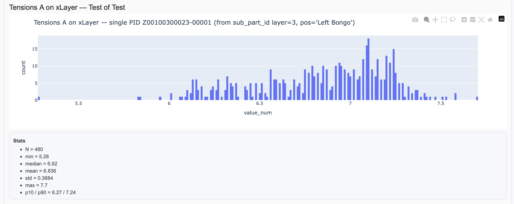{: .image-with-shadow}{: width="100%"}

   

A 2D scatter plot:
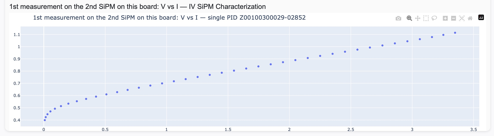{: .image-with-shadow}{: width="100%"}

      

[back to top](#contents)

## Generated PDF file

And here is an example of the generated file based on the example of the config file:
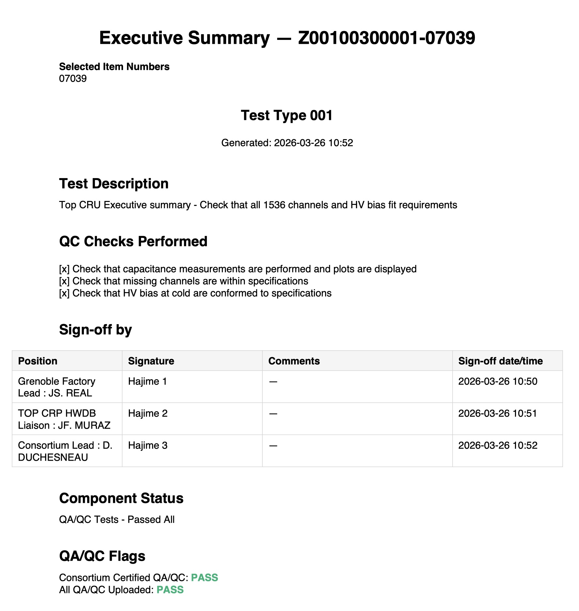{: .image-with-shadow}{: width="70%"}
We are showing only its 1st page here.
Sections of Reference URLs, Plots, and Table of sub-components are followed.

The generated PDF file is saved in the specified **working directory** locally and also uploaded
to the **IMAGES** section of the corresponding PID.

      

[back to top](#contents)

## DEFAULT mode

If you toggle into the **DEFAULT** mode and click the green **Sync to the HWDB** button,
the following will be identical to the **DETAIL** mode:

- You still get to see the PID table, in which you still need to select a PID that you write a summary about.
- You will see a list of the corresponding sub-components, if there is any.

However, you will **NOT** see sections of Checklist, Reference URLs, and Plots.\
Instead, you will see something like below.
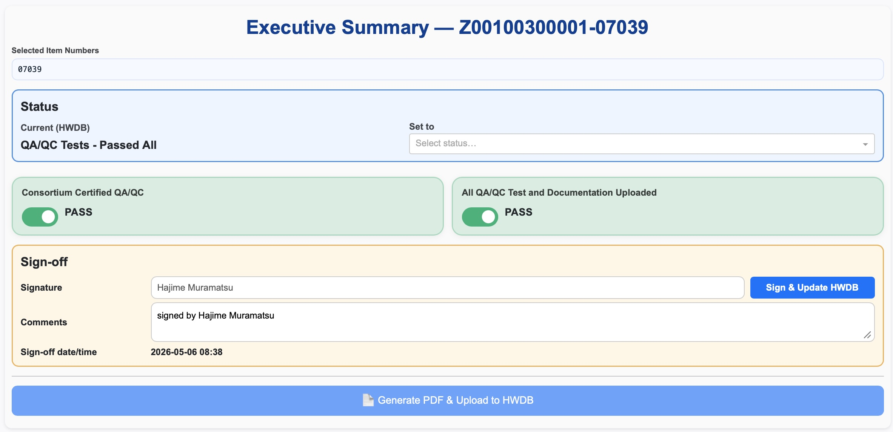{: .image-with-shadow}{: width="100%"}

In this mode (short, brief version), you just set (check/update) the 3 statuses.

In the Sign-off section, the **Signature** field is not editable and is fixed to the user's name
who is accessing to the HWDB.\
If you like, you could add things like "signing on behalf of ..." in the Comments field.

Still, once the sole signature is uploaded, the **Generate PDF & Upload HWDB** button becomes active.

   

[back to top](#contents)



