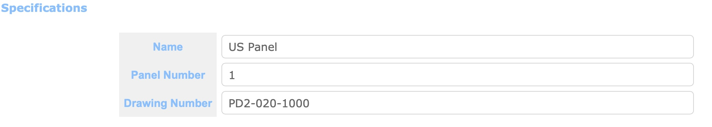
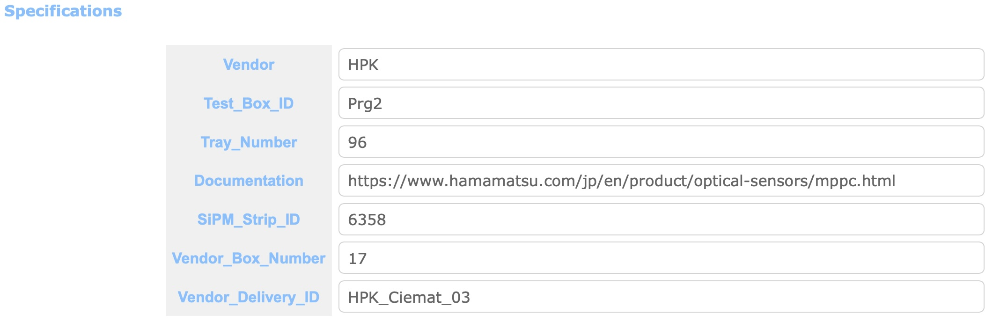
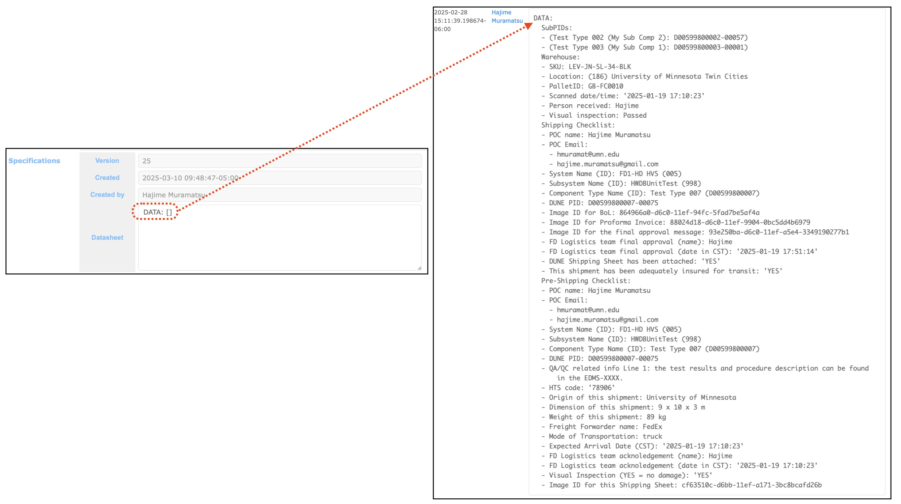
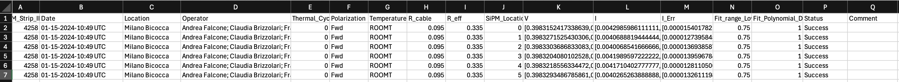
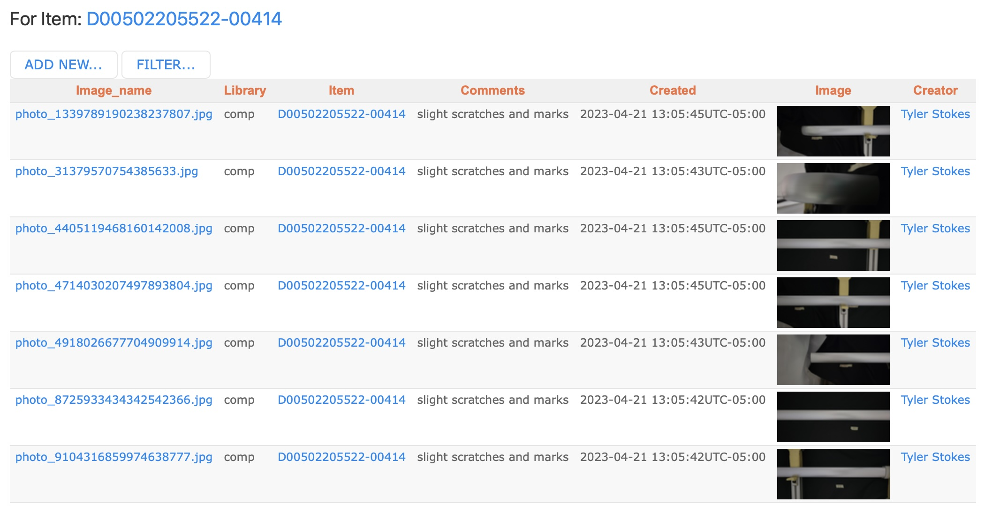
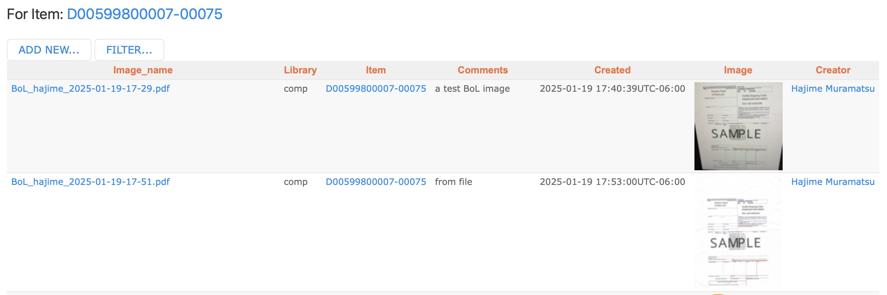
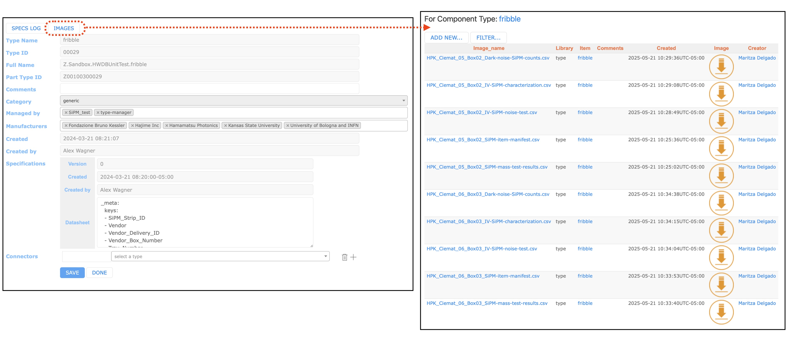
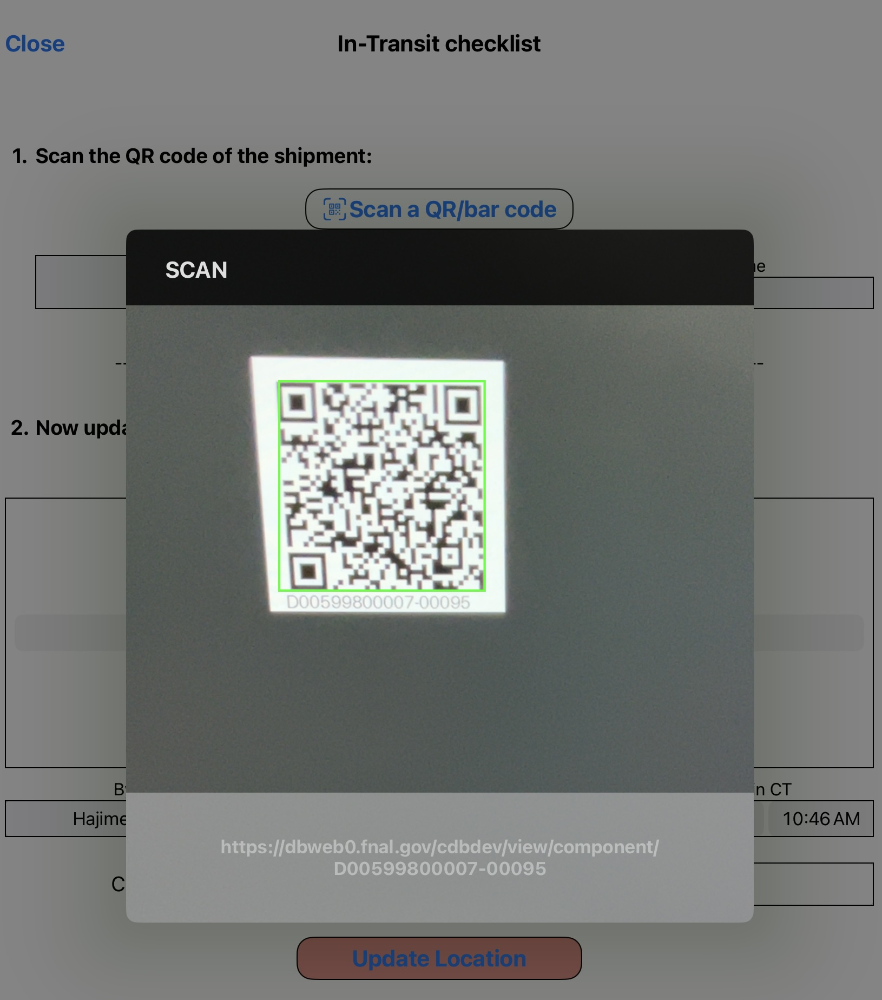

### This page describes examples of various practical use-cases of the HWDB.

## Contents
>
>|-------------------------------------+------------------|
>| Section                             | Description      |
>|-------------------------------------+------------------|
>| [Creating new Subsystems and/or Component Types](#creating-new-subsystems-andor-component-types) | An example of how one could create and define Subsystems and Types  |
>|-------------------------------------+------------------|
>| [Hierarchical structure in the HWDB](#hierarchical-structure-in-the-hwdb) |  An example of how one could create a hierarchy with PIDs in the HWDB |
>|-------------------------------------+------------------|
>| &emsp; [Shipping container and sub-component links](#shipping-container-and-sub-component-links) | The reason why we link shipping items to its shipping box |
>|-------------------------------------+------------------|
>| [List of Items](#list-of-items) |  A table that you can glance various info of components at once |
>|-------------------------------------+------------------|
>| [Item Filtering](#item-filtering) |  How to list components with various constraints |
>|-------------------------------------+------------------|
>| &emsp; [Syntax](#syntax) | Syntax of the filtering in the HWDB |
>|-------------------------------------+------------------|
>| &emsp; [Filtering with Specifications](#filtering-with-specifications) | An example of filtering data stored in Item Specifications  |
>|-------------------------------------+------------------|
>| &emsp; [Filtering with Test Data](#filtering-with-test-data) | An example of filtering data stored in Test Specifications  |
>|-------------------------------------+------------------|
>| &emsp; [Via the REST API](#via-the-rest-api) | Examples of filtering data via the REST API  |
>|-------------------------------------+------------------|
>| [Storing DATA (Item/Test Specs/Images/csv files)](#storing-data-itemtest-specsimagescsv-files) |   |
>|-------------------------------------+------------------|
>| &emsp; [Item Specifications](#item-specifications) | Examples of storing data in Item Specifications  |
>|-------------------------------------+------------------|
>| &emsp; [An empty Type definition](#an-empty-type-definition) |  Storing data without defining DB schema |
>|-------------------------------------+------------------|
>| &emsp; [Test Specifications](#test-specifications) | Examples of storing data in Test Specifications  |
>|-------------------------------------+------------------|
>| &emsp; [Images (csv files as well)](#images-csv-files-as-well) |  Examples of storing images |
>|-------------------------------------+------------------|
>| [Shipping](#shipping) |   |
>|-------------------------------------+------------------|
>| &emsp; [Updating location of a component in the HWDB](#updating-location-of-a-component-in-the-hwdb) | How one could easily update location info of a component in the HWDB by scanning a QR-code |
>|-------------------------------------+------------------|
>| &emsp; [Generating label sheets](#generating-label-sheets) | How one could easily generate massive bar/QR-code labels based on info stored in the HWDB |
>|-------------------------------------+------------------|
{: .checklist}

 

## Creating new Subsystems and/or Component Types

Before starting to enter data to the HWDB, perhaps the very first thing one would need to do is to
create Subsystems and Component Types for the needs of your consortium. A System (its ID and name) should be already provided
to your consortium, but each consortium has the freedom to define Subsystems and Component Types.

Below, we show how the HVS has done for the proto-DUNE II project as an example.
We don't show the all defined Subsystems and Component Types, of couse, due to the limited space (those *detached* bars infer that
there are existing other objects).

{: .image-with-shadow}{: width="80%"}

How exactly your Subsystems and Component Types are defined might also depend on how you like to have
your PID hiearachical structure in the end as shown in [the next subsection]({{ page.root }}/hwdbusage/index.html#hierarchical-structure-in-the-hwdb) as well. Notice that at the bottom of the above diagram, we reach the *PID* level, where we define a PID (D00501390003-00001: PD2 Array HV Bus)
which is the **only** real data entry in the HWDB within the above diagram and that *happens* to be sitting at the top
of the diagram shown in [the next subsection]({{ page.root }}/hwdbusage/index.html#hierarchical-structure-in-the-hwdb).

      

As we describe more in detail in the [session 8]({{ page.root }}/08-Inserting-Component-Types/index.html),
a user needs the **Architect** privilege to create Subsystems and/or Component Types. 

If you are one of the Architects, you could prepare a spreadsheet like the one shown below.
{: .image-with-shadow}{: width="100%"}
This will create 9 new Component Types under the same Subsystem (ID = 998, Name = HWDBUnitTest).
You could have provided different Subsystems, of course. In this example, for simplicity, we stick with a single Subsystem.

**Cautions:**

For those names (not IDs) entered in your sheet, there are certain characters that you cannot use: comma, period, quotation marks, underscore or the percent sign.

>## **Cautions:**
> For those names (not IDs) entered in your sheet, there are certain characters that you are not allowed to use:
> - comma (,)
> - period (.)
> - quotation marks ('' and "")
> - underscore (_)
> - percent sign (%)
{: .prereq}
Once you have your spreadsheet ready, the rest of the procedure to create them is trivial by using the WEB-UI
as described in the [session 8]({{ page.root }}/08-Inserting-Component-Types/index.html).

[back to top](#contents)

   

## Hierarchical structure in the HWDB

As the HWDB allows us to make links among stored components, we can create a hierarchical structure in the DB, which gives
a clearer view of the entire (sub) detector view, thus, also allows us to easily trace down individual components, when need to.

We describe the basics of how to make these links via the [WEB-UI]({{ page.root }}/04-Data-Management-WEB-UI/index.html#adding-subcomponents) as well as through the [RES API]({{ page.root }}/05-Data-Management-REST-API/index.html#linking-subcomponents).
There is one important rule that we should always remember when we create these links:
>## Rule:
> - we can link to **multiple daughters**, but
> - we are allowed to link to only **a single parent**.
{: .prereq}

With this in mind, we would like to go through an actual example that the HVS consortium has created
for the proto-DUNE II project in the development version of the HWDB in this section.

We show the hierarchy below. Each box represents a stored component (thus, the corresponding **PID** is also shown,
along with its **Component Type Name**), except those with numbers with parentheses.
We do not list the all stored components due to the obvious limited space. The numbers with parentheses show
how many number of the corresponding components are stored in the HWDB (thus, their Item Numbers are all XXXXX).

The direction of the arrows in this picture always points from a daughter(s) to its parent.

There are arrows that point to parents, but are not connected to daughters. They are actually connected to daughters in the HWDB,
but omit to list them, again due to the limited space.

We like to also remind that, because each of these boxes correspond to a unique PID, the following information
can be stored for each of them:
- Item Specifications
- Test Specifications
- Location
- Images, including csv-formated files

{: .image-with-shadow}{: width="100%"}

Perhaps, the very first thing to consider to start to map out a hierarchy is to decide what the most
basic Component Types would be that allow you to trace down through the hierarchy and physically replace them, if necessary in the future.

In the above picture, they will be likes of Spacers, Termination boards, Mini Resistor Board, etc.
Of course, if Mini Resistor Boards are permanently mounted on a CPA Panel, the only replaceable component would be a CPA Panel in that case.

Each *raw* components are assigned with unique PIDs by the HWDB as they are entered in the DB.
Those raw components would be then assembled into an module, which gets its own PID assigned.
For instance, a CPA Plane US (PID = D00502004501-00005) consists of a pair of CPA Panels (PIDs = D00502001000-00007 and D00502002000-00007).

These modules then eventually form the TPC HV Assembly as shown above, which could then be further linked with other sub-detector components
and form the proto-DUNE II detector in the end.

In the WEB-UI, one can go up-down through these hierarchy structures easily with the provided hyper-links (or with the [iPad app]({{ page.root }}/06-Using-iPad-App/index.html#pid-display)). Try to go through some of them at the [Development version of the HWDB](https://dbweb0.fnal.gov/cdb/login/sso). At [https://pd2-hvs.tiiny.site](https://pd2-hvs.tiiny.site), we also provide the complete list of stored components that are employed to form the TPC HV Assembly as can be seen below.
{: .image-with-shadow}{: width="40%"}

[back to top](#contents)
   

### Shipping container and sub-component links

As we show in the [DUNE Shipping Procedure]({{ page.root }}/shippingprocedure/index.html) section,
sub-component links are created while filling the
[Packing checklist]({{ page.root }}/shippingprocedure/index.html#packing-checklist) and
those links are removed as the
[Receiving checklist]({{ page.root }}/shippingprocedure/index.html#receiving-checklist) filled out.
In this subsection, we describe why we need to create and remove these links as they are shipped
and how this hierarchical structure helps to represent a location of an assembled object.

We take the FD-1 HD HVS CPA setup as an example.

First notice that there is a slight change as seen below, compared to the proto-DUNE II setup.
A CPA Panel is not directly connected to Mini Resistor Boards. But instead,
A CPA Panel consists of 6 CPA Units. In DUNE, **a CPA Unit is the smallest component they like to track in the HWDB**.

And they ship these CPA Units (circled by a blue-dotted line) to SURF.

{: .image-with-shadow}{: width="60%"}

 

The DUNE CPA container holds 12 CPA Units, which allow them to assemble a pair of CPA Panels.

 

As can be seen below, those 12 CPA Units are first linked to a container as the [Packing checklist]({{ page.root }}/shippingprocedure/index.html#packing-checklist) are being filled out.
Notice that CPA Units cannot be linked to a CPA Planel at this point as they are already linked to
their parent, the CPA Shipping Crate. They would allow to be linked to a CPA Panel only when the [Receiving checklist]({{ page.root }}/shippingprocedure/index.html#receiving-checklist) is properly filled out.

These steps protect users from making links to assembled object while components are being shipped
and force to fill out these checklists.

{: .image-with-shadow}{: width="100%"}

As you fill out the [Receiving checklist]({{ page.root }}/shippingprocedure/index.html#receiving-checklist),
locations of individual linked components (the 12 CPA Units in this case) are also updated in the HWDB.
However, when a CPA Panel is assembled, only the location of the CPA Panel needs to be updated.

>## Rule:
>**Location information of a component that is at the top level in its hierarchy should be respected most**.
{: .prereq}

 

[back to top](#contents)
   

## List of Items

Item list that the WEB-UI of the HWDB provides is very useful, allows you to glance various information of individual components,
as can be seen below.

Sorry for the small fonts. You should try to see it with your browser. It can be easily reached by clicking **Items** from its sidemenu
as soon as you login there.

>It provides:
> - Type Name
> - PID
> - Serial #
> - Manufacturer
> - Person's name who created the component
> - Date/time when the component was initially (not edited last time)
> - Its latest location
> - Country of Origin
> - Responsible Institution
> - Component Status
> - A link to Specifications (not implemented, yet)
> - A link to Test Log (not implemented, yet)
> - Comments on this component entry
{: .callout}

{: .image-with-shadow}{: width="100%"}

  
By clicking individual PID listed in the **Part_id** column, you can see information about that component more in details.
For instance, once you reach a particular component page, clicking **LOCATION LOG** shows a history of locations of that component as shown below.

{: .image-with-shadow}{: width="75%"}

[back to top](#contents)
   

## Item Filtering

The HWDB also provides a filtering functionality on the Item list mentioned above.
In this subsection, we repeat what we describe in the [WEB-UI]({{ page.root }}/04-Data-Management-WEB-UI/index.html#item-filtering)
session as well as in the [REST API]({{ page.root }}/05-Data-Management-REST-API/index.html#item-filtering) session.

  

You can search for Items (Components) based on the usual fields such as Component_type, Part_id, Serial_number, and Creator. In addition, you can filter by the fields as shown below.

You can filter by **status**: any, available, temporarily not available, permanantly not available.
{: width="70%"}

You can also filter by **Location**, **Manufacturer**, and **Country of Origin**. Each of which are case **in**sensitive and need not be completely spelled out.
{: width="90%"} 

A more advanced discussion of filtering requires use of specific syntax.

### Syntax

There is certain syntax that can be used when you are refining your search using filter fields. The following symbols can be utilized with **numbers** in filter fields. 

>|------+------|
>| symbol | definition|
>|------+------|
>| == | equal to|
>|------+------|
>| != | not equal to|
>|------+------|
>| < | less than|
>|------+------|
>| <= | less than or equal to|
>|------+------|
>| > | greater than|
>|------+------|
>| >= | greater than or equal to|
>|------+------|

The following symbols can be utilized with **strings** and **substrings** in filter fields.

>|------+------|
>| symbol | definition|
>|------+------|
>| == | equal to|
>|------+------|
>| != | not equal to|
>|------+------|
>| ~ | case sensitive regex search|
>|------+------|
>| ~* | case insensitive regex search|
>|------+------|

[back to top](#contents)

### Filtering with Specifications

You can also filter based on item **Specifications**. Suppose there exists an item with the following specifictations:
~~~
"specifications":[
  {
    "Documentation": "https://something.com/something"
    "SiPM_Strip_ID": 4548
    "Test_Box_ID": "Mib3"
    "Tray_Number": 20
    "Vendor_box_Number": 14,
    "Vendor_Delivery_ID": "HPK_Ciemat_03"
    "_meta":{
      "_column_order:[
        "Vendor_Delivery_ID",
        "Vendor_box_Number",
        "SiPM_Strip_ID",
        "Test_Box_ID",
        "Documentation"
      ]
    }
  }
]
~~~
{: .output}
Then you can apply the following filters to search the item. The syntax used in the filtering field is explained in depth in the following section. 
{: width="90%"} 

   

Consider an item with the following Specifications.

~~~
"specifications":[
  {
    "Vendor_Delivery_ID": "HPK_Ciemat_03"
    "DATA": {
      "Drawing Number": "DFD-21-2101",
      "Label Code": "12345",
      "Name": "Main I-Beam"
    }
  }
]
~~~
{: .output}

Then, 
- Vendor_Delivery_ID~HPK_Ciemat_
- Vendor_Delivery_ID~*HPK_CiemaT_
- Name==Main I-Beam
- Label Code==12345

all return this item (as well as others if possible). However,
- Vendor_Delivery_ID~HPK_CiemaT_

would not return any item as **~** is case sensitive.

[back to top](#contents)

   

### Filtering with Test Data

You can also filter using Test_data in the same way as Specifications. Suppose you have an item with the following test data:

~~~
"test_data":{
  "Test Results": [
    {
      "Location": "Minnesota",
      "Operator": "Scientist Red"; "Scientist Blue",
      "SiPM":[
        {
          "Comment":"",
          "List1":[
            1.77734e-06
            6.90008e-07
            -2.44907e-06
            5.33429e-06
          ]
          "List2":[
            "H_RED"
            "Z_yellow"
            "U_green"
            "J_BLUE"
          ]
        }
      ]
    }
  ]
}
~~~
{: .output}
Then,
- List1[0]==1.77734e-06
- List1[1]>6.9e-07
- List2[3]~*j_blue
- List[*]==H_RED

all return the intended item.

[back to top](#contents)
   

### Via the REST API

One can **GET** items using specification and test data as seen in Item Filtering in the WEB UI section. The following are the templates for the bash commands.

~~~
/api/v1/components?specs=<XXX>
/api/v1/components?testdata=<XXX>
~~~
{: .language-bash}

The following are a list of specific examples for get via specifications:

~~~
/api/v1/components?specs=SiPM_Strip_ID==4548 | jq.data[].part_id
/api/v1/components?specs=Test_Box_ID==Mib3 | jq.data[].part_id
/api/v1/components?specs=Label%20Code==12345| jq.data[].part_id
~~~
{: .language-bash}

The following is a list of specific examples for get via test data:

~~~
/api/v1/components?testdata=RPFSSRes%20RP%20Drawing%20N==DFD-20-A503 | jq.data[].part_id
/api/v1/components?testdata=I[0]==1.2604860486048603e-06 | jq.data[].part_id
~~~
{: .language-bash}

[back to top](#contents)
   

## Storing DATA (Item/Test Specs/Images/csv files)

### Item Specifications

One could store data in an Item Specifications that is unique to that particular Item.
If the data is common for a given Component Type, it might be better to provide the data in the Type definition as a initial value.

One example of such data would be a mechanical drawing. One could provide a drawing # or a link to its documentation
as shown below.

A drawing # in Item Specs             |  A link to an external source in Item Specs
:-------------------------:|:-------------------------:
{: .image-with-shadow}{: width="100%"} | {: .image-with-shadow}{: width="100%"}

[back to top](#contents)
   

### An empty Type definition

As described in the [session 3]({{ page.root }}/03-Setting-up-Types/index.html), one would normally have to
predefine Type definition (your DB schema) before entring data to your Item or Test Specifications.

One could, however, provide an empty array (e.g., DATA[]) or blob (e.g., DATA{}) in a Type defintion as shown below.
When you do this, you can insert any form within that empty array (or blob) when you create (or edit) the corresponding Items.
As it accepts any form, be careful to use this method as you don't have a control of its DB scheme at that point.
On the other hand, this might be useful when/if you, for instance, need to migrate a chunk of data (JSON) from a DB like MongoDB
or use a client-side-app, which constraints its DB scheme by itself, to post data.

{: .image-with-shadow}{: width="100%"}

[back to top](#contents)
   

### Test Specifications

One can similarly store data in Test Specifications as we describe in
the [session 4]({{ page.root }}/04-Data-Management-WEB-UI/index.html) 
and the [session 5]({{ page.root }}/05-Data-Management-REST-API/index.html).
And one could store data with more complex structure like the one shown below.

  ~~~
  "Serial Number": "HA-MURAMATSU-00003",
  "Operator"     : "Hajime",
  "Location"     : "Minneapolis",
  "PSU"          : [ 
                       "PSU Serial Number": "2PH30-230",
                       "Visual Inspection": "Passed",
                       "PSU Manufacturer" : "TOSHIBA",
                       "PSU Test 1"       : "Failed",
                       "PSU Test 2"       : "Passed" 
  				   ],
  "Fans"         : [ 
                       "Fan Serial Number": "W0909101451",
                       "Fan Manufacturer" : "Champion Lab",
                       "Fan Test 1"       : "Passed",
                       "Fan Test 2"       : "Failed" 
  				   ]
  ~~~
  {: .language-json}
With the [Python HWDB Upload Tool]({{ page.root }}/07-Using-Python-Upload-Tool/index.html), one can easily define
such DB schema and upload the data. (In fact, the above is one of the examples we provide [there]({{ page.root }}/07-Using-Python-Upload-Tool/index.html#lesson-6-do-them-all-at-once))

Test results on SiPM boards of the PDS have been also uploaded via the [Python HWDB Upload Tool]({{ page.root }}/07-Using-Python-Upload-Tool/index.html),
which takes a spreadsheet like the one shown below. They store a SiPM board for a given PID, where six SiPMs reside on a board.
Thus, it forms a similar nested sture as shown above.
It is also possible to define/store arrays in each cells as can be seen in the columns V, I, and I_Err of the spreadsheet.

{: .image-with-shadow}{: width="100%"}

[back to top](#contents)
   

### Images (csv files as well)

For a given Item, one can store images (for more details, please refer to [Adding Images]({{ page.root }}/04-Data-Management-WEB-UI/index.html#adding-images)). This functionality should be useful to store photos or pictures
that are needed for your QC related tests/analyses, for instance.
One could also store images that are related to shippings, such as scanned bill of lading or shipping labels under
a particular PID that is assigned to a shipping box. You can also store documentations (pdf format) as well.

High Res. pictures of Bent Al. Profiles             |  Photos and scanned images of bill of ladings
:-------------------------:|:-------------------------:
{: .image-with-shadow}{: width="100%"} | {: .image-with-shadow}{: width="100%"}

>## **Restrictions on image files stored in the HWDB:**
> - 50 MB per each file.
> - Excel files are **not** allowed (csv formatted files **are** allowed)
{: .prereq}

      

Sometimes you might also like to store your spreadsheets that you use to upload your data to the HWDB.
But as you likely upload to each Items and your sheet would likely hold data that corresponds to multiple Items,
it probably wouldn't make much sense to upload your sheet(s) to each Items.

In such case, one could store your sheets (in csv format, of course) for a given **Component Type**
as shown below.

{: .image-with-shadow}{: width="100%"}

[back to top](#contents)
   

## Shipping

There is a new [Shipping Procedure]({{ page.root }}/shippingprocedure/index.html) page, which is
unfortunately still incomplete as we are currently finalizing the procedure itself.
We will update the page as soon as we are done with the procedure.

Just briefly, the procedure consists of 4 checklists:
- [Packing checklist]({{ page.root }}/shippingprocedure/index.html#packing-checklist)
- Pre-shipping checklist
- Shipping checklist
- [Receiving checklist]({{ page.root }}/shippingprocedure/index.html#receiving-checklist)

These checklists enforce shippers to take the proper required steps to ship materials to the warehouse in SD and eventually to SURF.

### Updating location of a component in the HWDB

By filling [In-Transit checklist]({{ page.root }}/shippingprocedure/index.html#in-transit-checklist), one can easily update
location information of a component.
And with the [iPad app]({{ page.root }}/06-Using-iPad-App/index.html), to read in the corresponding PID of the component
would be quick/easy, by scanning a QR-code that is attached to its component.

In this subsection, we repeat a part (In-Transit checklist) of what we describe in the
[DUNE Shipping Procedure]({{ page.root }}/shippingprocedure/index.html) session.

   

#### In-Transit checklist - Step 1:

Unless you have continuously worked from the pre-shipping (and/or shipping) checklist, it starts by scanning a QR-code.
Once a QR-code is properly scanned, it should display a list of sub-components, if any, and its location history, if any, as shown below.

After scanning             |  Scanning a QR-code
:-------------------------:|:-------------------------:
{: .image-with-shadow}{: width="100%"} | {: .image-with-shadow}{: width="80%"}

   
#### In-Transit checklist - Step 2:

Here, select a location (usually your current or latest), along with your local time, which is auto-translated into the US Central Time.
Tap **Update Location** button to record the information in the HWDB.

{: .image-with-shadow}{: width="50%"}

[back to top](#contents)
   

### Generating label sheets

With the [Python HWDB Upload Tool]({{ page.root }}/07-Using-Python-Upload-Tool/index.html), one can
easily generate label sheets based on information that is stored in the HWDB.

>As can be seen in the left plot below, it allows you to do the followings:
> - Generate bar- and/or QR-codes
> - Change a paper size
> - Change a label size
> - Change a position and orientation of label
> - Add various texts with different fonts
> - Change orientation of fonts
{: .callout}

The app can take a spreadsheet as an input, where the spreadsheet may contain a list of existing PIDs in the HWDB.
The app then generates label sheets for the provided PIDs.

Now, you could also add the following to each labels, that are stored in the HWDB:
> - Component Type ID and Name
> - PID
> - Serial #
> - Manufacturer
> - Country and Institution
> - Location
> - Component Status
> - Anything stored in Item Specifications
> - Anything stored in Test Specifications
> - and some more...
{: .callout}

For details of how-to, please visit the [Generating bar/QR-code labels]({{ page.root }}/barqrcode/index.html) session.

Various options             |  An example QR-code sheet
:-------------------------:|:-------------------------:
{: .image-with-shadow}{: width="80%"} | {: .image-with-shadow}{: width="76%"}

[back to top](#contents)
   



