### This page describes how to Create a QC checklist using the HWDB Dashboard.

## Contents
>
>|-------------------------------------+------------------|
>| Section                             | Description      |
>|-------------------------------------+------------------|
>| [Using a QC checklist](#using-a-qc-checklist) | Some examples of QC checklists |
>|-------------------------------------+------------------|
>| [Creating a QC checklist](#creating-a-qc-checklist) | How to create QC checklists using the GUI-based editor |
>|-------------------------------------+------------------|
>| &emsp;[CHECKLIST](#checklist) | |
>|-------------------------------------+------------------|
>| &emsp;[SECTION](#section) | |
>|-------------------------------------+------------------|
>| &emsp;[FIELD](#field) | |
>|-------------------------------------+------------------|
>| [Creating a QC checklist based on an existing checklist](#creating-a-qc-checklist-based-on-an-existing-checklist) | Copying a checklist template from an existing one |
>|-------------------------------------+------------------|
{: .checklist}

 

## What is this:

We store various QC test results in the HWDB. It is often helpful for QC testers to have a QC checklist(s) that is dedicated to a specific QC test. It would be even better if the resultant (filled out) checklist could be easily uploaded to the HWDB.

This page describes how to create such QC checklist using the HWDB Dashboard.

In the first half of this page, we show some examples of such QC checklists.\
In the second half, we dive into the how-to based on the **GUI-based QC checklist editor**.

## Using a QC checklist

To start to use a checklist, from the corresponding Type View, find the **Checklisrs** row as shown below.
In there, select a desired checklist.
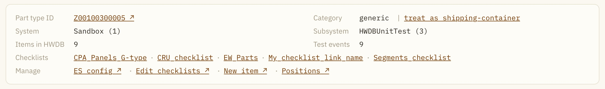{: .image-with-shadow}{: width="85%"}
In the above example screenshot, we see that the following checklists are available for this Type (Z00100300005):
- CPA_Panels_G-type
- CRU_checklist
- EW_Parts
- My_checklist_link_name
- Segments_checklist

  

Let's select (click/tap) **EW_Parts**. You should be then seeing something like the screenshot below:
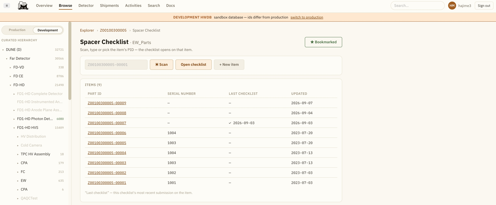{: .image-with-shadow}{: width="100%"}
We see the title of this checklist, **Spacer Checklist**, along with the list of the available PIDs under this Type ID, Z00100300005.

3 ways to proceed:
- Simply by selecting a PID from the list.
- By scanning a QR-code, if/when available, by clicking the **Scan** button.
- By creating a new PID by clicking **+New Item** button.

 

Also, notice that at the top-right corner, we see **Bookmarked** button in green. This is because this checklist has been bookmarked.\
One can bookmark any checklist by clicking the button.\
A link to the bookmarked checklist then shows up in your **User Profile** page, which can be reached by clicking
the user icon seen at the top-right corner in the above example screenshot (in this case, it is **HM hajime3**).

 

In a user profile page, one should then see a list of bookmarked checklists similar to the one shown below:
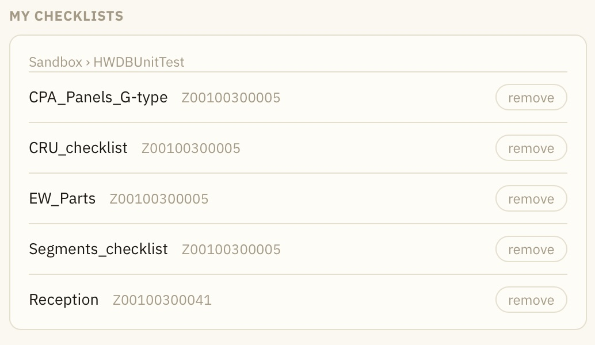{: .image-with-shadow}{: width="50%"}
Thus, one (e.g, QC tester!) could simply bookmark this URL to reach various QC checklists easily:\
[https://www.phy.bnl.gov/twister/cets/hw/dev/profile/](https://www.phy.bnl.gov/twister/cets/hw/dev/profile/)

 

Now, going back to the list of PIDs for **Spacer Checklist**, let's just simply select one of the already available PIDs,
Z00100300005-00009. You should be seeing a checklist like the one shown below:
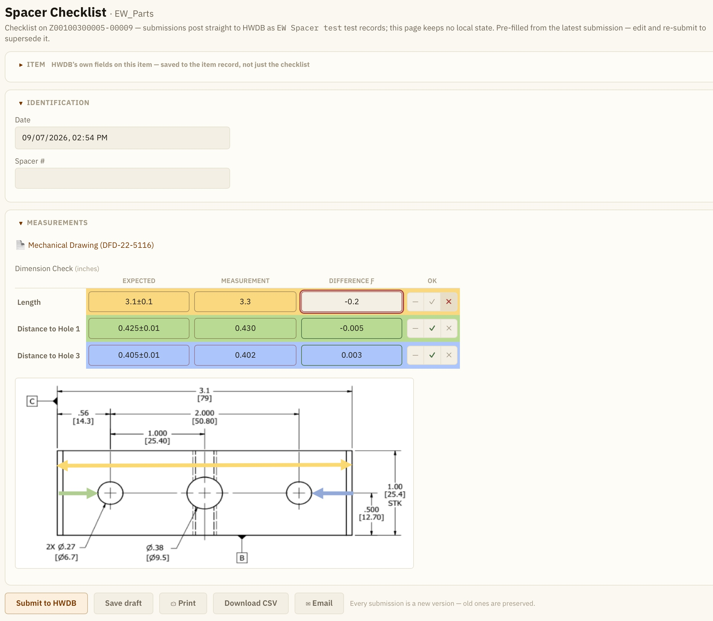{: .image-with-shadow}{: width="85%"}
Multiple types of fields are there (e.g., Date, a free text field), along with a link to a mechanical drawing and a table.\
Background colors of a table can be specified, which sometimes helpful when a reference image itself has colors.\
Each columns of a table can also have simple algebraic relations, just like a typical spreadsheet.\
One can also specify a range to tolerence. (When it is outside of the range, the border color of the cell becomes red)

Notice that we also have a link to, in this case a mechanical drawing (DFD-22-5116).\
Clicking the link opens a **pinch-able** image viewer as shown below:
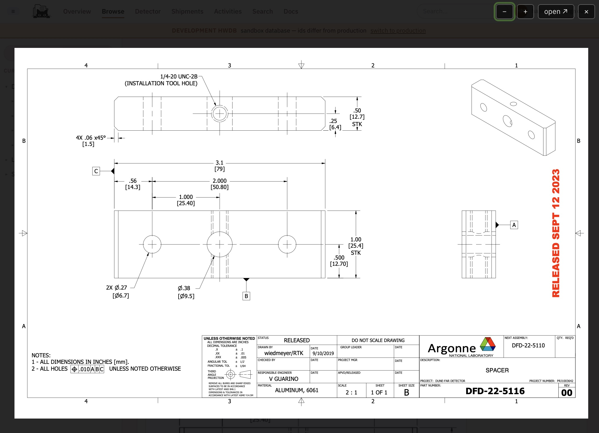{: .image-with-shadow}{: width="50%"}

   
We show another example of checklist below.\
Here, you can see buttons that initiate photo sessions that allows to take photos.
Once taken, image files would be stored in the **IMAGES** section under the corresponding PID in the HWDB.

In the SUB-COMPONENTS section, one can **Scan** a QR-code to read-in a PID, or **Pick** a PID from a list of its available PIDs.
These PIDs of sub-components will be then linked to the main PID (e.g., Z00100300005-00009).

Within the same SUB-COMPONENTS section, we also see a **clickable image**, in which user can click/tap a certain location of the image,
which invokes a scanning session to scan-in a (sub-component) PID. The scanned PID then shows up in the corresponding PID field below.
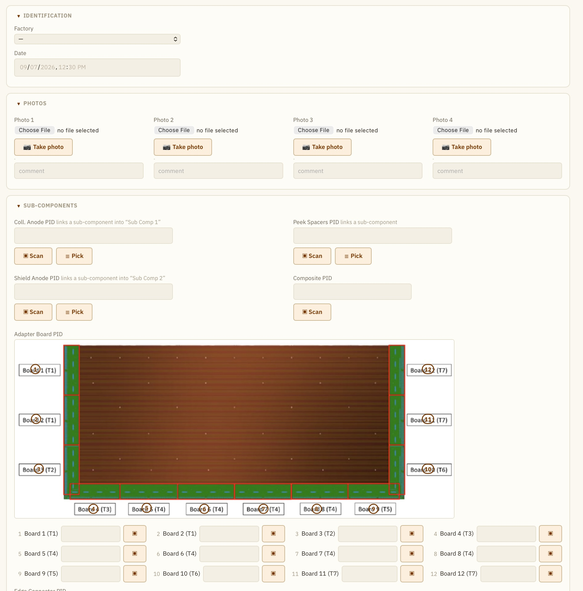{: .image-with-shadow}{: width="85%"}

   

In another example shown below, we can see buttons to;
- Submit HWDB
- Save draft (this saves the contents within the Dashboard without actually uploading to the HWDB)
- Print
- Download CSV
- Email
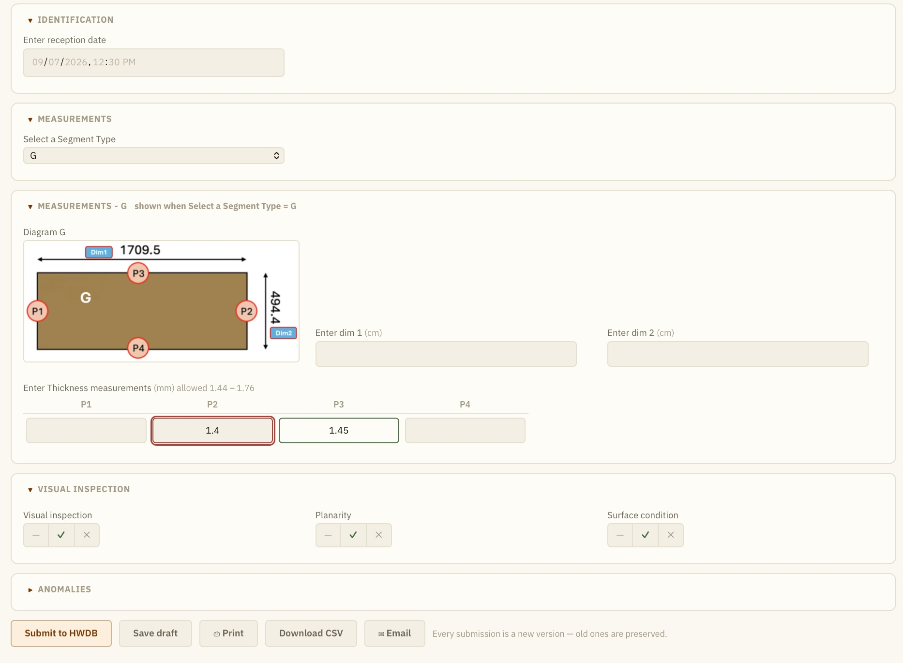{: .image-with-shadow}{: width="85%"}

   

In another example shown below, we see various selectors, checkboxes, and fields to specify the **default** fields in the Item View of the HWDB.\
In this checklist, we can also see a link to another existing checklist, **CRU_checklist**.
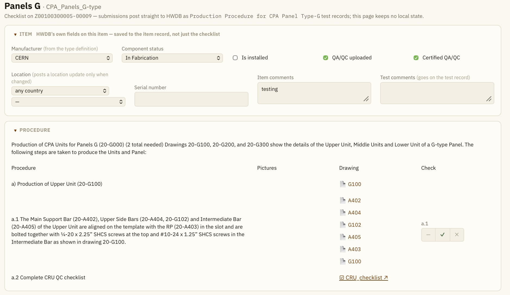{: .image-with-shadow}{: width="100%"}

   

The HWDB Dashboard auto-adjusts its layout based on screensize.
E.g., one can fill out checklists on mobile devices.

We show example screenshots of two checklists below:

iPhone             |  iPad
:-------------------------:|:-------------------------:
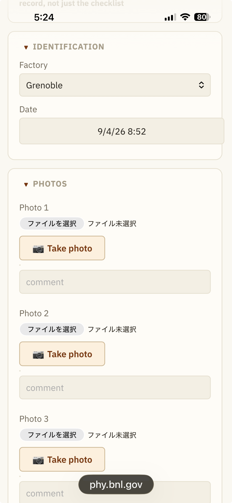{: .image-with-shadow}{: width="100%"}|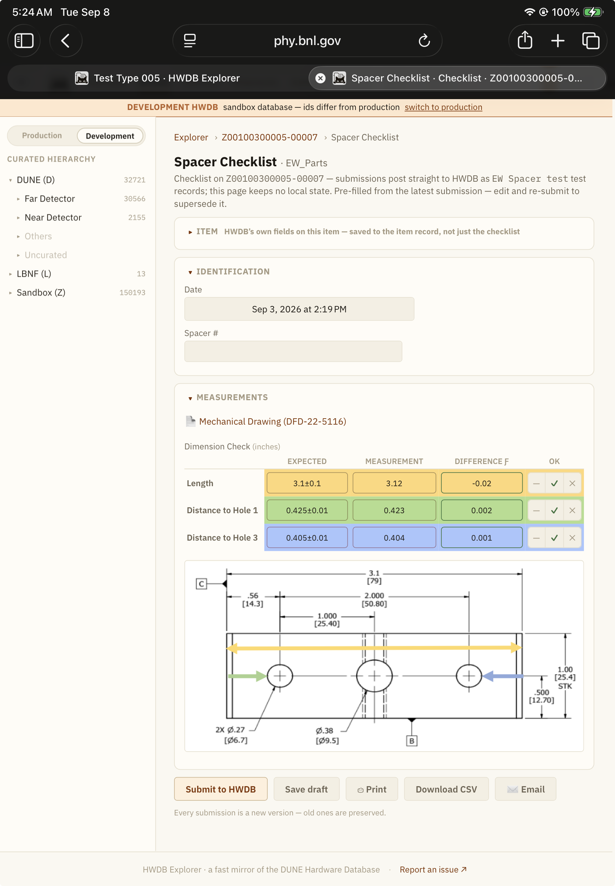{: .image-with-shadow}{: width="100%"}

   
Let's now see how we could create these checklists using the GUI-based editor.

      

[back to top](#contents)

## Creating a QC checklist

To start to create a new checklist (or edit an existing one), again from the corresponding Type View, find the **Manage** row
as shown below.
In there, click **Edit checklists**.
{: .image-with-shadow}{: width="85%"}

  

Once click **Edit checklists**, you should see a screen like the one shown below:
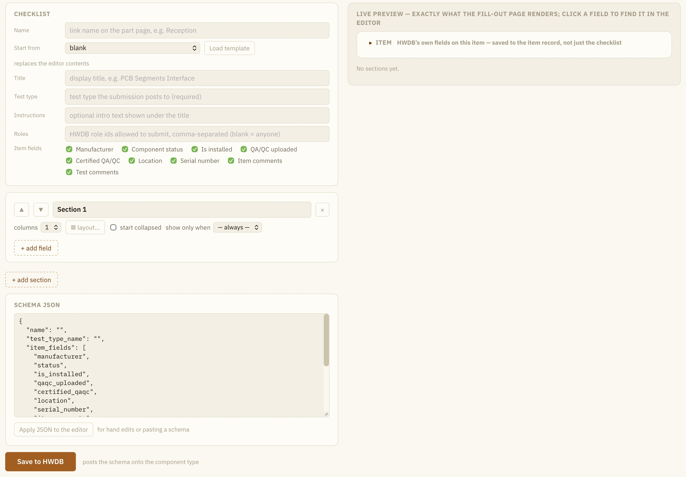{: .image-with-shadow}{: width="100%"}

As you can see, we have the editor on the left column and the live preview on the right.

### CHECKLIST

The CHEKLIST pane sist at the very top of the editor column.
This is where you define checklist name, the corresponding Type ID and Test Type name and others.
We'll go through each of them below:

Editor             |  Live Preview
:-------------------------:|:-------------------------:
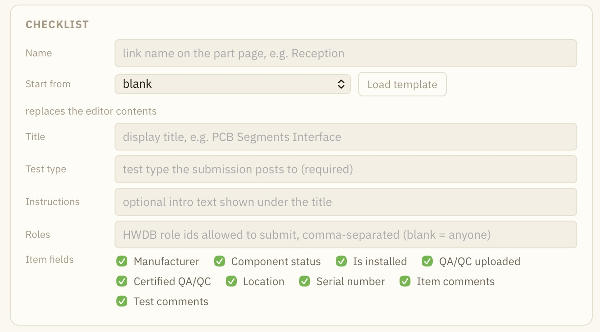{: .image-with-shadow}{: width="100%"}|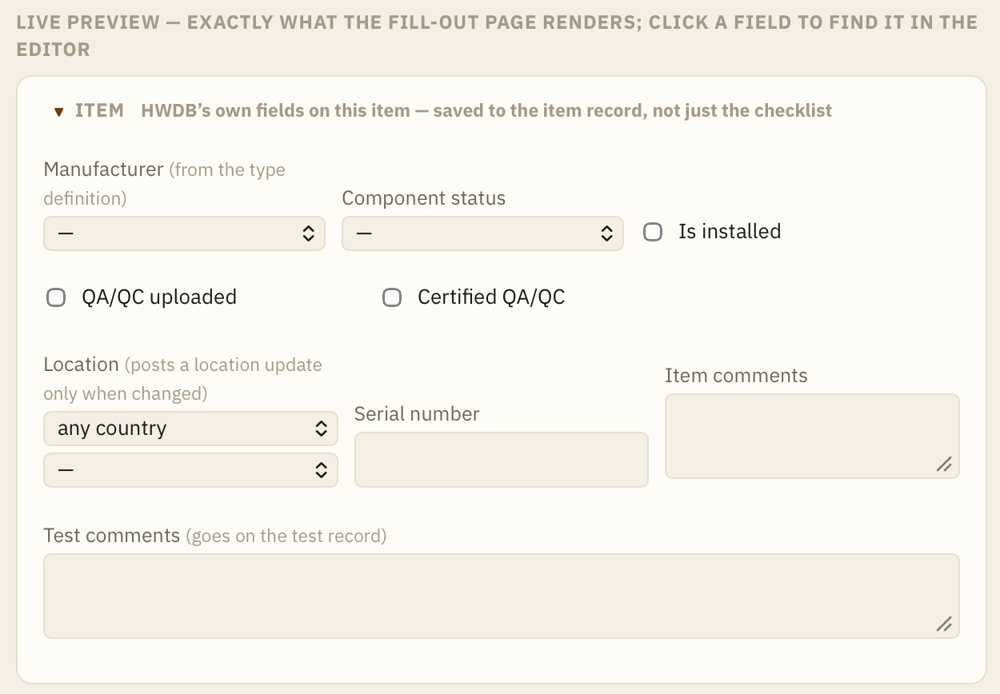{: .image-with-shadow}{: width="100%"}

- **Name:** This is the name to be used within the Dashboard. E.g., the link to this checklist or when you reference to this checklist from another checklist.
- **Start from:** One could select an existing example to start to create a checklist. If you don't see an example you like, you could copy your existing checklist as a template. We'll describe how to do this in a later section.
- **Title:** This will be the title of your checklist.
- **Test type:** Contents of the checklist will be stored in the **Test** section of the HWDB. Thus, assigning a unique **Test Type name** is required. Provide your QC test name here, which needs to be unique within this (selected) **Type ID**.
- **Instructions:** This is optional.
- **Roles:** This is where you can optionally (but strongly recommended) specify [Roles]({{ page.root }}/03-Setting-up-Types/index.html#managed-by-a-required-field) to restrict who can fill out and upload this checklist.
- **Item fields:** They are the default fields the HWDB has for each Item. One could uncheck some or all of them. Unchecked fields will not be included in your checklist, thus, they will not be modifiable directly from your checklist.

      

[back to top](#contents)

### SECTION

Editor             |
:-------------------------:|:-------------------------:
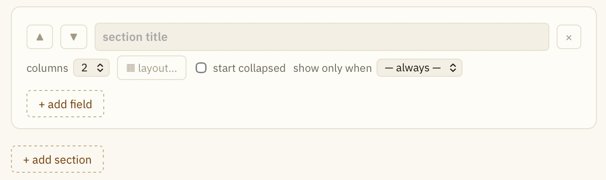{: .image-with-shadow}{: width="50%"}|

The rest of your checklist will consist of **sections**. In each Section, you will then define multiple **fields**. \
You can add new section as many as you like. To start, provide your **section title**.\
Clicking the up/down arrows change the order of the section to be appeared in your checklist.

You should also define # of **columns** that are used in the section.\
And when you have multiple columns and multiple fields in each of the columns, you could use the **layout GUI** by clicking
the **layout...** button. That will show you a GUI like the one shown below:

Editor             |
:-------------------------:|:-------------------------:
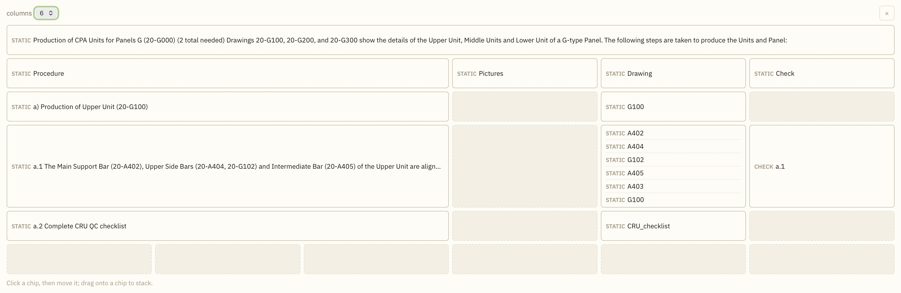{: .image-with-shadow}{: width="100%"}|

   

Also there are two more options:

There is an option to whether you want to hide (collapse) the section to start with.\

The other option is to whether you want to show this section **under a certain circumstance**.
The default is **always**, meaning that the section will be always displays.
Options other than **always** depend on what **fields** you have in the section (see the next section below for **fields** for more details).

For instance, if you happen to have a field, **QR/PID** (or **select**), one can setup so that the section is only displayed when its scanned PID happens to contain a certain vale under a certain Key (or when a certain item is selected in the **select** field) as shown below:

Editor             |  Editor
:-------------------------:|:-------------------------:
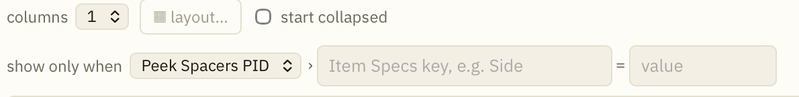{: .image-with-shadow}{: width="100%"}|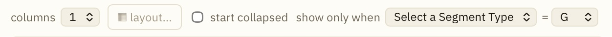{: .image-with-shadow}{: width="100%"}

      

[back to top](#contents)

### FIELD

Within a section, you can add a field as many as you like. 
When clicking the **+ add field**, you should see something similar to the one shown below:

Editor             |  Live Preview
:-------------------------:|:-------------------------:
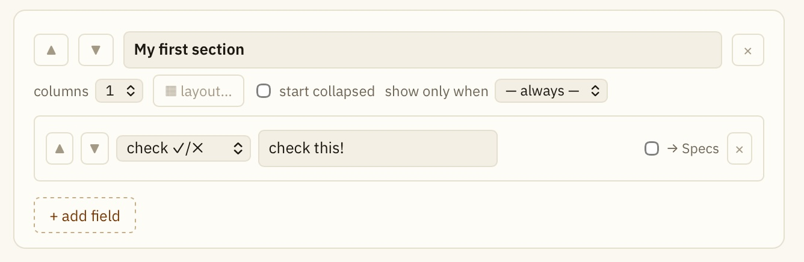{: .image-with-shadow}{: width="100%"}|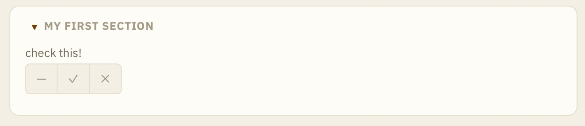{: .image-with-shadow}{: width="100%"}

Again, just like sections, you can change the order of the field appearance within its section by clicking the up/down arrows.

By default, the **check** field is initially selected. For this field, you could just provide its label name.

Checking the **Specs** makes the info of this field store in the Item Specifications, instead of the Test Specifications.

There are other **fields** available. **fields* current available are:
- check
- number
- table
- text
- textarea
- date/time
- select
- photo
- QR/PID
- link child
- steps
- static
- image map

We will no go through each of these below.

   

#### number

The field, **number**, is where one can enter a numerical value.\
You can specify a linebreak (or beside or same cell) and a range of tolerance as well.

Editor             |  Live Preview
:-------------------------:|:-------------------------:
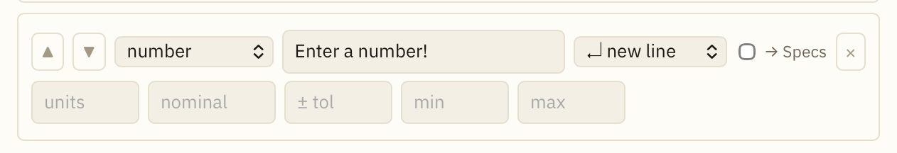{: .image-with-shadow}{: width="100%"}|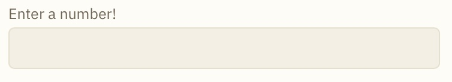{: .image-with-shadow}{: width="100%"}

   

#### table

You can set up a table as well. See below:

Editor             |
:-------------------------:|:-------------------------:
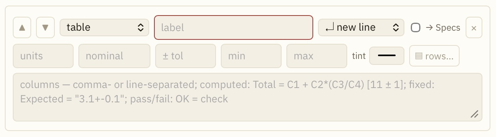{: .image-with-shadow}{: width="50%"}|

To modify table configuration, it would be the easiest to click the **rows...** button which would show the one like below:

Editor             |  Live Preview
:-------------------------:|:-------------------------:
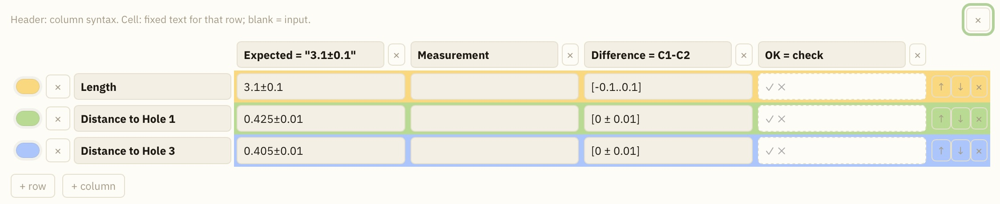{: .image-with-shadow}{: width="100%"}|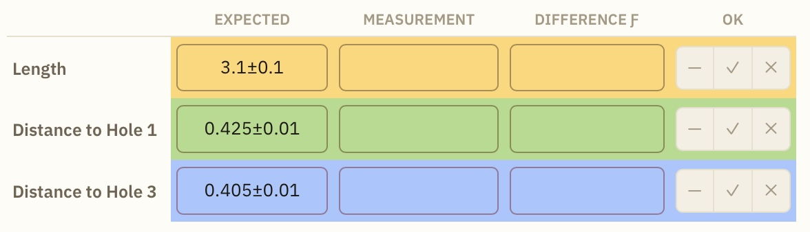{: .image-with-shadow}{: width="100%"}

- Provide column and row labels.
- You can set background colors of each rows, if you like.
- **double quotes** define it as *uneditable*.
- You can provide basic algebraic relations as done in the **Difference** column as shown above, while also defines a range of tolerence.
The cell boarder color becomes **red** when its provided value is outside of the defined tolerence range.
- The word, **check**, deploys the check field.

   

#### text

**text** field simply puts a text field as shown below:

Editor             |  Live Preview
:-------------------------:|:-------------------------:
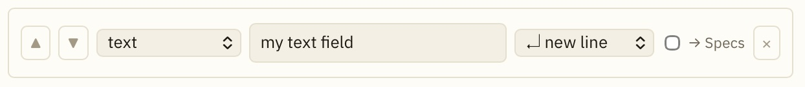{: .image-with-shadow}{: width="100%"}|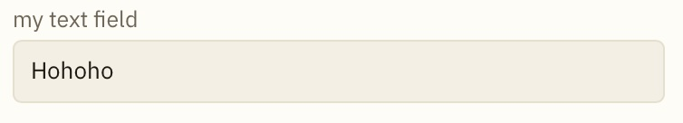{: .image-with-shadow}{: width="100%"}

   

#### textarea

Similar to **text**, **textarea** field provides a field for inputting texts, with multilines:

Editor             |  Live Preview
:-------------------------:|:-------------------------:
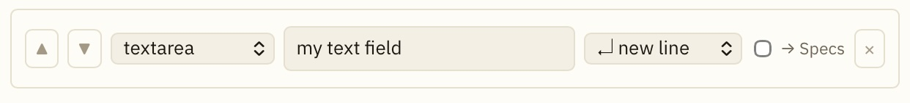{: .image-with-shadow}{: width="100%"}|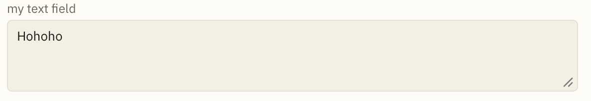{: .image-with-shadow}{: width="100%"}

   

#### date/time

**date/time** field puts a field, where user can provide date and time as shown below:

Editor             |  Live Preview
:-------------------------:|:-------------------------:
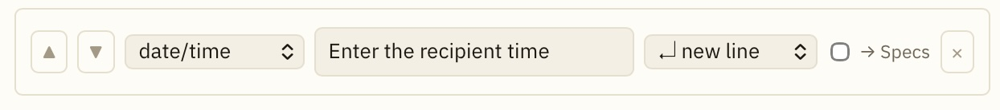{: .image-with-shadow}{: width="100%"}|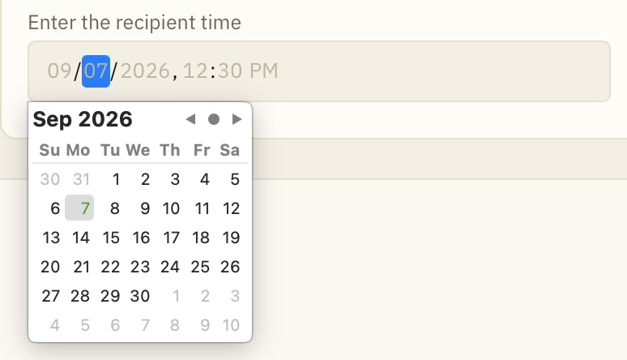{: .image-with-shadow}{: width="100%"}

   

#### select

**select** field lets you select from a predefined list. Simply provide a label name and its list as shown below:

Editor             |  Live Preview
:-------------------------:|:-------------------------:
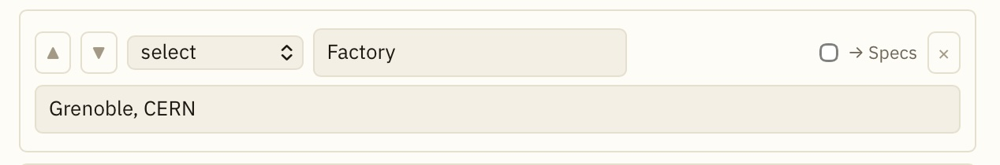{: .image-with-shadow}{: width="100%"}|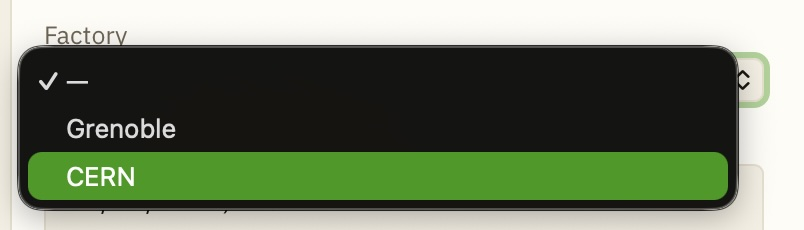{: .image-with-shadow}{: width="100%"}

   

#### photo

**photo** field provides the UI needed for taking a photo. Optionally one could provide an existing image file.

Editor             |  Live Preview
:-------------------------:|:-------------------------:
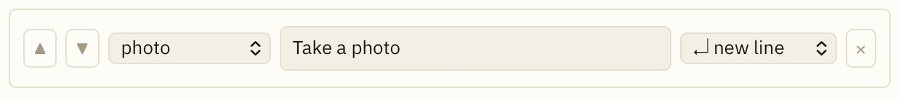{: .image-with-shadow}{: width="100%"}|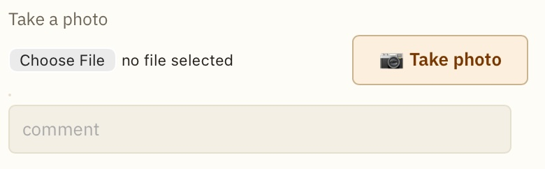{: .image-with-shadow}{: width="100%"}

   

#### QR/PID

**QR/PID** field is where a PID should be provided. It comes with a button that triggers a **scanner session** to let you scan a QR-code, in which a PID is embedded.

Optionally you can provide a specific Type ID (e.g., D00599800004). When this is set, the HWDB **will not scan** a QR-code which contains a PID that doesn't correspond to the specified Type ID.

Editor             |  Live Preview
:-------------------------:|:-------------------------:
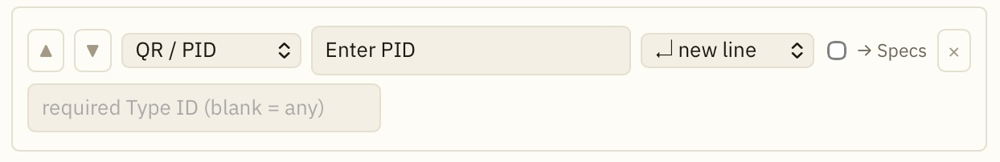{: .image-with-shadow}{: width="100%"}|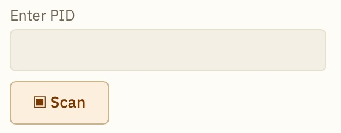{: .image-with-shadow}{: width="100%"}

   

#### link child

User provides a sub-component PID in a **link child** field.

Just like **QR/PID** field,
it comes with a button that triggers a **scanner session** to let you scan a QR-code, in which a PID is embedded.
Also, you can optionally provide a specific Type ID (e.g., D00599800004). When this is set, the HWDB **will not scan** a QR-code which contains a PID that doesn't correspond to the specified Type ID.

In this field, you should to provide a specific existing a functional position, which should have been already defined in its 
[Type definition]({{ page.root }}/03-Setting-up-Types/index.html#connectors-an-optional-field). Optionally you could leave this blank as well.

Editor             |  Live Preview
:-------------------------:|:-------------------------:
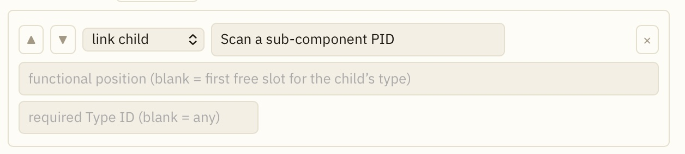{: .image-with-shadow}{: width="100%"}|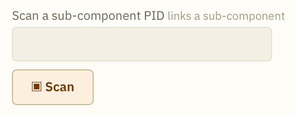{: .image-with-shadow}{: width="100%"}

  

In your checklist, when a PID is read-in, a green button, **link**, shows up as shown below.
You can either click it at this point to make the link for that particular sub-component or wait until completing the entire checklist and then click the **Upload to HWDB** button at the bottom..

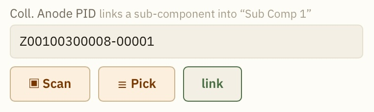{: .image-with-shadow}{: width="30%"}

And as soon as you link the PID, **unlink** button should show up as shown below. You can click this to remove the link, if you like.

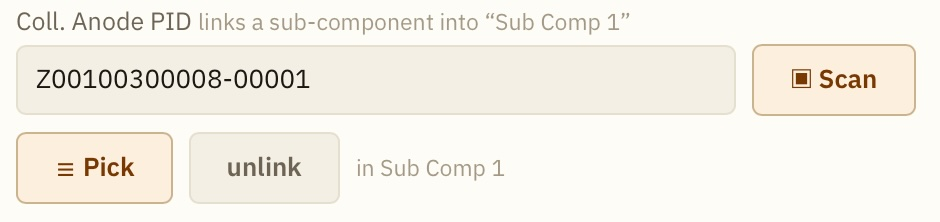{: .image-with-shadow}{: width="30%"}

Instead of scanning a QR-code to read-in a PID, you can click the **Pick** button. It then displays a list of available sub-component PIDs as shown below, from which you can select one to fill out the field.

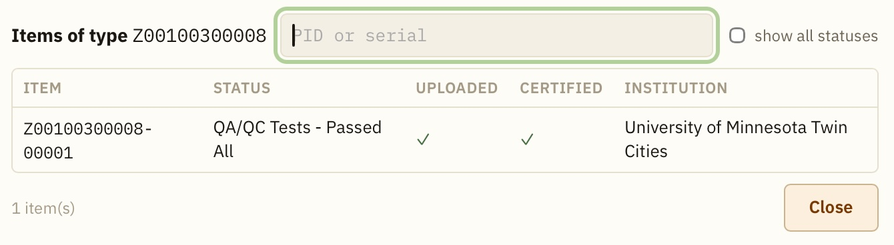{: .image-with-shadow}{: width="40%"}

   

#### steps

**steps** lets you have a normal checklist with an option that could impose a requirement for user to check all items before submitting to the HWDB.

Editor             |  Live Preview
:-------------------------:|:-------------------------:
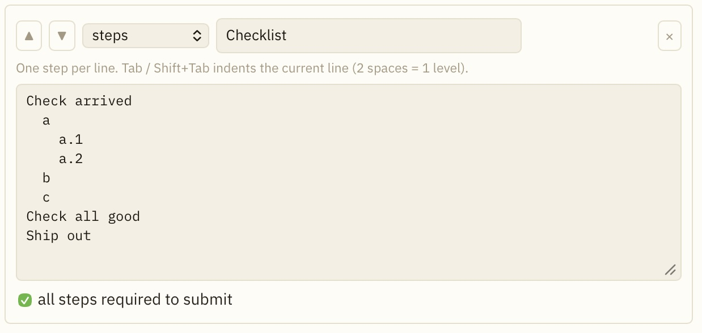{: .image-with-shadow}{: width="100%"}|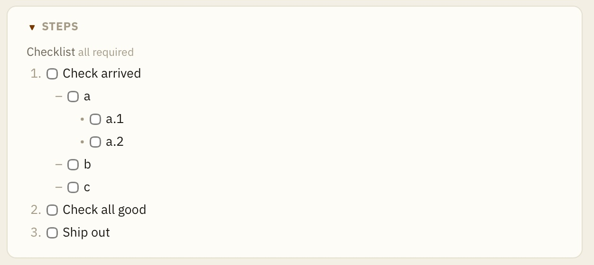{: .image-with-shadow}{: width="100%"}

   

#### static

**static** let you insert a text, an image, an URL, or even a link to an existing another checklist. See below:

Editor             |  Live Preview
:-------------------------:|:-------------------------:
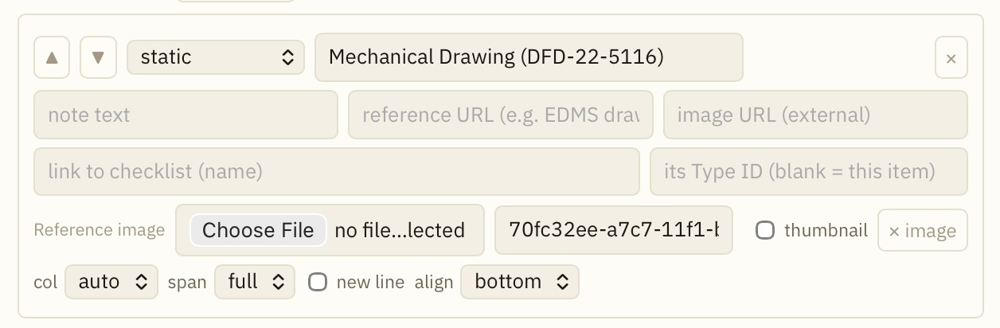{: .image-with-shadow}{: width="100%"}|{: .image-with-shadow}{: width="100%"}

To put an image, you could just upload an image file that is locally available, or the desired image already exists in the HWDBm specify the corresponding **image_id**.

If you want to put a link to another existing checklist, specify its checklist name and its Type ID.

   

#### image map

**image map** provides a clickable image. In the example given below, user tries to link 12 sub-components (adapter boards) that are mounted on a CRU.\
While user can click each of the 12 scanner buttons to scan each of the 12 QR-codes to read-in the 12 PIDs, user can click each of the geographical locations of the 12 boards to scan-in the corresponding PIDs.

Editor             |  Live Preview
:-------------------------:|:-------------------------:
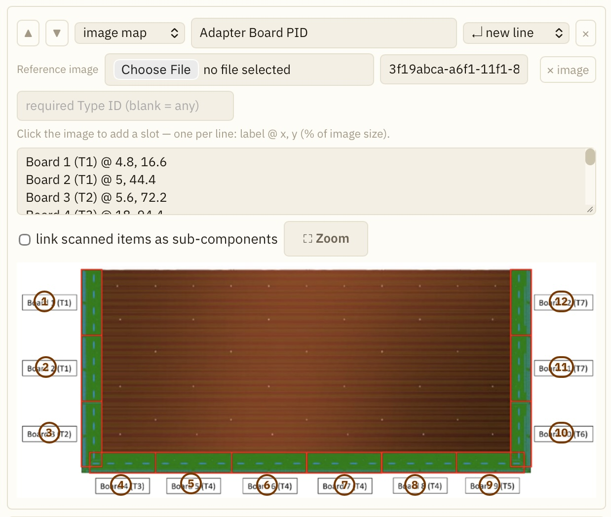{: .image-with-shadow}{: width="100%"}|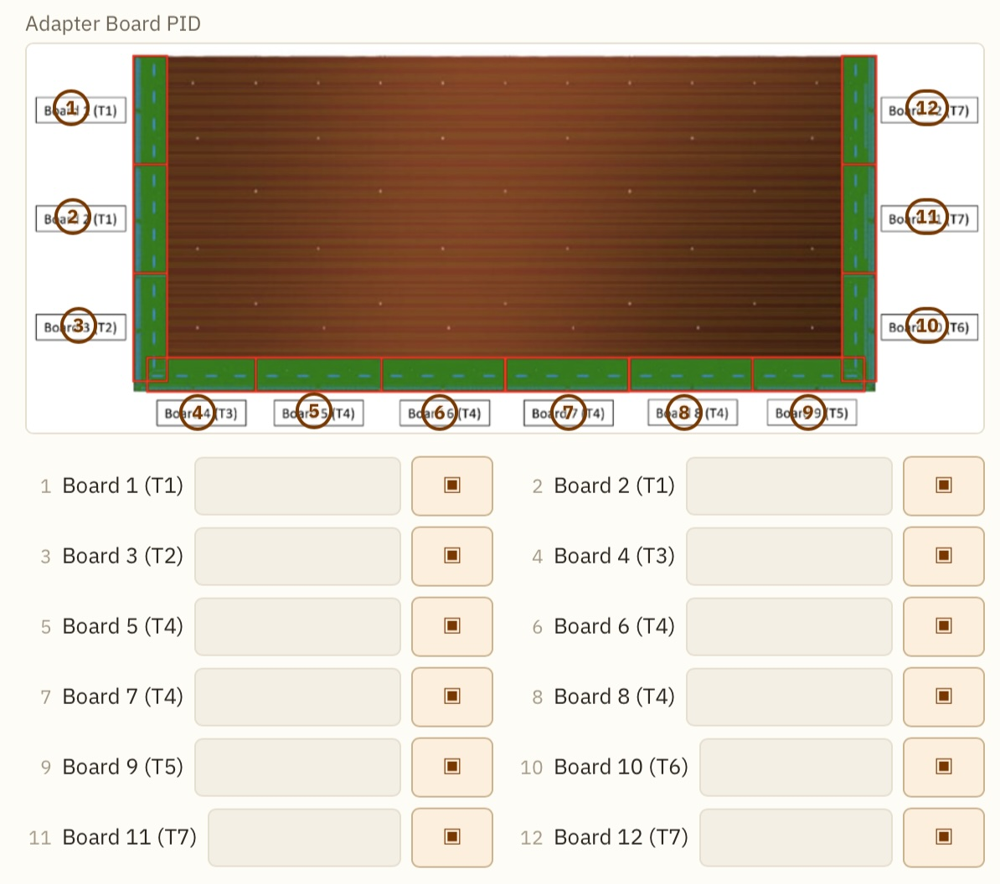{: .image-with-shadow}{: width="100%"}

To put an image, you could just upload an image file that is locally available, or the desired image already exists in the HWDBm specify the corresponding **image_id**.

If you want to put a link to another existing checklist, specify its checklist name and its Type ID.

Clicking the **Zoom** button initiates a GUI shown below, where user can decide where to click to add a new slot, **by clicking the desired location**.

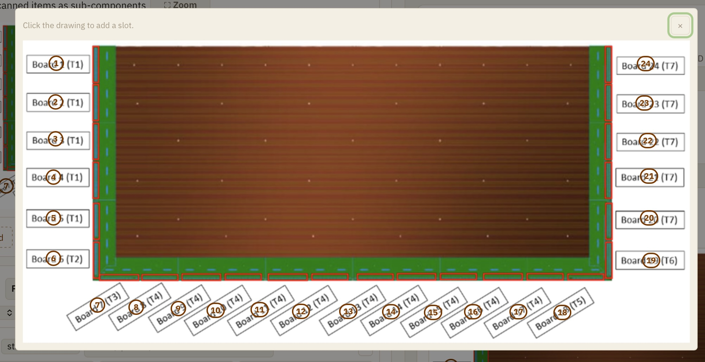{: .image-with-shadow}{: width="50%"}

      

[back to top](#contents)

## Creating a QC checklist based on an existing checklist

At the bottom of the editor, there is the Schema JSON section.
It shows the JSON that defines the corresponding checklist.

One can copy such existing JSON strings and paste to new one and click the **Apply JSON to the editor** to jump-start a creation of new checklist.

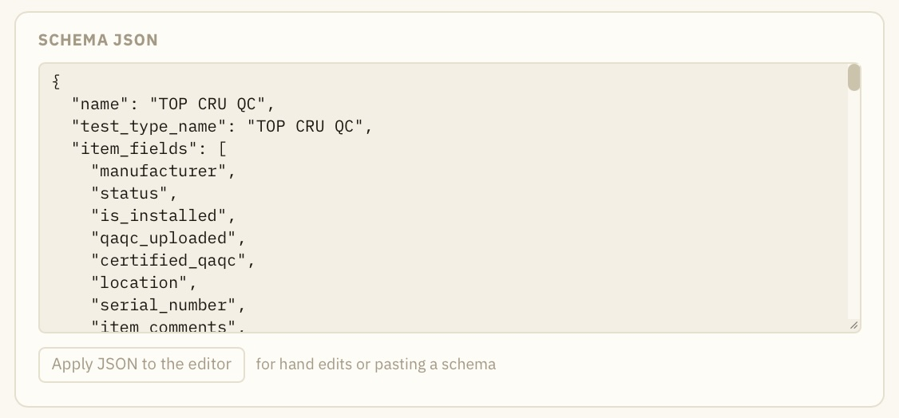{: .image-with-shadow}{: width="70%"}

      

[back to top](#contents)



