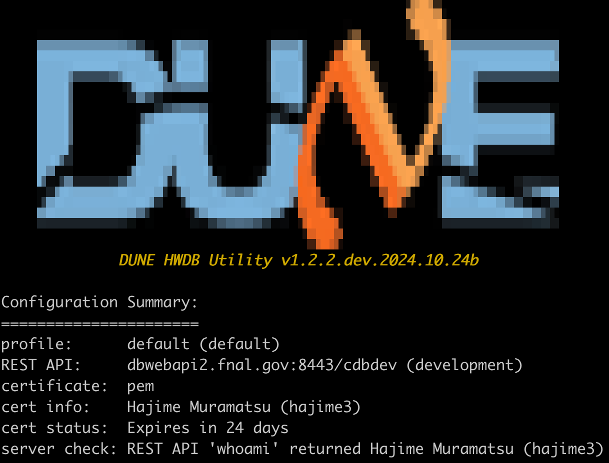
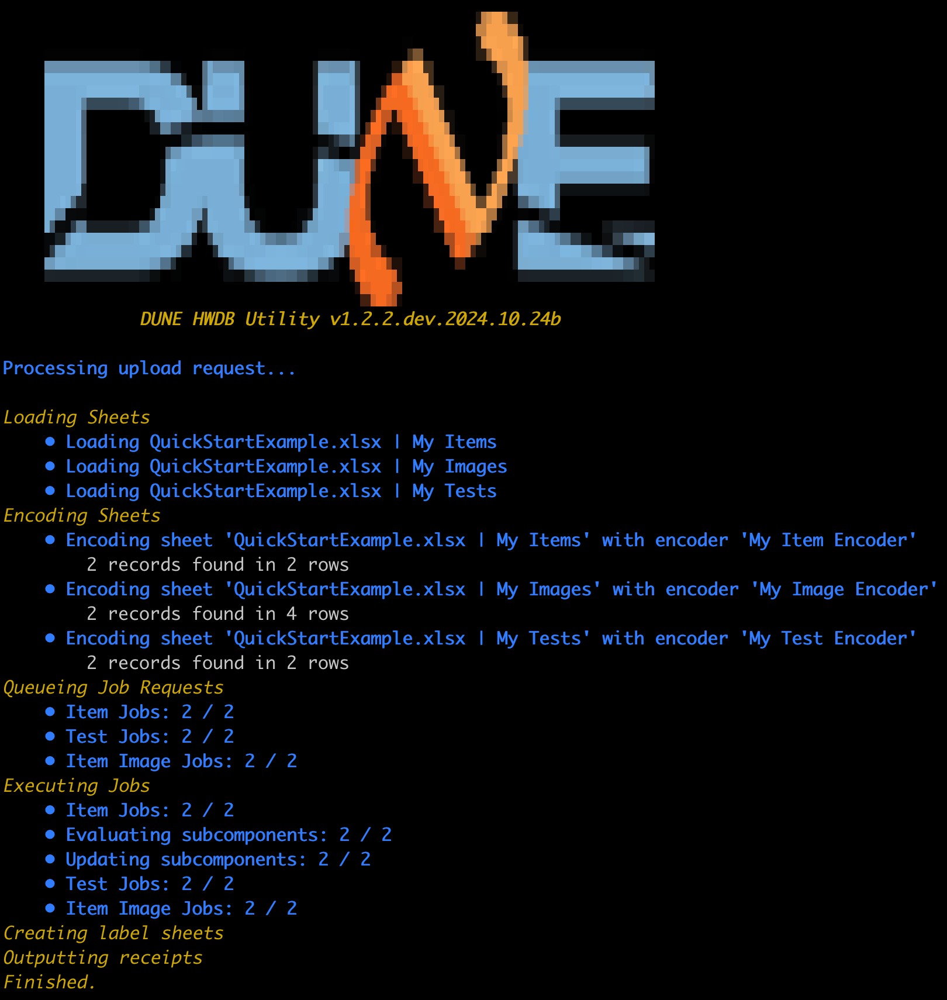
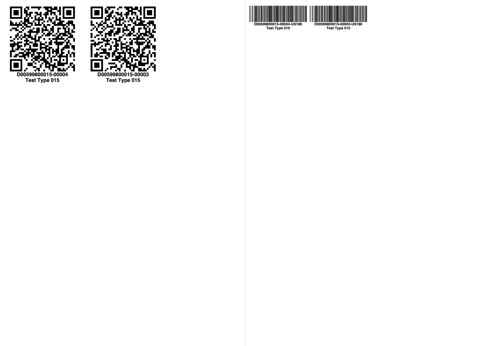

   

#### This page describes a quick-start guide on the Python HWDB Upload Tool with a single example. We emphasize that the method described in this page is not the only way to employ the Tool. There are other ways with various helpful options that are described [here]({{ page.root }}/07-Using-Python-Upload-Tool/index.html).

 

#### With the example provided in this page, you will be able to:
- upload a component specification (thus, obtain its assigned DUNE PID)
- update a component specification (for a given PID)
- create and/or update a serial number of the component
- create and/or update the component's location
- create links to its sub-components
- upload images to the component
- create and/or update the component's tests

## Getting ready

- We strongly recommend to employ [Anaconda (Python distribution)](https://en.wikipedia.org/wiki/Anaconda_(Python_distribution)),
  which should get you most of the needed packages for the Tool.
  It can be obtained from [https://www.anaconda.com/download](https://www.anaconda.com/download) for free and
  is available for Windows, Linux, and macOS.

- Next, obtain the zipped (or tar.gz, whichever you prefer) source code of the Tool from [here](https://github.com/DUNE/DUNE-HWDB-Python/releases). Make sure to grab the latest version, which is
v1.2.2 at the time of this writing.

### Installing the Tool:

- Extract the downloaded source code to a directory of your choosing. For the purposes of this document, we will assume this directory is $HOME/DUNE-HWDB-Python.

- To have the necessary paths available in your Bash shell, add the following lines to your .bashrc file. (If you are using a different shell, modify accordingly.)
~~~
export HWDB=~/DUNE-HWDB-Python
export PATH=$HWDB:$HWDB/bin:$HWDB/devtools:$PATH
export PYTHONPATH=$HWDB/lib:$PYTHONPATH
~~~
{: .language-bash}

- Provide the executable permission to the followings:
~~~
chmod u+x $HWDB/hwdb-*
~~~
{: .language-bash}

### Configuring the Tool:

- Obtain your PKCS12 certificate through [these steps]({{ page.root }}/setup.html#obtaining-your-certificate). The obtained file name should be something like "usercred.p12".

- Before using the Tool, you must configure it to use your PKCS12 certificate.
 ~~~
hwdb-configure --cert <path-to-your-p12-file> --password <your password>
~~~
{: .language-bash} 

- Now try to execute the following command:
 ~~~
hwdb-configure
~~~
{: .language-bash} 
If everything is setup correctly, you should see a screen similar to the one below.
{: .image-with-shadow}{: width="45%"}
Notice that the REST API base path points to the **development** version of the HWDB, which is the default setup.
When you are ready to work with the official Production server, enter:
~~~
hwdb-configure --prod 
~~~
{: .language-bash}

Likewise, to set it back to Development, enter:

~~~
hwdb-configure --dev 
~~~
{: .language-bash}

### Configuring a Component Type and a Test Type in the HWDB:

- If your Component Type is already setup, skip this step.

- We are going to use a Component Type ID, D00599800015, as an example in this page.
  This Component Type, thus, needs to be set up as described in the [03-Setting-up-Types]({{ page.root }}/03-Setting-up-Types/index.html#defining-a-component-type).
  
- In the Datasheet of this Component Specifications, insert the following (notice that you must have [the Administrator privilege]({{ page.root }}/02-Introduction-HWDB/index.html#user-privileges) in order to modify Component Type definitions):
~~~
DATA: []
_meta: {}
~~~
{: .language-json}

- Similarly, create and define a Test Type (as described in the [03-Setting-up-Types]({{ page.root }}/03-Setting-up-Types/index.html#defining-a-test-type).
  In our example, we will use a Test Type name, **My Test**. Go ahead to define a Test Type with that name and again insert the followings to its Specifications:
~~~
DATA: []
_meta: {}
~~~
{: .language-json}

- All contents uploaded by the Tool are stored within "DATA: []".

- "_meta: {}" is used by the Tool only and users should just ignore it.

  

## Uploading contents to the HWDB

### Understanding the basic concept:

- In our example, a user provides the contents, that are uploaded to the HWDB, to the Tool by a spreadsheet file.
  The example spreadsheet file can be obtained from here: [QuickStartExample.xlsx]({{ page.root }}/files/QuickStartExample.xlsx)
  
- The HWDB needs to know how the contents of the spreadsheet file should be structured/stored. A docket file does the job.
  Our example docket file can be obtained from here: [QE-docket.json]({{ page.root }}/files/QE-docket.json)
  
- In spreadsheet(s), user provides contents with specific column labels.
  There are specific label names that are reserved for the Tool. We list those **special labels** below.
  These special labels have specific meanings and we'll go through them in the following subsections.
   - External ID
   - Serial Number
   - Comments
   - Manufacturer
   - Manufacturer ID
   - Manufacturer Name
   - Institution
   - Institution ID
   - Institution Name
   - Location
   - Location ID
   - Location Name
   - Arrived
   - Location Comments
   - Image File

We'll start to look at the example spreadsheet file first and understand our **contents**.
We'll then go through the docket file to see how it works, including setting up the database schema for Specifications.

### QuickStartExample.xlsx: "My Items" sheet:

- Our example spreadsheet file includes 3 sheets. One of them, "My Items" sheet, looks like the below:

<table class="spreadsheet">
<tr>
    <th style="width: 1em"></th>
    <th style="width: 11.5em">A</th>
    <th style="width: 7em">B</th>
	<th style="width: 8.5em">C</th>
	<th style="width: 11.5em">D</th>
	<th style="width: 11.5em">E</th>
</tr>
<tr><th> 1</th><td><b>  Serial Number       </b></td><td><b>  Comments         </b></td><td><b>  Drawing Number  </b></td><td><b>  MySubComp 1  </b></td><td><b>  MySubComp 2  </b></td></tr>
<tr><th> 2</th><td>     HA-MURAMATSU-00003      </td><td>     here is my item      </td><td>     DFD-XX-FF00         </td><td>   HA-MURAMATSU-00001 </td><td> HA-MURAMATSU-00002   </td></tr>
<tr><th> 3</th><td>     HA-MURAMATSU-00004      </td><td>     another item         </td><td>     DFD-XX-FF01         </td><td>                      </td><td>                      </td></tr>
<tr><td colspan="6">the first half of <i>My Items</i> sheet</td></tr>
</table>

<table class="spreadsheet">
<tr>
    <th style="width: 1em"></th>
    <th style="width: 18.5em">F</th>
	<th style="width: 11.5em">G</th>
	<th style="width: 10.6em">H</th>
</tr>
<tr><th> 1</th><td><b>  Location                                   </b></td><td><b>  Arrived                 </b></td><td><b> Location Comments      </b></td></tr>
<tr><th> 2</th><td>     (186) University of Minnesota Twin Cities      </td><td>     10/14/2024 10:12:13 AM      </td><td>    comments for 1st item      </td></tr>
<tr><th> 3</th><td>     (186) University of Minnesota Twin Cities      </td><td>     10/13/2024  9:38:58 PM      </td><td>    comments for 2nd item      </td></tr>
<tr><td colspan="4">the second half of <i>My Items</i> sheet</td></tr>
</table>
 

| Column | Description |
| A | It  defines a specific Item, and thus acts as a **PID**. There is no specific scheme to define serial numbers, but **each of them must be unique for a given Component Type**. One could use **External ID** as its label name here, instead. In that case, you would have to specify existing PIDs. The Tool then overwrite the contents of the specified PIDs. |
| B | This column represents comments for each of the Items. |
| C | Drawing numbers, to be stored in each of the Item's Specifications in the HWDB. |
| D & E | The label names here need to coincide with those [functional position names]({{ page.root }}/03-Setting-up-Types/index.html#connectors-an-optional-field) that are defined in its Component Type definition. Notice that the Item, HA-MURAMATSU-00003, will have 2 sub-component links, one to HA-MURAMATSU-00001 and another to HA-MURAMATSU-00002, while the Item, HA-MURAMATSU-00004, will not have any sub-component link. |
| F | The column specifies a location of the Item. It expects both Institution ID and Institution name. If you like, you could only specify ID (name) with a label name, **Institution ID** (**Institution Name**), instead. |
| G | Represents arriving date&time of the corresponding Item. One can add a time-zone. Without it, by default it takes it in the North American Central Time Zone.|
| H | Represents comments for each locations.

- If you don't have any sub-component to be linked, you could just remove the columns D & E altogether.

- Similarly, if you don't need to enter locations of your Items, go ahead to remove columns F, G, and H.

### QuickStartExample.xlsx: "My Images" sheet:

- "My Images" sheet should look like the below:

<table class="spreadsheet">
<tr>
    <th style="width: 1em"></th>
    <th style="width: 11.5em">A</th>
    <th style="width: 10em">B</th>
	<th style="width: 7em">C</th>
</tr>
<tr><th> 1</th><td><b>  Serial Number       </b></td><td><b>  Image File         </b></td><td><b>  Comments  </b></td></tr>
<tr><th> 2</th><td>     HA-MURAMATSU-00003      </td><td>     images/apple.jpeg      </td><td>     image 1       </td></tr>
<tr><th> 3</th><td>     HA-MURAMATSU-00003      </td><td>     images/banana.jpeg     </td><td>     image 2       </td></tr>
<tr><th> 4</th><td>     HA-MURAMATSU-00004      </td><td>     images/broccoli.jpeg   </td><td>     image 3       </td></tr>
<tr><th> 4</th><td>     HA-MURAMATSU-00004      </td><td>     images/apple.jpeg      </td><td>     image 4       </td></tr>
<tr><td colspan="4"><i>My Images</i> sheet</td></tr>
</table>
 

| Column | Description |
| A | Represents the same Serial Numbers that are found in the **My Items** sheet. |
| B | Specifies the locations and file names of the images to be uploaded. |
| C | Comments for each image files. |

- Again, if you don't have any image to be uploaded, you could delete the entire "My Images" sheet.

### QuickStartExample.xlsx: "My Tests" sheet:

- "My Tests" sheet should look like the below:

<table class="spreadsheet">
<tr>
    <th style="width: 1em"></th>
    <th style="width: 11.5em">A</th>
    <th style="width: 6em">B</th>
	<th style="width: 4em">C</th>
	<th style="width: 7em">D</th>
	<th style="width: 10em">E</th>
	<th style="width: 9em">F</th>
	<th style="width: 9em">G</th>
	<th style="width: 6em">H</th>
	<th style="width: 6em">I</th>
</tr>
<tr><th> 1</th><td><b>Serial Number     </b></td><td><b>Comments  </b></td><td><b>Operator</b></td><td><b>Test Location</b></td><td><b> PSU Serial Number </b></td><td><b> Visual Inspection </b></td><td><b>PSU Manufacturer</b></td><td><b>PSU Test 1</b></td><td><b>PSU Test 2</b></td></tr>
<tr><th> 2</th><td>   HA-MURAMATSU-00003    </td><td>   Looks good    </td><td>   Hajime      </td><td>  Minneapolis       </td><td>    2PH30-230             </td><td>    Passed                </td><td>   TOSHIBA             </td><td>   Failed        </td><td>   Passed        </td></tr>
<tr><th> 3</th><td>   HA-MURAMATSU-00004    </td><td>   Looks ok      </td><td>   Andy        </td><td>  Tucson            </td><td>    2PH30-231             </td><td>    Passed                </td><td>   TOSHIBA             </td><td>   Passed        </td><td>   Failed        </td></tr>
<tr><td colspan="10">the first half of <i>My Tests</i> sheet</td></tr>
</table>

<table class="spreadsheet">
<tr>
    <th style="width: 1em"></th>
    <th style="width: 10em">J</th>
    <th style="width: 9em">K</th>
	<th style="width: 5em">L</th>
	<th style="width: 5em">M</th>
</tr>
<tr><th> 1</th><td><b>Fan Serial Number</b></td><td><b>Fan Manufacturer</b></td><td><b>Fan Test 1</b></td><td><b>Fan Test 2</b></td></tr>
<tr><th> 2</th><td>   W0909101451          </td><td>   Champion Lab        </td><td>   Passed        </td><td>   Failed        </td></tr>
<tr><th> 3</th><td>   W0909101452          </td><td>   Champion Lab        </td><td>   Failed        </td><td>   Passed        </td></tr>
<tr><td colspan="5">the second half of <i>My Tests</i> sheet</td></tr>
</table>
 

| Column | Description |
| A | Represents the same Serial Numbers that are found in the **My Items** and **My Images** sheets. |
| B | Comments on each of the Tests. |
| C-M | These columns represent my test data. We'll describe how exactly we like to format them below. |

- Again, if you don't need to upload any test data, but only Items, you could just delete this "My Tests" sheet.

### QE-docket.json: "Values" blob:

- "Values" blob in QE-docket.json should look like the below:
~~~
 "Values": {
        "Part Type ID": "D00599800015",
        "Institution": "(186) University of Minnesota Twin Cities",
        "Manufacturer": "(7) Hajime Inc"
    }
~~~
{: .language-json}
Here, you provide Component Type ID of the Items you like to upload (in this case, D00599800015), your Institution, and Manufacturer.

### QE-docket.json: "Sources":

- "Sources" in QE-docket.json should look like the below:
~~~
 "Sources": [
        {
            "Files": "QuickStartExample.xlsx",
	        "Sheet Name": "My Items",
            "Encoder": "My Item Encoder"
        },
	    {
            "Files": "QuickStartExample.xlsx",
	        "Sheet Name": "My Images",
            "Encoder": "My Image Encoder"
        },
	    {
            "Files": "QuickStartExample.xlsx",
	        "Sheet Name": "My Tests",
            "Encoder": "My Test Encoder"
        }
    ]
~~~
{: .language-json}
- Here you specify the 3 spreadsheet file names, the 3 sheet names, and the 3 Encoder names.

- We have only one single spreadsheet file in our example. But we could have those 3 sheets in 3 different files separately.

- We'll describe each of the Encoders in the next sub-sections.

### QE-docket.json: Encoders:  "My Item Encoder":

- "My Item Encoder" in QE-docket.json should look like the below:
~~~
            "Encoder Name": "My Item Encoder",
            "Record Type": "Item",
            "Part Type ID": "D00599800015",
            "Schema": {
                "Specifications": {
                    "DATA": {
                        "type": "group",
                        "key": "Serial Number",
                        "members": {
                            "Serial Number": "string",
                            "Drawing Number": "string",
			                "My Doc": {
				               "value": "https://edms.cern.ch/document/2505353/"
			                },
			                "Serial Number": "string",
			                "Location": "string",
			                "Arrived": "string",
			                "Location Comments": "string"
                        }
                    }
                },
		        "Subcomponents": {
		            "MySubComp 1": {
			            "column": "MySubComp 1"
		            },
		            "MySubComp 2": {
			           "column": "MySubComp 2"
		            }
		        }
            }
~~~
{: .language-json}
- Within the Specifications blob, its database scheme is defined.

- "key" tells the Tool that "Serial Number" defines an Item (one-to-one correspondance between a "Serial Number" and an Item).

- The "members" blob defines the scheme. In the database, we like to store them like the one shown below:
~~~
"Drawing Number": "DFD-XX-FF00",
"My Doc"        : "https ://edms.cern.ch/document/2505353/"
~~~
{: .language-json}
- For "My Doc", since we know the documentation link is the same for this Component Type, instead of specifying it in every row of "My Items" sheet, we provide the constant value here. Notice that we don't need to specify the label name, "My Doc" in our sheet either.

- The "Subcomponents" blob just specifies label names for sub-component PIDs (or Serial Numbers).

### QE-docket.json: Encoders:  "My Image Encoder":

- "My Image Encoder" in QE-docket.json should look like the below:
~~~
            "Encoder Name": "My Image Encoder",
            "Record Type": "Item Image",
            "Part Type ID": "D00599800015",
            "Schema": {
                "type": "group",
                "key": "Serial Number",
                "members": {
                    "Serial Number": "string",
                    "Image File": "string",
		            "Comments": "string"
                }
            }
~~~
{: .language-json}
- Similar to "My Item Encoder" typesets of the labels are defined.

### QE-docket.json: Encoders:  "My Test Encoder":

- "My Test Encoder" in QE-docket.json should look like the below:
~~~
            "Encoder Name": "My Test Encoder",
            "Record Type": "Test",
	        "Part Type ID": "D00599800015",
	        "Test Name": "My Test",
            "Schema": {
                "Test Results": {
                    "DATA": {
                        "type": "group",
                        "key": "Serial Number",
                        "members": {
			                "Serial Number": "string",
                            "Operator": "string",
			                "Location": "string",
			                "PSU": {
				                "type": "group",
				                "key": "PSU Serial Number",
				                "members": {
				                     "PSU Serial Number": "string",
				                     "Visual Inspection": "string",
				                     "PSU Manufacturer": "string",
				                     "PSU Test 1": "string",
				                     "PSU Test 2": "string"
				                }
			                },
			                "Fans": {
				                "type": "group",
				                "key": "Fan Serial Number",
				                "members": {
				                     "Fan Serial Number": "string",
				                     "Fan Manufacturer": "string",
				                     "Fan Test 1": "string",
				                     "Fan Test 2": "string"
				                }
			                }
                        }
                    }
                }
            }
~~~
{: .language-json}
- Again, it has a very similar form to what we have seen in Item and Image Encoders.

- This time, however, it has a nested structure in its scheme. E.g., this scheme would store the contents in "My Tests" sheet as shown below:
~~~
"Serial Number": "HA-MURAMATSU-00003",
"Operator"     : "Hajime",
"Location"     : "Minneapolis",
"PSU"          : [ 
                     "PSU Serial Number": "2PH30-230",
                     "Visual Inspection": "Passed",
                     "PSU Manufacturer" : "TOSHIBA",
                     "PSU Test 1"       : "Failed",
                     "PSU Test 2"       : "Passed" 
				   ],
"Fans"         : [ 
                     "Fan Serial Number": "W0909101451",
                     "Fan Manufacturer" : "Champion Lab",
                     "Fan Test 1"       : "Passed",
                     "Fan Test 2"       : "Failed" 
				   ]
~~~
{: .language-json}

### Let's upload them:

- If you have modified your sheet(s) and docket file according to your needs, you should be ready to upload them. Execute the following command. Don't worry. It will not upload, yet. It will only check the contents of the provided files.
~~~
hwdb-upload QE-docket.json
~~~
{: .language-bash} 

- If you don't see any error message from the above command-line, let's upload them for real:
~~~
hwdb-upload QE-docket.json --submit
~~~
{: .language-bash} 
- If everything goes well, you should see a screen similar to the one shown below:

{: .image-with-shadow}{: width="50%"}

- Again, if you don't need to upload Tests, you can remove the Test sheet from the spreadsheet file and the Tests portion from "Sources" and "Endoder" of the docket file.

- Likewise, if you don't plan to upload images, remove the corresponding parts from the spreadsheet and docket files.

- If you upload with Serial Numbers (or External IDs) that already exist in the HWDB, it will overwrite the existing Item Specifications and Tests (don't worry, their histories are kept in the HWDB). This is actually a useful feature when you need to update contents in the HWDB.

  

## After uploading contents to the HWDB

- Once you are done with uploading, there should be a new directory (folder) created locally with a directory name of timestamp.

- Go into that directory. There should be two files:
  - Items-D00599800015.xlsx (the provided Component Type ID is used for its file name)
  - ItemLabels.pdf
  
- Items-D00599800015.xlsx was generated by the Tool, based on what you just uploaded, and thus, based on what the HWDB current has.
  - It contains information of the uploaded Items. No info on uploaded images/Tests, yet.
  - Thus, **it contains the DUNE PIDs that were assigned by the HWDB, along with the corresponding Serial Numbers**.

- ItemLabels.pdf contains labels of bar- and QR-codes of the uploaded Items (there should be only two Items uploaded in our example).

- Every time you upload, the Tool creates this directory locally. It also creates a softlink, "latest", that points to the directory created most recently.

### Bar/QR-code labels

- The generated ItemLabels.pdf has actually 27 pages (in our example).

- It contains not only both QR-codes and bar-codes, but with various sizes of labels.
  Currently it produces the paper/label sizes that are shown below:

<table border="1" frame="box">
<tr>
    <th style="width: 6em">
Code Type
</th>
    <th style="width: 8em">
Paper Size
</th>
    <th style="width: 10em">
Label Size
</th>
	<th style="width: 5em">
# of labels/sheet
</th>
</tr>
<tr><td>
 Bar 
</td><td>
 A4 (210×297 mm)   
</td><td>
  51.5×26.6 mm 
</td><td>
 44 
</td></tr>
<tr><td>
 Bar 
</td><td>
 Letter (8.5”×11”) 
</td><td>
  4”×1.5”      
</td><td>
 12 
</td></tr>
<tr><td>
 Bar 
</td><td>
 Letter (8.5”×11”) 
</td><td>
  4”×1.333”    
</td><td>
 14 
</td></tr>
<tr><td>
 Bar 
</td><td>
 Letter (8.5”×11”) 
</td><td>
  2.625”×1”    
</td><td>
 30 
</td></tr>
<tr><td>
 QR  
</td><td>
 A4 (210×297 mm)   
</td><td>
  67×72 mm     
</td><td>
 12 
</td></tr>
<tr><td>
 QR  
</td><td>
 Letter (8.5”×11”) 
</td><td>
  5”×3.5”      
</td><td>
  4 
</td></tr>
<tr><td>
 QR  
</td><td>
 Letter (8.5”×11”) 
</td><td>
  4”×3.333”    
</td><td>
  6 
</td></tr>
<tr><td>
 QR  
</td><td>
 Letter (8.5”×11”) 
</td><td>
  4”×1.5”      
</td><td>
 12 
</td></tr>
<tr><td>
 QR  
</td><td>
 Letter (8.5”×11”) 
</td><td>
  2.625”×2”    
</td><td>
 15 
</td></tr>
</table>

- With requests, we can easily add other paper/label sizes.
  Or update the Tool so that users can provide these sizes at run time.
  
- Below we show two of the generated 27 pages as an example:  67×72 mm label size of QR-code and 51.5×26.6 mm size of bar-code, on A4 papers.

{: .image-with-shadow}{: width="75%"}



