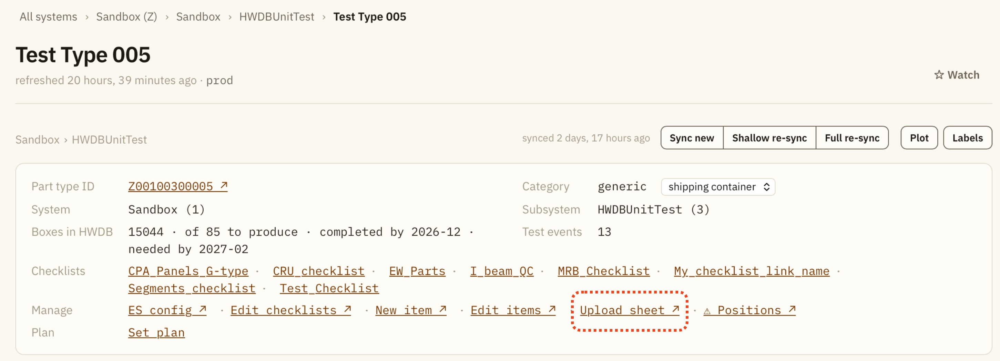
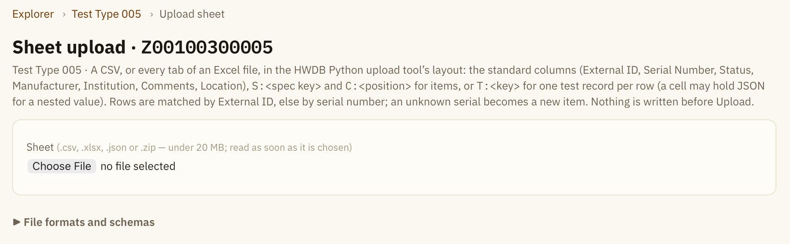
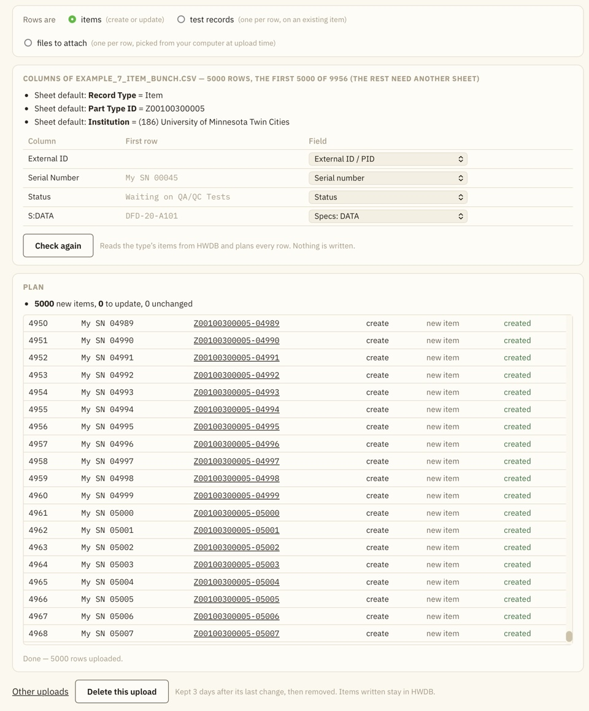
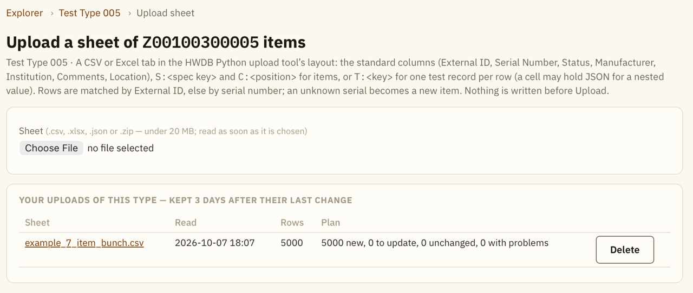

## This page describes how to upload spreadsheets (xlsx,csv,tsv,txt,json, and zip) to the HWDB at once via the HWDB Explorer


<br/>

You can upload spreadsheets to the HWDB using [the HWDB Explorer]({{ page.root }}/explorer/index.html).\
Uploading is done for **every given Component Type**. Thus, the process starts by selecting which components (PIDs) of **Type** you want to upload. This is done by going to the page of the target Type View. A screenshot of typical Type View is shown below as an example:
{: .image-with-shadow}{: width="100%"}
Towards the top of such page, there is a link, **Upload sheet**, which takes you to the sheet uploder site for the selected Component Type. In this case, the selected Component Type Name is "Test Type 005" and its Component Type ID is Z00100300005.

<br/><br/><br/><br/>

Once you arrive at the sheet uploader page, you should see a screen like below:
{: .image-with-shadow}{: width="100%"}

<br/>

You provide your file and start the upload process here.

It accepts csv, xlsx, json, and zip files.
The more detail about the format/scheme of these files can be found by clicking the **File formats and schemas** tick button in the sheet uploader page.
We also reproduce the description in [the following section]({{ page.root }}/sheetuploader/index.html#file-formats-and-schemas).

<br/>

The overall procedure goes as the following:

- Provide your spreadsheet file.
- The Explorer auto-identifies the column labels.
- If needed, you re-assign the column labels. Make sure you assign either External ID/PID or Serial Number. One of them is required.
- Click **Check** button. The Explorer checks your sheet(s).
- When ready, click **Upload**.
- When uploading is done, it displays its result as shown below.
- The resultant list can be also downloaded as a csv file.\
  If you create new PIDs using your unique serial numbers, instead of just updating existing PIDs, then this resultant csv file contains the newly assigned PIDs, along with your specified serial numbers.

{: .image-with-shadow}{: width="80%"}

<br/><br/>

For cases like when you like to check the uploaded PIDs or failure of upload,
the sheet information is kept within the Explorer for 3 days unless you manually delete it as shown below:
{: .image-with-shadow}{: width="80%"}

<br/><br/>

#### When there is an issue with uploading:

A **Problems** list will appear. It shows the rows (PIDs) that the HWDB refused, along with the response message from the HWDB.
For each row, there is a **Retry** button that lets you re-upload that row (PID).
There is also a **Retry all failed** button.

In the resultant csv file (list), these failed uploads are marked as **fix the sheet**.

## File formats and schemas

This section describes the file formats and schemas.

<br/>

### Files

| File | What it holds |
| --- | --- |
| `.csv`, `.tsv`, `.txt` | One sheet. The separator (comma, semicolon or tab) is detected. |
| `.xlsx` | Every tab is read; pick the tab on the job page. Cell types are kept (numbers stay numbers, dates become ISO text). |
| `.json` | Records as JSON: a list of objects, an object keyed by External ID, or an object with the records under `data` and its other entries as the key/value block. Each object's top-level keys are the columns; nested values stay nested. |
| `.zip` | One JSON file per item, each one test record (schema below). Files in folders are read; anything that is not `.json` is ignored. |

**Limits:** 20 MB per file, 5000 rows per tab. In a sheet or JSON record, a cell whose text is a JSON object or list becomes that nested value. A number written with a leading zero (a serial like `00123`) stays text.

<br/>

### Sheet layout

The HWDB Python upload tool's layout: an optional key/value block in columns A–B, a blank row, then the header row and the data rows. Block entries are defaults for every row (a cell wins over the block). Recognised block keys: `Record Type` (`Item`, `Test`, `Item Image`, `Test Image`), `Part Type ID` (must be this type), `Test Name`, and any column name such as `Institution` or `Status`.

```csv
Record Type,Item
Part Type ID,Z00100300005
Institution,(128) Brookhaven National Laboratory

External ID,Serial Number,Status,S:Drawing Number,C:A1,Comments
,BATCH-A,Waiting on QA/QC Tests,DFD-20-A101,,new item
Z00100300005-00018,,120,,D00400300002-00007,existing item
```

Every column is matched to a field on the job page (auto-filled from the names below; the last mapping used for a type is remembered in this browser). Rows are matched to items by **External ID** (the PID), else by **Serial Number**; a serial on several items is refused, so give the PID.

<br/>

### Items — create or update

| Column | Value |
| --- | --- |
| External ID / Part ID | The PID. Blank = look the item up by serial; an unknown serial becomes a **new item**. |
| Serial Number | Required for a new item. |
| Status | The HWDB status id (`110`) or its label (`Waiting on QA/QC Tests`). A new item without one is born *Waiting on QA/QC Tests*. |
| Manufacturer | One of the type's manufacturers: `(7) Hajime Inc`, `7` or `Hajime Inc`. A new item on a type with exactly one manufacturer gets it. |
| Institution | The owner of a **new item**, same forms as above (`(128) Brookhaven National Laboratory`). Required for a new item, usually in the block. |
| Comments | The item's comments. |
| Location, Location Comments, Arrived | Posts a location entry when it differs from the item's current one. Arrived is an ISO timestamp, default now. |
| `S:<key>` | An Item Specs key of the type's datasheet; dots reach into a nested object (`S:DATA.received`). `<null>` clears it. A bare column named exactly like a spec key maps too. |
| `C:<position>` | The item to put in that sub-component position: a PID, or a serial number of the position's type. `<null>` empties the position. |

Rows naming the same item merge into one record (later cells win). **Check** plans every row against the type's live listing: *create*, *update* with the fields that differ, *nothing to do*, or a problem. **Upload** writes several items at a time: a create re-checks the serial first, so a retry never creates twice; an update is one PATCH of the standard fields and specs only when something differs; then the location and the positions. A row that hit a server-side timeout is tried once more after a few seconds on its own. A row HWDB refuses stays in the list in red with the reason and is listed again under **Problems**, where **Retry** sends that row again and **Retry all failed** every one; **Download results (CSV)** keeps the list.

<br/>

### Test records — one per row

A sheet is a Test sheet when the block says `Record Type,Test` or any column starts with `T:`; switch it by hand on the job page. Every row posts one record of the **Test name** on the page (the block's `Test Name` fills it in). The test type is created on the component type on first use.

| Column | Value |
| --- | --- |
| External ID / Serial Number | The item, which must exist. |
| Comments | The record's comments. |
| `T:<key>` | A value in the record's DATA; dots nest (`T:Damage.count`). On a Test sheet every other column is a `T:` key too. |
| `T:<list>[]...` | A list: `T:Boxes[].Label`, `T:Boxes[].Checks[].Result`, `T:Notes[]`. Rows naming the same item with the same plain values become one record; inside it each `[]` level holds one element per distinct set of scalar members. |
| Test data | A cell holding the DATA object itself as JSON, `{"Inspected By": "CZ", "Boxes": 4}` (a zip file's `{"data": {...}}` wrapper is accepted too). In a `.csv` the cell must be in double quotes with the quotes inside doubled; a `.tsv` or `.xlsx` needs no quoting. |

Example:

```csv
External ID,T:Date,T:Boxes[].Label,T:Boxes[].Checks[].Name,T:Boxes[].Checks[].Result
Z00100300005-00018,2026-09-25,box 1,seal,ok
Z00100300005-00018,2026-09-25,box 1,count,ok
Z00100300005-00018,2026-09-25,box 2,seal,torn
```

This gives one record:

```json
{
  "Date": "2026-09-25",
  "Boxes": [
    {"Label": "box 1", "Checks": [{"Name": "seal", "Result": "ok"}, {"Name": "count", "Result": "ok"}]},
    {"Label": "box 2", "Checks": [{"Name": "seal", "Result": "torn"}]}
  ]
}
```

A row whose item already holds a record of that test with exactly the same DATA is left alone, so re-uploading a sheet is harmless.

<br/>

### A zip of JSON files

One file per item, one record per file:

```json
{
  "part_id": "Z00100300005-00018",
  "test_name": "Batch Check",
  "comments": "...",
  "data": { "Inspected By": "CZ", "Boxes": 4, "Damage": { "count": 0 } }
}
```

Use `"serial_number": "BATCH-A"` instead of `part_id` to identify an item by serial. `test_name` is optional; otherwise the name on the page is used. `comments` is optional.

Keys are matched regardless of case, spaces or underscores (`External ID`, `Serial Number`, `Test Name`, `DATA` work too). Without `data`, every other key is the test data. A file that is not such an object shows as a problem row.

<br/>

### Files to attach — one per row

A sheet is an attachment sheet when the block says `Record Type,Item Image` or `Test Image`, or it has an `Image File` column. The files themselves are picked in the browser after **Check** — several files, or a folder — and matched to rows by name; each goes straight from your computer to HWDB. The result list shows each attachment's HWDB `image_id`.

| Column | Value |
| --- | --- |
| External ID / Serial Number | The item, which must exist. |
| Image File | The file's name (a path is reduced to its name). |
| Save As | The name it gets in HWDB; default the file's name. |
| Comments | The attachment's comments. |
| Test Name, History Order | Attach to that test's record instead of the item: order 0 = the latest record, 1 = the one before. The test type and the record must exist. |

A file already attached under the same name is left alone.

<br/>

### Jobs

A read file becomes a job holding its rows, mapping and plan, so an upload continues after a reload or a lost connection. Jobs are yours only, per HWDB instance, and are removed 3 days after their last change. The Explorer never keeps the file.

<br/>



