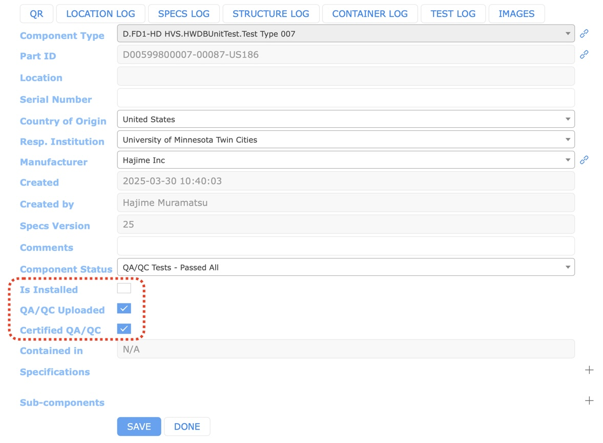
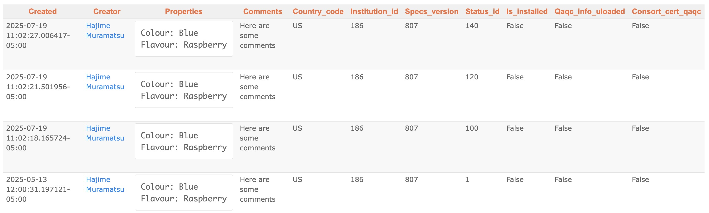

### This page describes various flags in the HWDB that are required to be set as a part of shipping handoff process when a shipment is sent to the warehouse in SD and eventually to SURF.

## Contents
>
>|-------------------------------------+------------------|
>| Section                             | Description      |
>|-------------------------------------+------------------|
>| [The Two Key Flags](#the-two-key-flags) | The two flags that are required to certify a shipment  |
>|-------------------------------------+------------------|
>| &emsp; [Who sets these two flags](#who-sets-these-two-flags) |  |
>|-------------------------------------+------------------|
>| [Requirement for Consortium Certified QA/QC to be "Yes"](#requirement-for-consortium-certified-qaqc-to-be-yes) | Introduction of the 10 Component statuses |
>|-------------------------------------+------------------|
>|-------------------------------------+------------------|
>| &emsp; [Who sets Component Status and How](#who-sets-component-status-and-how) |  |
>|-------------------------------------+------------------|
>| &emsp; [Treatment of components with Non-conforming](#treatment-of-components-with-non-conforming) | How a component with non-conforming status should be treated |
>|-------------------------------------+------------------|
>| [History of Flags](#history-of-flags) | How to view logs of flags (who changes and when)  |
>|-------------------------------------+------------------|
{: .checklist}

 

## The Two Key Flags

Every component that is sent to the warehouse in SD and eventually to SURF must have the two flags to be "Yes",
including a shipment box that contains it:
- **Consortium Certified QA/QC**
- **All QA/QC Test and Documentation Uploaded**

These flags are binary (Yes or No) and can be easily set via either the WEB-UI (or the REST API) in an Item View of the HWDB as shown below.

{: .image-with-shadow}{: width="70%"}

 

As for setting via the REST API, please refer to [Session 5]({{ page.root }}/05-Data-Management-REST-API/index.html#updating-flags-by-patching-an-items).

>## **Key behavior of the HWDB:**
> When all contents are linked properly to their own shipment box, then one could simply set these two flags to be "Yes" on a shipment box only.
> The HWDB then will automatically certify all of the linked components by propagating the "Yes" to those linked components.
{: .prereq}

### Who sets these two flags

A **Consortium QA Representative (QA Rep.)** must set these two flags in the HWDB.
Thus, this person must be knowledgeable about the components and their corresponding tests and documentations.

We also believe that, in a long term, it is likely too much to ask one person to handle this task.
Thus, we strongly recommend each consortium to form a group of QA Reps.

[back to top](#contents)

 

## Requirement for Consortium Certified QA/QC to be "Yes"

Going back to the above Item View of the HWDB, we can also see another flag (field), "Component Status".
There are 10 choices to be selected in Component Status:
- Status Unknown (initial value)
- **In Fabrication**
- **Waiting on QA/QC Tests**
- **QA/QC Tests - Passed All**
- QA/QC Tests - Non-conforming
- **QA/QC Tests - Use As Is**
- Broken or Need Repair
- In Repair
- In Rework
- Permanently Unavailable

>## **Key behavior of the HWDB:**
> - Only components with statuses in **bold** in the above list are allowed to be linked in the HWDB.
> - When a new component is created in the HWDB, its initial Component Status is always Status Unknown.
{: .prereq}

In order to set **Consortium Certified QA/QC** to be "Yes", a component must have one of the two Component Statuses:
- QA/QC Tests - Passed All
- QA/QC Tests - Use As Is

### Who sets Component Status and How

A component status flag should be set by a local QA/QC-test leader at each testing site.
To change these Component Status Flags, again, there are two ways:
- via the REST API: Please refer to this page; [Updating Flags by Patching an Item(s)]({{ page.root }}/05-Data-Management-REST-API/index.html#updating-flags-by-patching-an-items).

### Treatment of components with Non-conforming

All failed components need to be flagged with **QA/QC Tests - Non-conforming**.
Subsequently, they could become one of the followings:
- **Use As Is** : In order to have this condition, a supporting documentation needs to be uploaded to the HWDB.
- **In Rework** : It is the case when the component is expected to be meeting 100% of its original specification after rework.
No need of having an approval. And it would likely become **QA/QC Tests - Passed All**.
- **In Repair** : This is the case when the component could be fixed, but likely not meeting 100% of its original specification.
It needs to be approved by a design authority and a supporting documentation needs to be uploaded.
Eventually its component would become **QA/QC Tests - Use As Is** or possibly **Permanently Unavailable**.
- **Permanently Unavailable** : It is what it is.

[back to top](#contents)

 

## History of Flags

A history of who changes which flag is recorded in the HWDB and can be viewed easily from an Item View page.
In an Item View, clicking **SPECS LOG** takes you to a page like the one shown below.

- The first column shows date/time of when a flag is changed.
- The 2nd column shows who changes a flag.
- The column labeled as **Status_id** shows an ID of **Component Status**.\
  As for values of the IDs, again, please refer to [Updating Flags by Patching an Item(s)]({{ page.root }}/05-Data-Management-REST-API/index.html#updating-flags-by-patching-an-items).

- **Qaqc_info_uploaded** represents the **All QA/QC Test and Documentation Uploaded**.
- **Consort_cert_qaqc** represents the **Consortium Certified QA/QC**.

{: .image-with-shadow}{: width="100%"}

[back to top](#contents)

 



