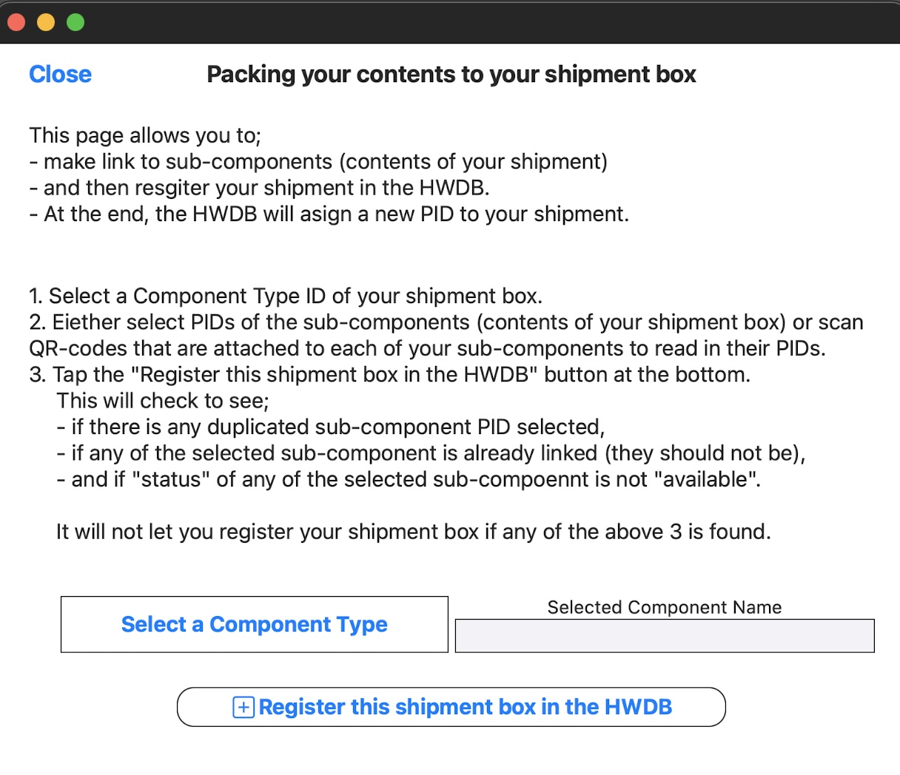
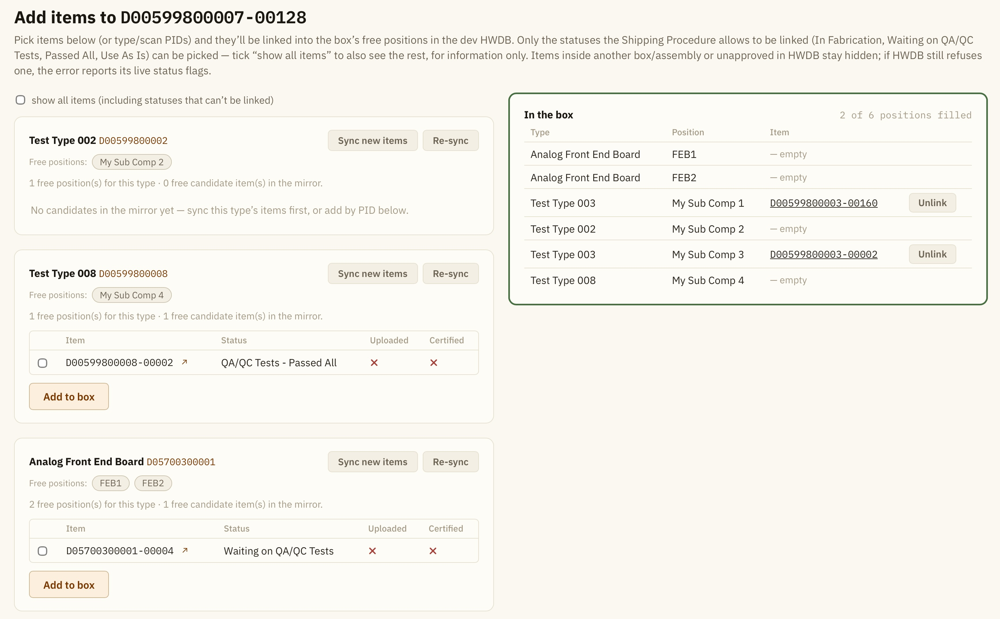
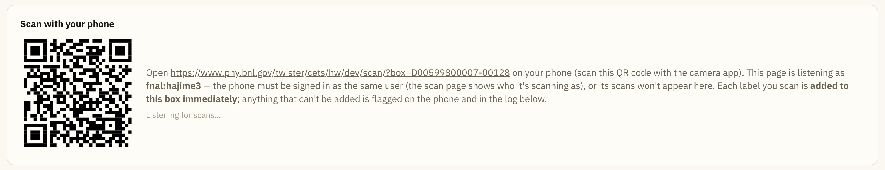
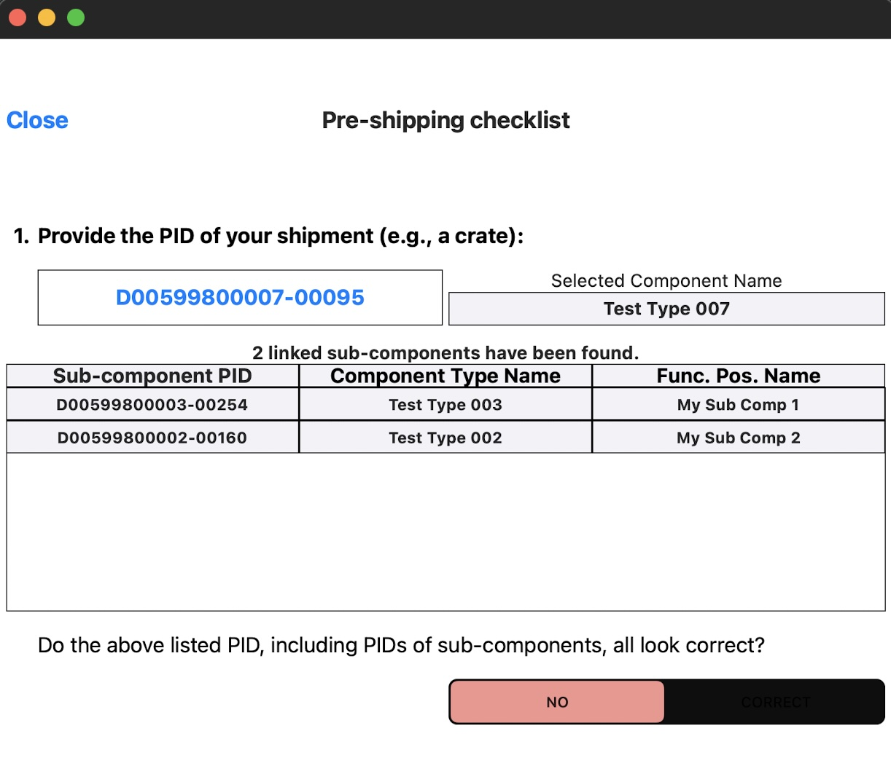

### Still working on this page...

### This page describes the DUNE Shipping checklists which must be filled out when one needs to ship DUNE components to the warehouse in Rapid City, SD (or even directly to SURF).

 

## Contents
>
>|-------------------------------------+------------------|
>| Section                             | Description      |
>|-------------------------------------+------------------|
>| [Packing checklist](#packing-checklist) |  to register your shipment box in the HWDB |
>|-------------------------------------+------------------|
>| [Pre-shipping checklist](#pre-shipping-checklist) | to notify the FD Logistics team and generate a shipping QR-code |
>|-------------------------------------+------------------|
>| [Shipping checklist](#shipping-checklist) |  to send shipping docs to  the FD Logistics team and request for the final shipping approval |
>|-------------------------------------+------------------|
>| [In-Transit checklist](#in-transit-checklist) |  to update location of your shipment |
>|-------------------------------------+------------------|
>| [Receiving checklist](#receiving-checklist) | to be filled when shipment arrives its final destination |
>|-------------------------------------+------------------|
{: .checklist}

## The two apps and word documents

## Five checklists and its menu page

Tapping **Shipment Tracker** in the **home page** takes you to the shipping checklist menu page as shown below:

{: .image-with-shadow}{: width="50%"}

We'll go through each of the five checklists in the following sections.
In general, all provided information persists through out the entire shipping process, so that one could
resume the process from anywhere, as long as you don'y **logout** from the app or **kill** the app.

When you need to refresh the provided information, e.g., to start to prepare for a new shipment, come to
this menu page and tap the **Remove Shipment Info** button.

## Packing checklist:

This checklist will prepare you to assign a PID to your shipment box, while making links from the assigned PID to
each of your sub-components that are contained inside of your shipment box.

**Cation:** If your shipment box already has its PID assigned and has links to its contents (sub-components),
please skip this checklist and start from the **Pre-shipping** checklist.

You should already know what the Component Type of your shipment box is and should have a list of PIDs for
your sub-components (the contents of your shipment box) before proceeding.

{: .image-with-shadow}{: width="50%"}

### Packing checklist - Step 1:

Tap the **Select a Component Type** button. This will take you to [PID Display session]({{ page.root }}/06-Using-iPad-App/index.html#pid-display) to let you select the **Component Type** of your shipment box.

### Packing checklist - Step 2:

Once you select a Component Type in PID Display, you will be taken back to the Packing checklist.
At this point, the selected Type ID and its Name should be displayed as seen below.

{: .image-with-shadow}{: width="50%"}

There should be also an additional table that shows the expected sub-component names (functional positions).
You need to select the corresponding PIDs for each of these sub-components.
To do this, you could either select them via PID Display or scan QR-codes that might be attached to each of the sub-components
using the iPad's camera.

### Packing checklist - Step 3:

Once you select PIDs for all of your sub-components, tap **Register this shipment box in the HWDB** button.
This will request the HWDB to assign a new PID to your shipment box and make the requested links to your sub-components.

When everything goes well, you should be seeing a message in red, stating that a new PID has been assigned as seen below.

{: .image-with-shadow}{: width="50%"}

   

[back to top](#contents)

## Pre-shipping checklist:

The goal of this checklist is to:
- gather information about your shipment and notify the FD Logistics team
- and generate a DUNE Shipping Sheet that contains the corresponding QR-code.

Pre-shipping checklist must be completed before filling out shipping checklist.

Also, background colors of unfilled boxes are in light pink initially. And the app won't let you proceed
as long as in light pink. They become white once they are filled out.

### Pre-shipping checklist - Step 1:

Start pre-shipping checklist by selecting the unique PID for your shipment box by tapping **Tap here to select the PID** button.
This will again take you to [PID Display session]({{ page.root }}/06-Using-iPad-App/index.html#pid-display) to let you select a PID.

Once you select a PID of your shipment box, you should be seeing a screen as shown below:

{: .image-with-shadow}{: width="50%"}

If they appear to be correct, answer "CORRECT" to the question by checking the box, whose background color will then turn into white.

   

[back to top](#contents)

## Shipping checklist:

   

[back to top](#contents)

## In-Transit checklist:

In normal shipping procedure (i.e., shipping to the warehouse and eventually to SURF), this checklist should be skipped.

The purpose of this checklist is only to update location information of the selected PID, which does not necessarily
correspond to a shipment box, but **any** component.
So when you only need to upload location of a component (e.g., relocating a component within underground SURF), you could use this checklist
to update its location.

### In-Transit checklist - Step 1:

Unless you have continuously worked from the pre-shipping (and/or shipping) checklist, it starts by scanning a QR-code.
Once a QR-code is properly scanned, it should display a list of sub-components, if any, and its location history, if any, as shown below.

{: .image-with-shadow}{: width="50%"}

### In-Transit checklist - Step 2:

Here, select a location (usually your current or latest), along with your local time, which is auto-translated into the US Central Time.
Tap **Update Location** button to record the information in the HWDB.

{: .image-with-shadow}{: width="50%"}

   

[back to top](#contents)

## Receiving checklist:

The purpose of this checklist is to update location information of both your shipment box and its contents,
and remove the links from your shipment box to its sub-components.
It will also notify its arrival to the POC person at the end.

### Receiving checklist - Step 1:

Just like In-Transit checklist, it starts by scanning a QR-code.
Once a QR-code is properly scanned, it should display a list of sub-components, if any, and its location history, if any, as shown below.

{: .image-with-shadow}{: width="50%"}

### Receiving checklist - Step 2:

Again just like in In-Transit checklist,
select a location (usually your current or latest), along with your local time, which is auto-translated into the US Central Time.
Tap **Update Location** button to record the information in the HWDB.

Notice that this will update not just the location of your shipment box, but **all** of your sub-components as well.

{: .image-with-shadow}{: width="50%"}

### Receiving checklist - Step 3:

Tap **Remove links** to un-do the links from your shipment box to your sub-components.

If you don't do this, your sub-components will not be able to link to their real parent(s)
when you start to assemble them!

{: .image-with-shadow}{: width="50%"}

### Receiving checklist - Step 4:

Tap **Email** to sen its arrival notification to the POC person.

This completes the shipping procedure.

{: .image-with-shadow}{: width="50%"}

   

[back to top](#contents)



