### This page describes the DUNE Shipping checklists which must be filled out when one needs to ship DUNE components to the warehouse in Rapid City, SD and eventually to SURF. The procedure can be also employed in the case of shipping to non-SURF destinations, including the case of transshipping to SURF.

 

## Contents
>
>|-------------------------------------+------------------|
>| Section                             | Description      |
>|-------------------------------------+------------------|
>| [The two apps and word document](#the-two-apps-and-word-document) |  Two apps to help users to follow the shipping procedure. A word-doc file is also available.  |
>|-------------------------------------+------------------|
>| [Packing checklist](#packing-checklist) | Assign a PID to a shipping box and link to its contents |
>|-------------------------------------+------------------|
>| [Pre-shipping checklist](#pre-shipping-checklist) | Collect info of your shipment, notify the FD Logitics team, and generate a DUNE Shipping Sheet (QR-code) |
>|-------------------------------------+------------------|
>| [Shipping checklist](#shipping-checklist) | Send shipping docs (Bill of Lading and Proforma Invoice) to the FD Logistics team to request for the final approval before shipping. Also update the location in the HWDB. |
>|-------------------------------------+------------------|
>| [Receiving checklist](#receiving-checklist) | Update the location in the HWDB, remove its sub-component links, and notify its arrival to the POC person |
>|-------------------------------------+------------------|
{: .checklist}

## The two apps and word document

We offer two applications, the [iPad App]({{ page.root }}/06-Using-iPad-App/index.html) and the [Python HWDB Tools]({{ page.root }}/07-Using-Python-Upload-Tool/index.html). These two apps help and enforce users to follow the shipping steps we describe below.

One could also either just follow the steps below or download the shipping procedure from [here](https://drive.google.com/file/d/1k7gG9VhwyT7_CrBE8PnrfWttH8xBy6cB/view?usp=share_link).

 

As for the two apps, please refer to their corresponding pages about how to obtain/install them.
We only briefly descrie how they should be initially configured here.

### iPad app setup

There isn't particularly a user needs to do.
Once log in as described [here]({{ page.root }}/06-Using-iPad-App/index.html), tap **Shipment Tracker** button on the very first page you see.
That takes you to the Shipment Tracker menu page as shown below.
From there, one could reach individual checklist pages (Packing, Pre-shipping, Shipping, and Receiving).

The app also produces various files, such as QR-code shipping sheet and csv files while filling checklists.
All produced files will be stored in /Tracker/Shipping/\<PID\>/ directory within its own app folder of your iPad.

In general, all provided information persists through out the entire shipping process, so that one could
resume the process from anywhere, as long as you don't logout from the app or kill the app.

When you need to refresh the provided information, e.g., to start to prepare for a new shipment, come to
this menu page and tap the **Remove Shipment Info** button.

### Python HWDB Upload Tool setup

Launch the shipment tracker by typing **hwdb-shipping**.
For the 1st time, you should then go **Preferences** where you should at least set up whether you like to connect to the development or production version of the HWDB in the HWDB Configuration plance as shown below. You can also setup your working directory, to which all produced files will be stored.

Once you are done with configuring the tracker, goto -> Option -> New Window, where you provide a PID of your shipping box. And then click "find". If it finds the PID in the HWDB, click "Continue" to proceed.

You should be then seeing the checklist menu as shown below.

iPad app             |  Python HWDB Upload Tool
:-------------------------:|:-------------------------:
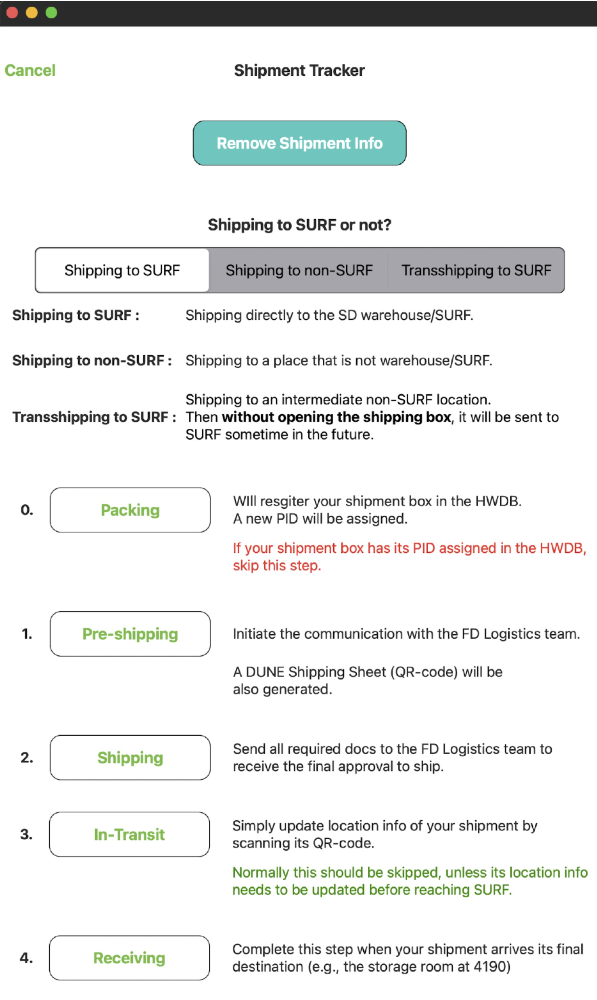{: .image-with-shadow}{: width="100%"}  |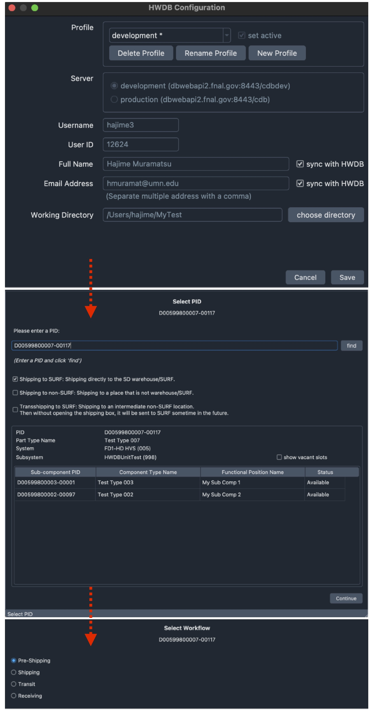{: .image-with-shadow}{: width="100%"}

  

Notice that, in both apps, you have three routes to choose from:
- Shipping to SURF: Shipping directly to the SD warehouse/SURF.
- Shipping to non-SURF: Shipping to non-SURF: Shipping to a place that is not warehouse/SURF.
- Transshipping to SURF: Shipping to an intermediate non-SURF location. Then without opening the shipping box, it will be sent to SURF sometime in the future.
- From Vendor: Shipping directly from Vendor to SURF.

You need to choose one of the four (**the From Vendor route is not available in the apps, yet**. We are currently in the process of updating the apps).
Then depending on your selection, some of the steps we describe below will be skipped and/or different. We will point out when steps are skipped below.

For rest of this page, we are going to describe the four checklists, Packing, Pre-shipping, Shipping, and Receiving.

   

[back to top](#contents)

## Packing checklist:

A PID needs to be assigned to every shipping box.
And its contents, which are treated as **sub-components** in the HWDB, need to be linked to their parent, the shipping box.

And that is basically all you need to do in the packing checklist.
It prepares you to assign a PID to your shipment box, while making links from the assigned PID to
each of your sub-components that are contained inside of your shipment box.

>## **Skipping this checklist?**
>If your shipping box already has its PID assigned and has links to its contents (sub-components),
>please skip this checklist and start from the **Pre-shipping** checklist.
{: .prereq}

<!--
We show the Packing checklist of the iPad app as a reference below. There, user selets a Component Type ID, selects PIDs of the expected sub-components, and then request the HWDB to assign a new PID to its shipping box.

The Python HWDB Upload Tool doesn't offer Packing checklist at this point.

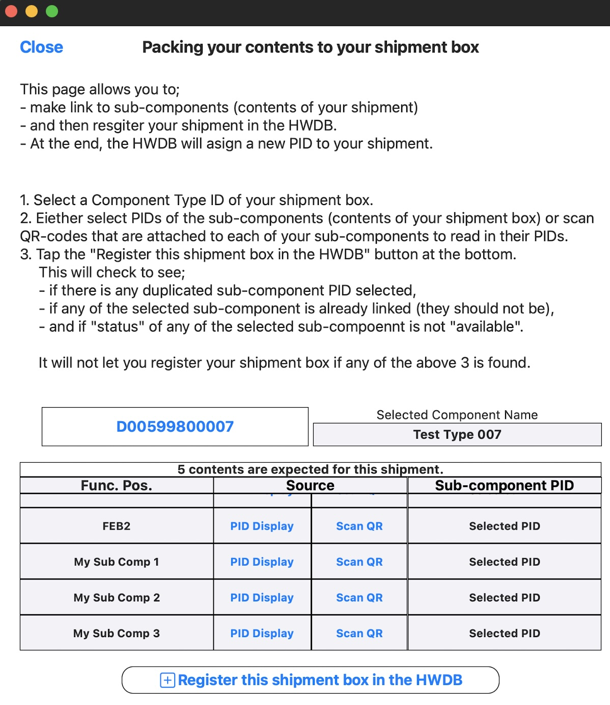{: .image-with-shadow}{: width="50%"}
-->

   

[back to top](#contents)

## Pre-shipping checklist:

The goal of this checklist is to:
- certify your shipment by going through [Shipping handoff process]({{ page.root }}/shippinghandoff/index.html)
- gather information about your shipment and notify the FD Logistics team about the shipment
- and generate a DUNE Shipping Sheet that contains the corresponding QR-code.

Pre-shipping checklist must be completed before filling out shipping checklist.

### Gathering information of the shipment, POC, and QA Representative

> ## Certification of shipment via consortium
>
> The very first thing you need to do in Pre-shipping checklist is to have your shipment **consortium-certified**.
> 
> Please refer to [Shipping handoff process]({{ page.root }}/shippinghandoff/index.html) to learn;
> - how it can be certified
> - and who certifies.
{: .testimonial}

Once your shipping box is certified:
- Provide the name and email address of your Consortium QA Representative who has certified your shipment.
- Also provide the name and email address of your point of contact (POC) person.
This person will be contacted in case of shipment failure.

> ## If your shipment is sent directly from vendor to SD Warehouse/SURF
>
> Obviously there is no way to perform the certification process in this case.\
> Skip this process entirely. And you will need to go through the process once your shipment is arrived at SURF\
> (i.e., when you fill the Receiving checklist).
>
{: .callout}

<!--
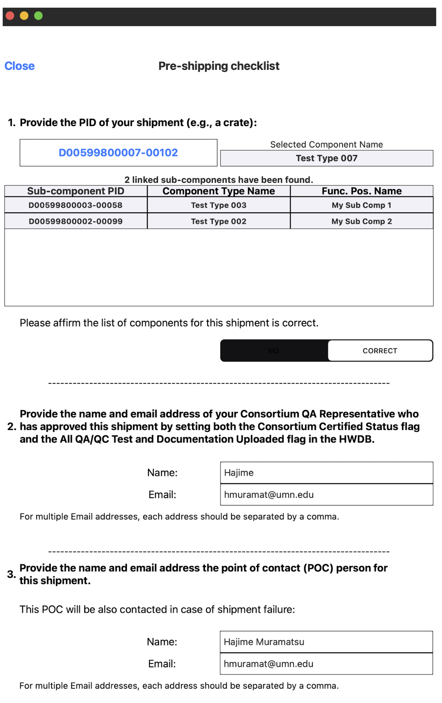{: .image-with-shadow}{: width="50%"}
-->

   

[back to top](#contents)

### Shipment origin, destination, size, weight, and arrival date

Next, we need to tell whether the shipment is domestic or international.

>## **For international shipment**
>Harmonized Tariff Schedule (HTS) code must be additionally provided.
> - Use the HTS code that your institution or lab used in the past successfully.
> - Else, for Equipment and Materials for the LBNF & DUNE Scientific Projects, use **8543.90.8845** (parts of particle accelerators).
{: .prereq}

You will then need to provide the followings:
- Shipment's origin
- Shipment's destination
- Dimension (length x width x height) of your shipment
- Weight of your shipment
- Name of your Freight Forwarder
- Mode of transportation
- Expected arrival date

<!--
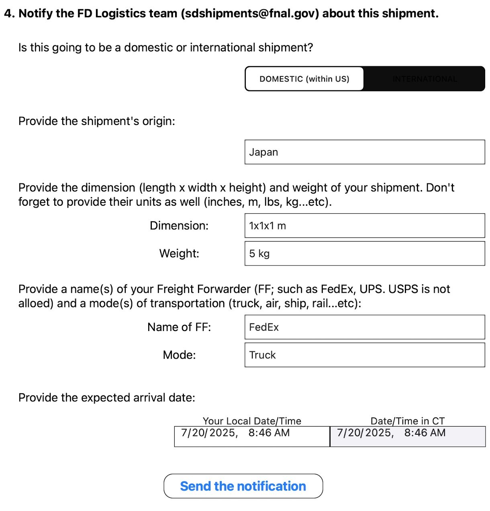{: .image-with-shadow}{: width="50%"}
-->

   

[back to top](#contents)

### Send an acknowledgment to the FD Logistics team

We are now ready to send an acknowledgment to the FD Logistics team to let them know your shipment is coming.
Send an email like the following to **sdshipments@fnal.gov**, while attaching a csv-formatted file that contains information of what you have provided so far.

A suggested acknowledgment email message:
<pre>
Dear FD Logistics team,

I, Hajime Muramatsu, would like to request a new shipment.
This shipment has been approved by the Consortium QA Representative, Hajime (hmuramat@umn.edu).

Please find the attached csv file, D00599800007-00102-preshipping-2025-07-20-09-23.csv, that contains the required information for this shipment.

Should there be any issue with this shipment, email to the following address(es):

- hmuramat@umn.edu

Hajime Muramatsu
</pre>

  
 
And here is an example of such csv file that should be attached to the above email message:
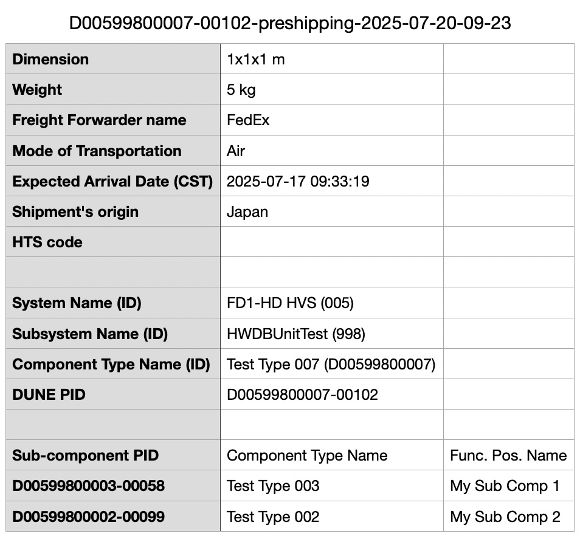{: .image-with-shadow}{: width="50%"}

   

[back to top](#contents)

### Wait to hear back from the FD Logistics team

>You need to wait to hear back from the FD Logistics team.
{: .prereq}

Once they respond:
- Record the name of the person who responded and its date/time.
- Perform one last visual inspection on your shipping box as well.

<!--
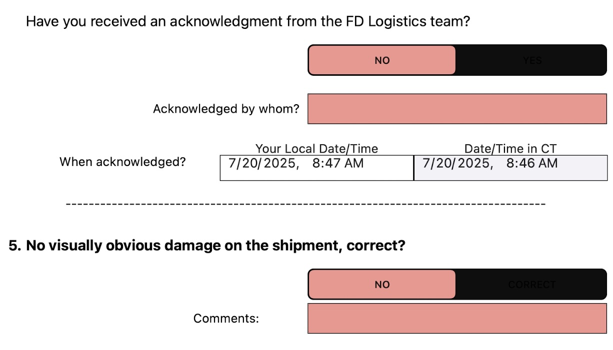{: .image-with-shadow}{: width="50%"}
-->

   

[back to top](#contents)

### Generate a DUNE Shipping Sheet and upload it to the HWDB

We are now ready to produce a DUNE Shipping Sheet. It needs to have:
- A **QR-code** in which the PID of your shipping box is embedded.
- Similarly, a **bar-code** of the PID (folks at the SD warehouse prefers bar-codes to scan).
- Right below the two codes, display:
  - **A version of the HWDB** you are using. It's either pro (production) or dev (development).
  - The corresponding **Component Type Name**.
  - The **PID**.
- Information of the **POC** person.
- Information of the **System** and **Subsystem** of your shipping box.
- Information of your linked **sub-components**.

An example of such sheet is shown below.
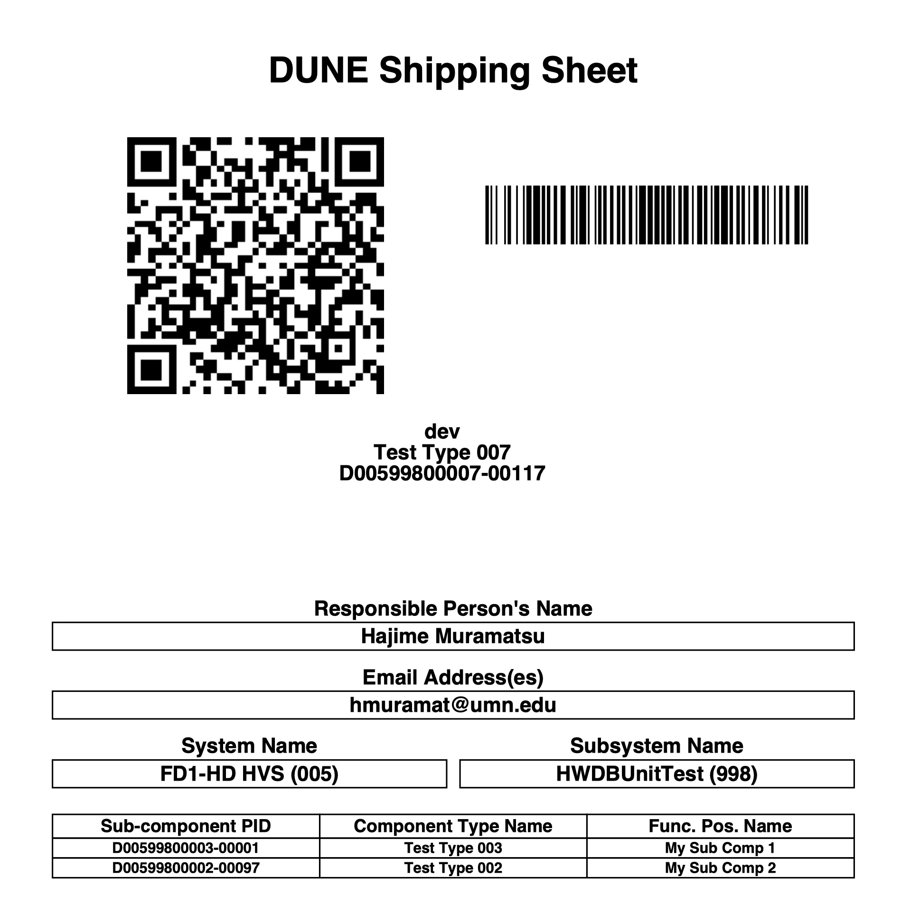{: .image-with-shadow}{: width="50%"}

  
 
This sheet then needs to be uploaded to the HWDB, under the **IMAGES** of the PID of your shipping box.

One should also print this out in a letter (or A4) size and attach it to your shipping box, along with its bill of lading. This is one of the steps in the Shipping checklist.

   

[back to top](#contents)

### Upload the rest of the info to the HWDB

We are almost done with the Pre-shipping checklist (the longest checklist!).

The contents of the Pre-shipping checklist needs to be uploaded to the Item Specifications of your shipping box.
An example is shown below in the JSON format:
<pre>
"DATA": {
  "Pre-Shipping Checklist": [
    {"QA Rep name": "Hajime Muramatsu"},
	{"QA Rep Email": [
		"hmuramat@umn.edu"
	]}
	{"POC name": "Hajime Muramatsu"},
	{"POC Email": [
		"hmuramat@umn.edu",
		"hajime.muramatsu@gmail.com"
	]}, 
	{"System Name (ID)": "FD1-HD HVS (005)"},
	{"Subsystem Name (ID)": "HWDBUnitTest (998)"},
	{"Component Type Name (ID)": "Test Type 007 (D00599800007)"}, 
	{"DUNE PID": "D00599800007-00075"}, 
	{"HTS code": "78906"}, 
	{"Origin of this shipment": "University of Minnesota"}, 
	{"Destination of this shipment": "SD Warehouse/SURF"}, 
	{"Dimension of this shipment": "9 x 10 x 3 m"},
	{"Weight of this shipment": "89 kg"}, 
	{"Freight Forwarder name": "FedEx"}, 
	{"Mode of Transportation": "truck"}, 
	{"Expected Arrival Date (CT)": "2025-01-19 17:10:23"}, 
	{"FD Logistics team acknoledgement (name)": "Hajime"},
	{"FD Logistics team acknoledgement (date in CT)": "2025-01-19 17:10:23"}, 
	{"Visual Inspection (YES = no damage)": "YES"}, 
	{"Image ID for this Shipping Sheet": "cf63510c-d6bb-11ef-a171-3bc8bcafd26b"}
  ],
  "SubPIDs": [ 
	{"(Test Type 002 (My Sub Comp 2)": "D00599800002-00057)"},
	{"(Test Type 003 (My Sub Comp 1)": "D00599800003-00001)"}
  ]
 }
</pre>

   

> ## If you are not shipping to SD Warehouse/SURF
>
> Skip the all steps that are related to communicate with the FD Logistics team.
> - No need to provide info of your Consortium QA representative.
> - No need to provide info on size, weight, Freight Forwarder, abd expected arrival date of your shipment.
> - No need to send an acknowledgement to the FD Logistics team.
>
> You are still encouraged to do the following:
> - Provide info of your POC person.
> - Provide origin and destination of your shipment.
> - Generate the DUNE Shipping Sheet and upload it to the HWDB.
> - Upload the corresponding pre-shipping checklist.
{: .callout}

   

[back to top](#contents)

## Shipping checklist:

### Bill of Lading and Proforma Invoice

You should obtain a Bill of Lading (BoL) electronically. This is needed in order to upload it to the HWDB.
A photo of BoL would be fine as well if it is sufficiently high-resolution.

For your BoL, request your carrier to employ a BoL type, "Through Seaway BoL" or "Through BoL with an express release".

Also request your carrier to include the shipping box PID and its Component Type Name in its BoL.

>If it is your shipping department who interacts with the Freight Forwarder office on behalf of you,
>make sure to make them to follow the above procedure.
{: .prereq}

 

For an international shipment, a **Proforma Invoice** (i.e., commercial invoice) is required additionally.
Again, make sure to request your carrier to include the shipping box PID and its Component Type Name in the invoice.
And request them to send you the finalized invoice electronically as well.

   

[back to top](#contents)

### Recipient (Warehouse) address

The warehouse address should be:
>ATTEN: LBNF/DUNE\
>Dakota Warehouse\
>1313 E Saint Patrick St.\
>Rapid City, SD 57701
>
>PH: 605-389-3344
{: .prereq}
Of course, if it is an international shipment, don't forget to add **USA** at the end of the address
and the phone number should be 1-605-389-3344.

> ## If your shipment is sent directly from vendor to SD Warehouse/SURF
>
> The recipient address should be the following (just add \<PID\> as shown below):
>
>ATTN: LBNF/DUNE &nbsp;&nbsp;\<PID\>\
>Dakota Warehouse\
>1313 E Saint Patrick St.\
>Rapid City, SD 57701
>
>PH: 605-389-3344
>
>where \<PID\> should be the PID of your shipping box. This way, the FD Logistics team would recognize
>what the shipment is when they receive it at the warehouse.
{: .callout}

   

> If you are sending in an envelope form which it is not possible to attach your shipping label to,\
> you should also include \<PID\> in your recipient address.
{: .prereq}

### Sending BoL (and Proforma invoice) to the FD Logistics team

We are now ready to send a request for the final approval for this shipment to the FD Logistics team.

Send a request to **sdshipments@fnal.gov** with your BoL attached (Proforma Invoice as well if it is international).
Again, an example email message is shown below:
<pre>
Dear FD Logistics team,

I, Hajime (POC), would like to request your final approval for this shipment.
The DUNE PID for this shipment is D00599800007-00102.

Please find the attached file;
- BoL_hajime_2025-07-20-10-17.png for BoL.
Should there be any issue with this shipment, email to:

- hmuramat@umn.edu

Hajime (POC)
</pre>

   

[back to top](#contents)

### Wait to hear back from the FD Logistics team

>You must wait to hear back from the FD Logistics team before proceeding further.
{: .prereq}

Once you are approved to ship:
- Record the name of the person who approved
- Approved Date/Time
- A photo of the email message that approves your shipment

### Attach your DUNE Shipping Sheet and ship it!

Before you finally ship it, make sure the followings are done:

- Attach your DUNE Shipping Sheet (the QR-code) is attached, along with your BoL
  (and Proforma Invoice for international shipment).
- Make sure that your shipment box (e.g., crate, cargo) is adequately insured for transit.

If all are done, ship it.

### Update location information of your shipment in the HWDB

Don't forget to update location of your shipment in the HWDB at this point.
Once it is shipped, the location of your shipping box should be **In-Transit**.

### Upload what you have provided in the Shipping checklist to the HWDB

Upload the followings to the HWDB, under the **IMAGES** of the PID of your shipping box:
- BoL (and Proforma Invoice if it is international shipment)
- Photo of the approval email message

And also upload the following information to the Item Specifications of your shipping box:
- Image ID of your uploaded BoL (again Proforma Invoice as well if it is international shipment)
- Image ID of the photo of the approval email message
- Name of the person who gave the final approval
- Approved Date/Time
- A statement that you have attached your DUNE Shipping Sheet to your shipping box
- A statement that your shipment has been adequately insured for transit

Again, we provide an example in the JSON format below:
<pre>
"DATA": {
  "Shipping Checklist": [
	{"POC name": "Hajime Muramatsu"}, 
	{"POC Email": [
		"hmuramat@umn.edu",
		"hajime.muramatsu@gmail.com"
	]}, 
	{"System Name (ID)": "FD1-HD HVS (005)"}, 
	{"Subsystem Name (ID)": "HWDBUnitTest (998)"}
	{"Component Type Name (ID)": "Test Type 007 (D00599800007)"}
	{"DUNE PID": "D00599800007-00075"}
	{"Image ID for BoL": "864966a0-d6c0-11ef-94fc-5fad7be5af4a"}
	{"Image ID for Proforma Invoice": "88024d18-d6c0-11ef-9904-0bc5dd4b6979"}
	{"Image ID for the final approval message": "93e250ba-d6c0-11ef-a5e4-3349190277b1"}
	{"FD Logistics team final approval (name)": "Hajime"}
	{"FD Logistics team final approval (date in CST)": "2025-01-19 17:51:14"}
	{"DUNE Shipping Sheet has been attached": "YES"}
	{"This shipment has been adequately insured for transit": "YES"}
  ]
 }
</pre>

   

> ## If you are not shipping to SD Warehouse/SURF
>
> Skip the all steps that are related to communicate with the FD Logistics team.
>
> That is, you could skip all steps described above for Shipping checklist, except to update
> location info of your shipment in the HWDB.
{: .callout}

   

[back to top](#contents)

## Receiving checklist:

When your shipping box arrives at its final destination, the followings must be done.
- Update location information of its location in the HWDB. Enter its **current** location in the HWDB.
- Remove all of the links to its sub-components in the HWDB.
- Send an email to the POC person(s) to notify its arrival at its final destination.

   

> ## If you are transshipping to SD Warehouse/SURF
>
> Do not remove the sub-component links.
>
> The links should be removed when your shipment eventually arrives at SURF after being transshipped.
{: .callout}

   

> ## If your shipment is sent directly from vendor to SD Warehouse/SURF
>
> As you skipped the certification process in the Pre-shipping checklist,
> you now need to go through this step to certify your shipment.
> 
> Please refer to [Shipping handoff process]({{ page.root }}/shippinghandoff/index.html) to learn;
> - how it can be certified
> - and who certifies.
>
{: .callout}

<!--

The purpose of this checklist is to update location information of both your shipment box and its contents,
and remove the links from your shipment box to its sub-components.
It will also notify its arrival to the POC person at the end.

### Receiving checklist - Step 1:

Just like In-Transit checklist, it starts by scanning a QR-code.
Once a QR-code is properly scanned, it should display a list of sub-components, if any, and its location history, if any, as shown below.

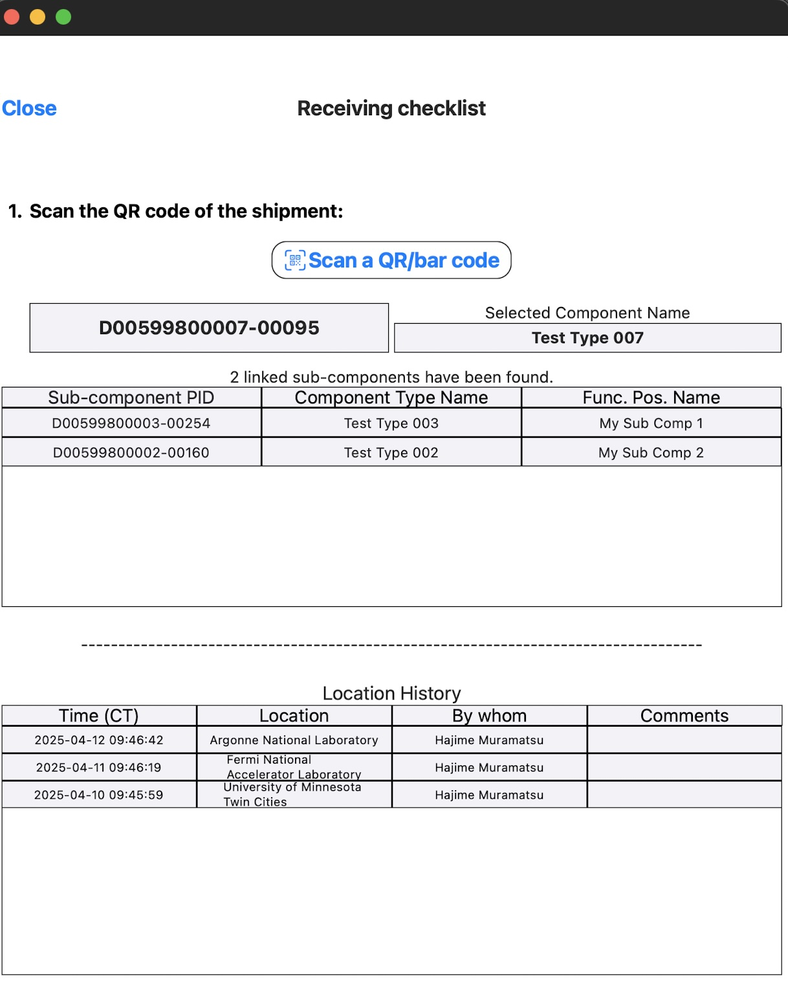{: .image-with-shadow}{: width="50%"}

### Receiving checklist - Step 2:

Again just like in In-Transit checklist,
select a location (usually your current or latest), along with your local time, which is auto-translated into the US Central Time.
Tap **Update Location** button to record the information in the HWDB.

Notice that this will update not just the location of your shipment box, but **all** of your sub-components as well.

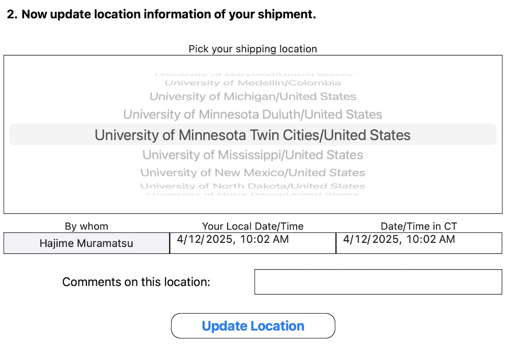{: .image-with-shadow}{: width="50%"}

### Receiving checklist - Step 3:

Tap **Remove links** to un-do the links from your shipment box to your sub-components.

If you don't do this, your sub-components will not be able to link to their real parent(s)
when you start to assemble them!

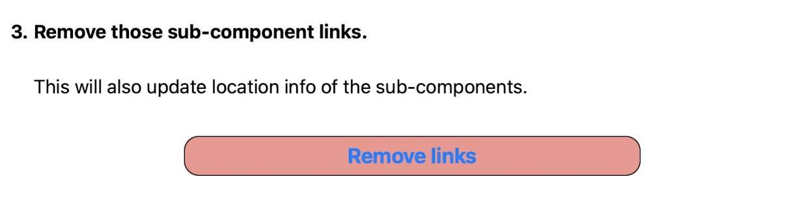{: .image-with-shadow}{: width="50%"}

### Receiving checklist - Step 4:

Tap **Email** to sen its arrival notification to the POC person.

This completes the shipping procedure.

{: .image-with-shadow}{: width="50%"}

   

[back to top](#contents)

-->

   

[back to top](#contents)

<!--

## In-Transit checklist:

In normal shipping procedure (i.e., shipping to the warehouse and eventually to SURF), this checklist should be skipped.

The purpose of this checklist is only to update location information of the selected PID, which does not necessarily
correspond to a shipment box, but **any** component.
So when you only need to upload location of a component (e.g., relocating a component within underground SURF), you could use this checklist
to update its location.

### In-Transit checklist - Step 1:

Unless you have continuously worked from the pre-shipping (and/or shipping) checklist, it starts by scanning a QR-code.
Once a QR-code is properly scanned, it should display a list of sub-components, if any, and its location history, if any, as shown below.

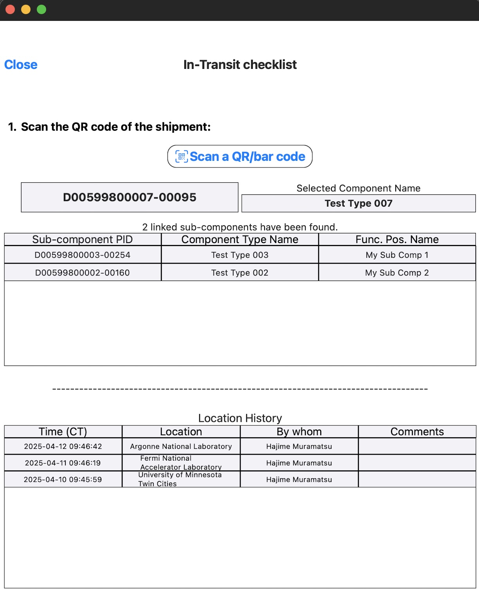{: .image-with-shadow}{: width="50%"}

### In-Transit checklist - Step 2:

Here, select a location (usually your current or latest), along with your local time, which is auto-translated into the US Central Time.
Tap **Update Location** button to record the information in the HWDB.

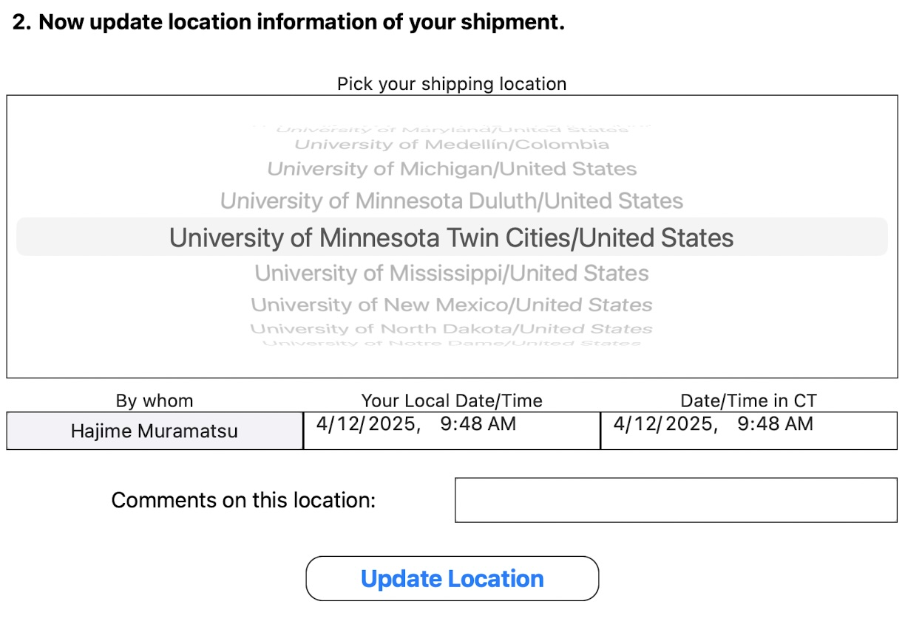{: .image-with-shadow}{: width="50%"}

   

[back to top](#contents)

-->



