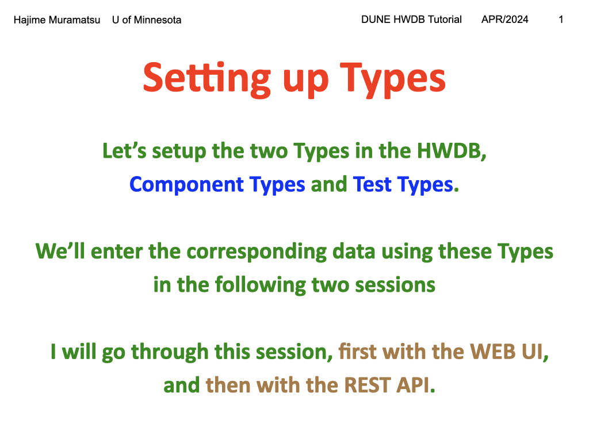
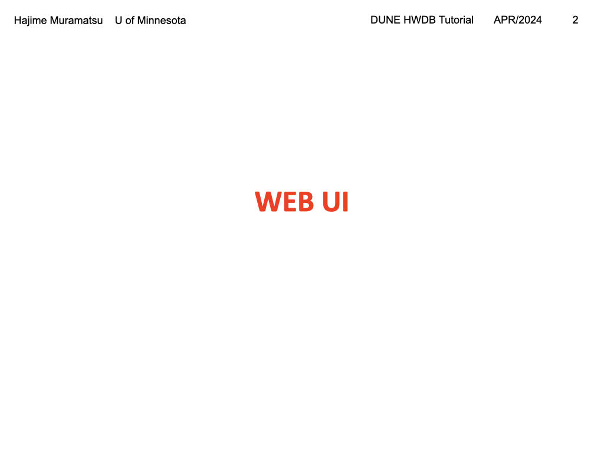
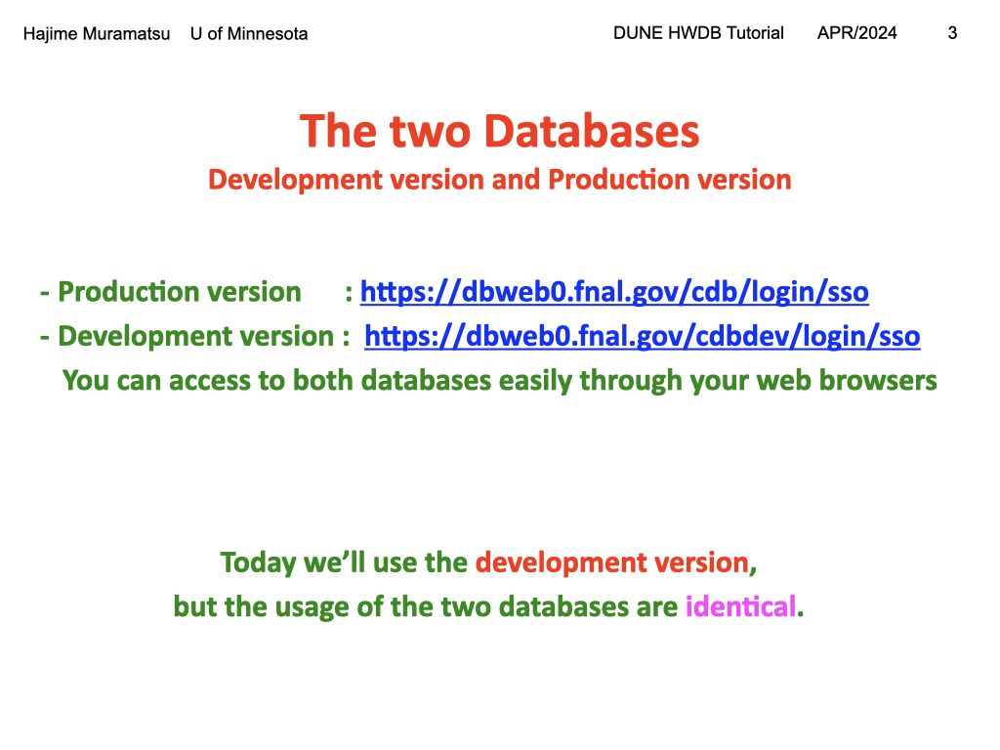

<!---  Note, there are three dashes for markdown comment vs. two for HTML
Scripts for slideviewer used is Software Carpentries templates.                                        

Often first offerings of lessons extend from Powerpoint, Key, or Slides.                                   
The slideviewrer.md (_extras), slideviewer.js (_includes), and slideviewer.css (_includes) are examples   
for building markdown lessons that offer a popup window of a slide that has text and an associate slide   
which allows lessons to evolve naturally over time to become a more complete SC lesson.                   
David DeMuth, Jr., DUNE June, 2024     

Slides exported from PPT, Key, or Slides will be iterated numerically as .jpeg, for example the slideshow 
Setting-up-Types.key is exported to the folder/files as                                                   
Setting-up-Types/Setting-up-Types.001.jpeg, Setting-up-Types/Setting-up-Types.002.jpeg, etc.              
The idea with this script is that only the iteration index slideNum need to be passed, e.g. passing 001   
will be enough to reference the slide to be popped up.
--->

### Testing Image Embeds

Referencing fig directory as relative
~~~
{: .image-with-shadow}{: width="85%"}
~~~
{: .source}

{: .image-with-shadow}{: width="85%"}

#### Testing popup slide

Click on the image to open in window, right click to open in you window or tab.
~~~

~~~
{: .source}

### Testing Acordion

> #### Slide 1
>
>~~~
>>Click on the boxed downarrow to reveal the slide image.
>>
>>>{: .solution}
>>{: .challenge}
>~~~
>{: .source}
> Click on the boxed downarrow to reveal the slide image.
>> ## Slide Reveal
>>  
>>
>> Reference: Full Slide Show Link Here
>>{: output}
>{: .solution}
{: .challenge}

#### Blocked as alternative syntax highlighting

> #### Alternate Syntax Highlighting
>
>~~~
> 
>~~~
>{: .source}
> 
>
> 
>
{: .callout}

> Before inserting Items and their corresponding Tests, we need to define a Component Type and Test Type, respectively.
We will do so, first with the WEB UI, and then through the REST API in this section.
>
>> ## Slide Reveal
>>  
>>
>> Reference:  [Slide Show](../fig/Setting-up-Types-v1.key)
>>{: output}
>{: .solution}
{: .challenge}

> First the WEB UI approach.
>> ## Slide Reveal
>>  
>>
>>  Reference:  [Slide Show](../fig/Setting-up-Types-v1.key)
>>{: output}
>{: .solution}
{: .challenge}

> One can access to the two versions of the HWDB from these addresses.

We will use the development version in this session.
>> ## Slide Reveal
>>  
>>
>>  Reference:  [Slide Show](../fig/Setting-up-Types-v1.key)
>>{: output}
>{: .solution}
{: .challenge}

** Experiment with pop-up Figures

** HTML resize

** HTML popup button using JS referencing URL

<button onclick="openImagePopup()">Click to Open Image Popup</button>

** HTML popup button using JS referencing local file

<button onclick="openImagePopup()">Click to Open Image Popup</button>

** HTML popup button using JS referencing local file with image embedded in the button

<button onclick="openImagePopup()">Click to Open Image Popup</button>

<button onclick="openImagePopup()" style="background-image:url('https://raw.githubusercontent.com/DUNE/computing-HWDB/gh-pages/fig/Setting-up-Types/Admin-list.png')">x</button>

<button onclick="openImagePopup()" style="background-image:url('../fig/Setting-up-Types/Admin-list.png')">&nbsp;</button>

<button onclick="openImagePopup()">&nbsp;</button>

START

Two column with thumbnail example

  

Lorem ipsum dolor sit amet, consectetur adipiscing elit, sed do eiusmod tempor incididunt ut labore et dolore magna aliqua. Ut enim ad minim veniam, quis nostrud exercitation ullamco laboris nisi ut aliquip ex ea commodo consequat. Duis aute irure dolor in reprehenderit in voluptate velit esse cillum dolore eu fugiat nulla pariatur. Excepteur sint occaecat cupidatat non proident, sunt in culpa qui officia deserunt mollit anim id est laborum.

Lorem ipsum dolor sit amet, consectetur adipiscing elit, sed do eiusmod tempor incididunt ut labore et dolore magna aliqua. Ut enim ad minim veniam, quis nostrud exercitation ullamco laboris nisi ut aliquip ex ea commodo consequat. Duis aute irure dolor in reprehenderit in voluptate velit esse cillum dolore eu fugiat nulla pariatur. Excepteur sint occaecat cupidatat non proident, sunt in culpa qui officia deserunt mollit anim id est laborum.

Lorem ipsum dolor sit amet, consectetur adipiscing elit, sed do eiusmod tempor incididunt ut labore et dolore magna aliqua. Ut enim ad minim veniam, quis nostrud exercitation ullamco laboris nisi ut aliquip ex ea commodo consequat. Duis aute irure dolor in reprehenderit in voluptate velit esse cillum dolore eu fugiat nulla pariatur. Excepteur sint occaecat cupidatat non proident, sunt in culpa qui officia deserunt mollit anim id est laborum.

  

  

    
    <button onclick="openImagePopup2()">Popup</button>

  

STOP

Lorem ipsum dolor sit amet, consectetur adipiscing elit, sed do eiusmod tempor incididunt ut labore et dolore magna aliqua. Ut enim ad minim veniam, quis nostrud exercitation ullamco laboris nisi ut aliquip ex ea commodo consequat. Duis aute irure dolor in reprehenderit in voluptate velit esse cillum dolore eu fugiat nulla pariatur. Excepteur sint occaecat cupidatat non proident, sunt in culpa qui officia deserunt mollit anim id est laborum.


