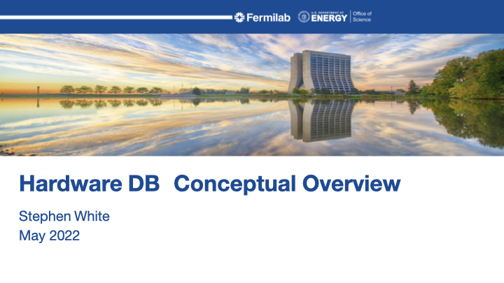
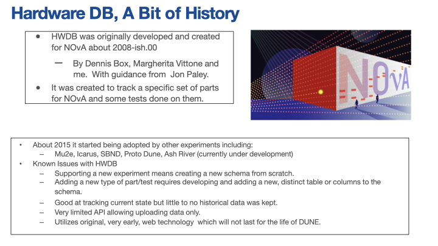
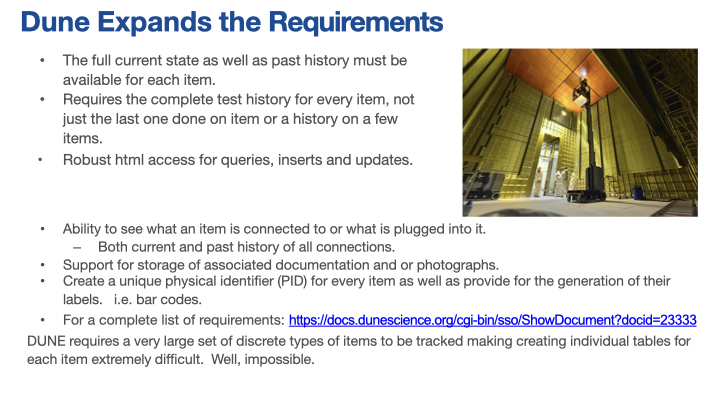
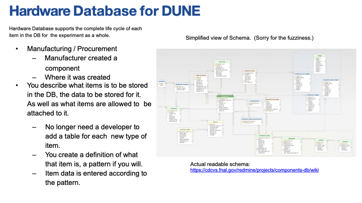
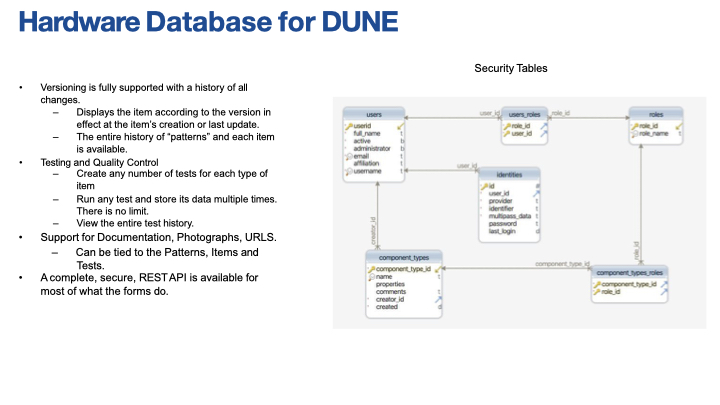
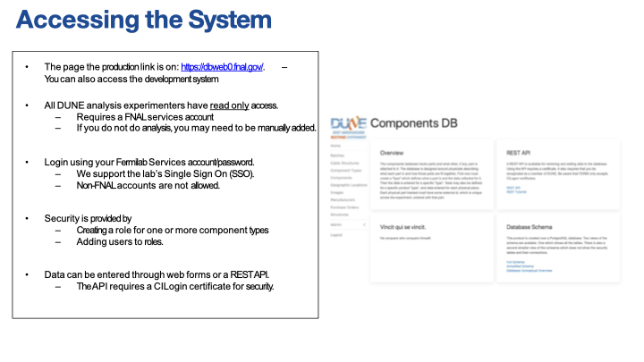
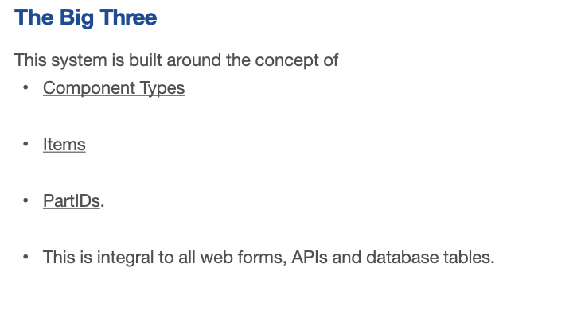
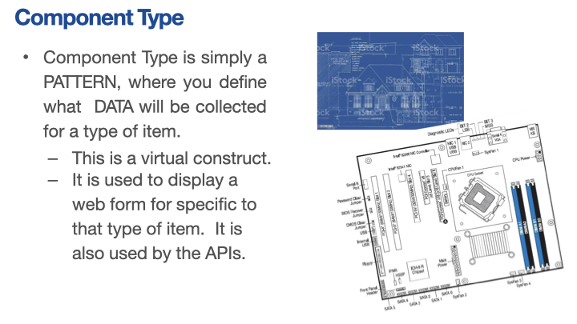
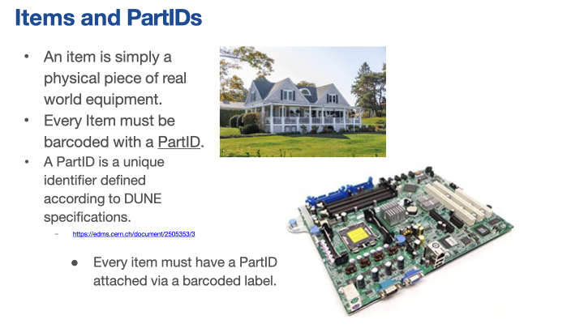
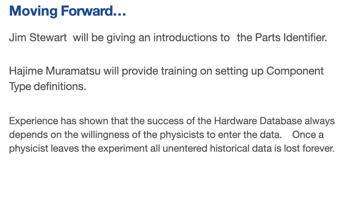

<!--- begin js and css inclusion --->

<!--- end js and css --->

>## Contents
>
>|-------------+------------------|
>|              | Description     |
>|-------------+------------------|
>| [Slide 001](#slide-001) | Slide Title  |
>| [Slide 002](#slide-002) | Slide Title  |
>| [Slide 003](#slide-003) | Slide Title  |
>| [Slide 004](#slide-004) | Slide Title  |
>| [Slide 005](#slide-005) | Slide Title  |
>| [Slide 006](#slide-006) | Slide Title  |
>| [Slide 007](#slide-007) | Slide Title  |
>| [Slide 008](#slide-008) | Slide Title  |
>| [Slide 009](#slide-009) | Slide Title  |
>| [Slide 010](#slide-010) | Slide Title  |
>|-------------+------------------|
{: .checklist}

## Slide 001

<!---slides are 1024 x 768 px--->

  

  <h1>HWDB Conceptual Overview</h1>
  
Stephen White

  
May 2022

  

  

    
    <button onclick="openImagePopup('001')">Popup</button>
  

[back to top](#contents)

## Slide 002

  

  <h1>Hardware DB, A Bit of History</h1>
<ul>
<li> HWDB was originally developed and created for NOvA about 2008-ish.00</li> 
   <ul><li>By Dennis Box, Margherita Vittone and me. With guidance from Jon Paley</li></ul>
 
<li>It was created to track a specific set of parts for NOvA and some tests done on them.</li>
 
<li>About 2015 it started being adopted by other experiments including:</li> 
    <ul><li>Mu2e, Icarus, SBND, Proto Dune, Ash River (currently under development)</li></ul>
 
<li>Known Issues with HWDB</li>
    <ul>
    <li>Supporting a new experiment means creating a new schema from scratch.</li>
    <li>Adding a new type of part/test requires developing and adding a new, distinct table or columns to the schema.</li>
    <li>Good at tracking current state but little to no historical data was kept.</li>
    <li>Very limited API allowing uploading data only.</li>
    <li>Utilizes original, very early, web technology which will not last for the life of DUNE.</li>
    </ul>
</ul>
  

  

	
    <button onclick="openImagePopup('002')">Popup</button>
  

[back to top](#contents)

## Slide 003

  

  <h1>DUNE Expands the Requirements</h1>
  <ul>
      <li>The full current state as well as past history must be available for each item.</li>
      <li>Requires the complete test history for every item, not just the last one done on item or a history on a few items.</li>
      <li>Robust html access for queries, inserts and updates.</li>
   </ul>
 
   <ul>
      <li>Ability to see what an item is connected to or what is plugged into it.</li>
          <ul>
		       <li>Both current and past history of all connections.</li>
		  </ul>
      <li>Support for storage of associated documentation and or photographs.</li>
      <li>Create a unique physical identifier (PID) for every item as well as provide for the generation of their labels, i.e. bar codes.</li>
    </ul>
 
    <ul>
		<li>For a complete list of requirements: <a href="https://docs.dunescience.org/cgi-bin/sso/ShowDocument?docid=23333">https://docs.dunescience.org/cgi-bin/sso/ShowDocument?docid=23333</a>.</li>
	</ul>
 
DUNE requires a very large set of discrete types of items to be tracked making creating individual tables for each item extremely difficult. Well, impossible.
  

  

    
    <button onclick="openImagePopup('003')">Popup</button>
  

[back to top](#contents)

## Slide 004

  

  <h1>Hardware Database for DUNE</h1>
  <ul>
  <li>Hardware Database supports the complete life cycle of each item in the DB for the experiment as a whole.</li>
  <li>Manufacturing / Procurement</li>
      <ul><li>Manufacturer created a component</li>
          <li>Where it was created</li>
	  </ul>
   <li>You describe what items is to be stored in the DB, the data to be stored for it. As well as what items are allowed to be attached to it.</li>
       <ul><li>No longer need a developer to add a table for each new type of item.</li>
           <li>You create a definition of what that item is, a pattern if you will.</li>
           <li>Item data is entered according to the pattern.</li>
	   </ul>
  </ul>
  

  

    
    <button onclick="openImagePopup('004')">Popup</button>
  

[back to top](#contents)

## Slide 005

  

  <h1>Hardware Database for DUNE</h1>
  <ul>
  <li>Versioning is fully supported with a history of all changes.</li>
      <ul><li>Displays the item according to the version in effect at the item’s creation or last update.</li>
          <li>The entire history of “patterns” and each item is available.</li>
          <li>Testing and Quality Control</li>
	  </ul>
   <li>Create any number of tests for each type of item</li>
       <ul><li>Run any test and store its data multiple times.</li>
           <li>There is no limit.</li>
           <li>View the entire test history.</li>
	   </ul>
   <li>Support for Documentation, Photographs, URLS. – Can be tied to the Patterns, Items and Tests.</li>
   <li>A complete, secure, REST API is available for most of what the forms do.</li>
  </ul>
  

  

    
    <button onclick="openImagePopup('005')">Popup</button>
  

[back to top](#contents)

## Slide 006

  

  <h1>Accessing the System</h1>
  <ul>
  <li>The page the production link is on: <a href="https://dbweb0.fnal.gov/">https://dbweb0.fnal.gov/</a> - You can also access the development system</li>
  <li>All DUNE analysis experimenters have read only access.</li>
      <ul><li>Requires a FNAL services account</li>
          <li>If you do not do analysis, you may need to be manually added.</li>
	  </ul>
<li>Login using your Fermilab Services account/password.</li>
    <ul><li>We support the lab’s Single Sign On (SSO).</li>
        <li>Non-FNAL accounts are not allowed.</li>
	</ul>
<li>Security is provided by</li>
    <ul><li>Creating a role for one or more component types</li>
        <li>Adding users to roles.</li>
    </ul>
<li>Data can be entered through web forms or a REST API.</li>
    <ul><li>The API requires a CILogin certificate for security.</li>
	</ul>
  </ul>
  

  

    
    <button onclick="openImagePopup('006')">Popup</button>
  

[back to top](#contents)

## Slide 007

  

  <h1>The Big Three</h1>
  This system is built around the concept of
  <ul><li>Component Types</li>
      <li>Items</li>
      <li>PartIDs.</li>
      <li>This is integral to all web forms, APIs and database tables.</li>
  </ul>
  

  

    
    <button onclick="openImagePopup('007')">Popup</button>
  

[back to top](#contents)

  

## Slide 008

  

  <h1>Component Type</h1>
  <ul>
  <li>Component Type is simply a PATTERN, where you define what  DATA will be collected for a type of item.</li>
      <ul><li>This is a virtual construct.</li>
          <li>It is used to display a web form for specific to that type of item.	It is also used by the APIs.</li>
	  </ul>
  </ul>
  

  

    
    <button onclick="openImagePopup('008')">Popup</button>
  

[back to top](#contents)

## Slide 009

  

  <h1>Name and PartIDs</h1>
  
An item is simply a physical piece of real world equipment.

  
Every Item must be barcoded with a PartID.

  
A PartID is a unique identifier defined according to DUNE specifications. <a href="https://edms.cern.ch/document/2505353/3">https://edms.cern.ch/document/2505353/3</a>

  
Every item must have a PartID attached via a barcoded label.

  

  

    
    <button onclick="openImagePopup('009')">Popup</button>
  

[back to top](#contents)

## Slide 010

<!---slides are 1024 x 768 px--->

  

  <h1>Moving Forward...</h1>
  
Jim Stewart will be giving an introductions to	the Parts Identifier.

  
Hajime Muramatsu will provide training on setting up Component Type definitions.

  
Experience has shown that the success of the Hardware Database always depends on the willingness of the physicists to enter the data.	Once a physicist leaves the experiment all unentered historical data is lost forever.

  

  

    
    <button onclick="openImagePopup('010')">Popup</button>
  

[back to top](#contents)

# Useful links to bookmark

- [Hardware Database Tutorial I (May 2022)](https://indico.fnal.gov/event/54352/)
- [Hardware Database Tutorial II (May 2022)](https://indico.fnal.gov/event/54411/) 
- [Overview of the HWDB, S. White (May 2022)](https://indico.fnal.gov/event/54411/contributions/240450/attachments/154851/201524/Hardware%20DB%20Dune%20Tutorial%205_2022.pdf)



